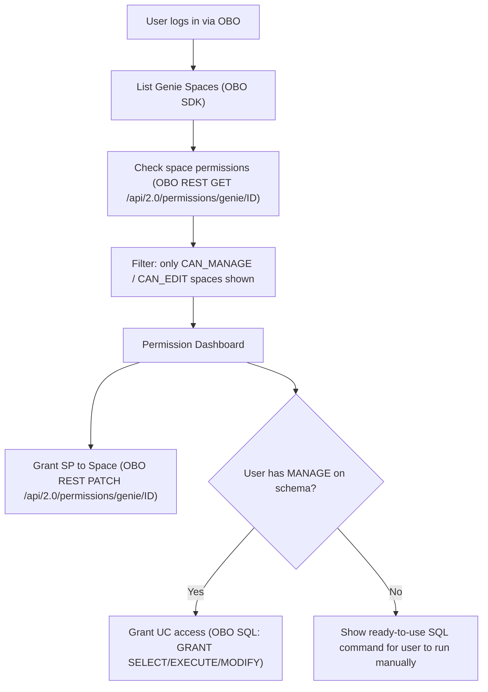

# Auth Flow REST API Rework

## Problem

The current permissions flow uses a mix of SP SDK calls, OBO SDK calls, and OBO REST API calls. This creates chicken-and-egg problems (SP can't grant itself access) and scope issues (OBO SDK lacking Permissions API scope). The user's proven pattern: **OBO token + REST API directly** works reliably.

## Target Auth Flow




## Changes by File

### 1. `genie_client.py` -- Replace SDK `permissions.get` with OBO REST API

**Current:** `user_can_edit_space` and `sp_can_manage_space` use `permissions.get()` (SDK), which requires the Permissions API scope that OBO tokens may lack. Falls back to SP client.

**Change:** Add a new helper `get_space_permissions_rest(client, space_id)` that calls `GET /api/2.0/permissions/genie/{space_id}` via `client.api_client.do()`. Update `user_can_edit_space` and `sp_can_manage_space` to use this REST helper instead of the SDK method.

```python
def get_space_permissions_rest(w: WorkspaceClient, space_id: str) -> dict | None:
    try:
        return w.api_client.do("GET", f"/api/2.0/permissions/genie/{space_id}")
    except Exception:
        return None
```

- `_check_user_edit_from_perms` needs a variant that works with the raw REST JSON shape (dicts instead of SDK objects)
- `user_can_edit_space` tries OBO REST first, SP REST fallback
- `sp_can_manage_space` uses SP REST call

### 2. `settings.py` -- Permission checks via OBO REST

`**_probe_user_manage_privileges` (lines 115-170):** Currently uses SP SDK `grants.get_effective` to check if the user has MANAGE on UC schemas. This is the function that determines `canGrant` / `canGrantWrite` in the UI.

**Change:** Keep using `grants.get_effective` via SP (this is a UC API, not Permissions API, and works fine with SP). No change needed here -- the SP is reading effective grants on behalf of the user, which is the correct pattern.

`**_user_can_manage_space` (lines 628-661):** Currently uses SP SDK `permissions.get`. 

**Change:** Use OBO REST `GET /api/2.0/permissions/genie/{space_id}` instead. Fall back to SP REST if OBO fails.

`**grant_space_access` (already partially fixed):** Uses OBO REST PATCH. Keep this pattern.

`**revoke_space_access` (already partially fixed):** Uses SP SDK then OBO REST. Keep this layered approach.

`**get_permission_dashboard` -- cached permission reads:** Currently caches SP SDK `permissions.get` calls. Change to use REST API via SP (or OBO if SP fails), caching raw dict results.

### 3. `settings.py` -- Show ready-to-use SQL when user can't grant

**Current:** When `canGrant` is `false` for a schema, the UI shows a "No Permission" badge with no actionable guidance.

**Change (backend):** Add a new field `grantCommand: str | None` to `SchemaPermission` in [models.py](src/genie_space_optimizer/backend/models.py). When `canGrantRead` or `canGrantWrite` is `false`, populate `grantCommand` with the ready-to-use SQL:

```sql
GRANT MANAGE ON SCHEMA `catalog`.`schema` TO `user@example.com`;
-- Then return to Settings and click Grant.
```

**Change (frontend):** In `settings.tsx`, when `canGrant` is false and `grantCommand` is present, show a copy-to-clipboard SQL snippet instead of just "No Permission".

### 4. `settings.tsx` -- UI improvements for the flow

- When `canGrantRead` is false and `grantCommand` exists: show a small info box with the SQL command and a copy button
- Keep the existing confirmation dialog pattern for grants that the user CAN perform
- The "Requires CAN_MANAGE on this space" message for space access is already correct

### 5. `genie_client.py` + `settings.py` -- Consistent REST-first pattern

Establish a clear convention documented at the top of settings.py:

- **Genie Space ACL reads:** OBO REST `GET /api/2.0/permissions/genie/{id}`, SP REST fallback
- **Genie Space ACL writes (grant/revoke):** OBO REST `PATCH` / `PUT`, SP SDK fallback
- **UC privilege probing:** SP SDK `grants.get_effective` (works fine, no change)
- **UC data grants:** OBO SQL via `statement_execution` (works fine, no change)

## Files Modified

- [src/genie_space_optimizer/common/genie_client.py](src/genie_space_optimizer/common/genie_client.py) -- REST-based permission helpers
- [src/genie_space_optimizer/backend/routes/settings.py](src/genie_space_optimizer/backend/routes/settings.py) -- REST-based permission checks, SQL hint field
- [src/genie_space_optimizer/backend/models.py](src/genie_space_optimizer/backend/models.py) -- Add `grantCommand` to `SchemaPermission`
- [src/genie_space_optimizer/ui/routes/settings.tsx](src/genie_space_optimizer/ui/routes/settings.tsx) -- Show SQL command when user can't grant

