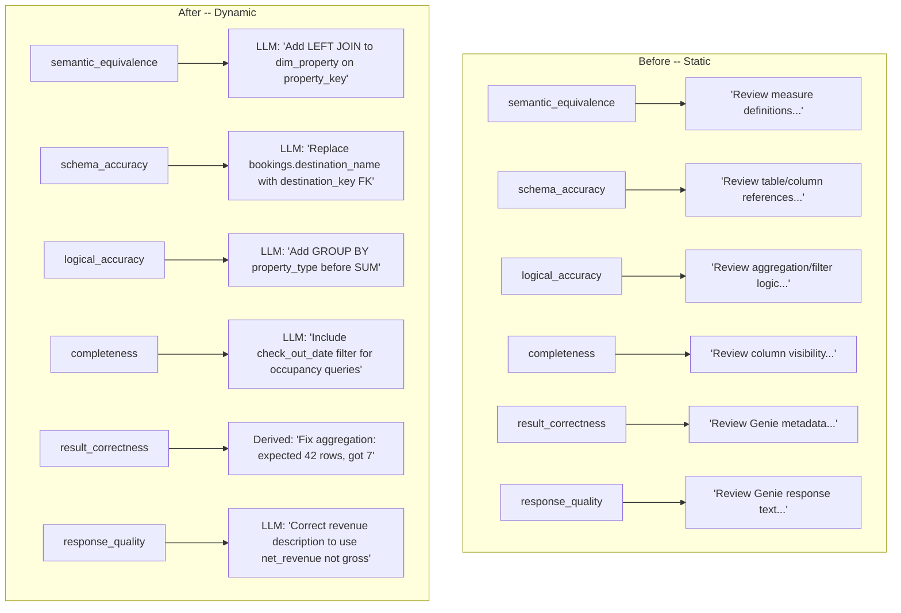

# Dynamic Counterfactual Fixes for Scorers

## Problem

Every scorer except `arbiter` uses hardcoded `counterfactual_fix` strings (e.g., `"Review measure definitions and grain in Genie metadata"`). These are:

- **Misleading to the proposal LLM** -- they're injected into the LLM prompt that generates metadata patches (via `_call_llm_for_proposal` in `optimizer.py` L1402-1406 and L1699)
- **Dangerous as a patch fallback** -- `applier.py` L504 uses counterfactual as last-resort `new_text` for actual patches
- **Already known to be useless** -- the codebase has `_is_generic_counterfactual()` and `GENERIC_FIX_PREFIXES` specifically to detect and skip these static strings

## Approach

**For all 5 LLM-based scorers**, add `"counterfactual_fix"` to the JSON schema the judge must return. The LLM already has full context (expected SQL, generated SQL, comparison summary) so it can produce a specific, actionable fix hint.

**For the 2 non-LLM scorers** (`result_correctness`, heuristic path of `arbiter`), derive counterfactual from the already-computed `failure_type` + `blame_set` using a helper function.

`**arbiter`** already does the right thing (passes LLM rationale as counterfactual) -- no change needed there.




## Changes

### 1. Add `counterfactual_fix` to LLM judge JSON schemas

Update the prompt's "Respond with JSON only" line in each of these 5 scorers to include a new field:

- **[semantic_equivalence.py](src/genie_space_optimizer/optimization/scorers/semantic_equivalence.py)** (L107-110):
Add `"counterfactual_fix": "<specific metadata change to fix this>"` to the JSON schema. Change the "If equivalent" instruction to also set `counterfactual_fix` to `""`.
Replace the static `counterfactual_fix="Review measure definitions..."` at L239 with `counterfactual_fix=result.get("counterfactual_fix", "")`.
- **[schema_accuracy.py](src/genie_space_optimizer/optimization/scorers/schema_accuracy.py)** (L95-98):
Same pattern. Replace static string at L218.
- **[logical_accuracy.py](src/genie_space_optimizer/optimization/scorers/logical_accuracy.py)** (L93-96):
Same pattern. Replace static string at L216.
- **[completeness.py](src/genie_space_optimizer/optimization/scorers/completeness.py)** (L103-106):
Same pattern. Replace static string at L235.
- **[response_quality.py](src/genie_space_optimizer/optimization/scorers/response_quality.py)** (~L103):
Same pattern. Replace static string at L166.

For each, the new JSON schema line becomes (example for `semantic_equivalence`):

```
'Respond with JSON only: {"equivalent": true/false, "failure_type": "...", '
'"blame_set": ["..."], "counterfactual_fix": "<specific Genie Space metadata change that would fix this, referencing exact table/column names>", '
'"rationale": "<brief explanation>"}\n'
'If equivalent, set failure_type to "", blame_set to [], and counterfactual_fix to "".'
```

### 2. Derive counterfactual for `result_correctness` (heuristic scorer)

In [result_correctness.py](src/genie_space_optimizer/optimization/scorers/result_correctness.py) (L168-174), replace the static string with a derived one using the comparison data already available:

```python
_cfix = (
    f"Result mismatch: expected {cmp.get('gt_rows', '?')} rows "
    f"(hash={cmp.get('gt_hash', '?')}), got {cmp.get('genie_rows', '?')} rows "
    f"(hash={cmp.get('genie_hash', '?')}). "
    f"Check joins, filters, or aggregation logic in the generated SQL."
)
```

This is more informative than the static string -- it tells the downstream LLM the exact magnitude of mismatch.

### 3. Update `JUDGE_PROMPTS` in config.py

The judge prompts in [config.py](src/genie_space_optimizer/common/config.py) `JUDGE_PROMPTS` dict also need the `counterfactual_fix` field added to their JSON schemas, to keep them in sync with the scorer implementations. This ensures the MLflow Prompt Registry versions match the actual prompts used.

### 4. Remove `GENERIC_FIX_PREFIXES` guard (optional cleanup)

Once all counterfactuals are dynamic, the `GENERIC_FIX_PREFIXES` constant in [config.py](src/genie_space_optimizer/common/config.py) L833-839 and the `_is_generic_counterfactual()` function in [optimizer.py](src/genie_space_optimizer/optimization/optimizer.py) L2245-2258 can be simplified. However, keeping them as a safety net is harmless -- dynamic fixes from the LLM won't start with "review" or "check" (they'll reference specific objects), so the guard will simply never trigger. **Recommendation:** keep the guard as defense-in-depth.

### 5. Add fallback for LLM non-compliance

If the LLM judge doesn't return `counterfactual_fix` (older model, malformed response), fall back to a constructed string from `failure_type` + `blame_set`:

```python
counterfactual = result.get("counterfactual_fix") or (
    f"Fix {result.get('failure_type', 'issue')} "
    f"involving {', '.join(result.get('blame_set', ['unknown']))}"
)
```

This replaces the current static fallback and ensures we always get something more specific than "Review X in Genie metadata."

## Files Changed


| File                              | Change                                                                 |
| --------------------------------- | ---------------------------------------------------------------------- |
| `scorers/semantic_equivalence.py` | Add `counterfactual_fix` to LLM JSON schema + use dynamic value        |
| `scorers/schema_accuracy.py`      | Same                                                                   |
| `scorers/logical_accuracy.py`     | Same                                                                   |
| `scorers/completeness.py`         | Same                                                                   |
| `scorers/response_quality.py`     | Same                                                                   |
| `scorers/result_correctness.py`   | Derive counterfactual from comparison data                             |
| `common/config.py`                | Update `JUDGE_PROMPTS` dict to include `counterfactual_fix` in schemas |


No changes needed to `arbiter.py` (already dynamic), `optimizer.py`, `applier.py`, or `harness.py` -- they consume counterfactual generically and will automatically benefit from better values.

## Risk

- **Low risk.** The change is additive to judge prompts (one extra JSON field). If the LLM omits it, the fallback produces a better result than today's static strings.
- **No downstream contract changes.** `counterfactual_fix` is already a `str` everywhere it's consumed. The only change is the quality of the string.
- **Token cost:** Marginal increase (~10-20 tokens per judge response for the new field).

