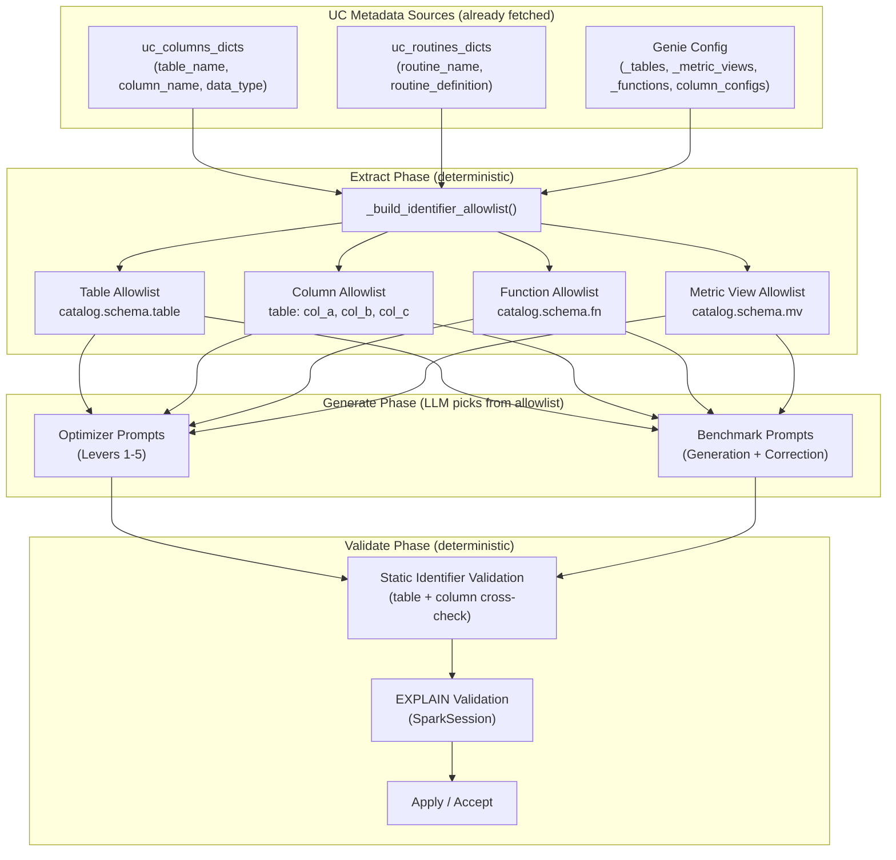

# Extract-Over-Generate Validation and SQL Pre-Validation

## Philosophy: Extract Over Generate

The core principle: **LLMs must never invent identifiers. They select from a pre-extracted, authoritative allowlist.** This applies to every LLM call that produces SQL, references data assets, or names columns/functions -- both in the optimizer (lever proposals) and in benchmark generation/correction.

All the raw data needed for extraction already exists in the codebase:

**UC Metadata Sources (already fetched)**

- **Columns**: `uc_columns_dicts` -- fetched via `get_columns_for_tables_rest(w, table_refs)` in [uc_metadata.py](src/genie_space_optimizer/common/uc_metadata.py) line 76. Each dict has `table_name`, `column_name`, `data_type`, `comment`. Stored on config as `config["_uc_columns"]` in [harness.py](src/genie_space_optimizer/optimization/harness.py) line 514 and [preflight.py](src/genie_space_optimizer/optimization/preflight.py) line 410.
- **Routines/Functions**: `uc_routines_dicts` -- fetched via `get_routines_for_schemas_rest(w, refs)` in [uc_metadata.py](src/genie_space_optimizer/common/uc_metadata.py) line 117. Each dict has `routine_name`, `routine_type`, `routine_definition`, `return_type`.
- **Tags**: `uc_tags_dicts` -- fetched via `get_tags_for_tables_rest(w, refs)` in [uc_metadata.py](src/genie_space_optimizer/common/uc_metadata.py) line 150.

**Genie Config Sources (already parsed)**

- **Tables**: `config["_tables"]` -- list of fully-qualified identifiers like `catalog.schema.table_name`
- **Metric Views**: `config["_metric_views"]` -- list of metric view identifiers
- **Functions**: `config["_functions"]` -- list of function identifiers
- **Column configs**: `data_sources.tables[].column_configs[]` with `column_name`, `data_type`, `description`, `synonyms`
- **Enriched types**: `enrich_metadata_with_uc_types()` in [optimizer.py](src/genie_space_optimizer/optimization/optimizer.py) line 791 merges UC `data_type`/`comment` into column_configs at lever loop start

**Existing partial allowlists (benchmark path only, not optimizer)**

- `_build_valid_assets_context(config)` in [evaluation.py](src/genie_space_optimizer/optimization/evaluation.py) line 3612 -- table/MV/function allowlist for benchmark prompts
- `_build_metadata_allowlist(config, uc_columns, uc_routines)` in [evaluation.py](src/genie_space_optimizer/optimization/evaluation.py) line 3795 -- programmatic validation allowlist with `assets`, `columns`, `column_index`, `routines`
- `_enforce_metadata_constraints()` in [evaluation.py](src/genie_space_optimizer/optimization/evaluation.py) line 4104 -- post-LLM benchmark validation using the allowlist

**The gap**: The optimizer prompts (`_call_llm_for_proposal`, `_call_llm_for_holistic_instructions`, `_call_llm_for_join_discovery`) do not use any allowlist. They pass free-form `full_schema_context` and loose `table_names`/`mv_names`/`tvf_names` strings. Benchmark prompts have asset-level allowlists but lack column-level allowlists.

## Architecture




## Changes

### 1. Unified Allowlist Builder

Create a single `_build_identifier_allowlist(metadata_snapshot, uc_columns=None)` function in [optimizer.py](src/genie_space_optimizer/optimization/optimizer.py) that produces:

```python
{
    "tables": ["catalog.schema.table1", ...],
    "tables_short": {"table1", "table2", ...},
    "columns": {"table1": [("col_a", "STRING"), ("col_b", "INTEGER")], ...},
    "columns_flat": {"table1.col_a", "table1.col_b", ...},
    "functions": ["catalog.schema.fn1", ...],
    "functions_short": {"fn1", ...},
    "metric_views": ["catalog.schema.mv1", ...],
}
```

**Data sources for extraction:**

- Tables: from `metadata_snapshot["data_sources"]["tables"]` identifiers (already available at every LLM call site)
- Columns: from `column_configs[]` in each table (always present), enriched with `uc_columns` data types when `config["_uc_columns"]` is available (set at [harness.py line 514](src/genie_space_optimizer/optimization/harness.py))
- Functions: from `metadata_snapshot["functions"]` or `config["_functions"]`
- Metric views: from `metadata_snapshot["metric_views"]` or `config["_metric_views"]`

Also produce `_format_identifier_allowlist(allowlist)` for prompt injection:

```
VALID TABLES (use ONLY these in FROM/JOIN):
- catalog.schema.table1
- catalog.schema.table2

VALID COLUMNS BY TABLE (use ONLY these column names):
table1: col_a (STRING), col_b (INTEGER), col_c (DATE)
table2: col_x (DECIMAL), col_y (STRING)

VALID FUNCTIONS (use ONLY these):
- catalog.schema.fn1

VALID METRIC VIEWS:
- catalog.schema.mv1
```

This replaces (and unifies with) `_build_valid_assets_context` in evaluation.py, which currently only lists table/MV/function names without columns.

### 2. Inject Allowlist Into All LLM Prompts (Optimizer + Benchmarks)

**Optimizer prompts** -- update LLM call functions in [optimizer.py](src/genie_space_optimizer/optimization/optimizer.py):

- `**_call_llm_for_proposal`** (Levers 1-4): Add `{{ identifier_allowlist }}`. Currently uses `full_schema_context` but no explicit allowlist.
- `**_call_llm_for_holistic_instructions**` (Lever 5): Add `{{ identifier_allowlist }}`. Currently only has loose `table_names`/`mv_names`/`tvf_names`.
- `**_call_llm_for_join_discovery**` (Lever 4): Add `{{ identifier_allowlist }}`. Currently uses filtered `full_schema_context`.
- `**_call_llm_for_ag_detail**` (Strategist detail): Add compact allowlist header for grounding.

**Benchmark prompts** -- update context builders in [evaluation.py](src/genie_space_optimizer/optimization/evaluation.py):

- `**_build_schema_contexts()`** (line 3624): Add `column_allowlist` key to the returned dict, built from `uc_columns` parameter (already passed to this function).
- `**generate_benchmarks()**` (line 4168): Pass `column_allowlist` to the `BENCHMARK_GENERATION_PROMPT` template.
- `**_attempt_benchmark_correction()**` (line 3686): Pass `column_allowlist` to the `BENCHMARK_CORRECTION_PROMPT` template.
- **Coverage gap fill**: Pass `column_allowlist` to `BENCHMARK_COVERAGE_GAP_PROMPT`.

**Prompt template updates** in [config.py](src/genie_space_optimizer/common/config.py):

- Add `{{ identifier_allowlist }}` template variable to: `LEVER_1_2_PROMPT`, `LEVER_3_PROMPT`, `LEVER_4_PROMPT`, `LEVER_5_INSTRUCTION_PROMPT`, `LEVER_5_HOLISTIC_PROMPT`, `STRATEGIST_DETAIL_PROMPT`.
- Add `{{ column_allowlist }}` to: `BENCHMARK_GENERATION_PROMPT`, `BENCHMARK_CORRECTION_PROMPT`, `BENCHMARK_COVERAGE_GAP_PROMPT`.
- Strengthen anti-hallucination in every prompt: "You MUST ONLY use identifiers from the allowlist. Any table, column, or function not in the allowlist is INVALID and will be rejected."
- For SQL-producing prompts: "Before writing SQL, verify every FROM table, JOIN table, column reference, and function call appears in the allowlist."

### 3. Static Identifier Validator (Zero-Cost, No Spark)

Add `_validate_sql_identifiers(sql, allowlist)` in [optimizer.py](src/genie_space_optimizer/optimization/optimizer.py):

1. Extract table references using regex (reuse `_extract_table_references` from [benchmarks.py](src/genie_space_optimizer/optimization/benchmarks.py) line 41).
2. Cross-check against `allowlist["tables"]` and `allowlist["tables_short"]`.
3. Extract column references from SELECT/WHERE/GROUP BY/ORDER BY and cross-check against `allowlist["columns_flat"]`.
4. Return `(is_valid, violations: list[str])`.

Apply to:

- `add_example_sql` proposals in `_validate_lever5_proposals()` (optimizer.py line 3625)
- `update_example_sql` proposals in the applier (currently unvalidated)
- Benchmark SQL in `generate_benchmarks()` as a pre-EXPLAIN fast filter
- Benchmark correction output in `_attempt_benchmark_correction()`

### 4. EXPLAIN Validation for Example SQL Proposals

Thread `SparkSession` + catalog/schema into the proposal pipeline:

- **[harness.py](src/genie_space_optimizer/optimization/harness.py)** line 1408: Pass `spark`, `catalog`, `schema` to `generate_proposals_from_strategy()`.
- **[optimizer.py](src/genie_space_optimizer/optimization/optimizer.py)**: Add optional `spark`, `catalog`, `gold_schema` params to `generate_proposals_from_strategy()` and `_validate_lever5_proposals()`. For `add_example_sql` proposals, call `validate_ground_truth_sql(sql, spark, catalog, gold_schema)` from [benchmarks.py](src/genie_space_optimizer/optimization/benchmarks.py) line 160.
- **Fallback**: When `spark` is None (e.g., testing), rely on static validation only.

### 5. Parameter Default Substitution Before EXPLAIN

Add `_resolve_params_with_defaults(sql, parameters)` in [benchmarks.py](src/genie_space_optimizer/optimization/benchmarks.py):

```python
def _resolve_params_with_defaults(sql: str, parameters: list[dict]) -> tuple[str, bool]:
    """Replace :param_name with default_value. Returns (resolved_sql, all_resolved)."""
```

In `validate_ground_truth_sql()` (line 186-192): instead of short-circuiting when `_extract_sql_params` finds parameters, attempt default substitution first. If all params resolved, run EXPLAIN on the substituted SQL.

Also apply in [evaluation.py](src/genie_space_optimizer/optimization/evaluation.py):

- Benchmark quarantine (line 1040-1046)
- Result comparison (line 1242-1254)

### 6. Fix `update_example_sql` Validation Gap

In [applier.py](src/genie_space_optimizer/optimization/applier.py) `_apply_action_to_config()` line 1097-1105:

The `update` op for `example_question_sqls` writes `new_sql` without validation. Add `_validate_example_sql_entry` call on the modified entry before applying. Also apply the static identifier validation from step 3.

### 7. Pre-Validate Genie Response SQL in Evaluation

In [evaluation.py](src/genie_space_optimizer/optimization/evaluation.py) around line 1256:

Before result comparison, run `EXPLAIN` on Genie-generated SQL. Classify failures as `genie_sql_invalid` (separate from `infrastructure` or `parameterized_sql`). This produces cleaner evaluation signals.