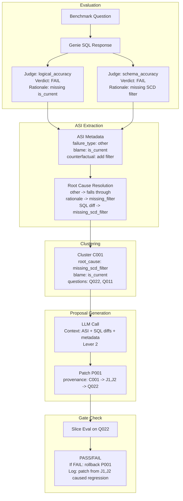
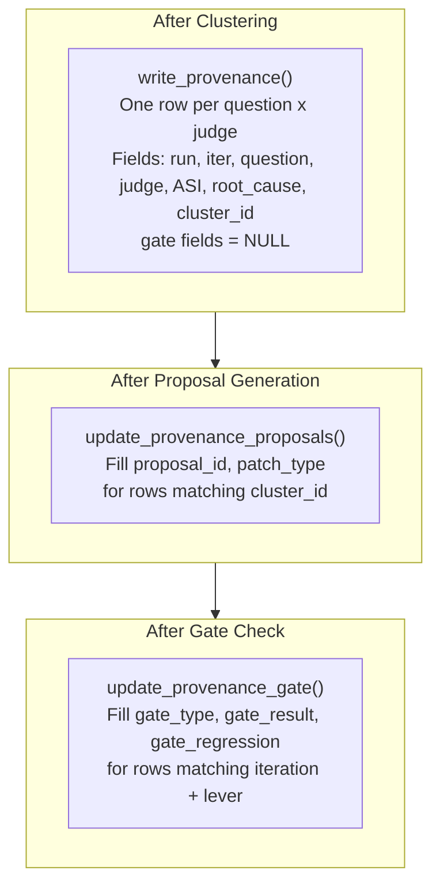

# Fix ASI Classification and Add End-to-End Pipeline Tracing

## Design Principle: Every Patch Has a Provenance Chain

The core idea is that **every patch must carry a structured provenance** that links it all the way back to the specific judge verdict(s) that motivated it. This provenance is a first-class data structure (not just log text) that flows through the entire pipeline and gets printed at every stage.




## Root Cause: Why Everything Shows "other"

The single biggest issue is in `[optimizer.py` line 515](src/genie_space_optimizer/optimization/optimizer.py):

```python
if f.get("asi_failure_type"):       # <-- "other" is truthy!
    root = f["asi_failure_type"]     # <-- root = "other", SQL diff never called
else:
    pattern = _extract_pattern(f["rationale"])
    root = pattern if pattern != "other" else _classify_sql_diff(f.get("sql_context", {}))
```

When a scorer (e.g. `logical_accuracy`) produces metadata `{failure_type: "other", blame_set: ["is_current"]}`, the string `"other"` is truthy so it's used directly as the root cause. The more specific `_classify_sql_diff` (which could detect `missing_filter`, `wrong_join`, etc.) is **never invoked**. This cascades: all clusters get root_cause=`other`, all map to lever 2 or 5, and the LLM receives generic context instead of actionable root causes.

## Fix 1: Stop "other" from short-circuiting (optimizer.py, line 515)

Change the root-cause resolution so `"other"` from ASI metadata falls through to `_extract_pattern` and then `_classify_sql_diff`:

```python
asi_ft = f.get("asi_failure_type")
if asi_ft and asi_ft != "other":
    root = asi_ft
else:
    pattern = _extract_pattern(f["rationale"])
    root = pattern if pattern != "other" else _classify_sql_diff(f.get("sql_context", {}))
```

**Same logic in `_map_to_lever`** (line 132): currently `ft = asi_failure_type or root_cause`. If `asi_failure_type` is `"other"`, it shadows `root_cause`. Fix:

```python
ft = (asi_failure_type if asi_failure_type and asi_failure_type != "other" else None) or root_cause
```

**File:** `[src/genie_space_optimizer/optimization/optimizer.py](src/genie_space_optimizer/optimization/optimizer.py)`

## Fix 2: Enhance `_classify_sql_diff` for SCD filters, join types, and WHERE conditions

Currently `_classify_sql_diff` only checks presence/absence of WHERE; if both queries have WHERE, the function falls through even when specific predicates differ. Add three new pattern detections after check 3 (line 312):

- `**missing_scd_filter`**: Expected has `is_current = true` (or `is_current = 1` / `is_active`), generated does not. Maps to lever 2 (or lever 5 as instruction).
- `**wrong_filter_condition`**: Both have WHERE, but condition sets differ (extract `column = value` pairs and diff). Maps to lever 2.
- `**wrong_join_type`**: Both join same tables but with different join keywords (e.g. LEFT JOIN vs INNER JOIN). Maps to lever 5 (instruction issue).

Add new regex patterns:

```python
_SQL_SCD_FILTER = re.compile(r"\b(is_current|is_active)\s*=\s*(true|1|'true')\b", re.I)
_SQL_JOIN_TYPE = re.compile(r"\b(LEFT|RIGHT|INNER|CROSS|FULL)\s+(OUTER\s+)?JOIN\b", re.I)
```

Add these classifications to `_map_to_lever` mapping dict:

```python
"missing_scd_filter": 2,
"wrong_filter_condition": 2,
"wrong_join_type": 5,
```

**File:** `[src/genie_space_optimizer/optimization/optimizer.py](src/genie_space_optimizer/optimization/optimizer.py)` (lines 250-365, and lines 138-165)

## Fix 3: Enhance `_extract_pattern` for richer rationale mining

Add detection for:

- `is_current` / SCD mentions in rationale -> `missing_scd_filter`
- `limit` mentions -> `wrong_filter_condition`
- `left join` / `inner join` / `join type` mentions -> `wrong_join_type`

**File:** `[src/genie_space_optimizer/optimization/optimizer.py](src/genie_space_optimizer/optimization/optimizer.py)` (lines 184-203)

## Fix 4: Patch Provenance Data Structure (In-Memory)

Every proposal and patch carries a `provenance` dict that records its origin chain. This is **data**, not just logging -- it flows through the pipeline, gets printed at every stage, and gets persisted to UC Delta tables.

### Structure

Add to every proposal dict in `generate_metadata_proposals` (both per-cluster and holistic paths):

```python
"provenance": {
    "cluster_id": "C001",
    "root_cause": "missing_scd_filter",
    "originating_questions": [
        {
            "question_id": "revenue_&_property_intelligence_gf_022",
            "question_text": "What are the top properties...",
            "failed_judges": [
                {
                    "judge": "logical_accuracy",
                    "verdict": "FAIL",
                    "asi_failure_type_raw": "other",
                    "resolved_root_cause": "missing_scd_filter",
                    "resolution_method": "sql_diff",
                    "blame_set": ["dim_property.is_current"],
                    "counterfactual_fix": "Add is_current = true...",
                    "rationale_snippet": "The generated SQL is missing the filter..."
                }
            ]
        }
    ],
    "lever": 2,
    "lever_name": "Metric Views",
    "patch_type": "add_instruction"
}
```

### Where it is built

- `cluster_failures` returns clusters with a new `question_traces` field (list of per-question-per-judge dicts recording the ASI extraction results, including the resolution chain: raw ASI type -> rationale pattern -> SQL diff class -> final root cause)
- `generate_metadata_proposals` copies the relevant traces into each proposal's `provenance`
- The harness passes `provenance` through to the applier and gate checks

**Files:**

- `[src/genie_space_optimizer/optimization/optimizer.py](src/genie_space_optimizer/optimization/optimizer.py)` (in `cluster_failures` and `generate_metadata_proposals`)

## Fix 5: Populate `genie_eval_asi_results` Delta Table

The table schema already exists in `[state.py` line 158](src/genie_space_optimizer/optimization/state.py) but is **never written to**. We need to:

### 5a. Add `write_asi_results` function to `state.py`

```python
def write_asi_results(
    spark: SparkSession,
    run_id: str,
    iteration: int,
    asi_rows: list[dict],
    catalog: str,
    schema: str,
) -> None:
    """Write per-question per-judge ASI feedback to the genie_eval_asi_results table."""
```

Each `asi_row` dict contains: `question_id`, `judge`, `value` (verdict), `failure_type`, `severity`, `confidence`, `blame_set` (JSON string), `counterfactual_fix`, `wrong_clause`, `expected_value`, `actual_value`, `missing_metadata`, `ambiguity_detected`.

### 5b. Call from `cluster_failures` or harness

After ASI extraction in `cluster_failures`, collect all the per-(question, judge) entries that were extracted. Return them alongside the clusters so the harness can write them to the Delta table. The harness already has `spark`, `run_id`, `catalog`, `schema` available.

**Files:**

- `[src/genie_space_optimizer/optimization/state.py](src/genie_space_optimizer/optimization/state.py)` (new function)
- `[src/genie_space_optimizer/optimization/optimizer.py](src/genie_space_optimizer/optimization/optimizer.py)` (return ASI rows from `cluster_failures`)
- `[src/genie_space_optimizer/optimization/harness.py](src/genie_space_optimizer/optimization/harness.py)` (call `write_asi_results`)

## Fix 6: Create `genie_opt_provenance` Delta Table

A new lineage table that links every patch back to its originating judge verdicts. This is the "join table" that enables full traceability across runs.

### Table Schema

```sql
CREATE TABLE IF NOT EXISTS {catalog}.{schema}.genie_opt_provenance (
    run_id              STRING        NOT NULL  COMMENT 'FK to genie_opt_runs.run_id',
    iteration           INT           NOT NULL  COMMENT 'Lever loop iteration',
    lever               INT           NOT NULL  COMMENT 'Lever number (1-5)',
    question_id         STRING        NOT NULL  COMMENT 'Benchmark question ID',
    signal_type         STRING        NOT NULL  COMMENT 'hard | soft',
    arbiter_verdict     STRING                  COMMENT 'Arbiter verdict for this question',
    judge               STRING        NOT NULL  COMMENT 'Judge that failed',
    judge_verdict       STRING        NOT NULL  COMMENT 'Judge verdict (PASS/FAIL)',
    asi_failure_type_raw STRING                 COMMENT 'Raw failure_type from ASI metadata',
    resolved_root_cause STRING        NOT NULL  COMMENT 'Final root cause after resolution chain',
    resolution_method   STRING        NOT NULL  COMMENT 'asi_metadata | rationale_pattern | sql_diff',
    blame_set           STRING                  COMMENT 'JSON: blamed objects',
    counterfactual_fix  STRING                  COMMENT 'Suggested fix from judge',
    wrong_clause        STRING                  COMMENT 'SQL clause identified as wrong',
    rationale_snippet   STRING                  COMMENT 'First 500 chars of judge rationale',
    expected_sql        STRING                  COMMENT 'Expected SQL (first 2000 chars)',
    generated_sql       STRING                  COMMENT 'Generated SQL (first 2000 chars)',
    cluster_id          STRING        NOT NULL  COMMENT 'Cluster this question was grouped into',
    proposal_id         STRING                  COMMENT 'Proposal generated from this cluster',
    patch_type          STRING                  COMMENT 'Type of patch applied',
    gate_type           STRING                  COMMENT 'slice | p0 | full (filled after gate check)',
    gate_result         STRING                  COMMENT 'pass | fail | rollback (filled after gate)',
    gate_regression     STRING                  COMMENT 'JSON: regression details if gate failed',
    logged_at           TIMESTAMP     NOT NULL  COMMENT 'When this row was written'
)
USING DELTA
PARTITIONED BY (run_id)
COMMENT 'End-to-end provenance: links every patch to originating judge verdicts and gate outcomes'
TBLPROPERTIES (
    'delta.autoOptimize.optimizeWrite' = 'true',
    'delta.autoOptimize.autoCompact' = 'true'
)
```

### Write Path




### `write_provenance` function in `state.py`

```python
def write_provenance(
    spark: SparkSession,
    run_id: str,
    iteration: int,
    lever: int,
    provenance_rows: list[dict],
    catalog: str,
    schema: str,
) -> None:
    """Write provenance rows linking questions/judges to clusters."""

def update_provenance_proposals(
    spark: SparkSession,
    run_id: str,
    iteration: int,
    proposal_mappings: list[dict],  # [{cluster_id, proposal_id, patch_type}]
    catalog: str,
    schema: str,
) -> None:
    """Backfill proposal_id and patch_type into provenance rows."""

def update_provenance_gate(
    spark: SparkSession,
    run_id: str,
    iteration: int,
    lever: int,
    gate_type: str,
    gate_result: str,
    gate_regression: dict | None,
    catalog: str,
    schema: str,
) -> None:
    """Backfill gate outcome into provenance rows."""
```

### Example Queries This Enables

```sql
-- All patches that targeted is_current failures across all runs
SELECT * FROM genie_opt_provenance
WHERE resolved_root_cause = 'missing_scd_filter'
ORDER BY run_id, iteration;

-- Which judge verdicts most frequently lead to rollbacks?
SELECT judge, resolved_root_cause, COUNT(*) as rollback_count
FROM genie_opt_provenance
WHERE gate_result = 'rollback'
GROUP BY judge, resolved_root_cause
ORDER BY rollback_count DESC;

-- Full lineage for a specific run
SELECT question_id, judge, resolved_root_cause, cluster_id,
       proposal_id, patch_type, gate_type, gate_result
FROM genie_opt_provenance
WHERE run_id = 'abc123'
ORDER BY iteration, question_id, judge;

-- Success rate of patches by lever
SELECT lever, gate_result, COUNT(DISTINCT proposal_id)
FROM genie_opt_provenance
WHERE proposal_id IS NOT NULL
GROUP BY lever, gate_result;
```

**Files:**

- `[src/genie_space_optimizer/optimization/state.py](src/genie_space_optimizer/optimization/state.py)` (DDL + write/update functions)
- `[src/genie_space_optimizer/optimization/harness.py](src/genie_space_optimizer/optimization/harness.py)` (call sites after clustering, proposals, and gates)

## Fix 7: Enrich `genie_opt_patches` with `provenance_json`

Add a `provenance_json` column to the existing `genie_opt_patches` DDL and `write_patch` function. This stores a JSON snapshot of the full provenance chain for each patch, making each patch row self-contained for auditing.

```sql
ALTER TABLE {catalog}.{schema}.genie_opt_patches
ADD COLUMN provenance_json STRING COMMENT 'JSON: full provenance chain from judge verdicts to this patch';
```

In `write_patch`, serialize the proposal's `provenance` dict into this column.

**Files:**

- `[src/genie_space_optimizer/optimization/state.py](src/genie_space_optimizer/optimization/state.py)` (DDL change + `write_patch` update)

## Fix 8: End-to-End Pipeline Tracing Logs

This is the major logging overhaul. Every stage prints structured output that can be traced forward and backward. The principle: **reading the logs top-to-bottom tells the full story of why each patch was generated and whether it helped.**

### 8a. Per-Question ASI Extraction Trace (in `cluster_failures`)

After processing each row's judges, emit a structured trace block:

```
== ASI EXTRACTION TRACE ======================================================

--- Q: revenue_&_property_intelligence_gf_022 --------------------------------
|  Judge: logical_accuracy  |  Verdict: FAIL
|    ASI metadata found:      YES
|      failure_type (raw):    other
|      blame_set:             ['dim_property.is_current']
|      counterfactual_fix:    "Add is_current = true filter on dim_property"
|      wrong_clause:          WHERE
|    Rationale pattern:       missing_filter (matched "filter" in rationale)
|    SQL diff classification: missing_scd_filter (expected has is_current=true, generated does not)
|    Final root cause:        missing_scd_filter  (rationale -> SQL diff fallback)
|  Judge: schema_accuracy    |  Verdict: FAIL
|    ASI metadata found:      YES
|      failure_type (raw):    other
|      blame_set:             ['dim_property.is_current']
|    Rationale pattern:       missing_filter
|    SQL diff classification: missing_scd_filter
|    Final root cause:        missing_scd_filter
|  Dominant root cause:       missing_scd_filter
|  Cluster group key:         (missing_scd_filter, "['dim_property.is_current']")
------------------------------------------------------------------------------
```

This goes inside `cluster_failures`. Controlled by a `CLUSTER_DEBUG` env var (default `True`).

### 8b. Cluster Formation Summary (in `cluster_failures`)

After grouping into clusters, emit:

```
== CLUSTER FORMATION =========================================================
|  Total failure entries:     8 (across 3 questions, 5 judges)
|  Question profiles:         3
|  Cluster groups formed:     2
|    C001 (missing_scd_filter, blame="['is_current']"): 2 questions [Q022, Q011]
|    C002 (missing_aggregation, blame="['completion_rate']"): 1 question  [Q019]
==============================================================================
```

### 8c. LLM Context Summary (in `_call_llm_for_proposal`)

Enhance the existing LLM Call box to show exactly what the LLM receives:

```
┌─── LLM Call [LEVER_1_2_COLUMN] ──────────────────────────────────────
│ Cluster:                C001
│ Patch type:             add_instruction
│ Root cause:             missing_scd_filter
│ Blame set:              ['dim_property.is_current']
│ Questions (2):          Q022, Q011
│
│ --- Judge Feedback Driving This Patch ---
│ Q022 / logical_accuracy:
│   "missing filter dp.is_current = true...historical SCD2 versions included"
│ Q022 / schema_accuracy:
│   "SCD2 dimension table requires is_current filter in JOIN or WHERE"
│ Q011 / completeness:
│   "missing is_current filter and wrong join type (INNER vs LEFT)"
│
│ --- SQL Diff (Q022) ---
│   Expected:  ...JOIN dim_property dp ON ... AND dp.is_current = true...
│   Generated: ...JOIN dim_property p ON b.property_id = p.property_id WHERE p.property_id IS NOT NULL...
│
│ --- Metadata Resolved for Blame ---
│   Table dim_property: 12 columns (is_current: BOOLEAN -- SCD2 flag)
│
│ Counterfactual fixes:   "Add is_current = true filter on dim_property"
│ Prompt length:          14,248 chars
│ ...
└──────────────────────────────────────────────────────────────────────
```

### 8d. Pipeline Lineage Summary (in harness, after all clusters printed)

A compact cross-reference showing the full chain for each hard-failure question:

```
== PIPELINE LINEAGE ==========================================================
|
|  Q: revenue_&_property_intelligence_gf_022
|    Arbiter verdict:       ground_truth_correct -> HARD FAILURE
|    Failed judges:         logical_accuracy (missing_scd_filter), schema_accuracy (missing_scd_filter)
|    Dominant root cause:   missing_scd_filter
|    Blame:                 ['dim_property.is_current']
|    Counterfactual:        "Add is_current = true filter on dim_property"
|    -> Cluster C001 -> Lever 2 (Metric Views)
|
|  Q: revenue_&_property_intelligence_011
|    Arbiter verdict:       ground_truth_correct -> HARD FAILURE
|    Failed judges:         completeness (wrong_join_type)
|    Dominant root cause:   wrong_join_type
|    Blame:                 ['h.is_current', 'LIMIT', 'join_type']
|    -> Cluster C002 -> Lever 5 (Instructions)
|
==============================================================================
```

### 8e. Patch Provenance Log (after proposals are generated)

Each proposal shows its provenance chain tying it back to judge verdicts:

```
-- Proposals (3 total) -------------------------------------------------------
|
|  Proposal 1 / 3  [Patch P001 from cluster C001]
|    Type:          add_instruction
|    Lever:         2 (Metric Views)
|    Root cause:    missing_scd_filter
|    Provenance:
|      Q022: logical_accuracy=FAIL ("missing is_current filter")
|      Q022: schema_accuracy=FAIL ("SCD2 dimension requires is_current")
|      Q011: completeness=FAIL ("missing is_current + wrong join type")
|    Proposed:      "When querying dim_property, always filter is_current = true..."
|    Rationale:     "SCD2 tables require currency filter to avoid historical duplicates"
|    Status:        OK
|
```

### 8f. Gate Provenance Log (during slice gate / rollback)

If a slice gate fails, show which patches caused regression and their originating judge verdicts:

```
-- SLICE GATE: FAIL ----------------------------------------------------------
|  Benchmarks evaluated:        1 (Q022)
|  Regressions:                 result_correctness 58.3->0.0
|
|  Patches applied in this iteration:
|    P001 (add_instruction, lever 2): "Filter is_current = true on SCD2 tables"
|      Originated from: Q022/logical_accuracy + Q022/schema_accuracy + Q011/completeness
|      Root cause: missing_scd_filter | Blame: ['is_current']
|
|  Action: ROLLBACK (reverting P001)
------------------------------------------------------------------------------
```

**Files:**

- `[src/genie_space_optimizer/optimization/optimizer.py](src/genie_space_optimizer/optimization/optimizer.py)` (in `cluster_failures`, `_call_llm_for_proposal`, `generate_metadata_proposals`)
- `[src/genie_space_optimizer/optimization/harness.py](src/genie_space_optimizer/optimization/harness.py)` (pipeline lineage, patch provenance, gate provenance)

## Expected Outcome After These Fixes

Using the latest logs as an example, Q022 (`dim_property.is_current` issue) would flow as:

```mermaid
flowchart LR
    Eval["Eval: Q022\nlogical_accuracy=FAIL"]
    ASI["ASI metadata\nfailure_type=other\nblame=['is_current']"]
    Override["Fix 1: 'other' falls through\nFix 3: rationale='filter'\nFix 2: SQL diff=missing_scd_filter"]
    Cluster["Cluster C001\nroot_cause=missing_scd_filter\nblame=['is_current']"]
    Lever["Lever 2\n(metric views/filters)"]
    LLM["LLM call with:\n- specific failure type\n- counterfactual fix\n- SQL diffs"]
    Patch["Patch P001\nprovenance: C001->J1,J2->Q022"]
    Gate["Slice Gate\nEval Q022 again\nPASS/FAIL + provenance"]

    Eval --> ASI --> Override --> Cluster --> Lever --> LLM --> Patch --> Gate
```




Instead of all clustering to `other -> lever 2` with generic context, each failure gets a specific root cause, maps to the right lever, the LLM receives actionable ASI data, and every patch carries a provenance chain that ties back to the specific judge verdicts that motivated it.