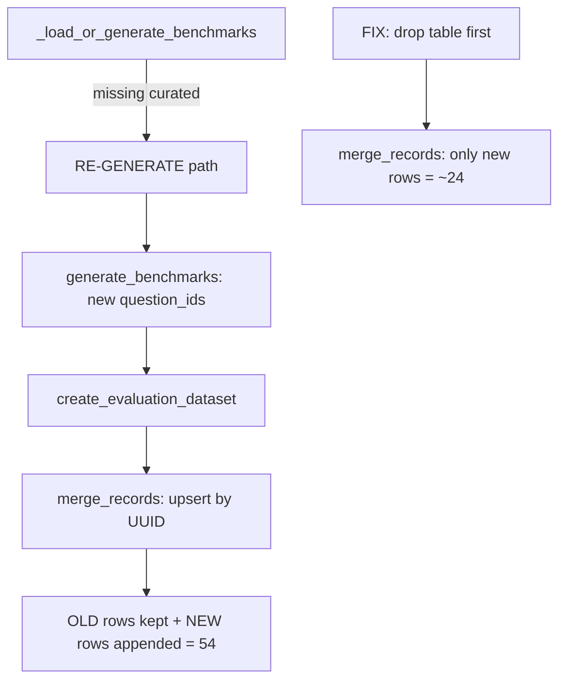

# Fix Benchmark Count Inflation (24 -> 54)

## Root Cause

When the RE-GENERATE path fires in `_load_or_generate_benchmarks` (e.g., due to missing curated questions), `generate_benchmarks` produces fresh benchmarks with **new `question_id` values** (e.g., `domain_gs_001`, `domain_007`). These are then persisted via `create_evaluation_dataset` -> `eval_dataset.merge_records(records)`.

The problem: `merge_records` upserts by an internal MLflow `dataset_record_id` (UUID), **not** by `question_id` or question text. Since new records have new UUIDs, they are **appended** as new rows even when the question text is identical to existing rows. This causes the table to grow from 24 to 54 records.

A helper `_drop_benchmark_table()` already exists in [evaluation.py](src/genie_space_optimizer/optimization/evaluation.py) (line 2524) precisely for clearing stale rows, but it is **never called**.

## Fix Strategy (two layers)

### 1. Drop stale table on full regeneration

In [preflight.py](src/genie_space_optimizer/optimization/preflight.py), call `_drop_benchmark_table` before `create_evaluation_dataset` when the benchmarks were **fully regenerated** (not just reused or topped-up). This ensures the old rows with stale IDs are removed before the new set is merged.

- Add a `regenerated: bool` flag from `_load_or_generate_benchmarks` to signal whether a full re-generation occurred (as opposed to REUSE or TOP-UP).
- Change `_load_or_generate_benchmarks` return type to `tuple[list[dict], bool]` where the bool indicates full regeneration.
- In `run_preflight`, when `regenerated` is `True`, call `_drop_benchmark_table(spark, f"{uc_schema}.genie_benchmarks_{domain}")` before calling `create_evaluation_dataset`.
- Import `_drop_benchmark_table` in preflight.py.

Key code locations:
- `_load_or_generate_benchmarks` returns in [preflight.py lines 896, 936, 992](src/genie_space_optimizer/optimization/preflight.py) -- the first two are REUSE/TOP-UP (`False`), the last is GENERATE/RE-GENERATE (`True`).
- Also the "regeneration after too-few-valid" path around [line 688](src/genie_space_optimizer/optimization/preflight.py) in `run_preflight` itself -- this should also trigger a drop.
- `create_evaluation_dataset` call at [line 708](src/genie_space_optimizer/optimization/preflight.py).

### 2. Question-text dedup in `create_evaluation_dataset`

As a safety net, deduplicate records **by question text** before calling `merge_records` in [evaluation.py `create_evaluation_dataset` (line 2484-2516)](src/genie_space_optimizer/optimization/evaluation.py).

- Before the `for b in benchmarks` loop, build a `seen_questions: set[str]` keyed on `question.lower().strip()`.
- Skip any benchmark whose question text has already been seen.
- Log a warning when duplicates are dropped.

### 3. Dedup on load in `load_benchmarks_from_dataset`

As a final read-side safety net in [evaluation.py `load_benchmarks_from_dataset` (line 4797-4832)](src/genie_space_optimizer/optimization/evaluation.py):

- After building the `benchmarks` list, deduplicate by question text (keeping the first occurrence, which is the most recently written row due to Delta ordering).
- Log if any duplicates were found and dropped.

### 4. Unit tests

Add tests to [tests/unit/](tests/unit/) covering:
- The new `regenerated` flag propagation from `_load_or_generate_benchmarks`
- The dedup logic in `create_evaluation_dataset`
- The dedup logic in `load_benchmarks_from_dataset`
