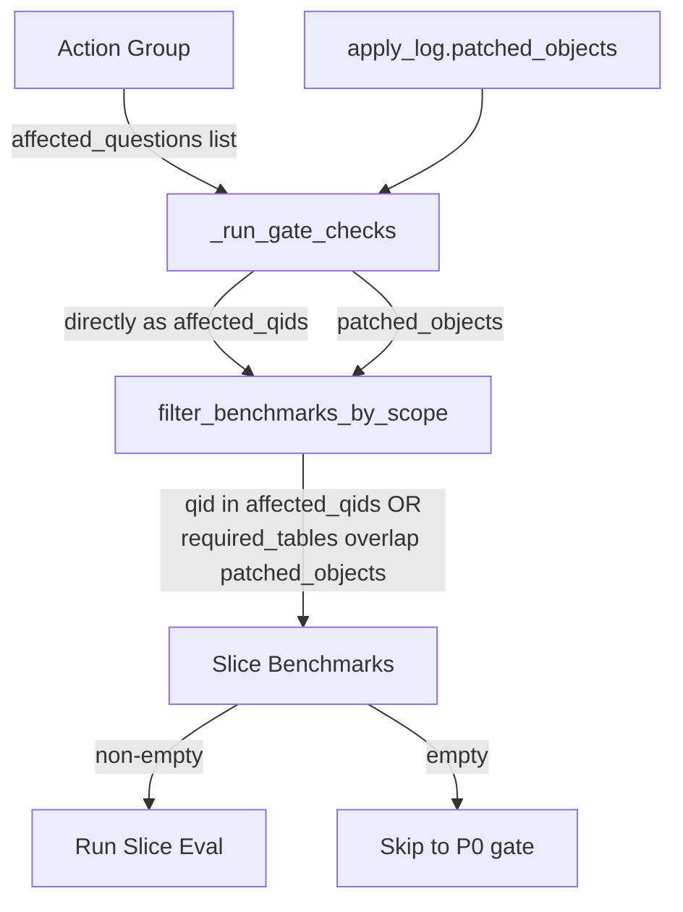

# Fix Slice Gate Evaluation

## Problem

The slice gate in `_run_gate_checks` always returns zero benchmarks because of two independent bugs, causing every iteration to skip directly to the expensive full evaluation.

## Bug 1: `affected_qids` is always empty (cluster_id mismatch)

In [harness.py](src/genie_space_optimizer/optimization/harness.py) lines 2413-2418:

```python
affected_qids: set[str] = set()
for p in proposals:
    cid = p.get("cluster_id", "")
    for c in clusters:
        if c.get("cluster_id") == cid:
            affected_qids.update(c.get("question_ids", []))
```

- `proposals[].cluster_id` is set to the **action group ID** (e.g., `"AG1"`) in [optimizer.py](src/genie_space_optimizer/optimization/optimizer.py) line 6032
- `clusters[].cluster_id` uses the **failure cluster ID** (e.g., `"C001"`) from [optimizer.py](src/genie_space_optimizer/optimization/optimizer.py) line 784
- These never match, so `affected_qids` is always empty

### Fix

The action group already carries `affected_questions` (a list of question IDs derived from the source clusters). Instead of reverse-looking up through proposals -> clusters, pass these directly.

**Change 1a** -- Add `affected_question_ids` parameter to `_run_gate_checks` in [harness.py](src/genie_space_optimizer/optimization/harness.py):

- Add a new keyword argument `affected_question_ids: set[str]` to the function signature (line 2346)
- Replace the broken loop (lines 2413-2418) with:

```python
affected_qids = affected_question_ids or set()
```

**Change 1b** -- Pass `affected_questions` from the action group at the call site in [harness.py](src/genie_space_optimizer/optimization/harness.py) line 3163:

- At the call to `_run_gate_checks(...)` (around line 3163), add:

```python
affected_question_ids=set(ag.get("affected_questions", [])),
```

This uses the `ag` variable already in scope (line 2987).

## Bug 2: `required_tables` / `required_columns` not persisted

Even if `affected_qids` were populated, the `patched_objects`-based path (`filter_benchmarks_by_scope` line 913-917) would still fail because `required_tables` and `required_columns` are never written to the evaluation dataset.

In [evaluation.py](src/genie_space_optimizer/optimization/evaluation.py) `create_evaluation_dataset` (lines 2487-2499), the `expectations` dict does not include these fields. When loaded back via `load_benchmarks_from_dataset` (line 4818), they default to `[]`.

### Fix

**Change 2** -- Persist `required_tables` and `required_columns` in [evaluation.py](src/genie_space_optimizer/optimization/evaluation.py) `create_evaluation_dataset`, inside the expectations dict (after line 2498):

```python
"required_tables": b.get("required_tables", []),
"required_columns": b.get("required_columns", []),
```

This ensures that when benchmarks are generated with `required_tables` populated (via `generate_benchmarks` line 4438), the data survives the round-trip through the UC Delta table.

**Note:** Curated benchmarks (from `extract_genie_space_benchmarks`) explicitly set `required_tables: []`. This is expected -- those benchmarks will only be captured by the `affected_qids` path, not the `patched_objects` path. No change needed there.

## Data Flow After Fix




## Files Changed

- [harness.py](src/genie_space_optimizer/optimization/harness.py) -- 2 edits (signature + call site, remove broken loop)
- [evaluation.py](src/genie_space_optimizer/optimization/evaluation.py) -- 1 edit (persist fields in `create_evaluation_dataset`)

