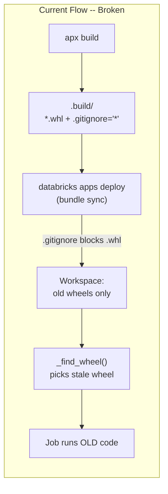
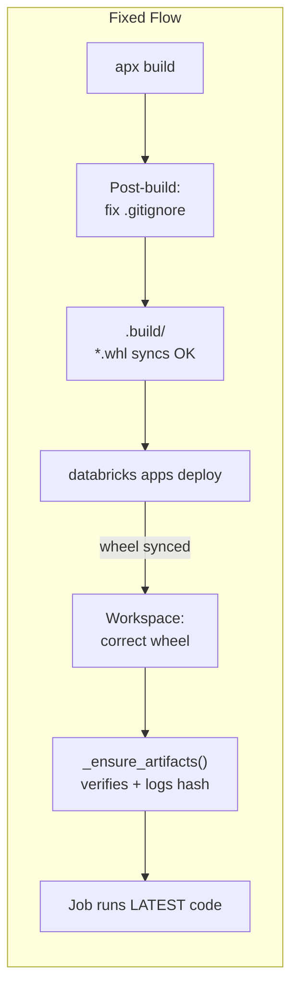

# Fix Wheel Deployment Pipeline

## Problem

`apx build` generates `.build/.gitignore` containing `*`, which causes the Databricks bundle sync to skip the wheel file. Old wheels from earlier deploys persist on the workspace and are picked up by `_find_wheel()`, so the serverless job runs stale code. This has caused hours of lost debugging time across multiple deploy cycles.







## Fix 1: Post-build `.gitignore` patch (prevent the problem)

**File:** `[databricks.yml](databricks.yml)`

Update the `artifacts.default.build` command to append negation rules to `.build/.gitignore` after `apx build` generates it:

```yaml
artifacts:
  default:
    build: >
      apx build
      && printf '\n!*.whl\n!*.txt\n!*.yml\n' >> .build/.gitignore
      && uv run python resources/grant_app_uc_permissions.py ...
```

This makes the bundle sync include `.whl`, `.txt`, and `.yml` files even though `*` excludes everything else. This covers `databricks bundle deploy` (the DAB workflow).

## Fix 2: Convenience `Makefile` (single-command deploy)

Create a top-level `[Makefile](Makefile)` that automates the full cycle, protecting against the manual `apx build` + `databricks apps deploy` workflow:

```makefile
deploy:
    apx build
    @printf '\n!*.whl\n!*.txt\n!*.yml\n' >> .build/.gitignore
    databricks apps deploy genie-space-optimizer --profile genie-test
    @echo "Deployed. Verifying wheel..."
    databricks workspace list ... | grep .whl
```

Key targets:

- `make deploy` -- full build + fix + deploy + verify (default)
- `make build` -- just build + fix gitignore
- `make verify` -- check workspace has the expected wheel

## Fix 3: Stale wheel cleanup in `_ensure_artifacts` (detect + recover)

**File:** `[src/genie_space_optimizer/backend/job_launcher.py](src/genie_space_optimizer/backend/job_launcher.py)`

Add a validation step inside `_ensure_artifacts` that:

1. **Verifies the wheel content matches the installed package** -- after `_find_wheel()` returns, check that the wheel contains a known sentinel (e.g., `_NON_ACTIONABLE_VERDICTS` or a version stamp) to catch stale-wheel scenarios.
2. **Cleans up old wheels** from the workspace `_WS_WHEEL_DIR` before uploading the new one, preventing accumulation.
3. **Logs the wheel build timestamp and hash** at INFO level for quick diagnosis.

Specifically, add to `_ensure_artifacts`:

- After uploading the new wheel, list files in `_WS_WHEEL_DIR` and delete any that don't match the current `ws_wheel_path`.
- Log a clear message: `"Wheel version: {stem}, hash: {hash[:8]}, path: {ws_wheel_path}"`.

## Fix 4: Startup health log in the app

**File:** `[src/genie_space_optimizer/backend/app.py](src/genie_space_optimizer/backend/app.py)` (or the lifespan function)

At app startup, log which wheel file `_find_wheel()` resolves to. This makes it immediately obvious in deploy logs whether the correct wheel was picked up, rather than having to wait for a full lever loop run to discover the problem.

```python
wheel = _find_wheel()
logger.info("App wheel: %s (size=%d)", wheel.name, wheel.stat().st_size)
```

## Summary of changes


| File              | Change                                                       | Purpose                                         |
| ----------------- | ------------------------------------------------------------ | ----------------------------------------------- |
| `databricks.yml`  | Append `!*.whl` to `.build/.gitignore` in artifact build cmd | Ensures bundle sync includes wheel              |
| `Makefile` (new)  | Build + fix + deploy + verify targets                        | Single-command deploy, prevents manual mistakes |
| `job_launcher.py` | Clean stale wheels, log version/hash at trigger time         | Detect + recover from stale wheel scenarios     |
| `app.py`          | Log resolved wheel at startup                                | Immediate visibility in deploy logs             |


