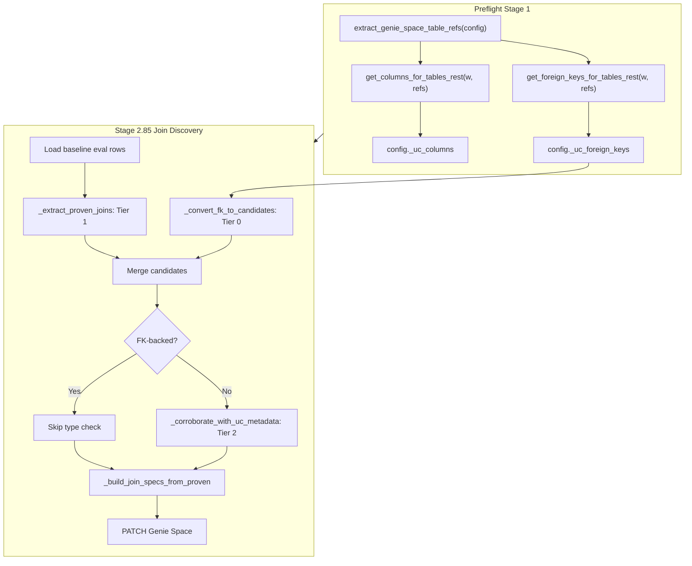

# FK Constraint-Based Join Discovery and Multi-Catalog Fix

## Context

The proactive join discovery pipeline (Stage 2.85) currently relies on:

- **Tier 1**: Execution-proven join paths parsed from successful baseline eval SQL
- **Tier 2**: UC column type compatibility check (reject incompatible types)

UC `information_schema` exposes foreign key metadata via `key_column_usage`, `constraint_table_usage`, and `constraint_column_usage`. More importantly, the **REST API already provides this data** -- `w.tables.get()` returns `TableInfo.table_constraints: List[TableConstraint]`, where each `ForeignKeyConstraint` contains:

- `child_columns: List[str]` (FK columns on the child table)
- `parent_table: str` (FQN of the referenced parent table)
- `parent_columns: List[str]` (PK columns on the parent table)

Since `get_columns_for_tables_rest()` in [uc_metadata.py](src/genie_space_optimizer/common/uc_metadata.py) already calls `w.tables.get()` per table, we can extract FK constraints **from the same API calls with zero additional cost**.

## Key Design Decisions

- **REST-first, Spark fallback**: Extract FK data from `w.tables.get()` (preferred). Add Spark SQL fallback querying `{catalog}.information_schema.key_column_usage` + `constraint_table_usage` + `constraint_column_usage` per unique (catalog, schema) pair.
- **Tier 0 (authoritative discovery)**: FK constraints generate join candidates independently of baseline eval SQL -- they can discover joins the eval never exercised.
- **Tier 2+ (strengthened corroboration)**: For execution-proven candidates, finding a matching FK raises confidence.
- **Multi-catalog correctness**: Fix the existing `table_name`-only key collision bug across the codebase by including catalog/schema or using FQN-based keys where needed.

## Changes

### Fix 1: Extract FK constraints from REST API (`uc_metadata.py`)

Modify `get_columns_for_tables_rest()` to also extract `table_constraints` from the `TableInfo` objects it already fetches:

```python
# In get_columns_for_tables_rest, after processing columns:
if table_info.table_constraints:
    for tc in table_info.table_constraints:
        fk = getattr(tc, "foreign_key_constraint", None)
        if fk and fk.parent_table and fk.child_columns and fk.parent_columns:
            fk_rows.append({
                "child_table": full_name,  # FQN of current table
                "child_columns": list(fk.child_columns),
                "parent_table": fk.parent_table,  # FQN from SDK
                "parent_columns": list(fk.parent_columns),
                "constraint_name": getattr(fk, "name", ""),
            })
```

Return FK rows as a separate list. Change the return type to a tuple `(column_rows, fk_rows)` or add a new companion function `get_foreign_keys_for_tables_rest(w, refs)` that re-uses the cached `TableInfo` objects.

**Recommended approach**: Add a new standalone function `get_foreign_keys_for_tables_rest(w, refs) -> list[dict]` that calls `w.tables.get()` per table (matching the existing pattern), extracts only FK constraints, and returns them. This avoids changing the existing `get_columns_for_tables_rest` signature.

To avoid **double API calls** (since `get_columns_for_tables_rest` already fetches the same `TableInfo`), add a module-level caching option: introduce `get_table_info_batch(w, refs) -> dict[str, TableInfo]` that both functions can share, or combine the extraction into one call site in the harness/preflight.

### Fix 2: Add Spark SQL fallback for FK constraints (`uc_metadata.py`)

Add `get_foreign_keys_for_tables(spark, refs) -> list[dict]` using the multi-catalog pattern (group by `(catalog, schema)`, UNION ALL):

```sql
SELECT
    kcu.table_catalog AS child_catalog,
    kcu.table_schema AS child_schema,
    kcu.table_name AS child_table,
    kcu.column_name AS child_column,
    ccu.table_catalog AS parent_catalog,
    ccu.table_schema AS parent_schema,
    ccu.table_name AS parent_table,
    ccu.column_name AS parent_column,
    kcu.constraint_name,
    kcu.ordinal_position
FROM {cat}.information_schema.key_column_usage kcu
JOIN {cat}.information_schema.constraint_column_usage ccu
    ON kcu.constraint_catalog = ccu.constraint_catalog
    AND kcu.constraint_schema = ccu.constraint_schema
    AND kcu.constraint_name = ccu.constraint_name
    AND kcu.ordinal_position = ccu.ordinal_position
WHERE kcu.position_in_unique_constraint IS NOT NULL
    AND kcu.table_schema = '{sch}'
    AND kcu.table_name IN ({safe_tables})
```

The `position_in_unique_constraint IS NOT NULL` filter isolates FK rows (PK rows have NULL in this column).

Post-process Spark rows to group multi-column FKs by `constraint_name` and produce the same output shape as the REST variant:

```python
{"child_table": "cat.sch.child", "child_columns": ["col_a", "col_b"],
 "parent_table": "cat.sch.parent", "parent_columns": ["pk_a", "pk_b"],
 "constraint_name": "fk_booking_property"}
```

### Fix 3: Integrate FK constraints into `_run_proactive_join_discovery` (`harness.py`)

In `_run_proactive_join_discovery`, after step 2 (gather existing specs) and before step 3 (extract from SQL), add:

```
Step 2.5: Fetch FK constraints
  - Call get_foreign_keys_for_tables_rest(w, table_refs) (or Spark fallback)
  - Convert each FK into a join candidate with source="fk_constraint"
  - Filter out pairs that already exist in existing_specs
  - These are Tier 0 candidates (authoritative, no SQL evidence needed)
  - Merge with execution-proven candidates, marking FK-backed ones
```

The FK-derived candidates bypass `_corroborate_with_uc_metadata` (type check) since FKs are definitionally type-correct. They go directly to `_build_join_specs_from_proven`.

**Wiring**: The `table_refs` needed for the FK query are available from `extract_genie_space_table_refs(config)` (already computed in `_prepare_config_for_lever_loop` at line 1040 of `harness.py`). Pass `table_refs` (or `w` + config) to `_run_proactive_join_discovery`, or compute inside the function.

### Fix 4: Merge FK + execution-proven candidates (`optimizer.py`)

Add `_convert_fk_to_candidates(fk_rows, short_to_fqn) -> list[dict]` in `optimizer.py` that converts FK constraint rows into the same candidate dict shape used by `_extract_proven_joins`:

```python
{
    "left_table": fk["child_table"],   # FQN
    "right_table": fk["parent_table"], # FQN
    "on_condition": "child_alias.child_col = parent_alias.parent_col",
    "frequency": 0,  # no SQL frequency; weight comes from FK authority
    "agreed": False,
    "source_questions": [],
    "fk_constraint": True,  # new flag
    "constraint_name": fk["constraint_name"],
}
```

In `_run_proactive_join_discovery`, merge FK candidates with execution-proven candidates:

- If both FK and SQL-proven exist for the same table pair, prefer the FK's ON condition (authoritative) and mark `"fk_validated": True`.
- If FK-only, include as a Tier 0 candidate.
- If SQL-only, proceed as today (Tier 1 + Tier 2 type check).

### Fix 5: Multi-catalog short-name collision fix (`uc_metadata.py`)

In `get_columns_for_tables_rest`, include `catalog_name` and `schema_name` in the returned rows:

```python
rows.append({
    "catalog_name": cat,
    "schema_name": sch,
    "table_name": tbl,
    "column_name": ...,
    "data_type": ...,
    "comment": ...,
})
```

This allows downstream consumers to build FQN-based keys when needed.

### Fix 6: Multi-catalog short-name collision fix (`optimizer.py`)

In the following functions, change `(short_table, col_name)` lookup keys to `(fqn_lower, col_name)` or add FQN fallback:

- `**_corroborate_with_uc_metadata**` (line 1717): Build `col_types` keyed by `(fqn, col_name)` in addition to `(short, col_name)`. Look up using FQN first, fall back to short name.
- `**_extract_proven_joins**` `short_to_fqn` (line 1596): Handle collisions by keeping a `list` of FQNs per short name, or preferring the FQN that matches the SQL context.

### Fix 7: Update preflight to expose FK metadata (`preflight.py`)

Add FK constraint extraction to the preflight metadata collection (alongside columns, tags, routines):

```python
uc_fk_dicts = (
    _usable_prefetch("uc_foreign_keys")
    or _rest_collect(
        lambda: get_foreign_keys_for_tables_rest(w, genie_table_refs),
        "foreign keys (genie tables)", "uc_foreign_keys",
    )
    or _spark_collect(
        lambda: get_foreign_keys_for_tables(spark, genie_table_refs),
        "foreign keys (genie tables)", "uc_foreign_keys",
    )
)
```

Store as `config["_uc_foreign_keys"]` so the lever loop and join discovery can access it without re-fetching.

## Data Flow




## Testing Considerations

- Unit test `get_foreign_keys_for_tables_rest` with mocked `w.tables.get()` returning `TableInfo` with `table_constraints`.
- Unit test `_convert_fk_to_candidates` with single-column and multi-column FK scenarios.
- Unit test the merge logic (FK + SQL-proven for same pair, FK-only, SQL-only).
- Unit test multi-catalog scenarios where two tables share the same short name but different catalogs.
- Integration: verify the Spark SQL fallback query compiles against `information_schema`.

