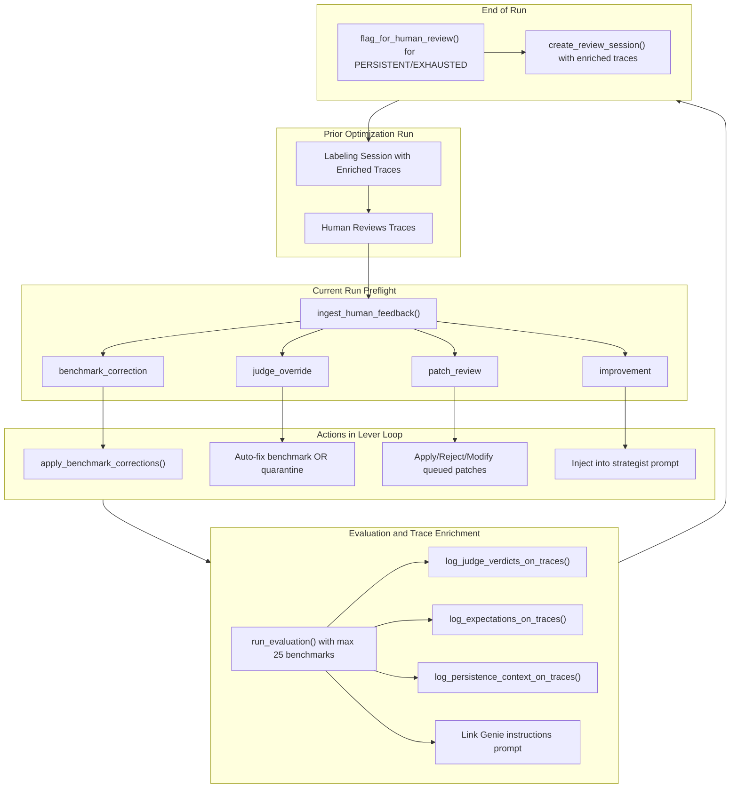

# Human Review Pipeline and Benchmark Hard Cap

## 1. Hard-cap benchmarks at 25

Add `MAX_BENCHMARK_COUNT = 25` to [config.py](src/genie_space_optimizer/common/config.py) (next to `TARGET_BENCHMARK_COUNT` at line 124).

**Enforce at three points:**

- **[preflight.py](src/genie_space_optimizer/optimization/preflight.py) `_load_or_generate_benchmarks`** (lines 683, 725, 768 — the three return paths): Before each return, if `len(benchmarks) > MAX_BENCHMARK_COUNT`, truncate. Priority order: `provenance == "curated"` first, then `"synthetic"`, then `"coverage_gap_fill"`, then `"auto_corrected"`. Within each tier, keep original order (which respects category diversity from generation). This single truncation before `create_evaluation_dataset` is the primary enforcement.
- **[evaluation.py](src/genie_space_optimizer/optimization/evaluation.py) `create_evaluation_dataset`** (line ~2536): After dedup loop and before `merge_records`, if `len(records) > MAX_BENCHMARK_COUNT`, truncate using the same provenance priority. This is a safety net in case benchmarks arrive from an unexpected path.
- **[evaluation.py](src/genie_space_optimizer/optimization/evaluation.py) `run_evaluation`** (line ~2910): After building `eval_data` DataFrame, if `len(eval_data) > MAX_BENCHMARK_COUNT`, truncate. This is the final guard — ensures no evaluation ever runs on more than 25 questions regardless of upstream bugs.

Also update `COVERAGE_GAP_SOFT_CAP_FACTOR` to respect the hard cap: change `_fill_coverage_gaps` (line 4141) to use `min(soft_cap, MAX_BENCHMARK_COUNT)`.

**Helper function** `_truncate_benchmarks(benchmarks, max_count)` in `evaluation.py`:

```python
_PROVENANCE_PRIORITY = ["curated", "synthetic", "auto_corrected", "coverage_gap_fill"]

def _truncate_benchmarks(benchmarks: list[dict], max_count: int) -> list[dict]:
    if len(benchmarks) <= max_count:
        return benchmarks
    buckets = {p: [] for p in _PROVENANCE_PRIORITY}
    buckets["other"] = []
    for b in benchmarks:
        prov = b.get("provenance", "other")
        buckets.get(prov, buckets["other"]).append(b)
    result = []
    for p in _PROVENANCE_PRIORITY + ["other"]:
        for b in buckets[p]:
            if len(result) >= max_count:
                break
            result.append(b)
    logger.warning("Truncated benchmarks from %d to %d", len(benchmarks), len(result))
    return result
```

---

## 2. Enrich traces for human review

Add a new function `log_judge_verdicts_on_traces` in [evaluation.py](src/genie_space_optimizer/optimization/evaluation.py) (after `log_expectations_on_traces` at line 5082):

```python
def log_judge_verdicts_on_traces(eval_result: dict) -> int:
    trace_map = eval_result.get("trace_map", {})
    rows = eval_result.get("rows", [])
    logged = 0
    for row in rows:
        qid = row.get("question_id") or row.get("inputs/question_id") or ""
        tid = trace_map.get(qid)
        if not tid:
            continue
        verdicts = {}
        for judge in ["schema_accuracy", "logical_accuracy", "completeness",
                       "asset_routing", "result_correctness", "arbiter"]:
            val = row.get(f"{judge}/value") or row.get(judge)
            if val is not None:
                verdicts[judge] = val
        if verdicts:
            mlflow.log_feedback(
                trace_id=tid, name="judge_verdicts",
                value=all(v in ("yes", "both_correct", "genie_correct") for v in verdicts.values()),
                rationale=json.dumps(verdicts),
                source=AssessmentSource(source_type="CODE", source_id="genie_space_optimizer/judges"),
                metadata={"question_id": qid, **verdicts},
            )
            logged += 1
    return logged
```

Add a new function `log_persistence_context_on_traces` in [evaluation.py](src/genie_space_optimizer/optimization/evaluation.py):

```python
def log_persistence_context_on_traces(
    eval_result: dict,
    persistence_data: dict[str, dict],
) -> int:
    trace_map = eval_result.get("trace_map", {})
    logged = 0
    for qid, ctx in persistence_data.items():
        tid = trace_map.get(qid)
        if not tid:
            continue
        mlflow.log_feedback(
            trace_id=tid, name="persistence_context",
            value=ctx.get("classification", "UNKNOWN") != "INTERMITTENT",
            rationale=f"Failed {ctx['fail_count']} times, {ctx['max_consecutive']} consecutive",
            source=AssessmentSource(source_type="CODE", source_id="genie_space_optimizer/persistence"),
            metadata={
                "question_id": qid,
                "fail_count": ctx.get("fail_count", 0),
                "max_consecutive": ctx.get("max_consecutive", 0),
                "classification": ctx.get("classification", ""),
                "patches_tried": str(ctx.get("patches_tried", [])),
                "fail_iterations": ctx.get("fail_iterations", []),
            },
        )
        logged += 1
    return logged
```

**Call sites in [harness.py](src/genie_space_optimizer/optimization/harness.py):**

- After `log_expectations_on_traces(eval_result)` at line 407 (baseline) and line 3769 (lever loop), add calls to `log_judge_verdicts_on_traces(eval_result)`.
- After the final evaluation in the lever loop (around line 3769), also call `log_persistence_context_on_traces(full_result, persistence_data)` where `persistence_data` is built from `_build_question_persistence_summary` internals (refactor to also return structured data, not just text).

**Refactor `_build_question_persistence_summary`** (harness.py line 1822): Make it return a tuple `(text, structured_dict)` where `structured_dict` is `{qid: {fail_count, max_consecutive, classification, patches_tried, fail_iterations}}`. The text output continues to feed the strategist; the structured dict feeds trace enrichment.

---

## 3. Trigger human review for persistent failures

Currently `flag_for_human_review` is only called from `_handle_escalation` for TVF/strategist escalations.

**Add end-of-run persistent failure flagging** in [harness.py](src/genie_space_optimizer/optimization/harness.py), right before the labeling session creation (line ~3857):

```python
# Flag persistent failures for human review
_persistence_text, _persistence_data = _build_question_persistence_summary(
    _verdict_history, reflection_buffer,
)
_persistent_items = [
    {
        "question_id": qid,
        "question_text": ctx.get("question_text", ""),
        "reason": ctx["classification"],
        "iterations_failed": ctx["fail_count"],
        "patches_tried": str(ctx.get("patches_tried", [])),
    }
    for qid, ctx in _persistence_data.items()
    if ctx["classification"] in ("PERSISTENT", "ADDITIVE_LEVERS_EXHAUSTED")
]
if _persistent_items:
    flag_for_human_review(spark, run_id, catalog, schema, domain, _persistent_items)
```

This ensures all persistent/exhausted questions are flagged at the end of the run with real `iterations_failed` data, not `0`.

**Also prioritize persistent-failure traces in the labeling session:** Pass persistent question IDs into `create_review_session` via `failure_question_ids` (already supported). Ensure the persistent failure question IDs are added to `all_failure_question_ids` at end-of-run.

---

## 4. Link Genie instruction prompt to top-level traces

**Modify `make_predict_fn`** in [evaluation.py](src/genie_space_optimizer/optimization/evaluation.py) (line 1182):

- Add parameter `instruction_prompt_name: str = ""`
- Inside `genie_predict_fn` (the `@mlflow.trace` closure, line 1206), call `_link_prompt_to_trace(instruction_prompt_name)` at the top of the function body.

**Update call sites** in [harness.py](src/genie_space_optimizer/optimization/harness.py):

- At lines 362 and 3166, compute the instruction prompt name:

```python
  _instr_prompt = format_mlflow_template(
      INSTRUCTION_PROMPT_NAME_TEMPLATE,
      uc_schema=f"{catalog}.{schema}", space_id=space_id,
  )
  predict_fn = make_predict_fn(
      w, space_id, spark, catalog, schema,
      instruction_prompt_name=_instr_prompt,
      ...
  )
  

```

---

## 5. Make all human feedback types actionable

### 5a. `judge_override` -> benchmark correction or quarantine

In [harness.py](src/genie_space_optimizer/optimization/harness.py) (lines 3146-3161), expand the human corrections processing block:

```python
# Process judge_override feedback
_judge_overrides = [c for c in (human_corrections or []) if c.get("type") == "judge_override"]
for ov in _judge_overrides:
    feedback = ov.get("feedback", "")
    if "Genie answer is actually fine" in feedback:
        # Extract Genie SQL from the trace and create benchmark correction
        genie_sql = _extract_genie_sql_from_trace(ov.get("trace_id", ""))
        if genie_sql:
            _human_sql_fixes.append({
                "question": ov.get("question", ""),
                "new_expected_sql": genie_sql,
                "verdict": "genie_correct",
            })
    elif "both answers are wrong" in feedback:
        quarantine_benchmark_question(spark, uc_schema, domain, ov.get("question_id", ""),
                                       reason="both_wrong", comment=ov.get("comment", ""))
    elif "Ambiguous" in feedback:
        quarantine_benchmark_question(spark, uc_schema, domain, ov.get("question_id", ""),
                                       reason="ambiguous", comment=ov.get("comment", ""))
```

Add helper `_extract_genie_sql_from_trace` in [evaluation.py](src/genie_space_optimizer/optimization/evaluation.py) that calls `mlflow.get_trace(trace_id)` and extracts the response SQL.

Note: `quarantine_benchmark_question` is being implemented as part of the "Per-Question Cross-Iteration Arbiter Corrections" plan (todo `quarantine-mechanism`). If that plan is implemented first, this hooks into it directly.

### 5b. `patch_review` -> apply/reject/modify queued patches

In [harness.py](src/genie_space_optimizer/optimization/harness.py), add processing after the benchmark corrections block (~line 3162):

```python
_patch_reviews = [c for c in (human_corrections or []) if c.get("type") == "patch_review"]
if _patch_reviews:
    from genie_space_optimizer.optimization.state import get_queued_patches, run_query
    pending = get_queued_patches(spark, catalog, schema, status="pending")
    for pr in _patch_reviews:
        decision = pr.get("decision", "")
        if "Approve" in decision:
            # Find matching patch and apply
            # Update status to 'approved' in genie_opt_queued_patches
            pass
        elif "Reject" in decision:
            # Update status to 'rejected'
            # Add to reflection buffer for strategist
            reflection_buffer.append({
                "iteration": 0, "type": "human_rejection",
                "detail": f"Human rejected patch: {pr.get('comment', '')}",
            })
        elif "Modify" in decision:
            # Store modification as human hint
            pass
```

### 5c. `improvement` -> strategist context

**Add `{{ human_reviewer_suggestions }}` placeholder** to `ADAPTIVE_STRATEGIST_PROMPT` in [config.py](src/genie_space_optimizer/common/config.py) (around line 1739, after the persistence summary section).

**In [optimizer.py](src/genie_space_optimizer/optimization/optimizer.py)** `_call_llm_for_adaptive_strategy` (line ~4596):

- Add parameter `human_suggestions: list[dict] | None = None`
- Format suggestions into text and add to `format_kwargs`:

```python
  suggestions_text = ""
  if human_suggestions:
      lines = ["Human reviewer suggestions from prior review:"]
      for s in human_suggestions:
          for item in s.get("suggestions", []):
              lines.append(f"- {item}")
      suggestions_text = "\n".join(lines)
  format_kwargs["human_reviewer_suggestions"] = suggestions_text
  

```

**Wire through:** In [harness.py](src/genie_space_optimizer/optimization/harness.py), extract `improvement` entries from `human_corrections` and pass them into `_call_llm_for_adaptive_strategy` via the new parameter.

### 5d. Enrich `ingest_human_feedback` extraction

In [labeling.py](src/genie_space_optimizer/optimization/labeling.py) `ingest_human_feedback` (line 420):

- For `judge_override`: also extract `question_id` and `question` from the trace's request JSON (same pattern as `benchmark_correction` at line 444-450), so the harness can identify which question to fix/quarantine.
- For "Ambiguous" verdicts: also capture as `judge_override` (currently only "Wrong" triggers extraction at line 436).

---

## Data flow diagram




---

## Files changed


| File                                                   | Changes                                                                                                                                                                                                                                                                                       |
| ------------------------------------------------------ | --------------------------------------------------------------------------------------------------------------------------------------------------------------------------------------------------------------------------------------------------------------------------------------------- |
| `src/genie_space_optimizer/common/config.py`           | Add `MAX_BENCHMARK_COUNT = 25`; add `{{ human_reviewer_suggestions }}` to `ADAPTIVE_STRATEGIST_PROMPT`                                                                                                                                                                                        |
| `src/genie_space_optimizer/optimization/evaluation.py` | Add `_truncate_benchmarks()`, `log_judge_verdicts_on_traces()`, `log_persistence_context_on_traces()`, `_extract_genie_sql_from_trace()`; add `instruction_prompt_name` to `make_predict_fn`; enforce cap in `create_evaluation_dataset` and `run_evaluation`                                 |
| `src/genie_space_optimizer/optimization/preflight.py`  | Enforce cap before returns in `_load_or_generate_benchmarks`                                                                                                                                                                                                                                  |
| `src/genie_space_optimizer/optimization/harness.py`    | Call trace enrichment functions; add persistent-failure flagging at end-of-run; process `judge_override`, `patch_review`, `improvement` from `human_corrections`; pass instruction prompt name to `make_predict_fn`; refactor `_build_question_persistence_summary` to return structured data |
| `src/genie_space_optimizer/optimization/optimizer.py`  | Add `human_suggestions` parameter to `_call_llm_for_adaptive_strategy`; format into `format_kwargs`                                                                                                                                                                                           |
| `src/genie_space_optimizer/optimization/labeling.py`   | Enrich `judge_override` extraction with question_id; capture "Ambiguous" verdicts                                                                                                                                                                                                             |
| `tests/unit/`                                          | Add tests for benchmark truncation, trace enrichment, feedback processing                                                                                                                                                                                                                     |


