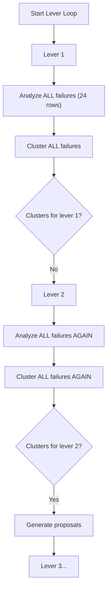
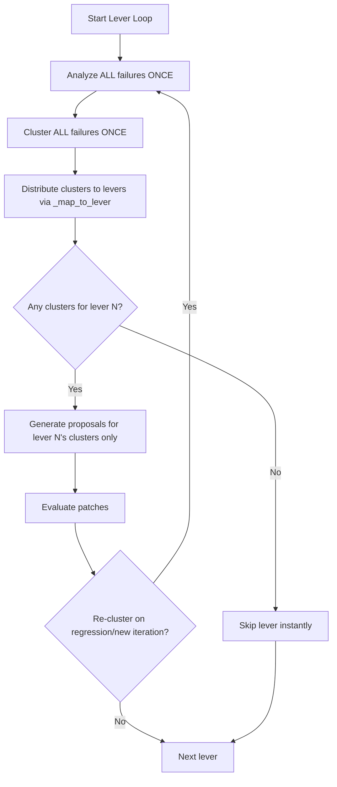

# Lever Loop Refactor: Analyze Once, Distribute to Levers

## Problem

The current lever loop in `_run_lever_loop()` ([harness.py](src/genie_space_optimizer/optimization/harness.py)) re-runs the **same failure analysis, ASI extraction, and clustering** for every lever in the loop. This means:

1. **Redundant work**: For 5 levers, the same 24 rows are analyzed up to 5 times with identical results
2. **Wasted iterations**: Lever 1 does full analysis only to discover "no clusters match lever 1" and skip
3. **Locked-out patches**: Lever 2 generates proposals that violate structured metadata ownership because the LLM is not properly constrained to only editable sections

## Current Flow (lever-first)




## Proposed Flow (failure-first)




## Key Changes

### 1. Extract analysis phase out of the per-lever loop

**File**: [harness.py](src/genie_space_optimizer/optimization/harness.py) (lines 782-1060)

Move the block at lines 812-1030 (failure row loading, arbiter classification, ASI extraction, cluster formation, lever mapping) **before** the `for lever in levers:` loop. This block currently runs identically for each lever.

Create a new helper function:

```python
def _analyze_and_distribute(
    spark, run_id, catalog, schema, metadata_snapshot,
    *, verbose: bool = True,
) -> dict[int, list[dict]]:
    """Analyze failures once, cluster, and distribute to levers.
    
    Returns: {lever_number: [clusters]} mapping.
    """
```

This function will:

- Load failure rows via `_get_failure_rows()`
- Classify by arbiter verdict (hard vs soft vs excluded)
- Call `cluster_failures()` for hard failures
- Call `cluster_failures()` for soft signals
- Map each cluster to its natural lever via `_map_to_lever()`
- Return a dict: `{1: [...], 2: [...], 3: [...], 4: [...], 5: [...]}`

### 2. Simplify the lever iteration loop

The `for lever in levers:` loop becomes:

```python
lever_assignments = _analyze_and_distribute(...)
# Print full analysis summary once

for lever in levers:
    assigned = lever_assignments.get(lever, [])
    if not assigned and lever not in (4, 5):
        # Skip instantly, no redundant analysis
        continue
    
    # For lever 5: merge in clusters from failed levers
    if lever == 5:
        for fl in levers_rolled_back:
            assigned.extend(lever_assignments.get(fl, []))
    
    # Generate proposals only for assigned clusters
    proposals = generate_metadata_proposals(
        assigned, metadata_snapshot, target_lever=lever, ...
    )
    # ... apply, evaluate, gate checks ...
    
    # On regression/rollback: re-analyze if needed
```

### 3. Re-analysis after patches

After a lever's patches are accepted and scores change, the failure landscape may shift. The loop should re-run `_analyze_and_distribute()` **only when patches are accepted** (not on every lever iteration). This replaces the current redundant re-analysis:

```python
for lever in levers:
    ...
    if patches_accepted:
        lever_assignments = _analyze_and_distribute(...)  # Re-analyze with new state
```

### 4. Add MLflow user/session trace metadata

**File**: [evaluation.py](src/genie_space_optimizer/optimization/evaluation.py) (line 1113)

In `make_predict_fn`, add `metadata` to the existing `mlflow.update_current_trace()` call:

```python
mlflow.update_current_trace(
    tags=_trace_tags,
    metadata={
        "mlflow.trace.user": triggered_by or "",
        "mlflow.trace.session": optimization_run_id or "",
    },
)
```

This requires:

- Adding `triggered_by: str = ""` parameter to `make_predict_fn()` signature
- Passing `triggered_by` from the lever loop notebook (read from preflight task values, which already publishes it)
- Passing `optimization_run_id=run_id` in the harness call to `make_predict_fn()` (currently not passed)

### 5. Pass `optimization_run_id` and `triggered_by` through the call chain

**File**: [harness.py](src/genie_space_optimizer/optimization/harness.py) (line 718)

Change:

```python
predict_fn = make_predict_fn(w, space_id, spark, catalog, schema, metric_view_measures=_mv_measures)
```

To:

```python
predict_fn = make_predict_fn(
    w, space_id, spark, catalog, schema,
    metric_view_measures=_mv_measures,
    optimization_run_id=run_id,
    triggered_by=triggered_by,
)
```

This requires adding `triggered_by` to `_run_lever_loop` signature and passing it from the notebook.

**File**: [run_lever_loop.py](src/genie_space_optimizer/jobs/run_lever_loop.py)

Read `triggered_by` from preflight task values (already published) and pass to `_run_lever_loop()`.

## Files Changed


| File                         | Change                                                                                |
| ---------------------------- | ------------------------------------------------------------------------------------- |
| `optimization/harness.py`    | Extract `_analyze_and_distribute()`, restructure lever loop, add `triggered_by` param |
| `optimization/evaluation.py` | Add `triggered_by` to `make_predict_fn`, add `metadata` to `update_current_trace`     |
| `jobs/run_lever_loop.py`     | Read `triggered_by` from task values, pass to `_run_lever_loop`                       |


## What Does NOT Change

- `cluster_failures()` in optimizer.py — unchanged, just called fewer times
- `generate_metadata_proposals()` in optimizer.py — unchanged, called the same way
- `_map_to_lever()` in optimizer.py — unchanged
- Evaluation gates (slice, P0, full) — unchanged
- Patch application — unchanged

