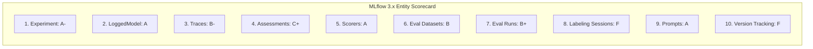
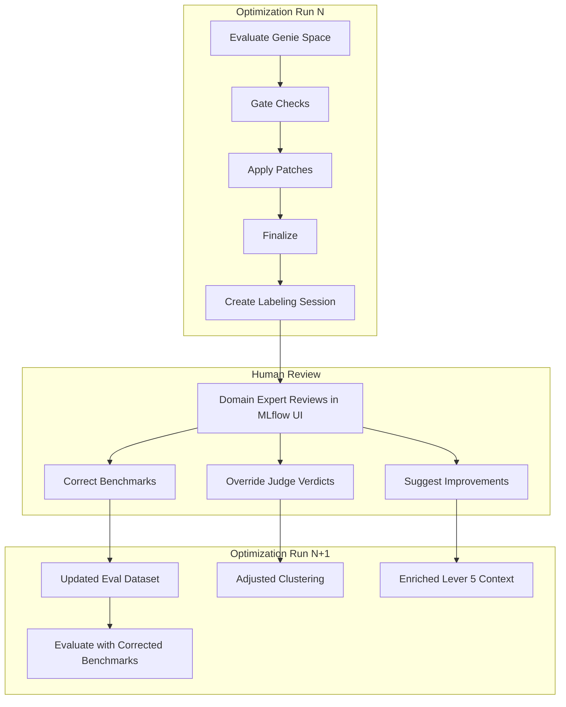
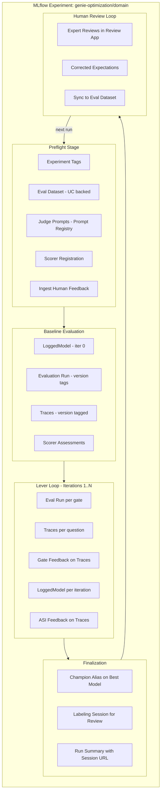

# MLflow 3.x End-to-End Audit and Integration Plan

Goal: Make the Genie Space Optimizer a **first-class reference implementation** of every MLflow 3.x GenAI data model entity, demonstrating how MLflow helps optimize a GenAI application end-to-end.

---

## End-to-End Audit Scorecard

Audited against the [MLflow 3.x GenAI Data Model](https://mlflow.org/docs/3.2.0/genai/data-model/) -- 10 core entities:




### 1. Experiment -- Grade: A-

**What we do well:**

- Single experiment per Genie Space domain: `/Users/<email>/genie-optimization/<domain>`
- Fallback to `/Shared/genie-optimization/<domain>` when OBO fails
- All evaluation runs, models, traces, and scorers live in this experiment
- Created during preflight and reused throughout the optimization lifecycle

**Gaps:**

- No experiment-level description or tags (best practice: tag with `space_id`, `domain`, `app_version`)
- No experiment-level metadata about the optimization pipeline version

**Fix (WS4):** Add `mlflow.set_experiment_tags()` in [preflight.py](src/genie_space_optimizer/optimization/preflight.py) after `set_experiment`:

```python
mlflow.set_experiment_tags({
    "genie.space_id": space_id,
    "genie.domain": domain,
    "genie.pipeline_version": __version__,
    "genie.catalog": catalog,
    "genie.schema": schema,
})
```

---

### 2. LoggedModel -- Grade: A

**What we do well:**

- `create_genie_model_version()` in [models.py](src/genie_space_optimizer/optimization/models.py) creates a LoggedModel per iteration
- Full snapshot of Genie Space config + UC metadata as params and artifacts
- `_finalize_logged_model(model_id, status="READY")` to mark readiness
- `promote_best_model()` sets `"champion"` alias on the best model
- `mlflow.set_active_model(model_id=...)` in [evaluation.py](src/genie_space_optimizer/optimization/evaluation.py) links traces to models
- `model_id` passed to `mlflow.genai.evaluate()` for automatic trace-to-model linking
- `rollback_to_model()` reads config from LoggedModel params for restore

**Gaps:**

- `link_eval_scores_to_model()` logs metrics via `mlflow.log_metric(f"eval_{judge}", score)` on the **run**, not directly on the LoggedModel. In MLflow 3, model-level metrics are separate.
- No `model_type="agent"` on all creation paths (only in `_initialize_logged_model`)
- Parent-child model linking exists (`parent_model_id` param) but not surfaced as a tag for UI filtering

**Fix (WS7):** In `link_eval_scores_to_model()` ([models.py](src/genie_space_optimizer/optimization/models.py) line ~230), also call `mlflow.log_metrics()` with `model_id` parameter if the API supports it, to ensure metrics appear on the Model card in the UI.

---

### 3. Traces -- Grade: B-

**What we do well:**

- `@mlflow.trace` on `genie_predict_fn` in [evaluation.py](src/genie_space_optimizer/optimization/evaluation.py) line 1082
- `mlflow.update_current_trace(tags={"question_id": ..., "space_id": ...})` for searchable metadata
- UC trace destination configured via `_configure_uc_trace_destination()`
- Monkey-patching for `None` trace edge cases (`_patch_mlflow_harness_none_trace`)

**Gaps (3 issues):**

1. **trace_id stripped from output** -- `_STRIP_COLS = {"trace", "trace_id", ...}` at line 2756 means we can never call `log_feedback` on traces later
2. **No version tracking tags on traces** -- No way to filter traces by optimization run, iteration, or lever in the MLflow UI
3. **No specialized span types** -- The predict function is a flat `@mlflow.trace`; could use nested spans with `TOOL` type for Genie API call and `RETRIEVER` type for UC metadata lookup

**Fix (WS1):** Remove `trace_id` from `_STRIP_COLS`, build `trace_map` dict, add version tags in the predict function:

```python
# In make_predict_fn, pass optimization context via closure:
mlflow.update_current_trace(tags={
    "genie.optimization_run_id": optimization_run_id,
    "genie.iteration": str(iteration),
    "genie.lever": str(lever),
    "genie.eval_scope": eval_scope,
})
```

---

### 4. Assessments (Feedback + Expectations) -- Grade: C+

**What we do well:**

- All 9 scorers return `Feedback` objects that `mlflow.genai.evaluate()` attaches to traces automatically
- `Expectations` (expected_response, expected_asset, previous_sql) are defined in eval data
- `_extract_assessments_from_traces()` pulls rationale and metadata from trace assessments

**Gaps (2 major):**

1. `**mlflow.log_feedback` is NEVER called** -- Gate outcomes (pass/fail/rollback), ASI insights, provenance metadata, and patch outcomes are all invisible in the MLflow UI. They exist only in Delta tables.
2. **No human assessments** -- No mechanism for domain experts to provide corrections or feedback on traces

**Fix (WS2):** New `log_gate_feedback_on_traces()` helper called after every gate decision. Also log ASI root-cause as feedback on baseline eval traces so judges' structured failure analysis is visible in the UI.

---

### 5. Scorers -- Grade: A

**What we do well:**

- 9 custom `@scorer` functions: `syntax_validity`, `schema_accuracy`, `logical_accuracy`, `semantic_equivalence`, `completeness`, `response_quality`, `asset_routing`, `result_correctness`, `arbiter`
- Plus `repeatability` scorer for cross-run consistency
- `register_scorers_with_experiment()` registers all scorers on baseline eval (iteration 0) so they appear in the **Judges tab** of the MLflow UI
- Each scorer returns `Feedback` with structured `metadata` (ASI failure_type, blame_set, counterfactual_fix, etc.)

**Gaps:** None significant. Could explore built-in MLflow judges (`Correctness`, `Guidelines`) as supplementary validators, but custom scorers are the right choice for this domain.

**No changes needed.**

---

### 6. Evaluation Datasets -- Grade: B

**What we do well:**

- `mlflow.genai.datasets.create_dataset(uc_table_name=...)` creates UC-backed datasets
- Benchmarks stored in `{catalog}.{schema}.genie_benchmarks_{domain}`
- Records include both `inputs` and `expectations` dicts
- `merge_records()` used to populate the dataset

**Gaps (2 issues):**

1. **Drop-and-recreate** -- `_drop_benchmark_table()` wipes the dataset before each run. No version history. Should append/merge instead, or version with tags.
2. **No `mlflow.log_input(dataset)`** -- Evaluation datasets are not formally linked to evaluation runs. This breaks the lineage chain in the MLflow UI.
3. **No sync from labeling sessions** -- Human-corrected expectations never flow back to the dataset.

**Fix (WS5):**

- Replace `DROP TABLE` with `merge_records()` (upsert by question_id) to preserve history
- Call `mlflow.log_input(dataset, context="evaluation")` inside `run_evaluation()` to link the dataset to the evaluation run
- After labeling session review: `session.sync(dataset_name=uc_table_name)` to propagate corrections

---

### 7. Evaluation Runs -- Grade: B+

**What we do well:**

- `mlflow.genai.evaluate(predict_fn, data, scorers, model_id=...)` is the core eval call
- Each eval creates an MLflow Run with `mlflow.start_run(run_name=...)`
- Params logged: eval scope, iteration, benchmark count, harness settings
- Metrics logged: per-judge scores, overall accuracy, thresholds
- Tags logged: evaluation_status, retry counts
- `model_id` correctly passed to `evaluate()` for model-attached runs (MLflow 3 pattern)

**Gaps (2 issues):**

1. **No optimization lifecycle tags** -- Runs don't carry `genie.optimization_run_id`, `genie.lever`, `genie.eval_scope` tags. You can't filter "show me all runs from optimization X" in the MLflow UI.
2. **No cross-run comparison metadata** -- No `previous_run_id` or `parent_run_id` tag linking sequential evaluations.

**Fix (WS4):** In `run_evaluation()` after `mlflow.start_run()`:

```python
mlflow.set_tags({
    "genie.optimization_run_id": optimization_run_id,
    "genie.iteration": str(iteration),
    "genie.lever": str(lever) if lever else "baseline",
    "genie.eval_scope": eval_scope,
    "genie.space_id": space_id,
    "genie.domain": domain,
    "genie.version": f"iter_{iteration}_{eval_scope}",
    "genie.previous_model_id": previous_model_id or "",
})
```

---

### 8. Labeling Sessions -- Grade: F (NOT USED)

**Current state:** Zero usage. No labeling sessions, no Review App integration, no human feedback loop. All review happens by reading print logs.

**This is the biggest gap** and the most impactful opportunity. MLflow's labeling sessions + Review App can:

- Let domain experts review regressed questions directly in the MLflow UI
- Collect structured feedback (was the judge correct? what's the right SQL?)
- Sync corrections back to the evaluation dataset
- Feed human insights into the next optimization run

**Fix (WS3a, WS3b, WS3c):** See detailed implementation below.

---

### 9. Prompts -- Grade: A

**What we do well:**

- `mlflow.genai.register_prompt()` for both judge prompts and Genie Space instructions
- `mlflow.genai.set_prompt_alias()` for `"production"` alias management
- Judge prompt templates logged as artifacts + registered in Prompt Registry
- `register_judge_prompts()` creates versioned prompts on baseline eval
- `register_instruction_version()` snapshots instruction text per iteration

**Gaps:** Minor -- could use `mlflow.genai.load_prompt()` to load prompts at eval time instead of inline strings, creating a formal dependency chain. Not critical.

**No changes needed for this phase.**

---

### 10. Version Tracking -- Grade: F (NOT USED)

**Current state:** Zero version tracking tags. Each evaluation run is isolated. No way to:

- Compare performance across optimization iterations in the MLflow UI
- Filter traces by iteration or lever
- Track how a Genie Space config evolves across runs
- Use `mlflow.search_traces(filter_string="tags.genie.iteration = '3'")` for analysis

**Fix (WS4):** Comprehensive tagging on experiments, runs, traces, and models. See Workstream 4.

---

## Implementation Workstreams

### WS1: Preserve Trace IDs and Add Trace-Level Tags

**Files:** [evaluation.py](src/genie_space_optimizer/optimization/evaluation.py)

**Changes:**

- Line 2756: Remove `trace_id` from `_STRIP_COLS` (keep it in output rows)
- After the row processing loop (~line 2850): Build `trace_map = {question_id: trace_id}`
- Add `trace_map` to the output dict
- Same change for `run_repeatability_evaluation()` at line 3138
- In `make_predict_fn()`: Accept `optimization_run_id`, `iteration`, `lever` via closure; add to `mlflow.update_current_trace(tags={...})`
- Propagate `optimization_run_id` through `run_evaluation()` signature (new kwarg)

---

### WS2: Log Gate Outcomes as Feedback on Traces

**Files:** [evaluation.py](src/genie_space_optimizer/optimization/evaluation.py), [harness.py](src/genie_space_optimizer/optimization/harness.py)

**New function** `log_gate_feedback_on_traces()` in evaluation.py:

```python
def log_gate_feedback_on_traces(
    eval_result: dict,
    gate_type: str,         # "slice" | "p0" | "full"
    gate_result: str,       # "pass" | "fail" | "rollback"
    regressions: list[dict] | None = None,
    lever: int | None = None,
    iteration: int | None = None,
) -> None:
    trace_map = eval_result.get("trace_map", {})
    if not trace_map:
        return
    for qid, trace_id in trace_map.items():
        try:
            mlflow.log_feedback(
                trace_id=trace_id,
                name=f"gate_{gate_type}",
                value=gate_result == "pass",
                rationale=f"Lever {lever} gate {gate_type}: {gate_result}",
                source=AssessmentSource(
                    source_type=AssessmentSourceType.CODE,
                    source_id="genie_space_optimizer/gate",
                ),
                metadata={"gate_type": gate_type, "lever": lever,
                          "iteration": iteration,
                          "regressions": (regressions or [])[:3]},
            )
        except Exception:
            logger.debug("Failed to log gate feedback for trace %s", trace_id)
```

**Call sites in harness.py:** After each gate pass/fail (slice ~line 920, P0 ~line 960, full ~line 1025).

Also log ASI root-cause as feedback on **baseline eval** traces:

```python
def log_asi_feedback_on_traces(eval_result: dict, asi_rows: list[dict]) -> None:
    trace_map = eval_result.get("trace_map", {})
    for asi in asi_rows:
        tid = trace_map.get(asi.get("question_id"))
        if not tid:
            continue
        mlflow.log_feedback(
            trace_id=tid,
            name=f"asi_{asi['judge']}",
            value=asi.get("value", "no") == "yes",
            rationale=asi.get("counterfactual_fix", ""),
            source=AssessmentSource(source_type=AssessmentSourceType.CODE,
                                   source_id="genie_space_optimizer/asi"),
            metadata={"failure_type": asi.get("failure_type"),
                      "blame_set": asi.get("blame_set"),
                      "wrong_clause": asi.get("wrong_clause")},
        )
```

---

### WS3: Labeling Sessions and Human Feedback Loop

**Files:** NEW [labeling.py](src/genie_space_optimizer/optimization/labeling.py), [harness.py](src/genie_space_optimizer/optimization/harness.py), [preflight.py](src/genie_space_optimizer/optimization/preflight.py)

#### 3a. Custom labeling schemas

Four schemas tailored to Genie Space optimization review:

- `**judge_verdict_accuracy`** (Feedback, categorical) -- Was the judge correct?
- `**corrected_expected_sql`** (Expectation, text) -- Correct benchmark SQL
- `**patch_approval**` (Feedback, categorical) -- Approve/reject/modify patch
- `**improvement_suggestions**` (Expectation, text list) -- Free-form improvements

#### 3b. Auto-create labeling session after lever loop

In `_run_lever_loop` finalization:

1. Collect `all_failure_trace_ids` and `all_regression_trace_ids` during the loop (from `trace_map` in each eval result)
2. Call `create_review_session(run_id, domain, exp_name, failure_trace_ids, regression_trace_ids, triggered_by_email)`
3. Store `session_run_id` and `session_url` in `genie_opt_runs` (new columns)
4. Print session URL in the lever loop summary for immediate access

#### 3c. Feedback-to-optimization loop

In `_run_preflight` (or new pre-stage):

1. Query the latest labeling session for this domain/space
2. Call `ingest_human_feedback(experiment_name, session_run_id)` to extract:
  - `benchmark_correction` -- update eval dataset via `session.sync()`
  - `judge_override` -- add to a `question_overrides` dict passed to clustering
  - `improvement` -- append to lever 5 context
3. This creates a **closed loop**: Human review --> Better benchmarks --> Better evaluations --> Better optimization




---

### WS4: Version Tracking Tags

**Files:** [evaluation.py](src/genie_space_optimizer/optimization/evaluation.py), [preflight.py](src/genie_space_optimizer/optimization/preflight.py), [models.py](src/genie_space_optimizer/optimization/models.py), [harness.py](src/genie_space_optimizer/optimization/harness.py)

**Experiment-level tags** (in preflight):

```python
mlflow.set_experiment_tags({"genie.space_id": space_id, "genie.domain": domain, "genie.pipeline_version": __version__})
```

**Run-level tags** (in run_evaluation, after start_run):

```python
mlflow.set_tags({
    "genie.optimization_run_id": optimization_run_id,
    "genie.iteration": str(iteration),
    "genie.lever": str(lever) if lever else "baseline",
    "genie.eval_scope": eval_scope,
    "genie.space_id": space_id,
    "genie.domain": domain,
})
```

**Trace-level tags** (in predict function, via update_current_trace):

```python
mlflow.update_current_trace(tags={
    "genie.optimization_run_id": optimization_run_id,
    "genie.iteration": str(iteration),
    "genie.lever": str(lever),
})
```

**LoggedModel tags** (already have domain/space_id/iteration, add optimization_run_id).

---

### WS5: Evaluation Dataset Versioning and Lineage

**Files:** [evaluation.py](src/genie_space_optimizer/optimization/evaluation.py)

- Replace `_drop_benchmark_table()` + `create_dataset()` with `merge_records()` (upsert semantics). This preserves historical benchmarks.
- After creating/loading the dataset, call `mlflow.log_input(dataset, context="evaluation")` inside `run_evaluation()` to formally link the dataset to the evaluation run in MLflow's lineage graph.
- After labeling session: `session.sync(dataset_name=uc_table_name)` to backfill human corrections.

---

### WS6: Fix ASI Results Table

**Files:** [state.py](src/genie_space_optimizer/optimization/state.py), [harness.py](src/genie_space_optimizer/optimization/harness.py), [optimizer.py](src/genie_space_optimizer/optimization/optimizer.py)

- Add `mlflow_run_id` column to `genie_eval_asi_results` DDL
- In `write_asi_results`, accept and store both `run_id` (optimization) and `mlflow_run_id` (from eval result)
- Wire `read_asi_from_uc` into clustering as an enrichment source (currently defined but never called)

---

### WS7: Model-Level Metrics

**Files:** [models.py](src/genie_space_optimizer/optimization/models.py)

- In `link_eval_scores_to_model()`, explore using `model_id` parameter in metric logging to ensure scores appear on the LoggedModel card in the UI (not just the run).
- If the MLflow SDK supports `mlflow.log_metric(key, value, model_id=...)`, use it; otherwise, ensure the active model is set before logging.

---

## Complete Architecture: MLflow Entity Usage Map




---

## File Changes Summary

- [evaluation.py](src/genie_space_optimizer/optimization/evaluation.py) -- Preserve trace_id, build trace_map, version tags on runs/traces, `log_gate_feedback_on_traces`, `log_asi_feedback_on_traces`, `mlflow.log_input(dataset)`, propagate optimization_run_id
- [harness.py](src/genie_space_optimizer/optimization/harness.py) -- Call gate/ASI feedback helpers, collect trace IDs, create labeling session at finalization, pass optimization_run_id to evaluations
- [labeling.py](src/genie_space_optimizer/optimization/labeling.py) -- **NEW FILE**: `ensure_labeling_schemas`, `create_review_session`, `ingest_human_feedback`
- [preflight.py](src/genie_space_optimizer/optimization/preflight.py) -- Experiment-level tags, call `ingest_human_feedback` for prior corrections
- [models.py](src/genie_space_optimizer/optimization/models.py) -- Version tags on LoggedModel, model-level metrics
- [state.py](src/genie_space_optimizer/optimization/state.py) -- Add `mlflow_run_id` to ASI table, add `session_run_id`/`session_url` to runs table
- [optimizer.py](src/genie_space_optimizer/optimization/optimizer.py) -- Wire `read_asi_from_uc` into clustering

