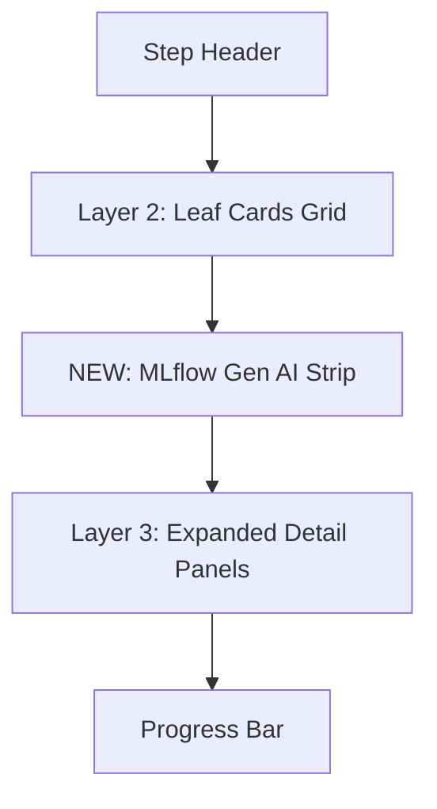

# MLflow Gen AI Feature Annotations in ProcessFlow

## Architecture

Add a visually distinct, teal/indigo-themed "MLflow Gen AI" horizontal strip to each step's detail panel. It sits between the Layer 2 leaf cards and the Layer 3 expanded detail panels, using the empty space that currently exists there.



## Data Model Changes

Add a new `mlflow` array to each `StepDef`:

```typescript
interface MlflowFeature {
  label: string;       // e.g. "Experiment Setup"
  api: string;         // e.g. "mlflow.set_experiment()"
  icon: LucideIcon;
}

interface StepDef {
  // ...existing fields...
  mlflow: MlflowFeature[];
}
```

## MLflow Features Per Step (based on codebase analysis)

- **Step 1 -- Configuration Analysis**: Experiment Creation (`mlflow.set_experiment()`), Experiment Tags (`mlflow.set_experiment_tags()`), Evaluation Dataset (`mlflow.genai.datasets.create_dataset()`), Prompt Registry setup for judge prompts (`mlflow.genai.register_prompt()`), LoggedModel init for iteration 0 (`mlflow.initialize_logged_model()`)
- **Step 2 -- Metadata Collection**: Instruction Versioning (`mlflow.genai.register_prompt()` for Genie instructions after proactive enrichment)
- **Step 3 -- Baseline Evaluation**: MLflow Run (`mlflow.start_run()`), GenAI Evaluate with 9 scorers (`mlflow.genai.evaluate()`), Tracing (`@mlflow.trace`), Params/Metrics (`mlflow.log_params()`, `mlflow.log_metric()`), LoggedModel Linking (`mlflow.set_active_model()`)
- **Step 4 -- Configuration Generation**: Tracing Spans for strategist phases (`mlflow.start_span()`), LoggedModel creation per iteration (`mlflow.initialize_logged_model()`)
- **Step 5 -- Optimized Evaluation**: 3-Gate Evaluations (`mlflow.genai.evaluate()`), Gate Feedback (`mlflow.log_feedback()`), ASI Feedback on traces, Instruction Versioning for updated config, LoggedModel per iteration
- **Step 6 -- Finalization**: Repeatability Evaluation (`mlflow.genai.evaluate()`), Model Promotion to Champion (`mlflow.set_logged_model_alias("champion")`)

## UI Rendering

Render as a compact horizontal bar with a teal/indigo theme to distinguish it from the blue leaf cards. Each MLflow feature is a small pill showing the label and, on hover or below, the API call. Layout:

```
[MLflow Gen AI icon] MLflow Gen AI  |  [pill] [pill] [pill] [pill] [pill]
```

Placed in [ProcessFlow.tsx](src/genie_space_optimizer/ui/components/ProcessFlow.tsx) between the leaf card grid (line ~547) and the expanded detail panels (line ~549).

## Files Changed

Only one file: [ProcessFlow.tsx](src/genie_space_optimizer/ui/components/ProcessFlow.tsx)

- Add `MlflowFeature` interface and `mlflow` field to `StepDef`
- Add `mlflow` array data to each of the 6 `STEPS` entries
- Add `MlflowStrip` renderer component
- Insert the strip in the detail panel between Layer 2 and Layer 3
- Import any additional icons needed (e.g. `FlaskConical` or `Beaker` for MLflow branding, `Activity` for tracing, `BookMarked` for prompt registry)
