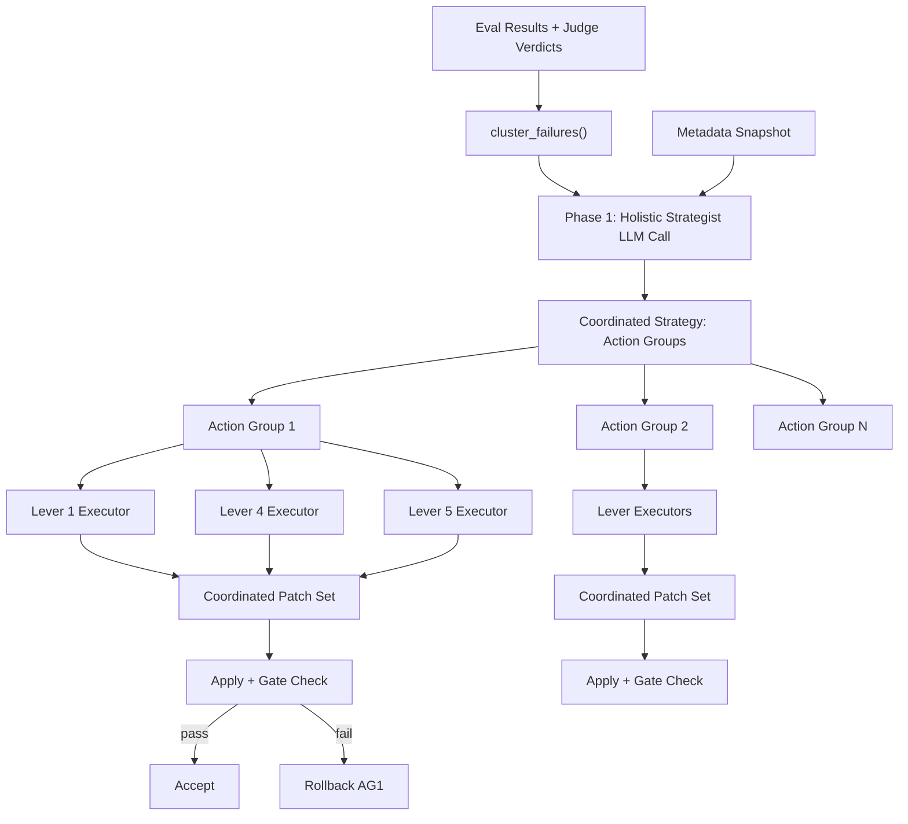

# Option B: Holistic Strategist + Lever Executor Architecture

## Architecture Overview




The fundamental change: **separate the brain (strategist) from the hands (levers)**. The strategist sees everything, plans everything, ensures coherence. Levers just execute their slice of the plan.

---

## Phase 1: Holistic Strategist

### New function: `_generate_holistic_strategy`

**File:** [optimizer.py](src/genie_space_optimizer/optimization/optimizer.py)

Add a new function (~100 lines) that replaces the current `_analyze_and_distribute` + per-lever `generate_metadata_proposals` planning:

```python
def _generate_holistic_strategy(
    clusters: list[dict],
    soft_signal_clusters: list[dict],
    metadata_snapshot: dict,
    w: WorkspaceClient | None = None,
) -> dict:
    """Phase 1: Analyze all failures and produce a coordinated multi-lever strategy.
    
    Returns a strategy dict with action_groups, each specifying what
    every relevant lever should do, ensuring no conflicts.
    """
```

**Input context for the LLM call:**

- All hard-failure clusters with their `sql_contexts`, `question_traces`, `root_cause`, `asi_`* fields
- All soft-signal clusters (correct queries with judge-level feedback)
- Current metadata snapshot: table descriptions, column descriptions, join specs, instructions, example SQL
- Structured metadata state: current sections per entity type (from `_format_structured_column_context`, `_format_structured_table_context`, `_format_structured_function_context`)

**Output schema (what the LLM returns):**

```json
{
  "action_groups": [
    {
      "id": "AG1",
      "root_cause_summary": "Missing join between fact_revenue and dim_property",
      "affected_questions": ["Q1", "Q3", "Q7"],
      "priority": 1,
      "lever_directives": {
        "1": {
          "tables": [
            {"table": "fact_revenue", "sections": {"relationships": "Joins to dim_property via property_key"}},
            {"table": "dim_property", "sections": {"purpose": "Property dimension..."}}
          ],
          "columns": [
            {"table": "fact_revenue", "column": "property_key", "entity_type": "column_key",
             "sections": {"definition": "FK to dim_property", "join": "dim_property.property_key"}}
          ]
        },
        "4": {
          "join_specs": [
            {"left": "fact_revenue", "right": "dim_property", 
             "join_guidance": "Join on property_key, INNER JOIN"}
          ]
        },
        "5": {
          "instruction_guidance": "Add guidance about property dimension joins",
          "example_sql": {"question": "What is revenue by property?", 
                          "sql_sketch": "SELECT ... FROM fact_revenue JOIN dim_property ON ..."}
        }
      },
      "coordination_notes": "Column description for property_key must reference the join; instruction must reference both tables"
    }
  ],
  "global_instruction_rewrite": "Full restructured instruction text incorporating all action groups",
  "rationale": "..."
}
```

Key design points:

- Each `action_group` addresses ONE root cause across MULTIPLE levers simultaneously
- `lever_directives` specify what each lever should produce (not just "which lever" but the actual content guidance)
- `coordination_notes` make cross-lever dependencies explicit so Phase 2 executors can honor them
- `global_instruction_rewrite` is the holistic Lever 5 instruction output (preserving existing + adding new)
- Action groups are ordered by `priority` (most impactful first)

### New prompt: `STRATEGIST_PROMPT`

**File:** [config.py](src/genie_space_optimizer/common/config.py)

This prompt is the most critical component in the entire framework. It must be tightly structured with explicit contracts, following the [AgentSkills.io specification body-content pattern](https://agentskills.io/specification#body-content) — step-by-step instructions, concrete input/output contracts, and explicit edge-case handling. No ambiguity.

The prompt has four sections: Role, Context, Contracts, and Output Schema.

#### Section 1: Role

```
You are the Holistic Strategist for a Databricks Genie Space optimization framework.

## Purpose
Analyze ALL benchmark evaluation failures and produce a coordinated multi-lever
action plan. Each action group addresses one root cause across multiple levers
simultaneously, ensuring fixes reinforce each other rather than conflict.

## When to create an action group
- When evaluation shows a systematic failure pattern (wrong column, missing join,
  wrong aggregation, etc.) affecting one or more benchmark questions.
- When a "correct-but-suboptimal" soft signal suggests a preventive improvement.

## When NOT to create an action group
- When the failure is a format-only difference (extra_columns_only, select_star,
  format_difference) — these are cosmetic, not actionable.
- When you cannot identify a specific table, column, join, or instruction to change.
```

#### Section 2: Context (placeholders)

```
## Genie Space Schema
{full_schema_context}

## Failure Clusters from Evaluation
{cluster_briefs}

## Soft Signal Clusters (correct but with judge-level feedback)
{soft_signal_summary}

## Current Structured Metadata State
### Tables
{structured_table_context}

### Columns
{structured_column_context}

### Functions
{structured_function_context}

## Current Join Specifications
{current_join_specs}

## Current Genie Space Instructions
{current_instructions}

## Existing Example SQL Queries
{existing_example_sqls}
```

#### Section 3: Contracts (the core rules)

```
## Contracts — You MUST follow ALL of these

### Contract 1: All Instruments of Power
For each root cause, specify EVERY lever that should act. A column fix alone
is weak. A column fix + join spec + instruction + example SQL is strong.
Use this mapping as a guide:
- wrong_column / wrong_table / description_mismatch / missing_synonym:
  Primary: Lever 1 (table/column metadata). Also consider: Lever 5 (instruction/example SQL).
- wrong_aggregation / wrong_measure / missing_filter / wrong_filter_condition:
  Primary: Lever 2 (metric views). Also consider: Lever 5 (instruction/example SQL).
- tvf_parameter_error:
  Primary: Lever 3 (functions). Also consider: Lever 5 (instruction/example SQL).
- wrong_join / missing_join_spec / wrong_join_spec:
  Primary: Lever 4 (join specs). Also consider: Lever 1 (column join/relationships sections), Lever 5 (instruction/example SQL).
- asset_routing_error / ambiguous_question:
  Primary: Lever 5 (instruction + example SQL). Also consider: Lever 1 (clarify table/column purpose).

### Contract 2: Structured Metadata Format
ALL table and column metadata changes MUST use the structured section format.
Tables use sections: purpose, best_for, grain, scd, relationships.
Columns use sections based on type:
  - Dimension: definition, values, synonyms
  - Measure: definition, aggregation, grain_note, synonyms
  - Key: definition, join, synonyms
Functions use sections: purpose, best_for, use_instead_of, parameters, example.
Metric views use sections: purpose, best_for, grain, important_filters.
Specify sections by KEY (e.g., "definition", "synonyms"), not by label.

### Contract 3: Non-Regressive / Augment-Not-Overwrite
When proposing a section update, you MUST account for existing content:
- If a section already has content, your proposed value must INCORPORATE the
  existing information and ADD new details from the failure analysis.
- Only replace from scratch if the current value is empty or factually wrong.
- Existing synonyms are automatically preserved; propose only NEW terms to add.
- The global_instruction_rewrite MUST incorporate ALL existing instructions
  (from Current Genie Space Instructions above) into the appropriate structured
  section. Do NOT discard any existing instruction unless directly contradicted
  by evaluation evidence.

### Contract 4: No Cross-Action-Group Conflicts
Two action groups MUST NOT propose conflicting changes to the same object.
If AG1 updates fact_revenue.property_key's definition, AG2 must not also
update that same column's definition. Merge related failures into ONE action
group when they touch the same objects.

### Contract 5: Coordination Notes Are Mandatory
Each action group MUST include coordination_notes explaining how the changes
across levers reference each other. Example: "Column description for property_key
must mention the join to dim_property; the join spec must use property_key;
the instruction must reference both tables for property lookups."

### Contract 6: Example SQL for Every Routing/Ambiguity Failure
When a failure involves asset routing or ambiguous questions, the action group
MUST include an example_sql directive for Lever 5. Example SQL is the most
effective lever for routing — Genie pattern-matches against it directly.
The SQL must use ONLY tables and columns from the schema above.

### Contract 7: Anti-Hallucination
If you cannot trace a proposed change back to a specific evaluation failure
cluster or soft signal, do NOT include it. Every change must be grounded
in evidence. Cite the cluster_id(s) that justify each action group.
```

#### Section 4: Output Schema (strict JSON contract)

```
## Output Schema — Return ONLY this JSON structure

{
  "action_groups": [
    {
      "id": "AG<N>",
      "root_cause_summary": "<one-sentence description of the root cause>",
      "source_cluster_ids": ["C001", "C003"],
      "affected_questions": ["<question_id>", ...],
      "priority": <1=highest>,
      "lever_directives": {
        "1": {
          "tables": [
            {
              "table": "<fully_qualified_table_name>",
              "entity_type": "table",
              "sections": {
                "<section_key>": "<proposed value — AUGMENT existing content>"
              }
            }
          ],
          "columns": [
            {
              "table": "<fully_qualified_table_name>",
              "column": "<column_name>",
              "entity_type": "<column_dim|column_measure|column_key>",
              "sections": {
                "<section_key>": "<proposed value>"
              }
            }
          ]
        },
        "4": {
          "join_specs": [
            {
              "left_table": "<fq_table>",
              "right_table": "<fq_table>",
              "join_guidance": "<natural language description of the join condition and relationship type>"
            }
          ]
        },
        "5": {
          "instruction_guidance": "<what to add/modify in instructions for this root cause>",
          "example_sql": {
            "question": "<realistic user prompt>",
            "sql_sketch": "<correct SQL using schema tables>",
            "parameters": [{"name": "...", "type_hint": "STRING|INTEGER|DATE|DECIMAL", "default_value": "..."}],
            "usage_guidance": "<when Genie should match this>"
          }
        }
      },
      "coordination_notes": "<how changes across levers reference each other>"
    }
  ],
  "global_instruction_rewrite": "<FULL restructured instruction text using the AgentSkills-inspired template: ## Purpose, ## Asset Routing, ## Query Rules, ## Query Patterns, ## Business Definitions, ## Disambiguation, ## Constraints>",
  "rationale": "<overall reasoning for the strategy>"
}

RULES for the JSON:
- "lever_directives" keys are strings "1" through "5". Only include levers that have work to do.
- "sections" keys must be from the structured metadata schema (e.g., "definition", "purpose", "synonyms").
- "global_instruction_rewrite" must follow the AgentSkills-inspired template with ## headers.
  It incorporates ALL existing instructions plus new guidance from action groups.
  Budget: {instruction_char_budget} chars maximum.
- "priority" 1 = most impactful. Order by number of affected questions descending.
- If no actionable improvements are found, return: {"action_groups": [], "global_instruction_rewrite": "", "rationale": "No actionable failures identified"}.
```

Placeholder variables: `{cluster_briefs}`, `{full_schema_context}`, `{structured_table_context}`, `{structured_column_context}`, `{structured_function_context}`, `{current_instructions}`, `{current_join_specs}`, `{existing_example_sqls}`, `{soft_signal_summary}`, `{instruction_char_budget}`

**MLflow Prompt Registry integration:**

Register the strategist prompt in the `LEVER_PROMPTS` dict ([config.py](src/genie_space_optimizer/common/config.py) line 1289) so it is automatically registered in MLflow alongside the other lever prompts:

```python
LEVER_PROMPTS: dict[str, str] = {
    "strategist": STRATEGIST_PROMPT,          # NEW
    "lever_1_2_column": LEVER_1_2_COLUMN_PROMPT,
    "lever_4_join_spec": LEVER_4_JOIN_SPEC_PROMPT,
    ...
}
```

This ensures the prompt is versioned via `mlflow.genai.register_prompt` during `register_all_prompts` ([evaluation.py](src/genie_space_optimizer/optimization/evaluation.py) line 1792), gets a `@champion` alias, and is linked to traces when the strategist LLM call runs.

### New LLM call: `_call_llm_for_strategy`

**File:** [optimizer.py](src/genie_space_optimizer/optimization/optimizer.py)

Same pattern as `_call_llm_for_holistic_instructions` (retry logic, `_extract_json`, exponential backoff), but with a repair function tailored to the strategy schema — if JSON truncates, try to extract `action_groups` array via bracket matching.

Inside the LLM call, link the prompt to the active MLflow trace for full traceability:

```python
from genie_space_optimizer.optimization.evaluation import _link_prompt_to_trace
_link_prompt_to_trace("strategist")
```

---

## Phase 2: Per-Lever Content Generation (Executors)

### Modified `generate_metadata_proposals`

**File:** [optimizer.py](src/genie_space_optimizer/optimization/optimizer.py) — rewrite the function (currently lines 2866-3270)

The function signature changes:

```python
def generate_metadata_proposals(
    strategy: dict,            # NEW: from Phase 1
    action_group: dict,        # NEW: single action group being executed
    metadata_snapshot: dict,
    target_lever: int,
    apply_mode: str = APPLY_MODE,
    w: WorkspaceClient | None = None,
) -> list[dict]:
```

**For levers 1-2 (columns/tables):**

- The LLM receives: the action group's `lever_directives["1"]` (tables, columns, sections to update), the `coordination_notes`, and the relevant metadata context
- Prompt: modified `LEVER_1_2_COLUMN_PROMPT` that includes a "Strategy Context" section with the action group summary and coordination notes
- The LLM generates the actual section content (e.g., the full text for `definition`, `synonyms`, etc.)
- Also emits `example_sql_proposals` if the action group includes example SQL guidance
- Output: structured metadata proposals (same `column_sections`/`table_sections` format as today)

**For lever 3 (functions):**

- Same pattern with function-specific directives

**For lever 4 (joins):**

- Receives `join_guidance` from the strategy
- LLM generates the actual join spec SQL
- Prompt: modified `LEVER_4_JOIN_SPEC_PROMPT` with strategy context

**For lever 5 (instructions + example SQL):**

- Receives `global_instruction_rewrite` from the strategy (already generated in Phase 1)
- Generates `rewrite_instruction` proposal directly from strategy output (no additional LLM call needed)
- Generates `add_example_sql` proposals from action group example SQL guidance
- Additional LLM call only if `global_instruction_rewrite` needs refinement

### Example SQL from every lever

Each lever's prompt now includes an `example_sql_proposals` field in its output schema. When Lever 1 fixes a column, it can also propose "here is an example query showing correct usage." The action group's `coordination_notes` guide which levers should produce example SQL.

---

## Phase 3: Coordinated Application and Gating

### Rewritten `_run_lever_loop`

**File:** [harness.py](src/genie_space_optimizer/optimization/harness.py) — rewrite the main loop (currently lines 1057-1740)

The new flow:

```python
# Phase 1: Strategy
strategy = _generate_holistic_strategy(
    clusters, soft_signal_clusters, metadata_snapshot, w=w
)

# Phase 2 + 3: Execute action groups in priority order
for ag in sorted(strategy["action_groups"], key=lambda a: a["priority"]):
    # Generate proposals for ALL levers in this action group
    all_proposals = []
    for lever in ag["lever_directives"]:
        proposals = generate_metadata_proposals(
            strategy, ag, metadata_snapshot,
            target_lever=int(lever), w=w,
        )
        all_proposals.extend(proposals)
    
    # Add example SQL proposals from any lever
    # (already included in per-lever proposals)
    
    # Convert and apply the coordinated patch set
    patches = proposals_to_patches(all_proposals)
    apply_log = apply_patch_set(w, space_id, patches, metadata_snapshot)
    
    # Gate check the action group as a unit
    # (slice gate + P0 gate + full eval)
    passed = _run_gate_checks(...)
    
    if passed:
        accept_action_group(ag, apply_log)
        metadata_snapshot = apply_log["post_snapshot"]
    else:
        rollback(apply_log, w, space_id, metadata_snapshot)
```

Key changes:

- **Action groups replace levers as the unit of application/gating.** Each action group is a coordinated cross-lever patch set that addresses one root cause.
- **Gate checks run once per action group** (not per lever). If an action group fails, its entire cross-lever patch set is rolled back together — preserving coordination.
- **Re-analysis happens after each accepted action group** since the metadata landscape has changed.
- **Lever 5's instruction rewrite is special:** the `global_instruction_rewrite` from the strategy is applied as the LAST action group, after all metadata/join changes are accepted. This way it can reference the final state.

### Gate check consolidation

Factor out the current slice/P0/full eval gate logic into a `_run_gate_checks` helper (extracted from lines 1344-1634) that takes a patch set and returns pass/fail. This is a pure refactor of existing logic — the gate mechanisms stay the same, just applied per action group instead of per lever.

---

## Structured Metadata Enforcement (Cross-Cutting)

### Auto-convert freeform patches

**File:** [applier.py](src/genie_space_optimizer/optimization/applier.py) `proposals_to_patches` (lines 476-624)

When a proposal has `update_column_description` or `update_description` but no `structured_sections`, auto-convert through `parse_structured_description`. If the text contains structured sections (`**Purpose:`** etc.), parse them out. If freeform, wrap in a `definition` section. This ensures ALL description patches flow through the structured pipeline regardless of how the LLM formatted its response.

### Augment-not-overwrite guard

**File:** [structured_metadata.py](src/genie_space_optimizer/optimization/structured_metadata.py) `update_sections` (lines 242-272)

Add an information-loss guard: when a new section value is significantly shorter than the existing value (loses >30% of content and existing is >20 chars), merge by appending the new value to the existing value rather than replacing. Log a warning when this guard activates.

```python
for key, new_val in applicable.items():
    old_val = sections.get(key, "")
    if old_val and new_val and len(old_val) > 20:
        if len(new_val.strip()) < len(old_val.strip()) * 0.7:
            logger.warning("Section '%s' would lose content — merging", key)
            applicable[key] = f"{old_val.rstrip('. ')}. {new_val.lstrip()}"
```

This is a backstop — the strategist's prompt already instructs "augment, do not overwrite," but this code-level guard catches cases where the LLM ignores the instruction.

---

## Lever 5 Silent Failure Fixes

### Relax known_assets filter for rewrite_instruction

**File:** [optimizer.py](src/genie_space_optimizer/optimization/optimizer.py) `_validate_lever5_proposals` (lines 2604-2623)

Replace the strict `known_assets` check for `rewrite_instruction` with a minimum-length check (>50 chars). Keep strict check for `add_instruction`. Rationale: holistic instructions legitimately use natural language without mentioning exact table identifiers.

### Improve truncated JSON repair

**File:** [optimizer.py](src/genie_space_optimizer/optimization/optimizer.py) `_repair_truncated_holistic_json` (lines 2208-2243)

Enhance to also attempt extraction of `example_sql_proposals` via bracket matching after extracting `instruction_text`. Currently loses this field entirely on truncation.

### Last-ditch regex recovery

**File:** [optimizer.py](src/genie_space_optimizer/optimization/optimizer.py) lines 2363-2379

When both `_extract_json` and `_repair_truncated_holistic_json` fail, try a simple regex extraction of `instruction_text` before returning empty.

---

## What Gets Deleted / Simplified

With the strategist handling coordination, several mechanisms become unnecessary:

- `**_map_to_lever` / lever_assignments / cluster-to-lever mapping** — replaced by strategist's `lever_directives`
- `**lever_changes` accumulation** — replaced by strategy context passed to all executors
- `**soft_signal_clusters` separate tracking** — soft signals feed into the strategist alongside hard failures
- `**levers_rolled_back` and failed-lever absorption into Lever 5** — replaced by per-action-group rollback
- **Per-lever cluster filtering in the main loop** — replaced by action group iteration
- `**_LEVER_TO_PATCH_TYPE` mapping** — the strategist directly specifies patch types

What stays:

- `cluster_failures` — still clusters eval results (input to strategist)
- `proposals_to_patches` — still converts proposals to executable patches
- `apply_patch_set` / `rollback` — still applies and rolls back patches
- `render_patch` / `_apply_action_to_config` — still the execution layer
- Gate check logic (slice/P0/full eval) — still validates results
- Structured metadata module — still enforces section ownership and format
- All existing patch types and their handlers — still the execution vocabulary

---

## Files Changed Summary


| File                                                                                    | Change Type   | Description                                                                                                                                                                                                             |
| --------------------------------------------------------------------------------------- | ------------- | ----------------------------------------------------------------------------------------------------------------------------------------------------------------------------------------------------------------------- |
| [optimizer.py](src/genie_space_optimizer/optimization/optimizer.py)                     | Major rewrite | New `_generate_holistic_strategy`, `_call_llm_for_strategy`; rewrite `generate_metadata_proposals` to accept strategy context; add example SQL extraction for all levers; relax known_assets; fix truncated JSON repair |
| [harness.py](src/genie_space_optimizer/optimization/harness.py)                         | Major rewrite | Replace per-lever loop with per-action-group loop; factor out `_run_gate_checks`; wire in Phase 1 strategy call; remove lever_assignments/lever_changes machinery                                                       |
| [config.py](src/genie_space_optimizer/common/config.py)                                 | Add + modify  | New `STRATEGIST_PROMPT`; add `{strategy_context}` and `example_sql_proposals` to lever prompts; add `{prior_lever_changes}` section                                                                                     |
| [structured_metadata.py](src/genie_space_optimizer/optimization/structured_metadata.py) | Modify        | Info-loss guard in `update_sections`                                                                                                                                                                                    |
| [applier.py](src/genie_space_optimizer/optimization/applier.py)                         | Modify        | Auto-convert freeform descriptions through structured pipeline in `proposals_to_patches`                                                                                                                                |


