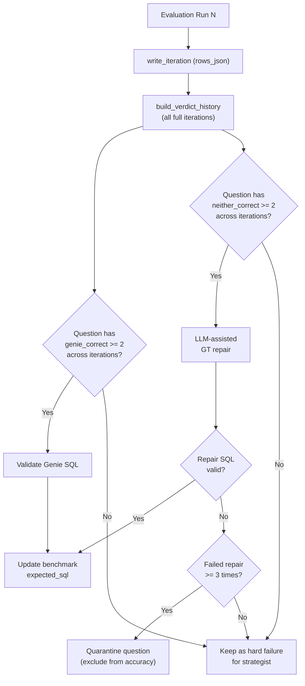

# Per-Question Cross-Iteration Arbiter Corrections

## Problem

The current arbiter benchmark correction logic in [`harness.py`](src/genie_space_optimizer/optimization/harness.py) (lines 2444-2479) counts total `genie_correct` verdicts across all questions in a single baseline eval and requires >= 3 to trigger any corrections. This is flawed because:

- 3 different questions being `genie_correct` doesn't validate any individual correction
- A single question being `genie_correct` across 2+ independent evals IS strong signal, but gets ignored
- `neither_correct` verdicts are treated as hard failures with no GT repair path
- Corrections only run once before the loop (from baseline), not after each iteration

## Architecture



## Changes

### 1. New config constants in [`config.py`](src/genie_space_optimizer/common/config.py)

Replace `ARBITER_CORRECTION_TRIGGER = 3` with:

```python
GENIE_CORRECT_CONFIRMATION_THRESHOLD = 2   # per-question, cross-iteration
NEITHER_CORRECT_REPAIR_THRESHOLD = 2       # attempts GT repair after N occurrences
NEITHER_CORRECT_QUARANTINE_THRESHOLD = 3   # quarantines after N consecutive neither_correct
```

Keep `ARBITER_CORRECTION_TRIGGER` as a deprecated alias for backward compatibility.

### 2. New state helper in [`state.py`](src/genie_space_optimizer/optimization/state.py)

Add `load_all_full_iterations()` that returns all iterations with `eval_scope='full'` (ordered by iteration ASC), with JSON columns parsed. This mirrors `load_latest_full_iteration()` (line 883) but returns all of them.

### 3. New verdict history builder in [`harness.py`](src/genie_space_optimizer/optimization/harness.py)

Add `_build_verdict_history()`:
- Calls `load_all_full_iterations()`
- Iterates each iteration's `rows_json`, extracts `question_id` and `arbiter/value`
- Returns a dict: `{question_id: {verdict: [list of (iteration, genie_sql, rationale)]}}`
- This is the core data structure both `genie_correct` and `neither_correct` logic uses

### 4. Replace `_extract_arbiter_actions_from_baseline()` in [`harness.py`](src/genie_space_optimizer/optimization/harness.py)

New function `_extract_confirmed_corrections()`:
- Calls `_build_verdict_history()`
- For each question with `genie_correct` count >= `GENIE_CORRECT_CONFIRMATION_THRESHOLD`:
  - Take the Genie SQL from the **most recent** `genie_correct` eval
  - Emit as a correction action (same format as today)
- No batch threshold — each question judged on its own merit

### 5. Add `neither_correct` GT repair in [`harness.py`](src/genie_space_optimizer/optimization/harness.py) or [`benchmarks.py`](src/genie_space_optimizer/optimization/benchmarks.py)

New function `_attempt_gt_repair()`:
- Input: question text, Genie SQL, GT SQL, arbiter rationale, schema metadata
- Calls LLM with a prompt: "Given the arbiter's diagnosis, produce a corrected ground-truth SQL"
- Validates the output via `validate_ground_truth_sql()`
- Returns corrected SQL or None

New function `_extract_neither_correct_repair_candidates()`:
- Uses `_build_verdict_history()`
- For questions with `neither_correct` count >= `NEITHER_CORRECT_REPAIR_THRESHOLD`:
  - Collect the arbiter rationales from all `neither_correct` evals
  - Call `_attempt_gt_repair()` with the most recent context
  - If valid: emit as a benchmark correction tagged `corrected_by = 'arbiter_repair'`

### 6. Add quarantine mechanism

In [`benchmarks.py`](src/genie_space_optimizer/optimization/benchmarks.py), add `quarantine_benchmark_question()`:
- Marks a question as quarantined (e.g., sets a `quarantined_at` timestamp and `quarantine_reason` in the benchmarks table)
- The benchmarks table schema may need 2 new nullable columns: `quarantined_at TIMESTAMP` and `quarantine_reason STRING`

In `_build_verdict_history()`, track consecutive `neither_correct` count. If a question hits `NEITHER_CORRECT_QUARANTINE_THRESHOLD` consecutive `neither_correct` verdicts AND GT repair has been attempted, quarantine it.

In [`evaluation.py`](src/genie_space_optimizer/optimization/evaluation.py), update `_compute_arbiter_adjusted_accuracy()` (line 807) to exclude quarantined questions from the denominator (similar to existing `excluded` row handling).

### 7. Move correction logic into the per-iteration flow

Currently, corrections run once before the lever loop (line 2444). Move (or duplicate) the correction check into the per-iteration loop body (around line 2510), so that evidence from iteration N's eval can trigger corrections before iteration N+1's failure analysis.

The flow becomes:
1. Run evaluation for iteration N
2. Call `_extract_confirmed_corrections()` — applies `genie_correct` fixes
3. Call `_extract_neither_correct_repair_candidates()` — attempts GT repair or quarantines
4. Run failure analysis (`_analyze_and_distribute`) — now with corrected/quarantined benchmarks
5. Proceed to strategist + patching

### 8. Update `_analyze_and_distribute()` in [`harness.py`](src/genie_space_optimizer/optimization/harness.py)

In the `_NON_ACTIONABLE_VERDICTS` filtering (line 1713):
- Quarantined questions should be excluded from `filtered_failure_rows` entirely (don't waste lever budget)
- Questions with pending GT repair (attempted but not yet confirmed) could be soft-signaled

### 9. Logging and observability

- Log per-question verdict history at the start of each iteration
- Log when a correction is applied (question, old SQL, new SQL, confirmation count)
- Log GT repair attempts (question, rationale summary, success/failure)
- Log quarantine events

### 10. Update `apply_benchmark_corrections()` in [`benchmarks.py`](src/genie_space_optimizer/optimization/benchmarks.py)

Extend to accept `verdict = 'arbiter_repair'` in addition to `genie_correct`. The `corrected_by` column already supports different values.

## Files to modify

- [`src/genie_space_optimizer/common/config.py`](src/genie_space_optimizer/common/config.py) — new constants
- [`src/genie_space_optimizer/optimization/state.py`](src/genie_space_optimizer/optimization/state.py) — `load_all_full_iterations()`
- [`src/genie_space_optimizer/optimization/harness.py`](src/genie_space_optimizer/optimization/harness.py) — verdict history, confirmed corrections, GT repair, per-iteration wiring
- [`src/genie_space_optimizer/optimization/benchmarks.py`](src/genie_space_optimizer/optimization/benchmarks.py) — quarantine, extended corrections
- [`src/genie_space_optimizer/optimization/evaluation.py`](src/genie_space_optimizer/optimization/evaluation.py) — quarantine-aware accuracy
- [`tests/unit/test_optimizer.py`](tests/unit/test_optimizer.py) — update/add tests
