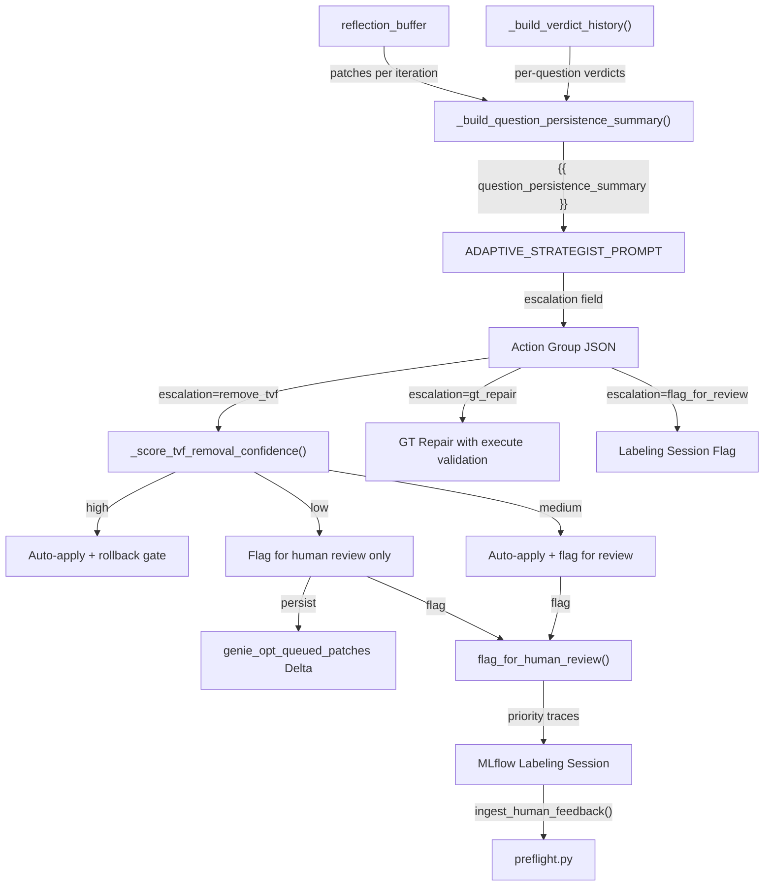
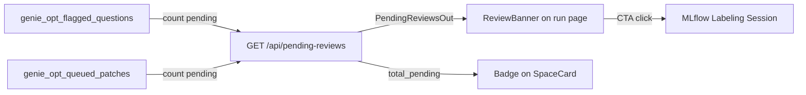

# Per-Question Failure Persistence for the Strategist

## Problem

The strategist's reflection buffer is iteration-level only. It sees "Iter 3: ACCEPTED, accuracy +4.2%" but never learns that Q16 has failed in *every single iteration*. This causes it to repeatedly propose the same additive fixes for persistent failures.

## Data Flow Overview



---

## Part 1: Enrich Reflections with Per-Question Data

### 1a. Enrich `_build_reflection_entry` ([harness.py](src/genie_space_optimizer/optimization/harness.py))

Add new parameters to the function signature (line 1545):

- `affected_question_ids: list[str] | None = None`
- `prev_failure_qids: set[str] | None = None`
- `new_failure_qids: set[str] | None = None`

Add to the returned dict:

- `affected_question_ids` — from the action group's `affected_questions`
- `fixed_questions` — `prev_failure_qids - new_failure_qids`
- `still_failing` — `prev_failure_qids & new_failure_qids`
- `new_regressions` — `new_failure_qids - prev_failure_qids`

At the call sites in the lever loop (~line 3272), thread `ag.get("affected_questions", [])` and the pre/post failure sets from `full_result["failure_question_ids"]`.

### 1b. New `_build_question_persistence_summary()` ([harness.py](src/genie_space_optimizer/optimization/harness.py) or [optimizer.py](src/genie_space_optimizer/optimization/optimizer.py))

- Accepts `verdict_history` (from `_build_verdict_history`) and `reflection_buffer`
- For each question with >= `PERSISTENCE_MIN_FAILURES` (new constant, default 2) non-passing iterations:
  - Show question ID, text, consecutive fail count, verdict breakdown
  - Cross-reference `reflection_buffer` entries' `affected_question_ids` to list patches tried for this specific question
  - Classify as `ADDITIVE_LEVERS_EXHAUSTED` when `add_instruction` + `add_example_sql` have each been tried 2+ times without fixing the question
  - Classify as `INTERMITTENT` when failures are non-consecutive

### 1c. Wire into the strategist prompt

- In `_call_llm_for_adaptive_strategy` ([optimizer.py](src/genie_space_optimizer/optimization/optimizer.py) line 4595): accept `verdict_history`, call `_build_question_persistence_summary()`, inject as `question_persistence_summary` format kwarg
- In `ADAPTIVE_STRATEGIST_PROMPT` ([config.py](src/genie_space_optimizer/common/config.py) line 1640): add `{{ question_persistence_summary }}` between Reflection History and Failure Clusters
- Add `PERSISTENCE_MIN_FAILURES = 2` to [config.py](src/genie_space_optimizer/common/config.py)

---

## Part 2: Escalation Path — TVF Removal (Tiered Confidence)

### Current state

- `remove_tvf` is an existing patch type (line 2108 of config.py)
- It is classified as `HIGH_RISK` (line 1856), so `apply_patch_set` queues it in `queued_high` and skips auto-application (applier.py line 1480)
- The `queued_high` list is returned but **never persisted, surfaced, or processed**
- Blame sets and counterfactual fixes are already tracked per-question per-judge in the ASI metadata (stored in `genie_eval_asi_results` Delta table and available in cluster data)
- Benchmark questions have `expected_asset` field (TVF / MV / TABLE) identifying which asset the GT SQL uses
- TVF output column schema is NOT stored in the Genie Space config (only `{id, identifier}`), but can be fetched from UC via `DESCRIBE FUNCTION` or `information_schema.routines`

### Tiered confidence model

New function `_score_tvf_removal_confidence()` in [harness.py](src/genie_space_optimizer/optimization/harness.py) computes a confidence tier:

**Iteration gate (hard prerequisite for all tiers):**
- TVF removal is only considered after `TVF_REMOVAL_MIN_ITERATIONS` (default: 2) consecutive iterations where the question(s) citing this TVF have failed. Since each iteration runs 2 full evaluations (confirmation eval), this means at least 4 consecutive eval failures before removal is even scored for confidence.
- New config constant: `TVF_REMOVAL_MIN_ITERATIONS = 2` in [config.py](src/genie_space_optimizer/common/config.py)
- The iteration count is derived from `_build_verdict_history()` — count consecutive non-passing verdicts for questions where the TVF is the blamed asset

**High confidence (auto-apply the removal):**
- Iteration gate passed (2+ iterations of consecutive failures)
- TVF appears in zero ground-truth SQLs (check `expected_asset` in benchmarks — no question uses this TVF as its GT asset)
- An alternative asset is named in blame/counterfactual traces across 2+ iterations (from `asi_blame_set` and `counterfactual_fix` fields in the provenance data, which already track "use X instead of Y")
- Schema overlap check shows full coverage (all output columns of the TVF are available in at least one table/MV in the space)

**Medium confidence (auto-apply but flag for human review):**
- Iteration gate passed
- TVF appears in zero ground-truth SQLs
- Schema overlap is partial, but the uncovered columns are not referenced by any benchmark question's `expected_sql`
- TVF has been blamed in only 1 iteration (weaker cross-iteration signal)

**Low confidence (do NOT remove, escalate to human only):**
- Iteration gate passed, but one or more of:
  - TVF appears in some ground-truth SQLs (it's sometimes the correct asset)
  - No single alternative covers all its functionality
  - The TVF provides unique computed columns not available elsewhere

### Implementation details

#### 2a. `_check_tvf_schema_overlap()` in [optimizer.py](src/genie_space_optimizer/optimization/optimizer.py) or new module

Fetches the TVF's output columns and compares against available assets:

```python
def _check_tvf_schema_overlap(
    w: WorkspaceClient,
    tvf_identifier: str,
    metadata_snapshot: dict,
) -> dict:
    """Check schema overlap between a TVF and other assets in the space.

    Returns:
        {
            "tvf_columns": ["col1", "col2", ...],
            "covered_columns": {"col1": "table_a", "col2": "mv_b"},
            "uncovered_columns": ["col3"],
            "coverage_ratio": 0.67,
            "full_coverage": False,
        }
    """
```

- Fetch TVF output columns via `DESCRIBE FUNCTION EXTENDED {tvf_identifier}` (using `w.statement_execution` or Spark)
- Parse the return type table's column names
- For each column, check if it appears in any table's `column_configs` or MV's measures/dimensions in `metadata_snapshot`
- Return overlap analysis

#### 2b. `_score_tvf_removal_confidence()` in [harness.py](src/genie_space_optimizer/optimization/harness.py)

```python
def _score_tvf_removal_confidence(
    tvf_identifier: str,
    benchmarks: list[dict],
    verdict_history: dict[str, list[VerdictEntry]],
    reflection_buffer: list[dict],
    schema_overlap: dict,
    asi_provenance: list[dict],
    *,
    min_iterations: int | None = None,  # defaults to TVF_REMOVAL_MIN_ITERATIONS
) -> Literal["high", "medium", "low"] | None:
    """Returns None if the iteration gate is not met (too early to consider removal)."""
```

Inputs:
- `benchmarks` — check `expected_asset` for GT references to the TVF
- `verdict_history` — cross-iteration blame signal AND iteration gate check
- `reflection_buffer` — which iterations blamed this TVF
- `schema_overlap` — from `_check_tvf_schema_overlap()`
- `asi_provenance` — stored ASI data with `blame_set` and `counterfactual_fix` fields (already in `genie_eval_provenance` Delta table, read via `read_asi_from_uc()`)

Logic:
0. **Iteration gate**: For each question where the TVF is the blamed asset, count consecutive non-passing verdicts from `verdict_history`. If the max consecutive failures across those questions is < `min_iterations` → return `None` (not eligible yet)
1. Count GT references: `gt_refs = sum(1 for b in benchmarks if tvf_identifier in b.get("expected_asset", ""))`
2. If `gt_refs > 0` → `"low"` (TVF is sometimes the correct answer)
3. Count blame iterations: scan `asi_provenance` for entries where `blame_set` contains the TVF identifier, count distinct iterations
4. If `schema_overlap["full_coverage"]` and `blame_iterations >= 2` → `"high"`
5. If `schema_overlap["coverage_ratio"] > 0` and uncovered columns aren't in any benchmark `expected_sql` → `"medium"`
6. Otherwise → `"low"`

#### 2c. Dispatch by tier in the lever loop

| Tier | Action |
|------|--------|
| **High** | Downgrade `remove_tvf` from `HIGH_RISK` to `MEDIUM_RISK` for this specific patch so `apply_patch_set` will auto-apply it. Normal rollback protection still applies — if accuracy drops, the removal is rolled back. Log: "TVF removal auto-applied (high confidence)" |
| **Medium** | Auto-apply (same as high) AND call `flag_for_human_review()` (Part 4) with reason "TVF removed with partial schema coverage — please verify". If the human rejects it in the next run's preflight, it gets rolled back. |
| **Low** | Do NOT apply. Call `flag_for_human_review()` with reason "TVF removal recommended but confidence too low — human decision required". The `remove_tvf` patch is persisted to a new `genie_opt_queued_patches` Delta table for the human to review/approve via the labeling session. |

#### 2d. Persisting queued patches

New Delta table `genie_opt_queued_patches` (added in [state.py](src/genie_space_optimizer/optimization/state.py)):
- `run_id`, `iteration`, `patch_type`, `target_identifier`, `confidence_tier`, `coverage_analysis` (JSON), `blame_iterations`, `status` (pending/approved/rejected), `created_at`
- Written when a low-confidence removal is queued
- Read by `preflight.py` to check for human approval decisions from labeling session feedback

#### 2e. Prompt update

Add to the strategist prompt instructions:
- "If a question has failed for 3+ consecutive iterations AND additive levers are exhausted AND the root cause is TVF routing, you may propose `remove_tvf` in lever 3. Only TVFs may be removed — never tables or MVs. The system will assess removal confidence and either auto-apply, flag for review, or escalate to human."

### Scope constraints

- Only `remove_tvf` is allowed through escalation — `remove_table` and `remove_mv_*` are NOT permitted
- The strategist prompt must explicitly forbid table/MV removal
- Even at high confidence, the normal accuracy-gate rollback mechanism provides a safety net
- Schema overlap fetches TVF columns dynamically from UC — this requires the `WorkspaceClient` to be available

---

## Part 3: Escalation Path — GT Repair (Strengthened)

### Current state

- `_attempt_gt_repair()` exists (harness.py line 1920) — uses an LLM to propose corrected SQL
- Validation is `validate_ground_truth_sql(repaired_sql, spark)` without `execute=True` — only checks EXPLAIN + table existence, does NOT execute the SQL

### What to strengthen

1. **Execute validation** — call `validate_ground_truth_sql(repaired_sql, spark, execute=True)` to ensure the repaired SQL actually returns rows. This is already supported by the function ([benchmarks.py](src/genie_space_optimizer/optimization/benchmarks.py) line 278) but not used in the repair path.

2. **Strategist recommendation** — when the persistence summary shows a `neither_correct` pattern, the strategist can include `"escalation": "gt_repair"` in its output. This doesn't change the repair mechanism itself (which is automatic via `_run_arbiter_corrections`), but it makes the strategist explicitly aware that GT repair is the right path rather than proposing more additive patches.

3. **No new mechanism needed** for "how would we know what the change should be" — the existing `_GT_REPAIR_PROMPT_TEMPLATE` handles this with the LLM, and the arbiter's rationale provides the context for what's wrong. The key improvement is execution validation to ensure the repair is actually correct.

---

## Part 4: Escalation Path — Flag for Human Review

### Current state

- Labeling sessions exist ([labeling.py](src/genie_space_optimizer/optimization/labeling.py)) with four schemas: judge verdict, corrected SQL, patch approval, improvement suggestions
- Sessions are populated with failure/regression traces automatically
- `ingest_human_feedback()` reads labels back and produces corrections
- `preflight.py` syncs corrections into the benchmark table before the next run
- The "Human Review" link is surfaced in the app UI via `ResourceLinks.tsx`

### What to build

1. **Explicit flagging** — new function `flag_for_human_review()` in [labeling.py](src/genie_space_optimizer/optimization/labeling.py):
   - Accepts a list of `{question_id, question_text, reason, iterations_failed, patches_tried}`
   - Writes to a new Delta table `genie_opt_flagged_questions` (or a column in `genie_benchmarks_{domain}` similar to quarantine)
   - Sets `flagged_for_review=True`, `flag_reason=...`, `flagged_at=CURRENT_TIMESTAMP()`

2. **Priority in labeling session** — modify `_populate_session_traces()` (labeling.py line 256) to:
   - Accept `flagged_question_ids` parameter
   - Ensure traces for flagged questions appear first in the session (before other failures)
   - Add a tag/metadata to flagged traces so the reviewer sees "PERSISTENT FAILURE: exhausted after 5 iterations"

3. **What the human does**:
   - In the MLflow labeling session, they see the flagged trace with context
   - They can provide `corrected_expected_sql` (if the GT is wrong) — this flows through the existing `benchmark_correction` pipeline
   - They can provide `judge_verdict` override (if the arbiter was wrong)
   - They can provide `improvement_suggestions` (if they have domain insight)
   - They can approve/reject a `remove_tvf` patch (via the `patch_approval` schema)

4. **Feedback loop** — already exists via `ingest_human_feedback()` -> `apply_benchmark_corrections()`. The only new wiring needed:
   - Queued high-risk patches (from Part 2) should also appear as traces in the labeling session so the `patch_approval` schema can be used
   - `preflight.py` should check `genie_opt_flagged_questions` and clear flags when human feedback is received

5. **Strategist can signal this** — `"escalation": "flag_for_review"` in the action group output. The harness interprets this by calling `flag_for_human_review()` instead of proposing patches.

---

## Part 5: Prompt Changes

Update `ADAPTIVE_STRATEGIST_PROMPT` in [config.py](src/genie_space_optimizer/common/config.py):

- Add `{{ question_persistence_summary }}` section
- Add escalation instructions to the `<instructions>` block
- Add `"escalation"` field to the output schema (optional field, one of: `"remove_tvf"`, `"gt_repair"`, `"flag_for_review"`, or omitted for normal patches)
- Add exhaustion heuristic guidance

---

## Part 6: UI Notification for Pending Reviews

### Current state

- The "Human Review" link exists in `ResourceLinks.tsx` (line 45) but only appears on the run detail page as a passive link — the user has to navigate to the run and notice it
- No notification, badge, or banner tells the user "you have items to review"
- `StatusBanner` in the run detail page ([runs/$runId.tsx](src/genie_space_optimizer/ui/routes/runs/$runId.tsx) line 123) handles QUEUED and RUNNING states but not "completed with pending reviews"
- `SpaceCard` ([SpaceCard.tsx](src/genie_space_optimizer/ui/components/SpaceCard.tsx)) shows quality score but no review indicator

### What to build

#### 6a. Backend: `GET /api/pending-reviews/{space_id}` endpoint

New route in [runs.py](src/genie_space_optimizer/backend/routes/runs.py) (or new `reviews.py` router):

```python
@router.get(
    "/pending-reviews/{space_id}",
    response_model=PendingReviewsOut,
    operation_id="getPendingReviews",
)
def get_pending_reviews(space_id: str, ws: Dependencies.Client):
    ...
```

Returns:
- `flagged_questions: int` — count from `genie_opt_flagged_questions` where `status = 'pending'`
- `queued_patches: int` — count from `genie_opt_queued_patches` where `status = 'pending'`
- `labeling_session_url: str | None` — URL of the labeling session with pending items
- `total_pending: int` — sum of above
- `items: list[PendingReviewItem]` — brief details for up to 5 items (question text, reason, confidence tier)

#### 6b. Frontend: Review notification banner on run detail page

In [runs/$runId.tsx](src/genie_space_optimizer/ui/routes/runs/$runId.tsx), add a new `ReviewBanner` component that renders when a completed run has pending reviews:

- Uses the existing `Alert` component from shadcn/ui (already imported in [spaces/$spaceId.tsx](src/genie_space_optimizer/ui/routes/spaces/$spaceId.tsx))
- Amber/warning style with a `UserCheck` icon (already imported in `ResourceLinks.tsx`)
- Shows: "N items need your review" with a brief summary (e.g., "2 flagged questions, 1 queued TVF removal")
- CTA button: "Open Review Session" linking to the MLflow labeling session URL
- Only appears when `total_pending > 0` and run status is terminal (COMPLETED/FAILED)

#### 6c. Frontend: Review badge on SpaceCard

In [SpaceCard.tsx](src/genie_space_optimizer/ui/components/SpaceCard.tsx), add a small badge next to the quality score:

- Fetch pending review count for the space (via the new endpoint, or include it in the existing space list API response)
- If `total_pending > 0`, show a `Badge` with an amber dot: "N reviews"
- This ensures users see the notification without navigating into the run

#### 6d. Frontend: Review badge in sidebar/navigation (optional stretch)

If a global sidebar exists, add a notification dot on the Spaces nav item when any space has pending reviews. This is a nice-to-have.

### Data flow



---

## Summary of Files to Change

- **[config.py](src/genie_space_optimizer/common/config.py)** — new constants (`PERSISTENCE_MIN_FAILURES`, `TVF_REMOVAL_MIN_ITERATIONS`, `TVF_REMOVAL_BLAME_THRESHOLD`), prompt updates with `{{ question_persistence_summary }}`, escalation instructions, tiered confidence guidance
- **[harness.py](src/genie_space_optimizer/optimization/harness.py)** — enrich `_build_reflection_entry`, new `_build_question_persistence_summary()`, new `_score_tvf_removal_confidence()` with iteration gate, wire escalation dispatch into lever loop
- **[optimizer.py](src/genie_space_optimizer/optimization/optimizer.py)** — update `_call_llm_for_adaptive_strategy` to accept `verdict_history` and inject persistence summary; new `_check_tvf_schema_overlap()`
- **[applier.py](src/genie_space_optimizer/optimization/applier.py)** — support per-patch risk override for high-confidence TVF removal
- **[benchmarks.py](src/genie_space_optimizer/optimization/benchmarks.py)** — strengthen GT repair validation with `execute=True`
- **[labeling.py](src/genie_space_optimizer/optimization/labeling.py)** — new `flag_for_human_review()`, update `_populate_session_traces` for flagged priorities
- **[state.py](src/genie_space_optimizer/optimization/state.py)** — new `genie_opt_queued_patches` and `genie_opt_flagged_questions` Delta tables
- **[uc_metadata.py](src/genie_space_optimizer/common/uc_metadata.py)** — new helper to fetch TVF output columns via `DESCRIBE FUNCTION EXTENDED`
- **[runs.py](src/genie_space_optimizer/backend/routes/runs.py)** (or new `reviews.py`) — new `GET /api/pending-reviews/{space_id}` endpoint
- **[runs/$runId.tsx](src/genie_space_optimizer/ui/routes/runs/$runId.tsx)** — new `ReviewBanner` component for pending review notification
- **[SpaceCard.tsx](src/genie_space_optimizer/ui/components/SpaceCard.tsx)** — review count badge
- **Unit tests** — persistence summary, TVF confidence scoring with iteration gate, schema overlap, escalation dispatch, flag_for_review, pending reviews API
