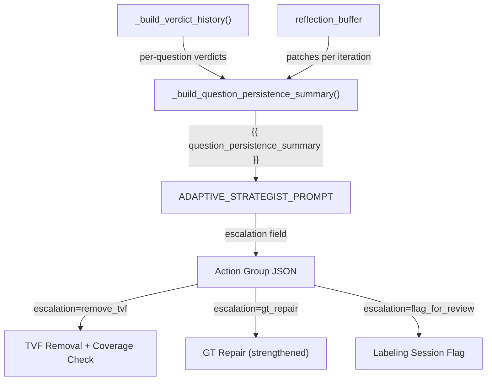

# Per-Question Failure Persistence for the Strategist

## Problem

The strategist's reflection buffer is iteration-level only. It sees "Iter 3: ACCEPTED, accuracy +4.2%" but never learns that Q16 has failed in *every single iteration*. This causes it to repeatedly propose the same additive fixes for persistent failures.

## Data Flow Overview

---

## Part 1: Enrich Reflections with Per-Question Data

### 1a. Enrich `_build_reflection_entry` ([harness.py](src/genie_space_optimizer/optimization/harness.py))

Add new parameters to the function signature (line 1545):

- `affected_question_ids: list[str] | None = None`
- `prev_failure_qids: set[str] | None = None`
- `new_failure_qids: set[str] | None = None`

Add to the returned dict:

- `affected_question_ids` — from the action group's `affected_questions`
- `fixed_questions` — `prev_failure_qids - new_failure_qids`
- `still_failing` — `prev_failure_qids & new_failure_qids`
- `new_regressions` — `new_failure_qids - prev_failure_qids`

At the call sites in the lever loop (~line 3272), thread `ag.get("affected_questions", [])` and the pre/post failure sets from `full_result["failure_question_ids"]`.

### 1b. New `_build_question_persistence_summary()` ([harness.py](src/genie_space_optimizer/optimization/harness.py) or [optimizer.py](src/genie_space_optimizer/optimization/optimizer.py))

- Accepts `verdict_history` (from `_build_verdict_history`) and `reflection_buffer`
- For each question with >= `PERSISTENCE_MIN_FAILURES` (new constant, default 2) non-passing iterations:
  - Show question ID, text, consecutive fail count, verdict breakdown
  - Cross-reference `reflection_buffer` entries' `affected_question_ids` to list patches tried for this specific question
  - Classify as `ADDITIVE_LEVERS_EXHAUSTED` when `add_instruction` + `add_example_sql` have each been tried 2+ times without fixing the question
  - Classify as `INTERMITTENT` when failures are non-consecutive

### 1c. Wire into the strategist prompt

- In `_call_llm_for_adaptive_strategy` ([optimizer.py](src/genie_space_optimizer/optimization/optimizer.py) line 4595): accept `verdict_history`, call `_build_question_persistence_summary()`, inject as `question_persistence_summary` format kwarg
- In `ADAPTIVE_STRATEGIST_PROMPT` ([config.py](src/genie_space_optimizer/common/config.py) line 1640): add `{{ question_persistence_summary }}` between Reflection History and Failure Clusters
- Add `PERSISTENCE_MIN_FAILURES = 2` to [config.py](src/genie_space_optimizer/common/config.py)

---

## Part 2: Escalation Path — TVF Removal

### Current state

- `remove_tvf` is an existing patch type (line 2108 of config.py)
- It is classified as `HIGH_RISK` (line 1856), so `apply_patch_set` queues it in `queued_high` and skips auto-application (applier.py line 1480)
- The `queued_high` list is returned but **never persisted, surfaced, or processed**

### What to build

**Not** auto-applying TVF removal. Instead, the escalation path is:

1. **Strategist proposes `remove_tvf`** — add an `"escalation"` field to the output schema so the strategist can signal `"remove_tvf"` when additive levers are exhausted. This maps to a lever 3 directive with `patch_type: remove_tvf`.

2. **Coverage check** before queuing — New function `_validate_tvf_removal_coverage()` in [applier.py](src/genie_space_optimizer/optimization/applier.py) or [optimizer.py](src/genie_space_optimizer/optimization/optimizer.py):
   - For the TVF being removed, check which benchmark questions reference it (via `expected_asset` in the benchmark dataset)
   - For each affected question, verify that an alternative asset (table or MV) exists in the Genie Space that can answer the same query (check column overlap between the TVF's output schema and available tables/MVs)
   - If coverage is insufficient, reject the removal and log the reason
   - **Only TVFs** can be removed through this path — tables and MVs are excluded

3. **Queue for human review** — the existing `queued_high` path already blocks auto-apply. The new step is to **persist** `queued_high` patches to a Delta table (`genie_opt_queued_patches` or a column in `genie_opt_iterations`) and include them in the labeling session (Part 4). This gives humans the ability to approve/reject.

4. **Prompt update** — add to the strategist prompt instructions:
   - "If a question has failed for 3+ consecutive iterations AND additive levers are exhausted, you may propose `remove_tvf` in lever 3 to remove a misleading TVF. Only TVFs may be removed — never tables or MVs. The removal will be queued for human review, not auto-applied."

### Scope constraints

- Only `remove_tvf` is allowed through escalation — `remove_table` is NOT permitted
- The strategist prompt must explicitly forbid table/MV removal
- Coverage validation is a hard gate — if it fails, the patch is rejected with a logged reason

---

## Part 3: Escalation Path — GT Repair (Strengthened)

### Current state

- `_attempt_gt_repair()` exists (harness.py line 1920) — uses an LLM to propose corrected SQL
- Validation is `validate_ground_truth_sql(repaired_sql, spark)` without `execute=True` — only checks EXPLAIN + table existence, does NOT execute the SQL

### What to strengthen

1. **Execute validation** — call `validate_ground_truth_sql(repaired_sql, spark, execute=True)` to ensure the repaired SQL actually returns rows. This is already supported by the function ([benchmarks.py](src/genie_space_optimizer/optimization/benchmarks.py) line 278) but not used in the repair path.

2. **Strategist recommendation** — when the persistence summary shows a `neither_correct` pattern, the strategist can include `"escalation": "gt_repair"` in its output. This doesn't change the repair mechanism itself (which is automatic via `_run_arbiter_corrections`), but it makes the strategist explicitly aware that GT repair is the right path rather than proposing more additive patches.

3. **No new mechanism needed** for "how would we know what the change should be" — the existing `_GT_REPAIR_PROMPT_TEMPLATE` handles this with the LLM, and the arbiter's rationale provides the context for what's wrong. The key improvement is execution validation to ensure the repair is actually correct.

---

## Part 4: Escalation Path — Flag for Human Review

### Current state

- Labeling sessions exist ([labeling.py](src/genie_space_optimizer/optimization/labeling.py)) with four schemas: judge verdict, corrected SQL, patch approval, improvement suggestions
- Sessions are populated with failure/regression traces automatically
- `ingest_human_feedback()` reads labels back and produces corrections
- `preflight.py` syncs corrections into the benchmark table before the next run
- The "Human Review" link is surfaced in the app UI via `ResourceLinks.tsx`

### What to build

1. **Explicit flagging** — new function `flag_for_human_review()` in [labeling.py](src/genie_space_optimizer/optimization/labeling.py):
   - Accepts a list of `{question_id, question_text, reason, iterations_failed, patches_tried}`
   - Writes to a new Delta table `genie_opt_flagged_questions` (or a column in `genie_benchmarks_{domain}` similar to quarantine)
   - Sets `flagged_for_review=True`, `flag_reason=...`, `flagged_at=CURRENT_TIMESTAMP()`

2. **Priority in labeling session** — modify `_populate_session_traces()` (labeling.py line 256) to:
   - Accept `flagged_question_ids` parameter
   - Ensure traces for flagged questions appear first in the session (before other failures)
   - Add a tag/metadata to flagged traces so the reviewer sees "PERSISTENT FAILURE: exhausted after 5 iterations"

3. **What the human does**:
   - In the MLflow labeling session, they see the flagged trace with context
   - They can provide `corrected_expected_sql` (if the GT is wrong) — this flows through the existing `benchmark_correction` pipeline
   - They can provide `judge_verdict` override (if the arbiter was wrong)
   - They can provide `improvement_suggestions` (if they have domain insight)
   - They can approve/reject a `remove_tvf` patch (via the `patch_approval` schema)

4. **Feedback loop** — already exists via `ingest_human_feedback()` -> `apply_benchmark_corrections()`. The only new wiring needed:
   - Queued high-risk patches (from Part 2) should also appear as traces in the labeling session so the `patch_approval` schema can be used
   - `preflight.py` should check `genie_opt_flagged_questions` and clear flags when human feedback is received

5. **Strategist can signal this** — `"escalation": "flag_for_review"` in the action group output. The harness interprets this by calling `flag_for_human_review()` instead of proposing patches.

---

## Part 5: Prompt Changes

Update `ADAPTIVE_STRATEGIST_PROMPT` in [config.py](src/genie_space_optimizer/common/config.py):

- Add `{{ question_persistence_summary }}` section
- Add escalation instructions to the `<instructions>` block
- Add `"escalation"` field to the output schema (optional field, one of: `"remove_tvf"`, `"gt_repair"`, `"flag_for_review"`, or omitted for normal patches)
- Add exhaustion heuristic guidance

---

## Summary of Files to Change

- **[config.py](src/genie_space_optimizer/common/config.py)** — new constants (`PERSISTENCE_MIN_FAILURES`), prompt updates
- **[harness.py](src/genie_space_optimizer/optimization/harness.py)** — enrich `_build_reflection_entry`, new `_build_question_persistence_summary()`, wire escalation handling into lever loop
- **[optimizer.py](src/genie_space_optimizer/optimization/optimizer.py)** — update `_call_llm_for_adaptive_strategy` signature and format_kwargs, update `format_reflection_buffer` to render per-question data
- **[applier.py](src/genie_space_optimizer/optimization/applier.py)** — new `_validate_tvf_removal_coverage()`, persist `queued_high`
- **[benchmarks.py](src/genie_space_optimizer/optimization/benchmarks.py)** — strengthen GT repair validation with `execute=True`
- **[labeling.py](src/genie_space_optimizer/optimization/labeling.py)** — new `flag_for_human_review()`, update `_populate_session_traces` for flagged priorities
- **[state.py](src/genie_space_optimizer/optimization/state.py)** — new table/columns for queued patches and flagged questions
- **Unit tests** — new tests for persistence summary, coverage validation, escalation handling
