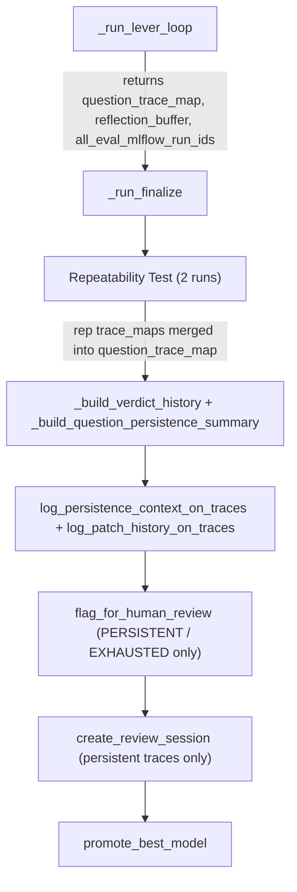

# Persistent-Only Review Sessions with Full Trace Enrichment

## Problem

1. **25 questions in session, only 4 reviewable** -- `all_failure_question_ids` accumulates every failure from every iteration (lines 3875, 3919 in `harness.py`). All of these are passed to `create_review_session` at line 4062, meaning the session contains traces for transient failures too, not just persistent ones.
2. **Persistence context not on traces** -- `log_persistence_context_on_traces` at line 4029 is called with only `full_result` (the last accepted iteration's eval result). If a persistent failure question was not in the last eval's `trace_map`, the persistence feedback is never attached.
3. **No patch history on traces** -- No function exists to log which patches were proposed/applied/rolled-back per question. The `reflection_buffer` has this data but it's never pushed to traces.
4. **Repeatability failures missed** -- The labeling session is created at the end of `_run_lever_loop` (line 4058), before `_run_finalize` runs 2 repeatability evaluations (lines 4265-4378). Failures surfaced by repeatability testing are never captured in the review session.

## Solution

### A. Collect per-question trace IDs across all iterations (`harness.py` -- `_run_lever_loop`)

Add a new accumulator `question_trace_map: dict[str, list[str]]` at line ~3178 alongside the existing accumulators. Populate it everywhere a `trace_map` is iterated (lines ~3876 and ~3920). This maps each question ID to ALL trace IDs produced for that question across the entire run.

```python
question_trace_map: dict[str, list[str]] = {}
```

At each place where we iterate a `trace_map`, also do:

```python
for qid, tid in _trace_map.items():
    question_trace_map.setdefault(qid, []).append(tid)
```

Return `question_trace_map`, `reflection_buffer`, and `all_eval_mlflow_run_ids` in the lever loop's return dict (line ~4151) so `_run_finalize` can consume them.

### B. Remove session creation from `_run_lever_loop`

Remove the following blocks from `_run_lever_loop` (lines 4021-4092):

- Persistence analysis and trace enrichment (lines 4021-4031)
- Flag persistent failures for human review (lines 4033-4056)
- Labeling session creation (lines 4058-4092)

These will all move to `_run_finalize`.

### C. Extend `_run_finalize` signature and add post-repeatability session creation

Add new parameters to `_run_finalize` (line 4169):

```python
def _run_finalize(
    ...,
    question_trace_map: dict[str, list[str]] | None = None,
    reflection_buffer: list[dict] | None = None,
    all_eval_mlflow_run_ids: list[str] | None = None,
) -> dict:
```

After the repeatability test block (line ~4378) and before model promotion (line ~4386), insert the full session creation pipeline:

1. **Merge repeatability traces** -- Each repeatability `rep_result` has a `trace_map`. Merge these into `question_trace_map` and collect their `mlflow_run_id` into `all_eval_mlflow_run_ids`.
2. **Re-run persistence analysis** -- Call `_build_verdict_history` and `_build_question_persistence_summary` (these read from Delta, so they see all evals including repeatability).
3. **Enrich traces** -- Call `log_persistence_context_on_traces` (with `extra_trace_map`) and new `log_patch_history_on_traces`.
4. **Flag persistent failures** -- Call `flag_for_human_review` for PERSISTENT / ADDITIVE_LEVERS_EXHAUSTED questions.
5. **Create labeling session** -- Only for persistent-failure questions; derive trace IDs from `question_trace_map` (use last trace per question).

Place this block under a `_check_timeout("human_review_session")` guard. This is lightweight (no LLM or Genie API calls) and should complete in seconds.

Update the call site in `optimize_genie_space` (line ~4841) to pass the new parameters from `loop_out`.

### D. Restrict labeling session to persistent failures only

When creating the session, compute:

```python
persistent_question_ids = [
    qid for qid, ctx in persistence_data.items()
    if ctx["classification"] in ("PERSISTENT", "ADDITIVE_LEVERS_EXHAUSTED")
]
persistent_trace_ids = [
    question_trace_map[qid][-1]
    for qid in persistent_question_ids
    if qid in question_trace_map
]
```

Pass only these to `create_review_session`. Fall back to the full set of accumulated failure IDs when `persistence_data` is empty (first run, no history).

### E. Extend `log_persistence_context_on_traces` (`evaluation.py`)

Add optional `extra_trace_map: dict[str, list[str]] | None = None` parameter. When provided, use it as the primary source of trace IDs per question (logging on all traces for each question, not just the last eval's `trace_map`). Falls back to `eval_result["trace_map"]` when `extra_trace_map` is absent.

### F. New `log_patch_history_on_traces()` function (`evaluation.py`)

Create after `log_persistence_context_on_traces`:

```python
def log_patch_history_on_traces(
    question_trace_map: dict[str, list[str]],
    reflection_buffer: list[dict],
    persistent_question_ids: set[str] | None = None,
) -> int:
```

For each question in `persistent_question_ids` (or all if None), extract per-question patch history from `reflection_buffer`:

- Which iteration, which patches (patch_type + target_object), accepted or rolled back, score delta

Log as `mlflow.log_feedback` with `name="patch_history"` on each question's latest trace from `question_trace_map`. Include:

- `rationale`: human-readable summary (e.g. "Iter 1: add_instruction on ..., ACCEPTED (+4.2%); Iter 3: rewrite_instruction on ..., ROLLED_BACK (-2.1%)")
- `metadata`: structured dict with `iterations`, `patches`, `accepted`, `score_deltas`

### G. Unit tests (`tests/unit/test_human_review_benchmark_cap.py`)

- `TestLogPatchHistoryOnTraces`: verify extraction from reflection buffer, logging on correct trace IDs, filtering to persistent questions only
- `TestPersistentOnlySessionFiltering`: verify correct subset of question IDs and trace IDs are computed
- `TestLogPersistenceContextExtraTraceMap`: verify `extra_trace_map` path logs on all provided traces
- `TestFinalizeMergesRepeatabilityTraces`: verify repeatability `trace_map` entries are merged into `question_trace_map`

## Data flow




## Files changed

- `[harness.py](src/genie_space_optimizer/optimization/harness.py)` -- add `question_trace_map` accumulator in `_run_lever_loop`, return it + `reflection_buffer` + `all_eval_mlflow_run_ids`; remove session creation from lever loop; extend `_run_finalize` to accept these and create session after repeatability
- `[evaluation.py](src/genie_space_optimizer/optimization/evaluation.py)` -- extend `log_persistence_context_on_traces` with `extra_trace_map`; add new `log_patch_history_on_traces`
- `[tests/unit/test_human_review_benchmark_cap.py](tests/unit/test_human_review_benchmark_cap.py)` -- new tests for patch history, persistent-only filtering, extra trace map, and repeatability trace merging

