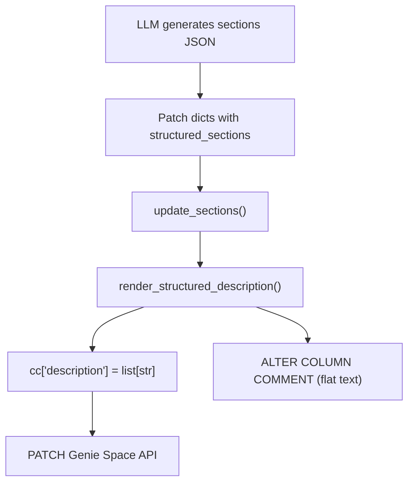

# Plain-Text Structured Descriptions

## Problem

Table and column descriptions currently render as `**Purpose:** SCD Type 2 property dimension...**Best for:** Property lookups...` — a wall of text with literal Markdown asterisks because the Genie API description field is **plain text**, not Markdown.

## Design

Apply the same ALL-CAPS section header format used for text instructions. A table description like:

```
**Purpose:** SCD Type 2 property dimension containing all current and historical versions of property listings.**Best for:** Property lookups, property attribute analysis, pricing analysis, geographic property reporting.
```

Becomes:

```
PURPOSE:
SCD Type 2 property dimension containing all current and historical versions of property listings.

BEST FOR:
Property lookups, property attribute analysis, pricing analysis, geographic property reporting.

GRAIN:
One row per property per SCD Type 2 version.
```

Key principles:

- Section header on its own line, ALL-CAPS with colon
- Section value on the next line (no bullet prefix for descriptions, unlike instructions which use `-` )
- Blank line between sections for visual separation
- No Markdown (`**`, `*`, backticks, etc.)
- Idempotent: parse then render yields the same output

## Files to Change

### 1. `structured_metadata.py` — Parser and Renderer (core change)

`**_SECTION_RE**` (line 92): Add a second regex to also match ALL-CAPS plain-text headers alongside the existing `**Label:**` pattern.

```python
# NEW: matches "PURPOSE:" or "BEST FOR:" on its own line
_PLAINTEXT_SECTION_RE = re.compile(
    r"^(?P<label>[A-Z][A-Z ]+?):\s*$",
    re.MULTILINE,
)
```

`**parse_structured_description**` (line 117): Update the line-parsing loop to match BOTH `_SECTION_RE` (legacy Markdown) and `_PLAINTEXT_SECTION_RE` (new plain-text). This ensures backward compatibility — existing `**Purpose:** ...` descriptions still parse correctly, while new `PURPOSE:\nvalue` descriptions also parse. Map the ALL-CAPS label back to the section key using a reverse lookup from `SECTION_LABELS`.

`**render_structured_description**` (line 184): Change the output format from `**Label:** value` to:

```python
label_upper = label.upper()
lines.append(f"{label_upper}:")
lines.append(value)
lines.append("")  # blank line separator
```

This matches the instruction format style. The preamble (legacy text) stays at the top, followed by a blank separator.

`**format_column_for_prompt**` (line 389): Leave unchanged — this is for LLM input, not display. The `**Label:**` format is fine for prompts.

### 2. `structured_metadata.py` — `SECTION_LABELS` reverse lookup

Add a reverse map for ALL-CAPS labels:

```python
_UPPER_LABEL_TO_KEY: dict[str, str] = {
    v.upper(): k for k, v in SECTION_LABELS.items()
}
```

This is used by the parser to resolve `"PURPOSE"` -> `"purpose"`, `"BEST FOR"` -> `"best_for"`, etc.

### 3. `applier.py` — UC DDL path (line 1383)

The `_apply_action_to_uc` function calls `render_structured_description`, joins with `"\n"`, and writes via `ALTER COLUMN COMMENT`. This will automatically use the new plain-text format — no change needed here since it consumes the renderer output. Verify it works correctly.

### 4. `runs.py` — OBO deferred path (line 89)

`_uc_statement_from_patch` only reads `new_text`/`value` from the command dict. For patches with only `structured_sections`, it returns `None` and the UC write is skipped. This is a pre-existing gap (not introduced by this change), but worth noting — no change needed for this plan.

### 5. `test_structured_metadata.py` — Update tests

All test assertions that check for `**Purpose:**`, `**Definition:**`, etc. must be updated to match the new plain-text format:

- `test_table_rendering`: `"PURPOSE:"` on its own line + `"Tracks bookings"` on next line
- `test_column_dim_rendering`: `"DEFINITION:"` + value
- `test_preserves_preamble`: preamble is first line, then blank, then sections
- `test_idempotent_round_trip`: must still pass (parse -> render -> parse yields same dict)
- `test_section_ordering_matches_template`: update index checks for new multi-line format

### 6. `DESCRIPTION_ENRICHMENT_PROMPT` in `config.py` (line 456)

Update the example output in the prompt to instruct the LLM to produce **concise, single-sentence** section values. Currently the prompt already asks for "one sentence per section" (line 509), which is good. No structural change needed to the prompt — the LLM output is `{"changes": [{...sections...}]}` JSON, and the sections are applied via `update_sections` -> `render_structured_description`, which will now use the new format automatically.

However, add an explicit instruction to the prompt: "Each section value must be a single concise sentence. Do NOT repeat information across sections."

## Data Flow (unchanged)




The only function that changes behavior is `render_structured_description` (and the parser for backward compat). Everything downstream automatically gets the new format.

## Backward Compatibility

- **Existing `**Label:** value` descriptions**: The parser gains dual-regex support, so legacy descriptions still parse into the same section dict. On the next write, they get re-rendered in the new plain-text format — a one-time migration that happens organically.
- **Preamble text**: Preserved as-is at the top of the description, separated by a blank line from structured sections.
- **LLM prompts** (`format_column_for_prompt`): Unchanged — keeps `**Label:`** for LLM consumption.

