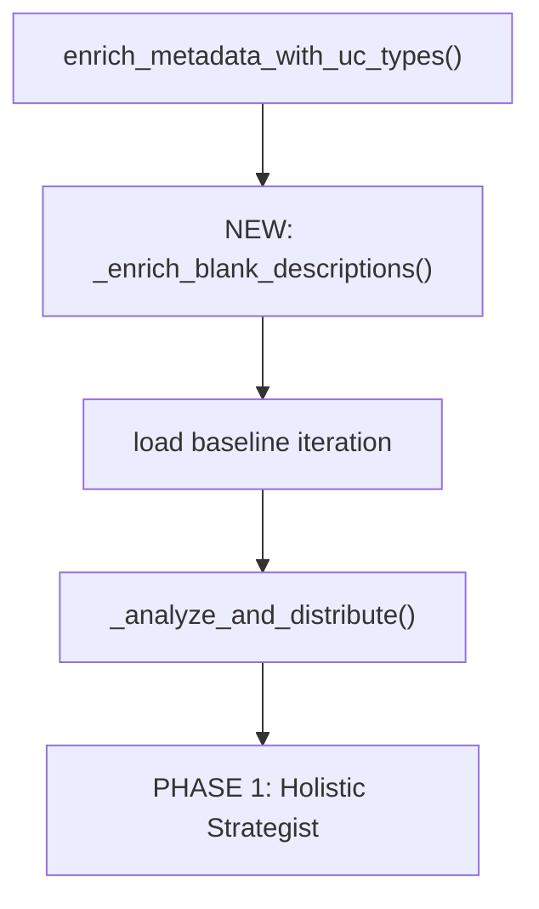

# Proactive Column Description Enrichment

## Placement

Insert a new **Stage 2.75** in `_run_lever_loop()` at [harness.py](src/genie_space_optimizer/optimization/harness.py) line ~1270, right after `enrich_metadata_with_uc_types(metadata_snapshot, uc_columns)` and before the baseline iteration load (line 1271). At this point:

- `metadata_snapshot` has all table/column configs with UC types enriched
- `uc_columns` dicts are available (each with `table_name`, `column_name`, `data_type`, `comment`)
- `w` (WorkspaceClient) and `space_id` are available for API patching




## Scope: Only columns missing descriptions in BOTH UC and Genie Space

A column is eligible when ALL of these are true:

1. Genie Space `description` is empty — `cc.get("description")` is `None`, `[]`, `[""]`, or `""`.
2. UC comment is empty — `cc.get("uc_comment")` is falsy (already set by `enrich_metadata_with_uc_types`).
3. Column is not hidden (`cc.get("hidden") != True`).

Columns that have a UC comment but no Genie description are NOT in scope (those should be a separate, simpler copy step if desired).

## New Prompt: `DESCRIPTION_ENRICHMENT_PROMPT`

**File:** [config.py](src/genie_space_optimizer/common/config.py) (after `LEVER_1_2_COLUMN_PROMPT`)

A new prompt constant that:

- Takes a batch of columns grouped by table, with their `data_type` and entity type classification
- Provides the table-level description (if any) and neighboring column names for contextual inference
- Asks the LLM to produce structured sections per the Lever 1/2 format:
  - `column_dim` -> `definition`, `values`, `synonyms`
  - `column_measure` -> `definition`, `aggregation`, `grain_note`, `synonyms`
  - `column_key` -> `definition`, `join`, `synonyms`
- Uses the same output schema as Lever 1/2: `{"changes": [{"table": "...", "column": "...", "entity_type": "...", "sections": {...}}], "rationale": "..."}`
- Includes few-shot example and extract-over-generate rules (identifier allowlist)
- Explicitly instructs the LLM to infer meaning from column name, data type, table context, and sibling columns — but to be conservative and honest when unsure

## New Function: `_enrich_blank_descriptions()`

**File:** [optimizer.py](src/genie_space_optimizer/optimization/optimizer.py)

```python
def _enrich_blank_descriptions(
    metadata_snapshot: dict,
    w: WorkspaceClient | None = None,
) -> list[dict]:
```

Logic:

1. Walk `metadata_snapshot["data_sources"]["tables"]` and collect blank-description columns (per criteria above)
2. Skip if zero eligible columns (common in well-documented spaces)
3. Classify each eligible column using `entity_type_for_column()` from `structured_metadata.py`
4. Group eligible columns by table for batched prompting
5. Build the prompt context: table identifier, table description, all column names/types (for sibling context), plus the identifier allowlist
6. Call the LLM with `DESCRIPTION_ENRICHMENT_PROMPT` (one call per table, or batched across tables if count is small)
7. Parse JSON response and return a list of patch dicts in the same format as Lever 1/2 proposals:

```python
{
    "type": "update_column_description",
    "table": "catalog.schema.table_name",
    "column": "column_name",
    "structured_sections": {"definition": "...", "values": "..."},
    "column_entity_type": "column_dim",
    "lever": 0,  # lever 0 = pre-optimization enrichment
    "risk_level": "low",
    "source": "proactive_enrichment",
}
```

Lever 0 means these sections are treated as "base" and can be refined by any lever later (levers 1/2 own all these section keys).

## New Orchestrator: `_run_description_enrichment()`

**File:** [harness.py](src/genie_space_optimizer/optimization/harness.py)

A new function following the same pattern as `_run_prompt_matching_setup()`:

1. Call `_enrich_blank_descriptions(metadata_snapshot, w)` to get proposed patches
2. If patches are non-empty:
  - Apply via existing `apply_patch_set()` or direct config mutation + `patch_space_config()`
  - Use `update_sections()` from `structured_metadata.py` with `lever=0` to apply (requires adding lever 0 to `LEVER_SECTION_OWNERSHIP` as a superset of all section keys, or bypassing ownership for lever 0)
  - Print diagnostic summary (total eligible, enriched count, skipped count)
  - Write a `DESCRIPTION_ENRICHMENT` stage entry via `write_stage()`
  - Refresh config from API: `config = fetch_space_config(w, space_id)` and restore `_uc_columns`
3. If no patches: log "0 columns need enrichment" and skip

## Lever Ownership for Lever 0

**File:** [structured_metadata.py](src/genie_space_optimizer/optimization/structured_metadata.py)

Add lever 0 to `LEVER_SECTION_OWNERSHIP` with the union of all column section keys:

```python
LEVER_SECTION_OWNERSHIP: dict[int, set[str]] = {
    0: {"purpose", "best_for", "grain", "scd", "definition", "values",
        "synonyms", "aggregation", "grain_note", "join", "important_filters",
        "relationships", "use_instead_of", "parameters", "example"},
    1: {...},
    ...
}
```

This ensures `update_sections()` works for lever 0 without special-casing.

## Integration in `_run_lever_loop()`

**File:** [harness.py](src/genie_space_optimizer/optimization/harness.py) line ~1270

After `enrich_metadata_with_uc_types`:

```python
uc_columns = config.get("_uc_columns", [])
if uc_columns:
    enrich_metadata_with_uc_types(metadata_snapshot, uc_columns)

# Stage 2.75: Proactive description enrichment for blank columns
enrichment_result = _run_description_enrichment(
    w, spark, run_id, space_id, config, metadata_snapshot, catalog, schema,
)
if enrichment_result.get("total_enriched", 0) > 0:
    config = fetch_space_config(w, space_id)
    config["_uc_columns"] = uc_columns
    metadata_snapshot = config.get("_parsed_space", config)
    if uc_columns:
        enrich_metadata_with_uc_types(metadata_snapshot, uc_columns)
```

## Batching Strategy

- If <= 30 eligible columns across all tables: single LLM call with all columns
- If > 30: batch by table (one LLM call per table with eligible columns)
- Each call bounded by the existing `PROMPT_TOKEN_BUDGET` and `_truncate_to_budget` mechanism

## Safeguards

- **Idempotent**: only targets columns where description is empty/None/[""]. Second run is a no-op.
- **Conservative generation**: prompt explicitly states "If unsure, write 'General-purpose [data_type] column' rather than guessing."
- **No overwrites**: lever 0 only writes to empty sections; `update_sections` info-loss guard is a secondary safety net.
- **Validation**: each generated description must reference only identifiers in the allowlist.
- **Graceful failure**: if the LLM call fails, log warning and continue to lever loop without enrichment.

