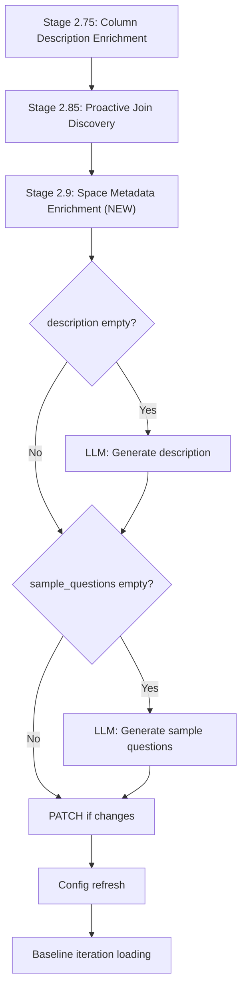

# Proactive Space Description and Sample Questions

## Background

The Genie Space has two user-facing metadata fields that the optimizer currently never populates:

- `**description**` -- a top-level field on the Space object (outside `serialized_space`)
- `**config.sample_questions**` -- inside `serialized_space.config.sample_questions`, displayed as starter prompts in the Genie UI

When these are empty, users see a blank description and no suggested questions, reducing discoverability.

## Architecture




## Key Design Decisions

- `**description` is a top-level PATCH field**, not inside `serialized_space`. The current `patch_space_config` only sends `serialized_space`. We need to add a new `update_space_metadata` function in [genie_client.py](src/genie_space_optimizer/common/genie_client.py) that sends `description` alongside `serialized_space` in the PATCH body.
- `**sample_questions`** are inside `serialized_space.config.sample_questions` and can be PATCHed through the existing `patch_space_config` path by mutating `_parsed_space["config"]["sample_questions"]`.
- **Conservative generation**: questions should be concrete and grounded in actual schema entities (tables, columns, metric views). The LLM prompt receives the full identifier allowlist.

## Changes

### Fix 1: Add `SPACE_DESCRIPTION_PROMPT` to [config.py](src/genie_space_optimizer/common/config.py)

New LLM prompt template after `DESCRIPTION_ENRICHMENT_PROMPT` (~line 531). Takes `tables_context`, `metric_views_context`, `instructions_context`, and `identifier_allowlist` as template variables. Output: a structured plain-text description following the format observed in [genie_space_config.json](docs/genie_space_config.json):

```
DATA COVERAGE:
- bullet points about tables/domains

AVAILABLE ANALYTICS:
1. numbered categories

USE CASES:
- role-based use case bullets

TIME PERIODS:
- temporal coverage info
```

The prompt should instruct the LLM to infer the domain from table/column names and metric view definitions, and produce 150-300 words max.

### Fix 2: Add `SAMPLE_QUESTIONS_PROMPT` to [config.py](src/genie_space_optimizer/common/config.py)

New LLM prompt template. Takes `tables_context`, `metric_views_context`, `instructions_context`, `description_context`, and `identifier_allowlist`. Output: JSON `{"questions": ["...", "..."], "rationale": "..."}` with 5-8 diverse sample questions that:

- Cover different tables / metric views
- Mix aggregation, filtering, ranking, and time-based patterns
- Are phrased in natural language (not SQL)
- Reference real column names / concepts from the schema

### Fix 3: Add `_generate_space_description` helper in [optimizer.py](src/genie_space_optimizer/optimization/optimizer.py)

New function after `_enrich_blank_descriptions` (~line 1060). Pattern follows `_enrich_blank_descriptions`:

- Build context strings from `metadata_snapshot` (tables with purposes, column names, MVs, instructions)
- Format `SPACE_DESCRIPTION_PROMPT` with `format_mlflow_template`
- Call LLM via `w.serving_endpoints.query`
- Extract and return the description string
- Returns `""` on failure (logged warning, no exception)

### Fix 4: Add `_generate_sample_questions` helper in [optimizer.py](src/genie_space_optimizer/optimization/optimizer.py)

New function after `_generate_space_description`. Same pattern:

- Build context from `metadata_snapshot` plus the description (either existing or just-generated)
- Format `SAMPLE_QUESTIONS_PROMPT`
- Call LLM, parse JSON response with `_extract_json`
- Return list of `{"id": generate_genie_id(), "question": [q]}` dicts
- Returns `[]` on failure

### Fix 5: Add `update_space_description` function in [genie_client.py](src/genie_space_optimizer/common/genie_client.py)

New function after `patch_space_config` (~line 400). Sends a minimal PATCH with only `{"description": "..."}` to `/api/2.0/genie/spaces/{space_id}`. Same retry logic as `patch_space_config`. This avoids coupling the description update with the `serialized_space` update and keeps the existing `patch_space_config` simple.

```python
def update_space_description(
    w: WorkspaceClient,
    space_id: str,
    description: str,
    *,
    max_retries: int = 2,
    retry_delay: float = 5.0,
) -> dict:
    ...
```

### Fix 6: Add `_run_space_metadata_enrichment` in [harness.py](src/genie_space_optimizer/optimization/harness.py)

New function after `_run_proactive_join_discovery`. Modeled on the existing proactive stage pattern:

**Gate logic:**

- `needs_description = not config.get("description", "").strip()`
- `parsed = config.get("_parsed_space", config)` then `needs_questions = not (parsed.get("config", {}).get("sample_questions"))`
- If neither is needed, log and return early

**Flow:**

1. `write_stage(spark, run_id, "SPACE_METADATA_ENRICHMENT", "STARTED", ...)`
2. If `needs_description`: call `_generate_space_description` -> if non-empty, call `update_space_description`
3. If `needs_questions`: call `_generate_sample_questions` -> if non-empty, mutate `parsed["config"]["sample_questions"]` and call `patch_space_config`
4. Write provenance patches via `write_patch` for each applied change
5. `write_stage(spark, run_id, "SPACE_METADATA_ENRICHMENT", "COMPLETE", ...)`
6. Console output with summary

### Fix 7: Wire into `_run_lever_loop` in [harness.py](src/genie_space_optimizer/optimization/harness.py)

Insert the call after the Stage 2.85 (proactive join discovery) config refresh block (~line 1690):

```python
# Stage 2.9: Proactive space metadata enrichment
meta_result = _run_space_metadata_enrichment(
    w, spark, run_id, space_id, config, metadata_snapshot, catalog, schema,
)
if meta_result.get("description_generated") or meta_result.get("questions_generated"):
    config = fetch_space_config(w, space_id)
    config["_uc_columns"] = uc_columns
    metadata_snapshot = config.get("_parsed_space", config)
    if uc_columns:
        enrich_metadata_with_uc_types(metadata_snapshot, uc_columns)
```

### Fix 8: Register new prompts in [config.py](src/genie_space_optimizer/common/config.py)

Add to the `PROMPTS` registry dict (~line 2162):

```python
"space_description": SPACE_DESCRIPTION_PROMPT,
"sample_questions": SAMPLE_QUESTIONS_PROMPT,
```

