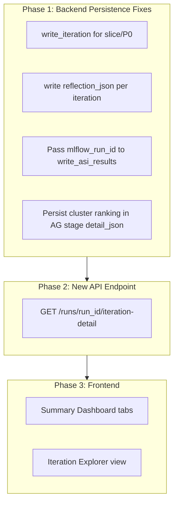

# Run Transparency Pane

## Architecture Overview




---

## Phase 1: Backend Persistence Fixes

All changes in `[src/genie_space_optimizer/optimization/harness.py](src/genie_space_optimizer/optimization/harness.py)`.

### 1a. Persist slice and P0 eval scores

Currently, only full evals call `write_iteration`. Add calls for slice and P0 after their gate checks.

**Slice eval** (~line 2849–2906): After `slice_result` is computed and before the gate decision, add:

```python
write_iteration(spark, run_id, iteration_counter, slice_result,
    catalog=catalog, schema=schema,
    lever=0, eval_scope="slice", model_id=new_model_id)
```

**P0 eval** (~line 2913–2935): Same pattern with `eval_scope="p0"`.

### 1b. Persist reflection_json per iteration

The `reflection_json` column exists in `genie_opt_iterations` and `write_iteration` already accepts it, but it's never passed. After `_build_reflection_entry` is called (~line 3865–3953), pass the entry to the full eval's `write_iteration`:

```python
reflection_entry = _build_reflection_entry(...)
reflection_buffer.append(reflection_entry)
write_iteration(spark, run_id, iteration_counter, full_result,
    catalog=catalog, schema=schema,
    lever=0, eval_scope="full", model_id=new_model_id,
    reflection_json=reflection_entry)  # <-- add this
```

This requires adjusting the call order: build reflection entry before calling write_iteration, not after.

### 1c. Pass mlflow_run_id to write_asi_results

In `[harness.py](src/genie_space_optimizer/optimization/harness.py)` ~line 3372, `write_asi_results` is called with `mlflow_run_id=""`. The eval's `mlflow_run_id` is available from `full_result.get("mlflow_run_id")`. Pass it through:

```python
write_asi_results(spark, run_id, iteration_counter - 1, _analysis["asi_rows"],
    catalog, schema, mlflow_run_id=full_result.get("mlflow_run_id", ""))
```

### 1d. Persist cluster ranking in AG stage detail_json

When writing `AG_{ag_id}_STARTED` (harness.py ~3508), include the cluster's ranking data in `detail_json`:

```python
write_stage(spark, run_id, f"AG_{ag_id}_STARTED", "STARTED",
    task_key="lever_loop", iteration=iteration_counter,
    detail={
        "cluster_id": cluster.get("cluster_id"),
        "impact_score": cluster.get("impact_score"),
        "rank": cluster.get("rank"),
        "question_count": len(cluster.get("question_ids", [])),
        "root_cause": cluster.get("root_cause"),
        "affected_questions": cluster.get("question_ids", [])[:20],
    },
    catalog=catalog, schema=schema)
```

The `cluster` variable is already available at this point in the loop from `ranked_clusters`.

---

## Phase 2: New Backend API Endpoint

### New endpoint: `GET /runs/{run_id}/iteration-detail`

Add to `[src/genie_space_optimizer/backend/routes/runs.py](src/genie_space_optimizer/backend/routes/runs.py)`.

**Response model** (add to `[models.py](src/genie_space_optimizer/backend/models.py)`):

```python
class QuestionResult(SafeModel):
    questionId: str
    question: str = ""
    resultCorrectness: str | None = None
    judgeVerdicts: dict[str, str] = {}
    failureTypes: list[str] = []
    matchType: str | None = None
    expectedSql: str | None = None
    generatedSql: str | None = None

class GateResult(SafeModel):
    gateName: str           # "slice", "p0", "full", "confirm"
    accuracy: float | None = None
    totalQuestions: int | None = None
    passed: bool | None = None
    mlflowRunId: str | None = None

class ReflectionEntry(SafeModel):
    iteration: int
    agId: str
    accepted: bool
    action: str
    levers: list[int] = []
    targetObjects: list[str] = []
    scoreDeltas: dict[str, float] = {}
    accuracyDelta: float = 0
    newFailures: str | None = None
    rollbackReason: str | None = None
    doNotRetry: list[str] = []
    affectedQuestionIds: list[str] = []
    fixedQuestions: list[str] = []
    stillFailing: list[str] = []
    newRegressions: list[str] = []
    reflectionText: str = ""
    refinementMode: str = ""

class IterationDetail(SafeModel):
    iteration: int
    agId: str | None = None
    status: str                  # "accepted", "rolled_back", "skipped", "baseline"
    overallAccuracy: float
    judgeScores: dict[str, float | None] = {}
    totalQuestions: int
    correctCount: int
    mlflowRunId: str | None = None
    modelId: str | None = None
    gates: list[GateResult] = []
    patches: list[dict] = []     # from genie_opt_patches filtered by AG
    reflection: ReflectionEntry | None = None
    questions: list[QuestionResult] = []
    clusterInfo: dict | None = None  # from AG_STARTED detail_json
    timestamp: str | None = None

class IterationDetailResponse(SafeModel):
    runId: str
    spaceId: str
    baselineScore: float | None = None
    optimizedScore: float | None = None
    totalIterations: int
    iterations: list[IterationDetail]
    flaggedQuestions: list[dict] = []   # from genie_opt_flagged_questions
    labelingSessionUrl: str | None = None
```

**Implementation logic:**

1. Load all iterations from `genie_opt_iterations` (all scopes: full, slice, p0)
2. Load all AG stage events from `genie_opt_stages`
3. Load all patches from `genie_opt_patches`
4. Parse `reflection_json` from each full-scope iteration (Phase 1b ensures it's populated)
5. For baseline (iteration 0): parse `rows_json` into `QuestionResult[]` with per-judge verdicts
6. For each subsequent iteration: group by iteration number, assemble gates from slice/p0/full rows, match patches by `action_group_id`, parse reflection, parse `rows_json` for question results
7. Load flagged questions from `genie_opt_flagged_questions` filtered by domain
8. Load `labeling_session_url` from `genie_opt_runs`
9. Return `IterationDetailResponse`

**Endpoint signature:**

```python
@router.get("/runs/{run_id}/iteration-detail",
    response_model=IterationDetailResponse,
    operation_id="getIterationDetail")
def get_iteration_detail(run_id: str, config: Dependencies.Config):
    ...
```

This single endpoint provides everything both the Summary Dashboard and Iteration Explorer need.

---

## Phase 3: Frontend Components

### 3a. View Toggle on Run Detail Page

In `[src/genie_space_optimizer/ui/routes/runs/$runId.tsx](src/genie_space_optimizer/ui/routes/runs/$runId.tsx)`, add a Tabs component wrapping the main content area:

```
[Summary]  [Iteration Explorer]
```

The Summary tab is the enhanced current page; the Iteration Explorer tab is the new deep-dive view. Both share the same `useGetRun` data, plus the new `useGetIterationDetail` hook for the detailed data.

### 3b. Summary Dashboard Enhancements

Replace the current flat layout (Score Progression + Stage Timeline + ASI panel + steps) with a **tabbed insight panel** between the score summary cards and the pipeline steps.

**New component: `InsightTabs`** in `src/genie_space_optimizer/ui/components/InsightTabs.tsx`

Tabs:

- **Overview** -- existing Score Progression chart + Stage Timeline + new Per-Judge Score Progression (multi-line chart from `scores_json` across iterations)
- **Questions** -- Per-question journey table: rows = questions, columns = iterations. Each cell shows pass/fail with judge badges. Filterable: All / Failing / Fixed / Regressed. Data from `rows_json` across iterations.
- **Patches** -- Filterable table from `genie_opt_patches`: Lever, Action Type, Target, Scope, Risk, Status (accepted/rolled_back). Expandable rows for full patch detail JSON.
- **Activity** -- Chronological feed of all stage events from `genie_opt_stages`, especially AG lifecycle events. Format: timestamp, event name, status, key metrics. Most recent at top.
- **Judges** -- Enhanced ASI panel (always visible, not collapsible). Add iteration comparison: side-by-side judge pass rates for baseline vs final. Add failure type trend chart across iterations.

### 3c. Iteration Explorer Component

**New component: `IterationExplorer`** in `src/genie_space_optimizer/ui/components/IterationExplorer.tsx`

Layout (as described in prior conversation):

- **Iteration Selector Strip** -- horizontal row of iteration pills with accuracy labels, active iteration highlighted
- **Strategist Decision Card** -- cluster targeted, impact score, levers chosen, reflection from prior iterations (from `reflection` field)
- **Patches Card** -- patches for this AG, expandable detail
- **Gate Results Card** -- vertical pipeline: Slice -> P0 -> Full -> Confirm with pass/fail and accuracy (from `gates[]`)
- **Question Impact Card** -- three sections: Fixed, Still Failing, New Regressions (from `reflection.fixedQuestions`, etc.)
- **Score Breakdown Table** -- per-judge before/after delta (from `reflection.scoreDeltas` + `judgeScores`)
- **MLflow Links** -- link to the iteration's MLflow evaluation run via `mlflowRunId`
- **Prev/Next Navigation** at bottom

**Special renderings:**

- Baseline (iteration 0): No strategist/patches/gates. Shows full question results table + judge score breakdown.
- Rolled-back iterations: Red-themed gate card showing where it failed, rollback reason, and "Optimizer learned" section from `doNotRetry`.

### 3d. Human Review Integration

Surface human review prominently:

- **Flagged Questions Badge** in the Questions tab: questions from `flaggedQuestions[]` in the response get a "Flagged for Review" badge with the flag reason (e.g., "ADDITIVE_LEVERS_EXHAUSTED")
- **Review Session Link** in the Iteration Explorer: when `labelingSessionUrl` is available, show a "Open Human Review Session" button linking to the MLflow Review App
- **Persistent Failure Highlight**: In the Questions tab, questions that fail across ALL iterations get a special "Persistent Failure" badge, and if they're in `flaggedQuestions`, show "Human Review Requested"

### 3e. MLflow Integration Points

For each iteration in the Explorer:

- **Evaluation Run Link**: "View in MLflow" button using `mlflowRunId` (construct URL from experiment ID in `links[]`)
- **Model Version Link**: "View LoggedModel" button using `modelId`
- In the Summary Activity tab: MLflow experiment link at the top

---

## File Summary


| File                                                            | Change Type | Description                                                                                                     |
| --------------------------------------------------------------- | ----------- | --------------------------------------------------------------------------------------------------------------- |
| `src/genie_space_optimizer/optimization/harness.py`             | Modify      | Add write_iteration for slice/P0, pass reflection_json, pass mlflow_run_id to ASI, add cluster info to AG stage |
| `src/genie_space_optimizer/backend/models.py`                   | Modify      | Add QuestionResult, GateResult, ReflectionEntry, IterationDetail, IterationDetailResponse                       |
| `src/genie_space_optimizer/backend/routes/runs.py`              | Modify      | Add get_iteration_detail endpoint                                                                               |
| `src/genie_space_optimizer/ui/routes/runs/$runId.tsx`           | Modify      | Add view toggle (Summary / Iteration Explorer), integrate InsightTabs                                           |
| `src/genie_space_optimizer/ui/components/InsightTabs.tsx`       | New         | Tabbed insight panel (Overview, Questions, Patches, Activity, Judges)                                           |
| `src/genie_space_optimizer/ui/components/IterationExplorer.tsx` | New         | Full iteration deep-dive component                                                                              |
| `src/genie_space_optimizer/ui/lib/transparency-api.ts`          | Modify      | Add useIterationDetail hook                                                                                     |


---

## Sequencing

Phase 1 (persistence) can be implemented independently and deployed first -- it only adds data, never removes. Phase 2 (API) depends on Phase 1 for slice/P0/reflection data to be available. Phase 3 (frontend) depends on Phase 2 for the endpoint. Within Phase 3, the Summary Dashboard tabs (3b) and Iteration Explorer (3c) are independent of each other and can be built in parallel.