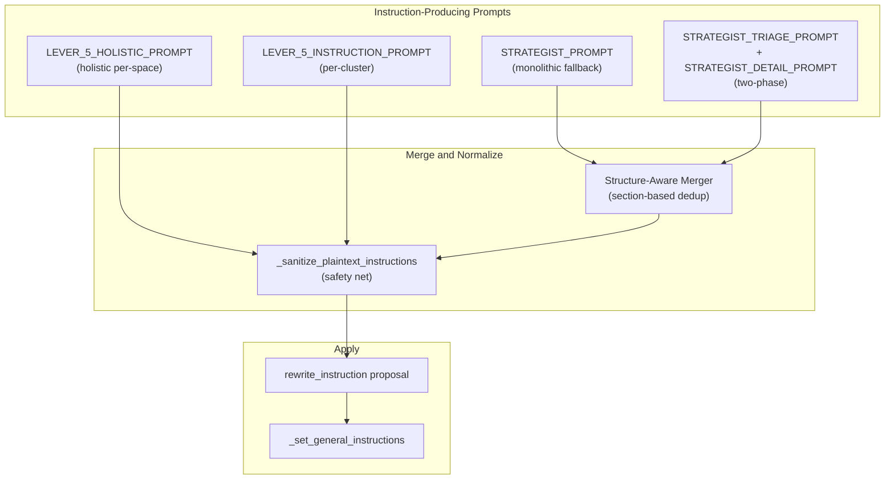

# Structured Genie Instructions and Markdown Elimination

## Problem

The Genie Space "General Instructions" field renders as **plain text**, but the optimizer produces Markdown-formatted output (`## Headers`, `**bold`**, backticks). The structured section vocabulary (`PURPOSE:`, `ASSET ROUTING:`, etc.) is only defined in `LEVER_5_HOLISTIC_PROMPT` — the dominant two-phase strategist path never references it. The merge code injects Markdown headers itself, and the sanitizer is never called on the strategist output path.

## Architecture

Four code paths produce instruction text, all must converge on one format:




## Changes

### Fix 1: Define canonical section vocabulary as a constant in `config.py`

Add a new constant `INSTRUCTION_SECTION_ORDER` near the top of the prompt constants section. The 12 sections are aligned to levers so that each lever's `instruction_contribution` naturally reinforces its primary fix in the corresponding section(s):

```python
INSTRUCTION_SECTION_ORDER: list[str] = [
    "PURPOSE",              # Cross-cutting: what this Genie Space does and who it serves
    "ASSET ROUTING",        # Lever 5: when user asks about X, use table/TVF/MV Y
    "BUSINESS DEFINITIONS", # Lever 1: term = column from table (reinforces synonyms/descriptions)
    "DISAMBIGUATION",       # Lever 1: when ambiguous scenario, prefer specific column/table
    "AGGREGATION RULES",    # Lever 2: how to aggregate measures, grain, avoid double-counting
    "FUNCTION ROUTING",     # Lever 3: when to use TVFs/UDFs vs raw tables, parameter guidance
    "JOIN GUIDANCE",        # Lever 4: explicit join paths and conditions (reinforces join specs)
    "QUERY RULES",          # Cross-cutting: SQL-level rules (filters, ordering, limits)
    "QUERY PATTERNS",       # Cross-cutting: common multi-step query patterns
    "TEMPORAL FILTERS",     # Lever 2/4: date partitioning, SCD filters, time-range rules
    "DATA QUALITY NOTES",   # Cross-cutting: known nulls, is_current flags, data caveats
    "CONSTRAINTS",          # Cross-cutting: behavioral constraints, output formatting
]
```

Also add a `LEVER_TO_SECTIONS` mapping so the Detail Planner knows which sections to target:

```python
LEVER_TO_SECTIONS: dict[int, list[str]] = {
    1: ["BUSINESS DEFINITIONS", "DISAMBIGUATION"],
    2: ["AGGREGATION RULES", "TEMPORAL FILTERS"],
    3: ["FUNCTION ROUTING"],
    4: ["JOIN GUIDANCE", "TEMPORAL FILTERS"],
    5: ["ASSET ROUTING", "QUERY RULES", "QUERY PATTERNS", "DATA QUALITY NOTES", "CONSTRAINTS"],
}
```

Also define a reusable `INSTRUCTION_FORMAT_RULES` string constant containing the formatting contract (plain text, ALL-CAPS headers, no Markdown), the full section template with lever alignment annotations, and the non-regressive rewrite rules. This will be inserted into every instruction-producing prompt instead of duplicating the rules.

### Fix 2: Update `STRATEGIST_PROMPT` output schema (~line 937)

**File:** `[config.py](src/genie_space_optimizer/common/config.py)`

Change:

```
"global_instruction_rewrite": "<FULL restructured text with ## Purpose, ## Asset Routing, ..."
```

To reference ALL-CAPS section headers and include the `INSTRUCTION_FORMAT_RULES` block in the `<instructions>` section. Add a few-shot example showing the structured plain-text format inside `global_instruction_rewrite`.

### Fix 3: Update `STRATEGIST_DETAIL_PROMPT` few-shot and output schema (~lines 1174, 1197)

**File:** `[config.py](src/genie_space_optimizer/common/config.py)`

- Change few-shot example `instruction_contribution` from `"## Query Patterns\n- ..."` to `"QUERY PATTERNS:\n- ..."` (and enrich to show multiple lever-aligned sections).
- Change output schema description from `"<instruction text for this root cause, ## headers>"` to `"<plain-text instruction fragment using ALL-CAPS SECTION HEADERS with colon, no Markdown>"`.
- Add a compact formatting rule in the `<instructions>` section: `instruction_contribution MUST use ALL-CAPS SECTION HEADERS with colon (e.g. QUERY RULES:). No Markdown. Target sections aligned with your active levers (see LEVER_TO_SECTIONS).`
- Include the lever-to-section mapping in the prompt so the LLM knows which sections to populate based on which levers are active in the action group.

### Fix 4: Update `STRATEGIST_TRIAGE_PROMPT` output schema (~line 1056)

**File:** `[config.py](src/genie_space_optimizer/common/config.py)`

Change `"global_instruction_guidance": "<high-level themes to add>"` to reference the canonical section names from `INSTRUCTION_SECTION_ORDER`.

### Fix 5: Update `LEVER_5_INSTRUCTION_PROMPT` text instruction rules (~line 646)

**File:** `[config.py](src/genie_space_optimizer/common/config.py)`

Add explicit section vocabulary listing all 12 canonical sections. Reference `LEVER_TO_SECTIONS` in the guidance so the LLM targets lever-appropriate sections.

### Fix 6: Make the two-phase merger structure-aware in `optimizer.py` (~lines 3539-3552)

**File:** `[optimizer.py](src/genie_space_optimizer/optimization/optimizer.py)`

Replace the naive concatenation:

```python
if global_guidance:
    rewrite_parts.append(f"\n\n## Optimization Guidance\n{global_guidance.strip()}")
for ic in instruction_contributions:
    rewrite_parts.append(f"\n{ic.strip()}")
```

With a `_merge_structured_instructions()` helper that:

1. Parses `existing_instr` into a dict keyed by ALL-CAPS section header (regex: `^([A-Z][A-Z /]+):` at start of line).
2. For each `instruction_contribution` fragment, parses it the same way and **appends** new bullets under matching sections (dedup by content).
3. Any content from `global_instruction_guidance` that doesn't fall under a recognized section goes into a catch-all section or is distributed to the most relevant section.
4. Reassembles sections in `INSTRUCTION_SECTION_ORDER`, omitting empty sections.
5. Runs `_sanitize_plaintext_instructions()` on the final result.

This replaces the hardcoded `## Optimization Guidance` Markdown header entirely.

### Fix 7: Add `_sanitize_plaintext_instructions` call on strategist path in `optimizer.py`

**File:** `[optimizer.py](src/genie_space_optimizer/optimization/optimizer.py)`

Two locations need the sanitizer as a safety net:

- **Monolithic strategist** (~line 3046): after extracting `global_rewrite` from the LLM result, call `_sanitize_plaintext_instructions(global_rewrite)`.
- **Two-phase merger** (~line 3552): the new `_merge_structured_instructions()` already calls it internally (per Fix 6), but also apply it to the monolithic fallback path.

### Fix 8: Enhance `_sanitize_plaintext_instructions` in `optimizer.py` (~line 2588)

**File:** `[optimizer.py](src/genie_space_optimizer/optimization/optimizer.py)`

Current implementation only handles `#` headers, bold, italic, backticks, and blank lines. Enhance to also strip:

- Code fences (`

``` `)

- Horizontal rules (`---`, `***`, `___`)
- Link syntax `[text](url)` -> `text`
- Numbered Markdown headers that were missed (e.g. `#####` )

### Fix 9: Add structural validation in `_validate_lever5_proposals` in `optimizer.py` (~line 3808)

**File:** `[optimizer.py](src/genie_space_optimizer/optimization/optimizer.py)`

For `rewrite_instruction` proposals, add a soft check: verify that at least one recognized section header from `INSTRUCTION_SECTION_ORDER` appears in the proposed text. Log a warning if none are found (don't reject — the sanitizer may have already fixed formatting, and content is more important than structure).

## Files Modified

- `[src/genie_space_optimizer/common/config.py](src/genie_space_optimizer/common/config.py)` — Fixes 1-5: canonical constant, prompt updates
- `[src/genie_space_optimizer/optimization/optimizer.py](src/genie_space_optimizer/optimization/optimizer.py)` — Fixes 6-9: structure-aware merger, sanitizer calls, sanitizer enhancement, validation

