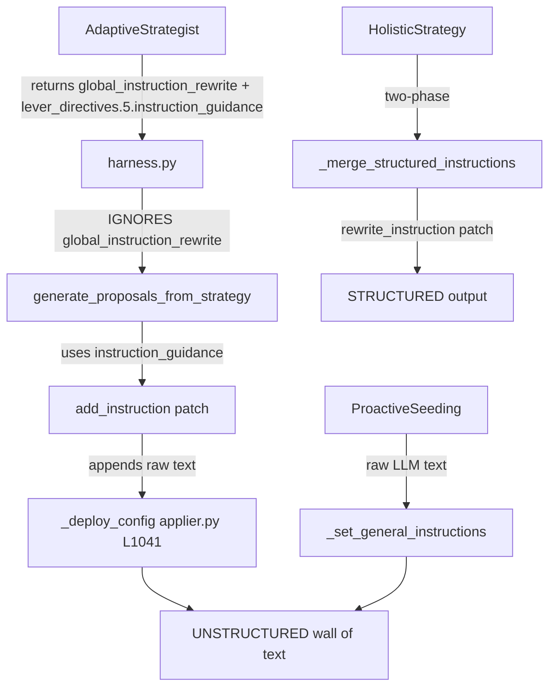

# Structured Instruction Enforcement

## Problem

There are multiple code paths that write Genie Space instructions, and only one of them uses the structured `_merge_structured_instructions()` merger. The primary adaptive strategist path bypasses it entirely, producing an unstructured wall of text via blind `add_instruction` appends.

## Key Code Paths




The fix normalizes all three paths through the structured merger.

## Changes

### 1. Add `normalize_instructions()` public wrapper in [optimizer.py](src/genie_space_optimizer/optimization/optimizer.py)

Create a thin public function that wraps `_merge_structured_instructions` for use from `applier.py`:

```python
def normalize_instructions(text: str) -> str:
    """Parse text into canonical structured sections and reassemble."""
    return _merge_structured_instructions(existing=text, contributions=[], global_guidance="")
```

This keeps the merge logic in one place and provides a clean import surface.

### 2. Wire the adaptive strategist's `global_instruction_rewrite` in [harness.py](src/genie_space_optimizer/optimization/harness.py)

After `_call_llm_for_adaptive_strategy` returns (line ~3511), extract `global_instruction_rewrite` from the strategy dict. If it's non-empty, replace the action group's `lever_directives["5"]["instruction_guidance"]` with it, so that `generate_proposals_from_strategy` uses the full structured rewrite instead of the short fragment.

At [harness.py line ~3512](src/genie_space_optimizer/optimization/harness.py) (after `strategy = _call_llm_for_adaptive_strategy(...)`):

```python
_global_rewrite = (strategy.get("global_instruction_rewrite") or "").strip()
if _global_rewrite and ag is not None:
    ld = ag.setdefault("lever_directives", {})
    l5 = ld.setdefault("5", {})
    l5["instruction_guidance"] = _global_rewrite
    if "5" not in set(ld.keys()):
        ld["5"] = l5
```

### 3. Change Lever 5 proposal type from `add_instruction` to `rewrite_instruction` in [optimizer.py](src/genie_space_optimizer/optimization/optimizer.py)

In `generate_proposals_from_strategy` (line ~6277-6283), when Lever 5 has `instruction_guidance`:

- Change `patch_type` from `"add_instruction"` to `"rewrite_instruction"`
- Add `"old_value"` field with the current instructions from `metadata_snapshot`
- The `proposed_value` should be the merged result of existing instructions + the new guidance, produced by calling `_merge_structured_instructions(existing=current_instructions, contributions=[instruction_guidance])`

This ensures the proposal already contains the fully structured text.

### 4. Add normalizer safety net in [applier.py](src/genie_space_optimizer/optimization/applier.py) `_deploy_config`

For all instruction operations (`add`, `update`, `rewrite` at lines 1037-1063), after the text is assembled but before `_set_general_instructions` is called, run the result through `normalize_instructions()`:

```python
from genie_space_optimizer.optimization.optimizer import normalize_instructions

if section == "instructions":
    if op == "add":
        text = cmd.get("new_text", "")
        if text:
            current = _get_general_instructions(config)
            merged = normalize_instructions((current + "\n" + text).strip())
            _set_general_instructions(config, merged)
        return True
    if op == "update":
        current = _get_general_instructions(config)
        old_text = cmd.get("old_text", "")
        new_text = cmd.get("new_text", "")
        if old_text and old_text not in current:
            return False
        replaced = current.replace(old_text, new_text, 1) if old_text else current + "\n" + new_text
        _set_general_instructions(config, normalize_instructions(replaced.strip()))
        return True
    if op == "remove":
        # ... existing logic ...
        _set_general_instructions(config, normalize_instructions(current.replace(old_text, "").strip()))
        return True
    if op == "rewrite":
        text = cmd.get("new_text", "")
        _set_general_instructions(config, normalize_instructions(text))
        return True
```

This is the **safety net** — no matter which path writes instructions, the output is always normalized into canonical section format.

### 5. Update `PROACTIVE_INSTRUCTION_PROMPT` in [config.py](src/genie_space_optimizer/common/config.py) (line 682-725)

The proactive seeding prompt currently uses numbered categories ("1. ASSET ROUTING", "2. TEMPORAL CONVENTIONS") that don't match the canonical section names. Update it to use the canonical ALL-CAPS section headers from `INSTRUCTION_SECTION_ORDER`:

- Replace the numbered list with explicit section header examples:

```
  Write plain-text instructions using ALL-CAPS SECTION HEADERS with a colon.
  Use these canonical sections (omit empty ones):

  PURPOSE:
  - What this space does and who it serves (1 paragraph)

  ASSET ROUTING:
  - Which table(s) to use for which topic/entity

  TEMPORAL FILTERS:
  - Default date filters, fiscal year logic, time-range rules

  DATA QUALITY NOTES:
  - NULL handling, is_current flags, data caveats

  JOIN GUIDANCE:
  - Key join patterns if join specs exist
  

```

- Keep the existing character budget (500-1500 chars)

### 6. Normalize proactive seeding output in [optimizer.py](src/genie_space_optimizer/optimization/optimizer.py) `_generate_proactive_instructions` (line 1596-1604)

After the LLM returns its text, run it through `normalize_instructions()` before returning:

```python
text = normalize_instructions(text)
```

This ensures even the initial seed is properly structured.

### 7. Unit tests

Add tests in a new test file or extend existing test files:

- **Test `normalize_instructions` idempotency**: Calling it twice on the same text produces the same output.
- **Test unstructured text gets sectioned**: Raw paragraphs without headers land in appropriate sections (PURPOSE for preamble, CONSTRAINTS for catch-all).
- **Test `add` operation normalizes**: Simulating an `add_instruction` through `_deploy_config` produces structured output.
- **Test `rewrite` operation normalizes**: Simulating a `rewrite_instruction` through `_deploy_config` produces structured output.
- **Test Lever 5 proposal uses `rewrite_instruction`**: Verify `generate_proposals_from_strategy` emits `rewrite_instruction` with merged text when `instruction_guidance` is present.

## Files Changed

- `[src/genie_space_optimizer/optimization/optimizer.py](src/genie_space_optimizer/optimization/optimizer.py)` -- add `normalize_instructions()`, update Lever 5 proposal generation
- `[src/genie_space_optimizer/optimization/harness.py](src/genie_space_optimizer/optimization/harness.py)` -- wire `global_instruction_rewrite` into Lever 5 directives
- `[src/genie_space_optimizer/optimization/applier.py](src/genie_space_optimizer/optimization/applier.py)` -- normalize all instruction write ops
- `[src/genie_space_optimizer/common/config.py](src/genie_space_optimizer/common/config.py)` -- update `PROACTIVE_INSTRUCTION_PROMPT`
- `tests/unit/test_structured_instructions.py` -- new unit tests

