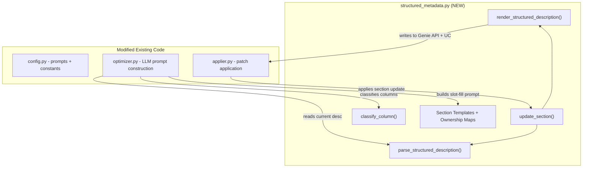

# Structured Metadata Schema for Genie Space Descriptions

## Problem

Descriptions across tables, columns, metric views, and functions are free-form text. When Lever 2 generates a fix for an aggregation issue, it can produce a global `add_instruction` patch that stomps on Lever 1's column semantics, causing regressions. There is no contract about what content lives where, so changes have an unpredictable blast radius. Additionally, column synonyms (e.g., `"synonyms": ["store id", "location number"]` in column_configs) are not consistently managed alongside description updates in Lever 1 and 2.

## Solution

Introduce structured `**Section:** value` markdown descriptions where each lever owns specific sections. The system becomes a form-filler (slot-filling) instead of a free-text generator. A new `structured_metadata.py` module will provide parse/render/update utilities consumed by the existing optimizer and applier.

## Architecture




## New File: `src/genie_space_optimizer/optimization/structured_metadata.py`

This is the only new file. It contains:

### 1. Section Templates and Ownership Constants

```python
TABLE_DESCRIPTION_SECTIONS = ["purpose", "best_for", "grain", "scd", "relationships"]
COLUMN_DIMENSION_SECTIONS = ["definition", "values", "synonyms"]
COLUMN_MEASURE_SECTIONS = ["definition", "aggregation", "grain_note", "synonyms"]
COLUMN_KEY_SECTIONS = ["definition", "join", "synonyms"]
FUNCTION_SECTIONS = ["purpose", "best_for", "use_instead_of", "parameters", "example"]
MV_TABLE_SECTIONS = ["purpose", "best_for", "grain", "important_filters"]

SECTION_LABELS = {
    "purpose": "Purpose", "best_for": "Best for", "grain": "Grain",
    "scd": "SCD", "relationships": "Relationships", "definition": "Definition",
    "values": "Values", "aggregation": "Aggregation", "grain_note": "Grain note",
    "join": "Join", "synonyms": "Synonyms", "use_instead_of": "Use instead of",
    "parameters": "Parameters", "example": "Example",
    "important_filters": "Important filters",
}

LEVER_SECTION_OWNERSHIP = {
    1: {"purpose", "best_for", "grain", "scd", "definition", "values", "synonyms"},
    2: {"aggregation", "grain_note", "important_filters", "synonyms"},
    3: {"purpose", "best_for", "use_instead_of", "parameters", "example"},
    4: {"relationships", "join"},
    5: set(),
}
```

Note: `synonyms` is owned by both Lever 1 and Lever 2, since Lever 1 handles naming/aliasing and Lever 2 handles metric view synonyms.

### 2. Parser

```python
def parse_structured_description(text: str) -> dict[str, str]:
    """Parse '**Section:** value' pairs from a description string.
    Returns {"purpose": "...", "definition": "...", ...}.
    Unrecognized text goes into "_preamble".
    """
```

- Handles both structured and legacy free-text (legacy text -> `_preamble`)
- Idempotent: parsing a structured description returns the same sections
- Joins `list[str]` input (Genie API format) into a single string before parsing

### 3. Renderer

```python
def render_structured_description(
    sections: dict[str, str],
    entity_type: str,  # "table" | "column_dim" | "column_measure" | "column_key" | "function" | "mv_table"
) -> list[str]:
    """Render sections into Genie API description format (list of strings)."""
```

- Outputs `["**Purpose:** ...", "**Aggregation:** ..."]` as a list of strings (matching the Genie API `description` field)
- Preserves `_preamble` at the top if present

### 4. Updater

```python
def update_section(
    current_description: str | list[str],
    section: str,
    new_value: str,
    lever: int,
    entity_type: str,
) -> list[str]:
    """Update one section, validating lever ownership. Returns new description list."""
```

- Validates lever owns the section via `LEVER_SECTION_OWNERSHIP`
- Parses current text, replaces one section, re-renders

### 5. Column Classifier

```python
def classify_column(
    col_name: str, data_type: str, *, is_in_metric_view: bool = False,
    enable_entity_matching: bool = False,
) -> str:
    """Returns 'dimension', 'measure', or 'key'."""
```

- Uses existing heuristics from `applier.py` (`_is_measure_column`) plus UC `data_type`
- `_key` / `_id` suffix -> key; numeric + aggregation pattern -> measure; else dimension

### 6. Synonyms Helper

```python
def extract_synonyms_section(sections: dict[str, str]) -> list[str]:
    """Parse the 'synonyms' section into a list of terms."""

def format_synonyms_section(synonyms: list[str]) -> str:
    """Format a list of synonyms into the structured section value."""
```

- The `**Synonyms:**` section stores terms as a comma-separated string: `"store id, location number"`
- These functions bridge between the section format and the Genie API `synonyms: list[str]` field
- On render, the synonyms section is informational in the description; actual synonyms are *also* written to the `column_configs[].synonyms` array field

## Modified Files

### [config.py](src/genie_space_optimizer/common/config.py) -- Prompt Changes

`**LEVER_1_2_COLUMN_PROMPT`** (lines 326-365): Rewrite to slot-filling format.

- Current: "Fix column descriptions and synonyms" -> returns `{"changes": [{"description": [...], "synonyms": [...]}]}`
- New: Provide current structured description per blamed column, ask LLM to fill specific sections:
  - For Lever 1: fill `Definition`, `Values`, `Synonyms` sections
  - For Lever 2: fill `Aggregation`, `Grain note`, `Synonyms` sections
- Response schema becomes: `{"changes": [{"table": "...", "column": "...", "sections": {"definition": "...", "synonyms": "store id, location number"}, "new_synonyms": ["store id", "location number"]}], "rationale": "..."}`
- The `new_synonyms` field is the explicit synonym list for the Genie API `synonyms` array, extracted alongside the structured description section

`**PROPOSAL_GENERATION_PROMPT`** (lines 298-324): Minimal changes -- add instruction to use structured sections when the target is a description.

`**_LEVER_TO_PATCH_TYPE`** (lines 954-977): Add missing entries for `"other"` failure types per lever, removing the fallback to `add_instruction`:

```python
("other", 1): "update_column_description",
("other", 2): "update_column_description",
("other", 3): "update_description",
```

### [optimizer.py](src/genie_space_optimizer/optimization/optimizer.py) -- Proposal Generation Changes

`**_call_llm_for_proposal**` (~line 1534):

- Import and use `parse_structured_description`, `classify_column`, `LEVER_SECTION_OWNERSHIP`
- For Levers 1 and 2: build `format_kwargs["current_structured_descriptions"]` by parsing existing descriptions of blamed columns into structured sections and presenting them as a fill-in-the-blank prompt
- For Lever 3: similarly present function description sections

`**generate_metadata_proposals**` response parsing (~line 2754):

- Parse LLM response `sections` dict instead of raw `description` list
- Extract `new_synonyms` from the response alongside section data
- Set `column_description` to the rendered structured description
- Set `column_synonyms` to the `new_synonyms` list

`**_format_full_schema_context**`: Enhance to show current structured sections per column (so the LLM has full context of what's already defined).

### [applier.py](src/genie_space_optimizer/optimization/applier.py) -- Patch Application Changes

`**_apply_action_to_config**` (column_configs section, ~line 724):

- For `update_column_description`: use `update_section()` instead of raw string replacement when the description is structured
- For `add_column_description`: use `render_structured_description()` to create properly formatted initial descriptions
- Synonyms flow remains the same (separate `add_column_synonym` / `remove_column_synonym` patches), but now the description also contains a `**Synonyms:**` section for documentation purposes

`**_apply_action_to_uc**` (~line 1156):

- UC column comment `ALTER TABLE ... ALTER COLUMN ... COMMENT` gets the same structured markdown string
- No change to the mechanism, just the content is now structured

`**proposals_to_patches**` (~line 466):

- No structural change -- already emits separate `update_column_description` + `add_column_synonym` patches
- The `new_text` in `update_column_description` will now be a structured markdown string instead of free-form text

### [harness.py](src/genie_space_optimizer/optimization/harness.py) -- Minor Changes

- Import `classify_column` to pass column type info to the optimizer
- Pass `uc_columns` (already available from preflight) into `generate_metadata_proposals` so the optimizer can classify columns

## Data Flow for a Lever 2 Patch (Example)

```mermaid
sequenceDiagram
    participant Eval as Evaluation
    participant Opt as Optimizer
    participant SM as structured_metadata
    participant App as Applier
    participant API as Genie API

    Eval->>Opt: completion_rate wrong aggregation
    Opt->>SM: parse_structured_description(current_desc)
    SM-->>Opt: {"definition": "Payment completion rate", "aggregation": ""}
    Opt->>SM: classify_column("completion_rate", "DOUBLE")
    SM-->>Opt: "measure"
    Note over Opt: Build slot-fill prompt:<br/>"Fill Aggregation section ONLY"
    Opt->>Opt: LLM returns {"sections": {"aggregation": "Use AVG()..."}}
    Opt->>SM: update_section(desc, "aggregation", "Use AVG()...", lever=2)
    SM-->>Opt: ["**Definition:** ...", "**Aggregation:** Use AVG()..."]
    Opt->>App: patch(update_column_description, new_text=rendered)
    App->>API: PATCH column_configs[].description
    App->>API: ALTER COLUMN ... COMMENT (same structured text)
```


## Synonyms Integration (Lever 1 and Lever 2)

The user's highlighted example shows a column config:

```json
{"column_name": "store_number", "description": ["Store business key..."], "synonyms": ["inventory records"]}
```

Synonyms are handled at two levels in the new system:

1. **Description section** (`**Synonyms:** store id, location number`): Informational, helps the LLM understand the full picture when doing slot-filling
2. **Genie API `synonyms` array**: The actual functional field that Genie uses for entity matching

When the LLM proposes synonym changes, the response includes both:

- `"sections": {"synonyms": "store id, location number"}` (for the description)
- `"new_synonyms": ["store id", "location number"]` (for the API array)

The applier emits two patches as it does today:

- `update_column_description` with the structured description (including synonyms section)
- `add_column_synonym` with the explicit synonym list

This ensures the Genie API `synonyms` array stays in sync with the description, and both Lever 1 (naming/aliasing) and Lever 2 (metric view synonyms) can propose synonyms in a coordinated way.

## Migration Strategy

- **No schema migration needed**: The `**Section:** value` format is backward-compatible -- it's just a string convention inside the existing `description: list[str]` field
- **Legacy descriptions**: The parser puts all unrecognized text into `_preamble`, which is preserved at the top when re-rendering. Over iterations, the system progressively structures descriptions as levers update them
- **Gradual adoption**: First iteration structures descriptions only when a lever actually proposes a change to a column. Untouched columns keep their current free-text descriptions

## Testing

- Unit tests in `tests/unit/test_structured_metadata.py` for:
  - `parse_structured_description` round-trip (structured -> parse -> render = same)
  - `parse_structured_description` on legacy free-text (goes to `_preamble`)
  - `update_section` validates lever ownership (Lever 2 cannot update `definition`)
  - `classify_column` heuristics
  - `extract_synonyms_section` / `format_synonyms_section` round-trip
  - Integration test: a Lever 2 aggregation update does not alter the `Definition` section

