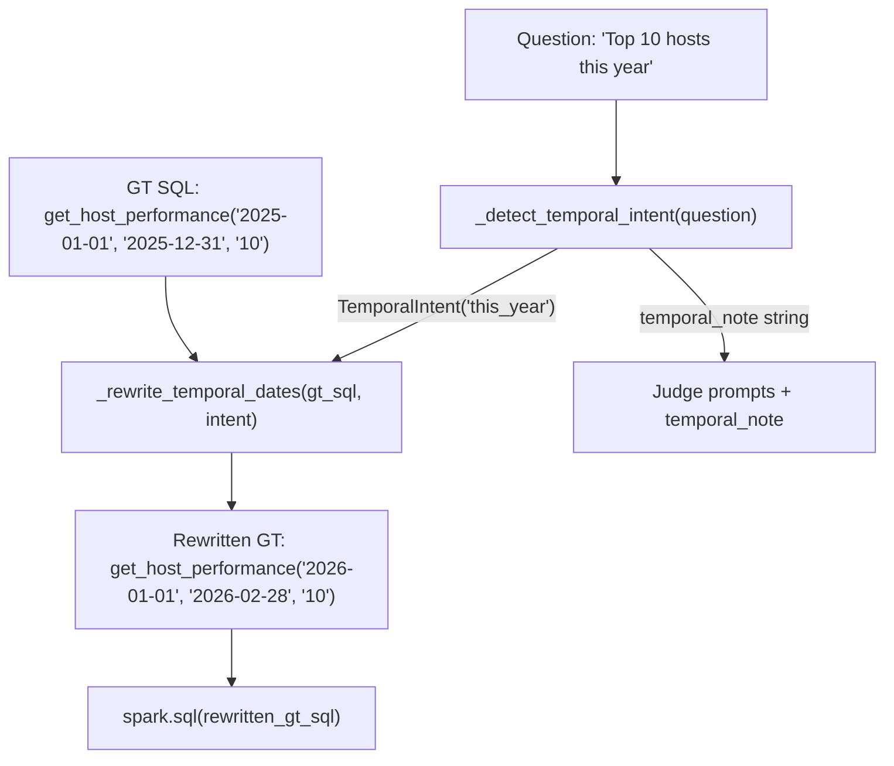

# Temporal Date Resolution for GT SQL and Judge Awareness

## Problem

Benchmark GT SQL uses hardcoded dates (e.g., `'2025-01-01'`) that become stale over time. When a question asks "Top 10 hosts by revenue **this year**" and it's now 2026, Genie correctly uses 2026 dates but gets penalized because the GT still uses 2025 dates.

## Architecture

The fix has two layers:




## Layer 1: Auto-rewrite GT SQL dates at evaluation time

### New function: `_detect_temporal_intent`

Add to [evaluation.py](src/genie_space_optimizer/optimization/evaluation.py) (after `_rewrite_measure_refs` around line 240).

- Input: `question: str`
- Output: `TemporalIntent | None` — a dataclass with `keyword`, `start_date`, `end_date` computed from `datetime.date.today()`
- Keyword map (regex-based):


| Pattern                | start_date                     | end_date              |
| ---------------------- | ------------------------------ | --------------------- |
| `this year`            | `DATE_TRUNC('year', today)`    | `today`               |
| `this month`           | `DATE_TRUNC('month', today)`   | `today`               |
| `this quarter`         | `DATE_TRUNC('quarter', today)` | `today`               |
| `last quarter`         | `start of prev quarter`        | `end of prev quarter` |
| `last (\d+) months`    | `today - N months`             | `today`               |
| `last (\d+) days`      | `today - N days`               | `today`               |
| `last year`            | `Jan 1 of last year`           | `Dec 31 of last year` |
| `YTD` / `year to date` | `DATE_TRUNC('year', today)`    | `today`               |


- Skip if the question contains an **explicit year** that matches the GT dates (e.g., "for 2025" with GT dates in 2025 is intentional, not stale).
- The `start_date` and `end_date` are Python `date` objects, formatted as `'YYYY-MM-DD'` strings for replacement.

### New function: `_rewrite_temporal_dates`

- Input: `gt_sql: str`, `intent: TemporalIntent`
- Output: rewritten `gt_sql: str`
- Logic:
  1. Find all date literals matching `'(\d{4}-\d{2}-\d{2})'` in the GT SQL
  2. If no date literals found, return unchanged (GT uses `CURRENT_DATE()` or has no dates)
  3. If date literals found, identify the **earliest** as start and **latest** as end
  4. Replace the earliest date with `intent.start_date` and latest with `intent.end_date`
  5. If only one date literal exists, replace it with `intent.start_date`
- Guard: only rewrite if the GT dates are in a **different year** than the intent dates (prevents rewriting when GT and question agree)

### Integration point

In `genie_predict_fn` at line ~885 of [evaluation.py](src/genie_space_optimizer/optimization/evaluation.py), after `resolve_sql` and `_rewrite_measure_refs`:

```python
gt_sql = resolve_sql(expected_sql, catalog, schema)
if _mv_measures and gt_sql:
    gt_sql = _rewrite_measure_refs(gt_sql, _mv_measures)
# NEW: temporal date resolution
temporal_intent = _detect_temporal_intent(question)
if temporal_intent and gt_sql:
    gt_sql = _rewrite_temporal_dates(gt_sql, temporal_intent)
```

Also add a `temporal_rewrite` key to the `comparison` dict so judges can see if rewriting happened.

## Layer 2: Temporal awareness in judge prompts

### Temporal note construction

In each scorer, after the `empty_data_note` construction, add a `temporal_note`:

```python
temporal_note = ""
if cmp.get("temporal_rewrite"):
    temporal_note = (
        "\nTEMPORAL CONTEXT: The question uses a relative time reference "
        f"('{cmp['temporal_rewrite']['keyword']}'). The GT SQL dates were "
        f"auto-adjusted from {cmp['temporal_rewrite']['original_dates']} to "
        f"{cmp['temporal_rewrite']['rewritten_dates']} to match the current date. "
        "If there are still minor date differences between GT and Genie, "
        "evaluate whether Genie's date interpretation is reasonable for the "
        "temporal reference in the question.\n"
    )
```

### Files to update

- [arbiter.py](src/genie_space_optimizer/optimization/scorers/arbiter.py) — Add `temporal_note` to line 186 prompt injection (after `{row_cap_note}{gt_empty_note}`)
- [schema_accuracy.py](src/genie_space_optimizer/optimization/scorers/schema_accuracy.py) — Add `{temporal_note}` alongside `{cmp_summary}{empty_data_note}` at line 89
- [logical_accuracy.py](src/genie_space_optimizer/optimization/scorers/logical_accuracy.py) — Same pattern at line 87
- [semantic_equivalence.py](src/genie_space_optimizer/optimization/scorers/semantic_equivalence.py) — Same pattern at line 88
- [completeness.py](src/genie_space_optimizer/optimization/scorers/completeness.py) — Same pattern

### Arbiter-specific temporal rule

Add to the arbiter's VERDICT RULES section:

```
"- TEMPORAL RELATIVITY: If the question uses relative time ('this year', 'last month'),\n"
"  the CURRENT DATE determines the correct window. If Genie uses dates matching the\n"
"  current temporal context while GT uses stale dates from a different period,\n"
"  Genie is correct.\n"
```

## Layer 3: Unit tests

Add to `tests/unit/test_evaluation.py`:

- `TestDetectTemporalIntent` — test each keyword pattern, explicit year skip, no-match cases
- `TestRewriteTemporalDates` — test date replacement, single date, no dates, same-year skip, `CURRENT_DATE()` passthrough
- `TestTemporalIntegration` — test the full flow (detect + rewrite) with real-world GT SQL examples like:
  - `get_host_performance('2025-01-01', '2025-12-31', '10')` with "this year" → rewritten to 2026 dates
  - `get_booking_trends('2025-01-01', '2025-12-31', 'monthly')` with "for 2025" → NOT rewritten (explicit year)

