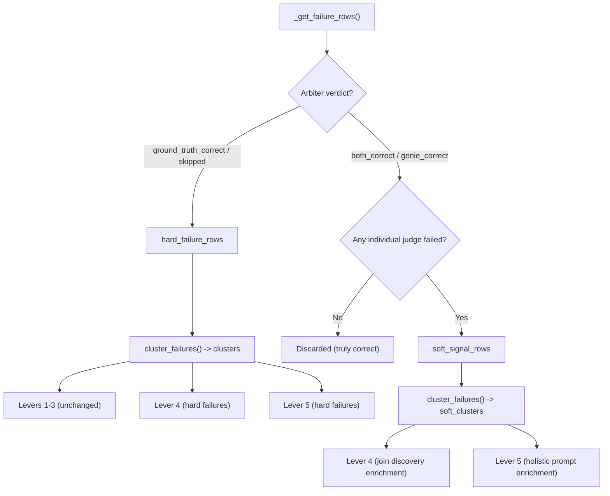

# Tiered Arbiter: Soft Signals from Correct Verdicts

## Problem

In [harness.py](src/genie_space_optimizer/optimization/harness.py) (lines 806-825), rows where the arbiter says `both_correct` or `genie_correct` are entirely excluded from `filtered_failure_rows`. This discards all individual judge feedback (schema_accuracy, logical_accuracy, completeness, etc.) even when those judges failed with rich ASI data. This signal loss prevents Lever 5 from learning about fragile-but-correct patterns and Lever 4 from discovering undocumented joins that Genie happened to infer.

## Design



Levers 1-3 see **only** hard failure rows (no behavior change). Levers 4 and 5 see hard failure clusters **plus** soft signal clusters, clearly labeled so the LLM can weight them appropriately.

## Changes

### 1. Extract soft signal rows in [harness.py](src/genie_space_optimizer/optimization/harness.py) (lines 806-842)

Modify the arbiter filter loop to produce **two** lists instead of one:

- `hard_failure_rows` -- arbiter is `ground_truth_correct` or `skipped` (current behavior)
- `soft_signal_rows` -- arbiter is `both_correct` or `genie_correct`, BUT **at least one individual judge value contains "no"** (i.e., has a failing sub-score)

The check for individual judge failures reuses the same column-scanning pattern from `cluster_failures` (lines 413-423 in [optimizer.py](src/genie_space_optimizer/optimization/optimizer.py)):

```python
def _has_individual_judge_failure(row: dict) -> bool:
    _NON_JUDGE_SUFFIXES = ("/rationale", "/source", "/metadata", "/error")
    for col, val in row.items():
        is_judge = False
        if col.startswith("feedback/") and col.endswith("/value"):
            is_judge = True
        elif col.startswith("feedback/") and not any(col.endswith(s) for s in _NON_JUDGE_SUFFIXES):
            if "/" not in col.removeprefix("feedback/"):
                is_judge = True
        elif col.endswith("/value") and not col.startswith("feedback/"):
            is_judge = True
        if is_judge and "no" in str(val).lower():
            return True
    return False
```

Rows where arbiter is `both_correct`/`genie_correct` but NO individual judge failed are truly correct and discarded (no change from current behavior for those).

### 2. Cluster soft signal rows separately in [harness.py](src/genie_space_optimizer/optimization/harness.py)

After the existing `cluster_failures(eval_result_for_clustering, metadata_snapshot)` call (line 843), add:

```python
soft_signal_clusters: list[dict] = []
if soft_signal_rows:
    soft_eval = {"rows": soft_signal_rows}
    soft_signal_clusters = cluster_failures(soft_eval, metadata_snapshot)
    for sc in soft_signal_clusters:
        sc["signal_type"] = "soft"  # tag for downstream use
```

Add diagnostic logging analogous to the existing failure analysis block, showing how many soft-signal rows were found and how many clusters they produced.

### 3. Pass soft signal clusters to Lever 4 in [harness.py](src/genie_space_optimizer/optimization/harness.py)

Before the `generate_metadata_proposals` call (line 684), when `lever == 4`, merge soft signal clusters into the clusters list:

```python
effective_clusters = clusters
if lever in (4, 5) and soft_signal_clusters:
    effective_clusters = clusters + soft_signal_clusters
```

Pass `effective_clusters` instead of `clusters` to `generate_metadata_proposals` for levers 4 and 5. This gives Lever 4's `discover_join_candidates` the extra join signal, and Lever 5's holistic path the full picture.

### 4. Label soft clusters in `_format_cluster_briefs` in [optimizer.py](src/genie_space_optimizer/optimization/optimizer.py) (lines 1211-1250)

In `_format_cluster_briefs`, check for the `signal_type` tag. Soft-signal clusters should be rendered under a separate header so the LLM knows they represent "correct-but-suboptimal" patterns rather than hard failures:

```python
hard = [c for c in clusters if c.get("signal_type") != "soft"]
soft = [c for c in clusters if c.get("signal_type") == "soft"]
# ... format hard clusters as today ...
if soft:
    lines.append("")
    lines.append("### Correct-but-Suboptimal Patterns (arbiter: correct, individual judges: failed)")
    lines.append("These queries returned correct results but used suboptimal approaches.")
    lines.append("Use these to inform best-practice guidance, NOT to fix failures.")
    # ... format soft clusters with same structure ...
```

### 5. Update `LEVER_5_HOLISTIC_PROMPT` in [config.py](src/genie_space_optimizer/common/config.py) (line 544)

Add a brief sentence to the "Failure Clusters from Evaluation" section header so the LLM understands the two-tier structure:

```
## Failure Clusters from Evaluation
The following clusters represent systematic issues found during benchmark evaluation.
Each cluster groups related failures by root cause and blamed objects.
Clusters tagged "Correct-but-Suboptimal" produced correct results but used fragile or
non-standard approaches -- use these for best-practice guidance in instructions.
{cluster_briefs}
```

### 6. Update `_format_eval_summary` in [optimizer.py](src/genie_space_optimizer/optimization/optimizer.py) (lines 1160-1186)

Add a line distinguishing hard vs soft clusters in the summary:

```python
hard_count = sum(1 for c in clusters if c.get("signal_type") != "soft")
soft_count = sum(1 for c in clusters if c.get("signal_type") == "soft")
lines.append(f"Hard failure clusters: {hard_count}, Soft signal clusters: {soft_count}")
```
