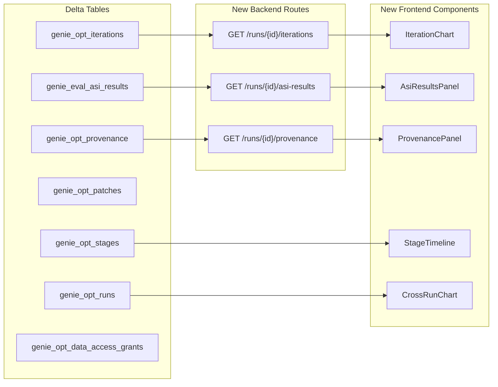

# Transparency Visualizations for Internal Framework Tables

## Current State

**Backend:** 5 of 7 tables are exposed via API routes. **Missing:** `genie_eval_asi_results` and `genie_opt_provenance` have no read helpers in `state.py` and no API routes.

**Frontend:** No chart library installed. Existing pages show runs, pipeline steps, lever detail, and comparison — but no charts, no judge-level drill-down, no provenance lineage, and no cross-run trends.

## Architecture




---

## Phase 1: Foundation — Backend Data Exposure

### 1a. Add read helpers to `state.py`

File: `[src/genie_space_optimizer/optimization/state.py](src/genie_space_optimizer/optimization/state.py)` (after line 916)

Add two new functions following the existing pattern (using `run_query` and `_fqn`):

- `**load_asi_results(spark, run_id, catalog, schema, *, iteration=None)**` — returns `pd.DataFrame` from `genie_eval_asi_results` filtered by `run_id` and optionally `iteration`, ordered by `question_id, judge`
- `**load_provenance(spark, run_id, catalog, schema, *, iteration=None, lever=None)**` — returns `pd.DataFrame` from `genie_opt_provenance` filtered by `run_id` and optionally `iteration`/`lever`, ordered by `iteration, lever, question_id`

### 1b. Add Pydantic models

File: `[src/genie_space_optimizer/backend/models.py](src/genie_space_optimizer/backend/models.py)`

New models:

```python
class AsiResult(SafeModel):
    questionId: str
    judge: str
    value: str
    failureType: str | None = None
    severity: str | None = None
    confidence: float | None = None
    blameSet: list[str] = []
    counterfactualFix: str | None = None
    wrongClause: str | None = None
    expectedValue: str | None = None
    actualValue: str | None = None

class AsiSummary(SafeModel):
    runId: str
    iteration: int
    totalResults: int
    passCount: int
    failCount: int
    failureTypeDistribution: dict[str, int]
    blameDistribution: dict[str, int]
    judgePassRates: dict[str, float]
    results: list[AsiResult]

class ProvenanceRecord(SafeModel):
    questionId: str
    signalType: str
    judge: str
    judgeVerdict: str
    resolvedRootCause: str
    resolutionMethod: str
    blameSet: list[str] = []
    counterfactualFix: str | None = None
    clusterId: str
    proposalId: str | None = None
    patchType: str | None = None
    gateType: str | None = None
    gateResult: str | None = None

class ProvenanceSummary(SafeModel):
    runId: str
    iteration: int
    lever: int
    totalRecords: int
    clusterCount: int
    proposalCount: int
    rootCauseDistribution: dict[str, int]
    gateResults: dict[str, int]
    records: list[ProvenanceRecord]

class IterationSummary(SafeModel):
    iteration: int
    lever: int | None = None
    evalScope: str
    overallAccuracy: float
    totalQuestions: int
    correctCount: int
    repeatabilityPct: float | None = None
    thresholdsMet: bool
    judgeScores: dict[str, float | None]
```

### 1c. Add new API routes

File: `[src/genie_space_optimizer/backend/routes/runs.py](src/genie_space_optimizer/backend/routes/runs.py)`

Three new endpoints:

- `**GET /runs/{run_id}/asi-results**` (`operation_id="getAsiResults"`, query param `iteration: int | None`)
  - Calls `load_asi_results` from state.py
  - Computes summary stats (failure type distribution, blame distribution, per-judge pass rates)
  - Returns `AsiSummary`
- `**GET /runs/{run_id}/provenance**` (`operation_id="getProvenance"`, query params `iteration: int | None`, `lever: int | None`)
  - Calls `load_provenance` from state.py
  - Computes summary (cluster count, proposal count, root cause distribution, gate results)
  - Returns `list[ProvenanceSummary]` (one per iteration+lever combo)
- `**GET /runs/{run_id}/iterations**` (`operation_id="getIterations"`)
  - Calls `load_iterations` from state.py (already loaded in `getRun` but not exposed as a clean array)
  - Returns `list[IterationSummary]`

---

## Phase 2: Chart Library Setup

### 2a. Add recharts via shadcn chart component

Use `apx components add chart --yes` to add the shadcn chart component (which wraps Recharts with shadcn theming and CSS variables for chart colors already defined in the project's CSS).

This gives us `<ChartContainer>`, `<ChartTooltip>`, `<ChartTooltipContent>`, `<ChartLegend>`, and `<ChartLegendContent>` — all themed to match the existing UI.

---

## Phase 3: Run Pipeline Page — Score Progression Chart

### 3a. New component: `IterationChart.tsx`

File: `src/genie_space_optimizer/ui/components/IterationChart.tsx`

A **line chart** using Recharts `<LineChart>` inside `<ChartContainer>`:

- X-axis: iteration number (0 = baseline, subsequent = after each lever)
- Y-axis: overall accuracy (%)
- Data source: new `useGetIterationsSuspense` hook from auto-generated client
- Annotations: lever name at each point, dashed line for threshold
- Colored regions: green above threshold, red below

### 3b. Integrate into run detail page

File: `[src/genie_space_optimizer/ui/routes/runs/$runId.tsx](src/genie_space_optimizer/ui/routes/runs/$runId.tsx)`

Add `<IterationChart>` below the score summary cards (line ~440), rendered only when run is in a terminal state and has iteration data. Wrapped in `<Suspense>` + `<ErrorBoundary>`.

---

## Phase 4: Run Pipeline Page — ASI Judge Dashboard

### 4a. New component: `AsiResultsPanel.tsx`

File: `src/genie_space_optimizer/ui/components/AsiResultsPanel.tsx`

A tabbed panel within the run detail page containing:

- **Summary cards**: Total questions evaluated, overall pass rate, fail count
- **Failure type bar chart**: Horizontal `<BarChart>` showing count per `failureType` (wrong_join, missing_filter, etc.)
- **Blame attribution bar chart**: Top blamed metadata fields from `blameSet`
- **Per-judge pass rate bar chart**: Pass rate % per judge name
- **Question-level table**: Expandable rows showing each question, its verdicts across judges, failure types, and counterfactual fixes — using existing shadcn `<Table>` + `<Collapsible>` patterns

Data fetched via `useGetAsiResultsSuspense({ params: { run_id }, query: { iteration } })`.

### 4b. Iteration selector

A dropdown/toggle to switch between baseline (iteration 0) and the best iteration, to compare which questions got fixed and which still fail.

### 4c. Integrate into run detail page

Add as a new expandable section or tab below the pipeline steps, visible only on terminal runs. Integrate into the Step 3 (Baseline Evaluation) card via `<StepInsights>` as a "View judge details" expandable.

---

## Phase 5: Run Pipeline Page — Provenance Lineage

### 5a. New component: `ProvenancePanel.tsx`

File: `src/genie_space_optimizer/ui/components/ProvenancePanel.tsx`

Per-lever provenance view (integrated into the lever expand in `LeverProgress.tsx`):

- **Flow summary**: `N failing questions` -> `M clusters` -> `K proposals` -> `J patches` -> `gate: pass/fail` — using a simple horizontal step indicator with numbers
- **Root cause distribution**: Small bar chart of `resolvedRootCause` values
- **Cluster detail table**: Grouped by `clusterId`, showing questions in each cluster, the proposed fix, and the patch type applied
- **Question trace**: Click any question to see its full chain: judge verdict -> root cause -> resolution method -> cluster -> proposal -> patch -> gate result

Data fetched via `useGetProvenanceSuspense({ params: { run_id }, query: { iteration, lever } })`.

### 5b. Integrate into LeverProgress

File: `[src/genie_space_optimizer/ui/components/LeverProgress.tsx](src/genie_space_optimizer/ui/components/LeverProgress.tsx)`

Add a "View provenance" expandable section inside each lever card (after the existing "Iteration history" section, around line 229). Only visible when the lever has provenance data (accepted or rolled_back status).

---

## Phase 6: Stage Timeline

### 6a. New component: `StageTimeline.tsx`

File: `src/genie_space_optimizer/ui/components/StageTimeline.tsx`

A horizontal **Gantt-style timeline** using Recharts `<BarChart>` with horizontal layout:

- Each bar = one stage, width proportional to `durationSeconds`
- Color by status (green = COMPLETE, red = FAILED, blue = STARTED, gray = SKIPPED)
- Hover tooltip shows `stage`, `status`, `startedAt`, `completedAt`, `errorMessage`
- No new API needed — data already in `stageEvents` from `PipelineStep.outputs`

### 6b. Integrate into run pipeline page

Add as an expandable section above the pipeline steps, or as a collapsible panel at the top of the page. Uses the existing `run.steps[*].outputs.stageEvents` data.

---

## Phase 7: Space Detail — Cross-Run Comparison

### 7a. New component: `CrossRunChart.tsx`

File: `src/genie_space_optimizer/ui/components/CrossRunChart.tsx`

A **bar chart** on the Space Detail page showing baseline vs. optimized scores across runs:

- X-axis: run date/ID
- Y-axis: accuracy %
- Two bars per run: baseline (gray) and optimized (blue)
- Data source: `optimizationHistory` already available from `getSpaceDetail` response

### 7b. Integrate into Space Detail

File: `[src/genie_space_optimizer/ui/routes/spaces/$spaceId.tsx](src/genie_space_optimizer/ui/routes/spaces/$spaceId.tsx)`

Add a new tab "Analytics" (or enhance "Optimization History" tab) with the chart above the existing history table.

---

## File Change Summary


| File                                                          | Change Type | Description                                              |
| ------------------------------------------------------------- | ----------- | -------------------------------------------------------- |
| `src/genie_space_optimizer/optimization/state.py`             | Modify      | Add `load_asi_results()`, `load_provenance()`            |
| `src/genie_space_optimizer/backend/models.py`                 | Modify      | Add ASI, Provenance, Iteration models                    |
| `src/genie_space_optimizer/backend/routes/runs.py`            | Modify      | Add 3 new API routes                                     |
| `src/genie_space_optimizer/ui/components/IterationChart.tsx`  | Create      | Score progression line chart                             |
| `src/genie_space_optimizer/ui/components/AsiResultsPanel.tsx` | Create      | Judge feedback dashboard                                 |
| `src/genie_space_optimizer/ui/components/ProvenancePanel.tsx` | Create      | Provenance lineage view                                  |
| `src/genie_space_optimizer/ui/components/StageTimeline.tsx`   | Create      | Gantt-style stage timeline                               |
| `src/genie_space_optimizer/ui/components/CrossRunChart.tsx`   | Create      | Cross-run comparison chart                               |
| `src/genie_space_optimizer/ui/routes/runs/$runId.tsx`         | Modify      | Integrate IterationChart, AsiResultsPanel, StageTimeline |
| `src/genie_space_optimizer/ui/components/LeverProgress.tsx`   | Modify      | Integrate ProvenancePanel per lever                      |
| `src/genie_space_optimizer/ui/routes/spaces/$spaceId.tsx`     | Modify      | Add CrossRunChart to analytics tab                       |
| `src/genie_space_optimizer/ui/lib/api.ts`                     | Auto-regen  | New hooks auto-generated from OpenAPI                    |


