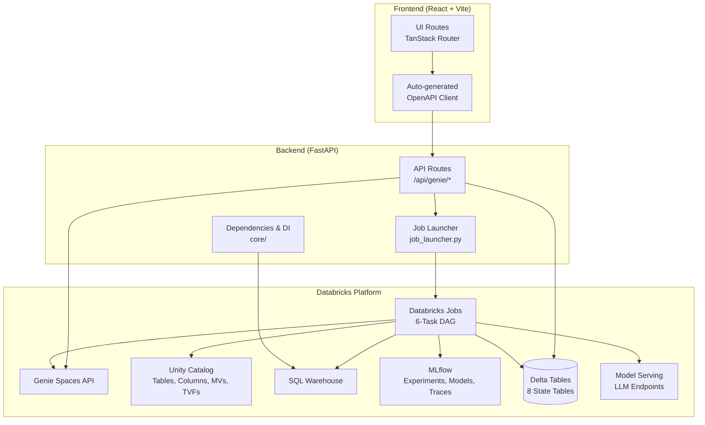
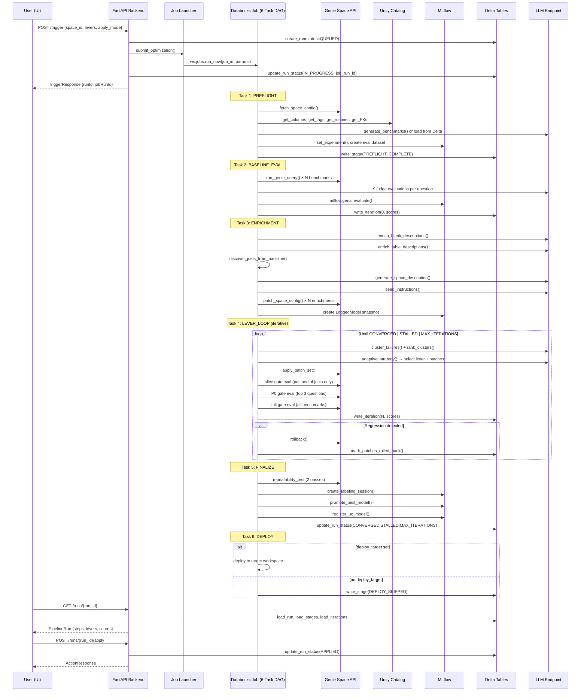
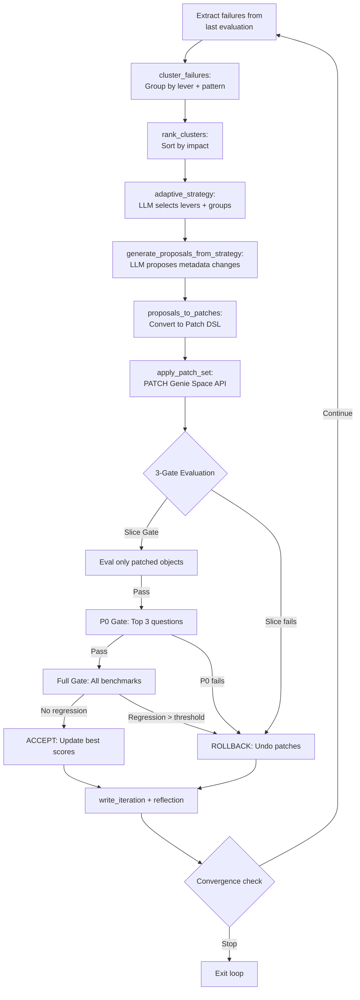
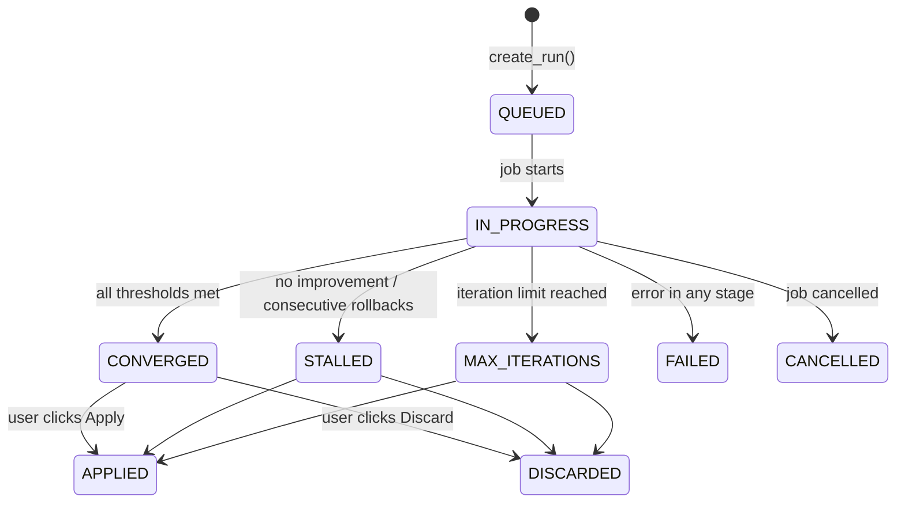

# Genie Space Optimizer — Architecture Deep Dive

## 1. Executive Summary

Genie Space Optimizer is a full-stack Databricks application that **automatically improves the quality of Databricks Genie Spaces** — the natural-language-to-SQL interface for business users. It works by running a closed-loop optimization pipeline: generating benchmark questions, evaluating Genie's SQL generation accuracy against those benchmarks using 9 specialized LLM-based judges, diagnosing failures, proposing targeted metadata changes (table/column descriptions, synonyms, join specifications, instructions, metric view annotations), applying those changes to the Genie Space configuration, and re-evaluating until quality thresholds are met or no further improvement is possible. The system tracks every change with full provenance, supports rollback, and records the entire optimization history in Delta tables for transparency and auditability.

---

## 2. System Architecture



### Component Responsibilities

| Component | Path | Role |
|-----------|------|------|
| **Frontend** | `src/genie_space_optimizer/ui/` | React SPA with TanStack Router, shadcn/ui components |
| **Backend API** | `src/genie_space_optimizer/backend/` | FastAPI server, route handlers, DI via `Dependencies` |
| **Job Launcher** | `backend/job_launcher.py` | Submits optimization jobs via `ws.jobs.run_now()` |
| **Job Notebooks** | `src/genie_space_optimizer/jobs/` | 6 DAG task notebooks (thin wrappers around harness) |
| **Optimization Engine** | `src/genie_space_optimizer/optimization/` | Core logic: harness, optimizer, evaluation, scorers |
| **State Machine** | `optimization/state.py` | Delta-backed persistence for runs, stages, iterations, patches |
| **Common** | `src/genie_space_optimizer/common/` | Config, Genie client, UC metadata, Delta helpers |

---

## 3. Data Models

### 3.1 API Request/Response Models (`backend/models.py`)

#### Trigger & Run Status

| Model | Layer | Fields |
|-------|-------|--------|
| `TriggerRequest` | API Input | `space_id: str`, `apply_mode: str = "genie_config"`, `levers: list[int] \| None`, `deploy_target: str \| None` |
| `TriggerResponse` | API Output | `runId`, `jobRunId`, `jobUrl`, `status` |
| `RunStatusResponse` | API Output | `runId`, `status`, `spaceId`, `startedAt`, `completedAt`, `baselineScore`, `optimizedScore`, `convergenceReason` |

#### Pipeline Run

| Model | Layer | Fields |
|-------|-------|--------|
| `PipelineRun` | API Output | `runId`, `spaceId`, `spaceName`, `status`, `startedAt`, `completedAt`, `initiatedBy`, `baselineScore`, `optimizedScore`, `steps: list[PipelineStep]`, `levers: list[LeverStatus]`, `convergenceReason`, `links`, `deploymentJobStatus`, `deploymentJobUrl` |
| `PipelineStep` | API Output | `stepNumber`, `name`, `status`, `durationSeconds`, `summary`, `inputs`, `outputs` |
| `LeverStatus` | API Output | `lever`, `name`, `status`, `patchCount`, `scoreBefore`, `scoreAfter`, `scoreDelta`, `rollbackReason`, `patches`, `iterations` |

#### Comparison & Actions

| Model | Layer | Fields |
|-------|-------|--------|
| `ComparisonData` | API Output | `runId`, `spaceId`, `baselineScore`, `optimizedScore`, `improvementPct`, `perDimensionScores`, `original: SpaceConfiguration`, `optimized: SpaceConfiguration` |
| `ActionResponse` | API Output | `status`, `runId`, `message` |
| `SpaceConfiguration` | Nested | `instructions`, `sampleQuestions`, `tableDescriptions` |

#### Space Models

| Model | Layer | Fields |
|-------|-------|--------|
| `SpaceSummary` | API Output | `id`, `name`, `description`, `tableCount`, `lastModified`, `qualityScore`, `accessLevel` |
| `SpaceListResponse` | API Output | `spaces: list[SpaceSummary]`, `totalCount`, `scopedToUser` |
| `SpaceDetail` | API Output | `id`, `name`, `description`, `instructions`, `sampleQuestions`, `benchmarkQuestions`, `tables`, `joins`, `functions`, `optimizationHistory`, `hasActiveRun` |

#### Transparency Models

| Model | Layer | Fields |
|-------|-------|--------|
| `AsiResult` | API Output | `questionId`, `judge`, `value`, `failureType`, `severity`, `confidence`, `blameSet`, `counterfactualFix`, `wrongClause` |
| `ProvenanceRecord` | API Output | `questionId`, `signalType`, `judge`, `judgeVerdict`, `resolvedRootCause`, `resolutionMethod`, `blameSet`, `clusterId`, `proposalId`, `patchType`, `gateType`, `gateResult` |
| `IterationDetail` | API Output | `iteration`, `agId`, `status`, `overallAccuracy`, `judgeScores`, `gates`, `patches`, `reflection`, `questions`, `clusterInfo` |
| `SuggestionOut` | API Output | `suggestionId`, `runId`, `spaceId`, `suggestionType`, `title`, `rationale`, `definition`, `affectedQuestions`, `status` |

#### Settings & Health

| Model | Layer | Fields |
|-------|-------|--------|
| `PermissionDashboard` | API Output | `spaces: list[SpacePermissions]`, `spPrincipalId`, `frameworkCatalog`, `frameworkSchema`, `jobUrl` |
| `HealthStatus` | API Output | `healthy`, `catalogExists`, `schemaExists`, `tablesReady`, `tablesAccessible`, `volumeReady`, `jobHealthy`, `catalog`, `schema_` |

### 3.2 Delta State Tables (`optimization/state.py`)

All tables are created under `{catalog}.{schema}` with Delta format, auto-optimize, and auto-compaction.

#### `genie_opt_runs` — One row per optimization attempt

| Column | Type | Description |
|--------|------|-------------|
| `run_id` | STRING PK | UUID for this optimization run |
| `space_id` | STRING | Genie Space ID (partition key) |
| `domain` | STRING | Domain name (e.g., `revenue_property`) |
| `catalog` | STRING | Unity Catalog name |
| `uc_schema` | STRING | `catalog.schema` format |
| `status` | STRING | `QUEUED\|IN_PROGRESS\|CONVERGED\|STALLED\|MAX_ITERATIONS\|FAILED\|CANCELLED\|APPLIED\|DISCARDED` |
| `started_at` | TIMESTAMP | Run creation time |
| `completed_at` | TIMESTAMP | Terminal state time |
| `job_run_id` | STRING | Databricks Job run ID |
| `job_id` | STRING | Databricks Job definition ID |
| `max_iterations` | INT | Maximum lever iterations allowed |
| `levers` | STRING | JSON array of lever numbers, e.g., `[1,2,3,4,5]` |
| `apply_mode` | STRING | `genie_config\|uc_artifact\|both` |
| `deploy_target` | STRING | DABs target for post-optimization deploy |
| `best_iteration` | INT | Iteration with highest accuracy |
| `best_accuracy` | DOUBLE | Best overall accuracy (0–100) |
| `best_repeatability` | DOUBLE | Best repeatability percentage |
| `best_model_id` | STRING | MLflow LoggedModel ID for best iteration |
| `convergence_reason` | STRING | `threshold_met\|plateau\|max_iterations\|error` |
| `experiment_name` | STRING | MLflow experiment path |
| `config_snapshot` | STRING | JSON: Genie Space config at run start |
| `triggered_by` | STRING | User email |
| `labeling_session_name` | STRING | MLflow labeling session name |
| `labeling_session_url` | STRING | URL to Review App |

#### `genie_opt_stages` — Timeline of stage transitions

| Column | Type | Description |
|--------|------|-------------|
| `run_id` | STRING FK | Partition key |
| `task_key` | STRING | Databricks Job task key |
| `stage` | STRING | e.g., `PREFLIGHT_STARTED`, `LEVER_2_EVAL_DONE` |
| `status` | STRING | `STARTED\|COMPLETE\|FAILED\|SKIPPED\|ROLLED_BACK` |
| `started_at` | TIMESTAMP | Stage start |
| `completed_at` | TIMESTAMP | Stage end |
| `duration_seconds` | DOUBLE | Wall-clock duration |
| `lever` | INT | Lever number (1–5), null for non-lever stages |
| `iteration` | INT | Eval iteration if applicable |
| `detail_json` | STRING | JSON stage-specific payload |
| `error_message` | STRING | Error detail if `FAILED` |

#### `genie_opt_iterations` — Evaluation results per pass

| Column | Type | Description |
|--------|------|-------------|
| `run_id` | STRING FK | Partition key |
| `iteration` | INT | 0 = baseline |
| `lever` | INT | Which lever was applied before this eval |
| `eval_scope` | STRING | `full\|slice\|p0\|held_out` |
| `overall_accuracy` | DOUBLE | 0–100 percentage |
| `total_questions` | INT | Benchmark count |
| `correct_count` | INT | Questions passing all judges |
| `scores_json` | STRING | Per-judge scores |
| `failures_json` | STRING | Failed question IDs |
| `arbiter_actions_json` | STRING | Arbiter verdicts |
| `thresholds_met` | BOOLEAN | All quality thresholds passed |
| `rows_json` | STRING | Per-question eval detail |
| `reflection_json` | STRING | Adaptive loop reflection entry |
| `model_id` | STRING | LoggedModel ID |

#### `genie_opt_patches` — Audit trail of every metadata change

| Column | Type | Description |
|--------|------|-------------|
| `run_id` | STRING FK | Partition key |
| `iteration` | INT | When applied |
| `lever` | INT | Which lever |
| `patch_type` | STRING | `add_description\|update_column_description\|add_join_spec\|...` |
| `scope` | STRING | `genie_config\|uc_artifact\|both` |
| `risk_level` | STRING | `low\|medium\|high` |
| `target_object` | STRING | Table or column being modified |
| `patch_json` | STRING | Full patch definition |
| `rollback_json` | STRING | Undo command |
| `rolled_back` | BOOLEAN | True if subsequently undone |
| `provenance_json` | STRING | Judge verdict → patch chain |

#### `genie_eval_asi_results` — Actionable Side Information from judges

Per-question, per-judge feedback with `failure_type`, `severity`, `blame_set`, `counterfactual_fix`, `wrong_clause`.

#### `genie_opt_provenance` — End-to-end provenance chain

Links every patch to originating judge verdicts and gate outcomes. Columns include `question_id`, `judge`, `resolved_root_cause`, `resolution_method`, `cluster_id`, `proposal_id`, `gate_type`, `gate_result`.

#### `genie_opt_suggestions` — Strategist improvement proposals

METRIC_VIEW and FUNCTION suggestions for human review. Columns: `suggestion_id`, `type`, `title`, `rationale`, `definition`, `affected_questions`, `status` (`PROPOSED\|ACCEPTED\|REJECTED\|IMPLEMENTED`).

#### `genie_opt_data_access_grants` — UC privilege tracking

Tracks grants applied by the app SP for accessing Genie space assets.

#### `genie_opt_queued_patches` — High-risk patches pending human review

Patches that require manual approval before application.

---

## 4. Configuration Reference

### 4.1 Environment Variables

| Variable | Default | Description |
|----------|---------|-------------|
| `GENIE_SPACE_OPTIMIZER_CATALOG` | — | Unity Catalog for state tables (set by bundle) |
| `GENIE_SPACE_OPTIMIZER_SCHEMA` | — | Schema for state tables (set by bundle) |
| `GENIE_SPACE_OPTIMIZER_WAREHOUSE_ID` | `""` | SQL Warehouse ID for profiling and execution |
| `GENIE_SPACE_OPTIMIZER_JOB_ID` | — | Bundle-managed runner job ID (auto-set) |
| `GENIE_SPACE_OPTIMIZER_PROPAGATION_WAIT` | `"30"` | Seconds to wait after Genie config PATCH |
| `GENIE_SPACE_OPTIMIZER_PROPAGATION_WAIT_ENTITY_MATCHING` | `"90"` | Seconds for entity matching propagation |
| `GENIE_SPACE_OPTIMIZER_EVAL_DEBUG` | `"true"` | Enable evaluation debug logging |
| `GENIE_SPACE_OPTIMIZER_EVAL_MAX_ATTEMPTS` | `"4"` | Retry attempts for evaluation |
| `GENIE_SPACE_OPTIMIZER_EVAL_RETRY_SLEEP_SECONDS` | `"10"` | Sleep between eval retries |
| `GENIE_SPACE_OPTIMIZER_EVAL_RETRY_WORKERS` | `"1"` | Workers on retry (single-worker fallback) |
| `GENIE_SPACE_OPTIMIZER_STRICT_PROMPT_REGISTRATION` | `"true"` | Strict prompt registration mode |
| `GENIE_SPACE_OPTIMIZER_FAIL_ON_INFRA_EVAL_ERRORS` | `"true"` | Abort on infra SQL errors during eval |
| `GENIE_SPACE_OPTIMIZER_FINALIZE_TIMEOUT_SECONDS` | `"6600"` | Soft timeout for finalize (~110 min) |
| `GENIE_SPACE_OPTIMIZER_FINALIZE_HEARTBEAT_SECONDS` | `"30"` | Heartbeat interval for finalize |

### 4.2 Quality Thresholds (`config.py`)

| Judge | Threshold |
|-------|-----------|
| `syntax_validity` | 98% |
| `schema_accuracy` | 95% |
| `logical_accuracy` | 90% |
| `semantic_equivalence` | 90% |
| `completeness` | 90% |
| `response_quality` | 0% (informational) |
| `result_correctness` | 85% |
| `asset_routing` | 95% |
| `REPEATABILITY_TARGET` | 90% |

### 4.3 Iteration & Convergence Constants

| Constant | Value | Description |
|----------|-------|-------------|
| `MAX_ITERATIONS` | 5 | Maximum lever loop iterations |
| `REGRESSION_THRESHOLD` | 5.0 | Max allowed accuracy regression (%) before rollback |
| `DIMINISHING_RETURNS_EPSILON` | 2.0 | Stop when improvement < this per iteration |
| `DIMINISHING_RETURNS_LOOKBACK` | 2 | Window of recent iterations to check |
| `CONSECUTIVE_ROLLBACK_LIMIT` | 2 | Stop after this many consecutive rollbacks |
| `PLATEAU_ITERATIONS` | 2 | Plateau detection window |
| `MAX_NOISE_FLOOR` | 5.0 | Maximum noise floor for score comparison |
| `SLICE_GATE_TOLERANCE` | 15.0 | Slice gate regression tolerance (%) |
| `GENIE_CORRECT_CONFIRMATION_THRESHOLD` | 2 | Min evals before auto-correcting benchmarks |
| `NEITHER_CORRECT_REPAIR_THRESHOLD` | 2 | Evals before LLM-assisted ground truth repair |
| `NEITHER_CORRECT_QUARANTINE_THRESHOLD` | 3 | Evals before quarantining a question |
| `REFLECTION_WINDOW_FULL` | 3 | Recent reflections shown in full detail |
| `TVF_REMOVAL_MIN_ITERATIONS` | 2 | Min failing iterations before TVF removal |

### 4.4 LLM Configuration

| Constant | Value |
|----------|-------|
| `LLM_ENDPOINT` | `databricks-claude-opus-4-6` |
| `LLM_TEMPERATURE` | 0 |
| `LLM_MAX_RETRIES` | 3 |

### 4.5 Benchmark Generation

| Constant | Value | Description |
|----------|-------|-------------|
| `TARGET_BENCHMARK_COUNT` | 20 | Target number of benchmarks |
| `MAX_BENCHMARK_COUNT` | 25 | Hard ceiling on benchmarks per eval |
| `MAX_PROFILE_TABLES` | 20 | Max tables to profile in preflight |
| `PROFILE_SAMPLE_SIZE` | 100 | Rows sampled per table |
| `LOW_CARDINALITY_THRESHOLD` | 20 | Distinct values below this get collected |

### 4.6 Databricks Bundle Variables (`databricks.yml`)

| Variable | Default | Description |
|----------|---------|-------------|
| `app_name` | `genie-space-optimizer` | Databricks App name |
| `catalog` | `main` | Unity Catalog for state |
| `gold_schema` | `genie_optimization` | Schema for state tables |
| `warehouse_id` | — | SQL Warehouse ID (required) |
| `deploy_profile` | `DEFAULT` | CLI profile |

---

## 5. API Reference

All routes are under `/api/genie` (prefix set in `core/`).

### 5.1 Trigger & Status

| Method | Path | `operation_id` | Request | Response | Description |
|--------|------|-----------------|---------|----------|-------------|
| POST | `/trigger` | `triggerOptimization` | `TriggerRequest` | `TriggerResponse` | Start optimization run for a space |
| GET | `/trigger/status/{run_id}` | `getTriggerStatus` | — | `RunStatusResponse` | Poll run status (lightweight) |
| GET | `/levers` | `listLevers` | — | `list[LeverInfo]` | List all optimization levers with descriptions |

### 5.2 Spaces

| Method | Path | `operation_id` | Request | Response | Description |
|--------|------|-----------------|---------|----------|-------------|
| GET | `/spaces` | `listSpaces` | — | `SpaceListResponse` | List visible Genie Spaces with quality scores |
| POST | `/spaces/check-access` | `checkSpaceAccess` | `CheckAccessRequest` | `list[AccessLevelEntry]` | Batch access check for space IDs |
| GET | `/spaces/{space_id}` | `getSpaceDetail` | — | `SpaceDetail` | Full space detail with config, history, benchmarks |

### 5.3 Runs

| Method | Path | `operation_id` | Request | Response | Description |
|--------|------|-----------------|---------|----------|-------------|
| GET | `/runs/{run_id}` | `getRun` | — | `PipelineRun` | Full pipeline run with steps, levers, links |
| GET | `/runs/{run_id}/comparison` | `getComparison` | — | `ComparisonData` | Baseline vs. optimized scores and config diff |
| POST | `/runs/{run_id}/apply` | `applyOptimization` | — | `ActionResponse` | Apply optimized config (updates status to APPLIED) |
| POST | `/runs/{run_id}/discard` | `discardOptimization` | — | `ActionResponse` | Rollback and discard (status → DISCARDED) |
| GET | `/runs/{run_id}/iterations` | `getIterations` | — | `list[IterationSummary]` | All evaluation iterations |
| GET | `/runs/{run_id}/asi-results` | `getAsiResults` | — | `AsiSummary` | Judge feedback details |
| GET | `/runs/{run_id}/provenance` | `getProvenance` | — | `list[ProvenanceSummary]` | Provenance chain per iteration/lever |
| GET | `/runs/{run_id}/iteration-detail` | `getIterationDetail` | — | `IterationDetailResponse` | Deep transparency drill-down |

### 5.4 Suggestions

| Method | Path | `operation_id` | Request | Response | Description |
|--------|------|-----------------|---------|----------|-------------|
| GET | `/runs/{run_id}/suggestions` | `getImprovementSuggestions` | — | `list[SuggestionOut]` | Strategist suggestions (MV, TVF) |
| POST | `/suggestions/{id}/review` | `reviewSuggestion` | `SuggestionReviewRequest` | `SuggestionOut` | Accept/reject a suggestion |
| POST | `/suggestions/{id}/apply` | `applySuggestion` | — | `SuggestionOut` | Execute accepted suggestion SQL |

### 5.5 Activity & Settings

| Method | Path | `operation_id` | Request | Response | Description |
|--------|------|-----------------|---------|----------|-------------|
| GET | `/activity` | `getActivity` | `space_id?`, `limit?` | `list[ActivityItem]` | Recent runs across workspace |
| GET | `/settings/permissions` | `getPermissionDashboard` | `space_id?`, `metadata_only?` | `PermissionDashboard` | Permission advisor |
| GET | `/pending-reviews/{space_id}` | `getPendingReviews` | — | `PendingReviewsOut` | Flagged questions and queued patches |

### 5.6 Health & Metadata

| Method | Path | `operation_id` | Response |
|--------|------|-----------------|----------|
| GET | `/version` | `getVersion` | `VersionOut` |
| GET | `/current-user` | `getCurrentUser` | `UserOut` |
| GET | `/health` | `getHealth` | `HealthStatus` |

---

## 6. Run Lifecycle

### 6.0 Complete Sequence Diagram



### 6a. Trigger

**User action:** On the Space Detail page, the user selects levers (checkboxes for levers 1–5), an apply mode ("Config Only" or "Config + UC Write Backs"), optionally a deploy target, and clicks "Start Optimization."

**Code path:**
1. Frontend calls `POST /api/genie/trigger` with `TriggerRequest` body
2. `trigger.py:triggerOptimization()` delegates to `spaces.py:do_start_optimization()`
3. `do_start_optimization()`:
   - Checks user has CAN_EDIT on the space
   - Checks SP has CAN_MANAGE on the space
   - Checks SP has UC access to referenced schemas
   - Generates `run_id = uuid4()`
   - Calls `state.create_run()` → inserts QUEUED row into `genie_opt_runs`
   - Calls `job_launcher.submit_optimization()` → `ws.jobs.run_now()` with idempotency token
   - Updates run to `IN_PROGRESS` with `job_run_id` and `job_id`
4. Returns `TriggerResponse` with `runId`, `jobRunId`, `jobUrl`

**Job submission parameters:** `run_id`, `space_id`, `domain`, `catalog`, `schema`, `apply_mode`, `levers`, `max_iterations`, `triggered_by`, `experiment_name`, `deploy_target`.

**Idempotency:** Token is `gso-{sha256(space_id|triggered_by|run_id)[:60]}`.

### 6b. Preflight (`run_preflight.py` → `harness._run_preflight()` → `preflight.run_preflight()`)

**Purpose:** Set up everything needed for evaluation before any changes are made.

**Sub-steps:**

1. **`preflight_fetch_config()`** — Fetches the current Genie Space configuration via the Genie API. Stores it as `config_snapshot` on the run row. Resolves tables, metric views, TVFs, join specs, and instructions from the parsed space object.

2. **`preflight_collect_uc_metadata()`** — Collects UC metadata for all referenced tables:
   - Column names, types, descriptions via REST API (`get_columns_for_tables_rest`)
   - Table/column tags via `get_tags_for_tables_rest`
   - Routines (TVFs, UDFs) via `get_routines_for_schemas_rest`
   - Foreign key constraints via `get_foreign_keys_for_tables_rest`
   - **Data profile**: `TABLESAMPLE` of each table, `COUNT(DISTINCT col)` for cardinality, `MIN`/`MAX` for numerics, `COLLECT_SET` for low-cardinality columns (< 20 distinct values)
   - Join overlap analysis via FK/PK sampled joins

3. **`preflight_generate_benchmarks()`** — Loads benchmarks from `{uc_schema}.genie_benchmarks_{domain}` Delta table. If no benchmarks exist or too few are valid, generates synthetic benchmarks via LLM using `BENCHMARK_GENERATION_PROMPT` (grounded in actual schema, data profile, and column allowlist). Also generates coverage-gap benchmarks for uncovered assets.

4. **`preflight_validate_benchmarks()`** — Validates each benchmark's `expected_sql` via:
   - `EXPLAIN` statement to check syntax
   - Table existence verification (`SELECT * FROM fqn LIMIT 0`)
   - Optional `LIMIT 1` execution to verify non-zero results
   - Metric view alias collision detection and auto-fix
   - LLM-based question-SQL alignment check

5. **`preflight_load_human_feedback()`** — Loads corrections from prior labeling sessions (benchmark SQL fixes, judge overrides, "both wrong" quarantines).

6. **`preflight_setup_experiment()`** — Creates or resolves the MLflow experiment, creates the evaluation dataset, and registers the initial instruction version as an MLflow prompt.

**Outputs (task values):** `config`, `benchmarks`, `model_id`, `experiment_name`, `experiment_id`, `human_corrections`.

**What can fail:** Genie API permission denied, UC metadata unavailable, benchmark generation returns 0 valid questions, EXPLAIN validation rejects all benchmarks.

### 6c. Baseline Evaluation (`run_baseline.py` → `harness._run_baseline()`)

**Purpose:** Establish the quality baseline before any changes.

**Sub-steps:**

1. **`baseline_setup_scorers()`** — Creates the Genie predict function via `make_predict_fn()` and assembles all 9 scorers via `make_all_scorers()`.

2. **`baseline_run_evaluation()`** — Calls `run_evaluation()` which:
   - Builds an `mlflow.genai` evaluation DataFrame from benchmarks
   - Calls `mlflow.genai.evaluate()` with the predict function and 9 scorers
   - Retries up to `EVAL_MAX_ATTEMPTS` times on transient failures
   - Falls back to single-worker mode on retry

3. **`baseline_display_scorecard()`** — Prints per-judge scores with pass/fail against thresholds.

4. **`baseline_persist_state()`** — Writes iteration 0 to `genie_opt_iterations`, updates `genie_opt_runs` with `best_accuracy` and `best_model_id`.

**Output:** `scores` dict, `overall_accuracy`, `thresholds_met` boolean, `model_id`.

### 6d. Enrichment (`run_enrichment.py` → `harness._run_enrichment()`)

**Purpose:** Apply proactive, non-destructive improvements before the lever loop.

**If baseline already meets all thresholds, enrichment is skipped.**

**Sub-stages:**

1. **Config Preparation** (`_prepare_lever_loop()`) — Loads config from Genie API, UC metadata, UC column types. Applies prompt matching auto-config (format assistance, entity matching).

2. **Description Enrichment** (`_run_description_enrichment()`) — Uses LLM to generate structured descriptions for columns and tables that have < 10 characters of description in both Genie Space and UC. Sections generated depend on column type:
   - `column_dim`: definition, values, synonyms
   - `column_measure`: definition, aggregation, grain_note, synonyms
   - `column_key`: definition, join, synonyms

3. **Join Discovery** (`_run_proactive_join_discovery()`) — Parses JOIN clauses from successful baseline queries (arbiter = `both_correct` or `genie_correct`), corroborates with UC column type metadata, and adds Tier 1 (execution-proven) join specifications.

4. **Space Metadata Enrichment** (`_run_space_metadata_enrichment()`) — Generates space description and sample questions via LLM if none exist.

5. **Instruction Seeding** (`_run_proactive_instruction_seeding()`) — Generates routing instructions via LLM if the space has no instructions.

6. **Example SQL Mining** (`_mine_benchmark_example_sqls()`) — Extracts validated SQL from benchmarks to add as example queries in the space config.

7. **LoggedModel Snapshot** — Creates an MLflow LoggedModel capturing the enriched config state.

### 6e. Lever Loop (`run_lever_loop.py` → `harness._run_lever_loop()`)

**Purpose:** Iterative, adaptive optimization using failure analysis and targeted metadata patches.

**The loop runs until one of:**
- All quality thresholds are met → `CONVERGED`
- No improvement for `DIMINISHING_RETURNS_LOOKBACK` iterations → `STALLED`
- `CONSECUTIVE_ROLLBACK_LIMIT` consecutive rollbacks → `STALLED`
- `max_iterations` reached → `MAX_ITERATIONS`
- No remaining failure clusters → `CONVERGED`
- Strategist yields 0 action groups → `STALLED`

**Each iteration:**



**3-Gate Pattern:**
1. **Slice Gate** — Evaluates only questions that reference patched objects. Fast check that patches don't break what they touched. (Optional, controlled by `ENABLE_SLICE_GATE`.)
2. **P0 Gate** — Evaluates the top 3 highest-impact questions. Quick regression detection.
3. **Full Gate** — Evaluates all benchmarks. The authoritative score.

**Reflection Buffer:** After each iteration, a reflection entry is recorded with: which patches were applied, accuracy delta, which questions were fixed vs. regressed, and a "do not retry" list. This buffer is included in subsequent strategist prompts to prevent repeating failed strategies.

**Human Corrections:** Before the loop starts, any human corrections from prior labeling sessions are applied: benchmark SQL fixes (from `genie_correct` overrides), quarantines (from "both wrong"/"ambiguous" verdicts).

### 6f. Evaluation & Benchmarking (`evaluation.py`, `benchmarks.py`)

**Evaluation flow:**
1. `make_predict_fn()` creates a closure that queries the Genie Space and captures the SQL response
2. `run_evaluation()` calls `mlflow.genai.evaluate()` with benchmarks as the eval dataset
3. Each benchmark question is sent through the predict function
4. 9 scorers (judges) evaluate each response independently (see Section 7)
5. Results are normalized, per-judge scores computed, and failures identified

**Benchmark management:**
- Stored in `{uc_schema}.genie_benchmarks_{domain}` Delta table
- Each benchmark has: `question`, `expected_sql`, `expected_asset` (TABLE/MV/TVF), `category`, `required_tables`, `required_columns`, `expected_facts`
- Split into `train` (used during optimization) and `held_out` (used in finalize)
- Benchmarks can be quarantined (excluded from accuracy denominator)
- Arbiter corrections auto-update benchmark SQL when Genie's answer is independently confirmed correct

### 6g. Structured Metadata (`structured_metadata.py`)

**Purpose:** Manage structured, section-based descriptions for tables and columns.

**Section format:** Descriptions are stored as structured text with `SECTION_NAME:\nvalue` sections. Each lever owns specific sections:

| Section | Owned by Levers |
|---------|----------------|
| `purpose` | 0, 1, 5 |
| `best_for` | 0, 1, 5 |
| `grain` | 0, 1, 5 |
| `scd` | 0, 1, 5 |
| `definition` | 0, 1, 2, 5 |
| `values` | 0, 1, 2, 5 |
| `synonyms` | 0, 1, 2, 5 |
| `aggregation` | 0, 2, 5 |
| `grain_note` | 0, 2, 5 |
| `important_filters` | 0, 2, 5 |
| `relationships` | 0, 4, 5 |
| `join` | 0, 4, 5 |
| `use_instead_of` | 0, 3, 5 |
| `parameters` | 0, 3, 5 |
| `example` | 0, 3, 5 |

**Enforcement:** `update_section()` raises `LeverOwnershipError` if a lever tries to modify a section it doesn't own. Lever 0 (proactive enrichment) and lever 5 (instructions) have the widest ownership.

**Merge logic:** When updating a section, if the new value is < 70% the length of the existing value, the update is merged rather than replaced.

### 6h. Cross-Environment Deployment (`run_cross_env_deploy.py`)

**Purpose:** Deploy optimized configuration to a different Databricks workspace.

**Flow:**
1. Load `space_config.json` from the UC registered model artifact
2. Create `WorkspaceClient` for the target workspace URL
3. Call `patch_space_config()` to apply the optimized config to the target space
4. Tag the model version as deployed

**Parameters:** `model_name`, `model_version`, `target_workspace_url`, `target_space_id`.

### 6i. Deploy Approval (`run_deploy_approval.py`)

**Purpose:** Gate cross-environment deployment on human approval.

**Flow:** Checks a UC model tag for approval status. If not approved, the task fails — Databricks Jobs then shows this as requiring manual intervention, creating a human-in-the-loop approval gate.

### 6j. Finalization (`run_finalize.py` → `harness._run_finalize()`)

**Purpose:** Validate, promote, and close out the run.

**Sub-stages:**

1. **Repeatability Testing** — Runs 2 evaluation passes and compares SQL hashes for consistency. Uses `run_repeatability_test()` with reference SQLs from the best iteration.

2. **Human Review Session** — Creates an MLflow labeling session for the run, pre-populates it with evaluation traces, and records the session URL on the run.

3. **Model Promotion** — `promote_best_model()` sets the "champion" alias on the best iteration's LoggedModel.

4. **UC Model Registration** — `register_uc_model()` registers the champion model to a UC Registered Model (if enabled).

5. **Report Generation** — `generate_report()` creates a summary report for the run.

6. **Terminal Status** — Sets the run to `CONVERGED`, `MAX_ITERATIONS`, `STALLED`, or `FAILED` based on convergence analysis.

**Timeout:** Finalize has a soft timeout (`FINALIZE_TIMEOUT_SECONDS`, default 6600s) with heartbeat events written to Delta every 30 seconds.

---

## 7. Optimization Deep Dive

### 7.1 The 9 Judges (Scorers)

Located in `optimization/scorers/`:

| # | Judge | File | What It Checks | Method |
|---|-------|------|-----------------|--------|
| 1 | `syntax_validity` | `syntax_validity.py` | SQL parses without syntax errors | `EXPLAIN` statement or Spark SQL parser |
| 2 | `schema_accuracy` | `schema_accuracy.py` | All referenced columns and tables exist | Compares against UC metadata |
| 3 | `logical_accuracy` | `logical_accuracy.py` | SQL logic is correct (JOINs, WHERE, GROUP BY) | LLM judge comparing expected vs. generated SQL |
| 4 | `semantic_equivalence` | `semantic_equivalence.py` | Generated SQL answers the same question as expected SQL | LLM judge with SQL diff analysis |
| 5 | `completeness` | `completeness.py` | Response includes all required facts/columns | LLM judge checking required columns and facts |
| 6 | `response_quality` | `response_quality.py` | Overall response quality (informational, threshold = 0%) | LLM judge on natural language quality |
| 7 | `result_correctness` | `result_correctness.py` | Executing both SQLs produces matching result sets | Hash comparison of query results |
| 8 | `asset_routing` | `asset_routing.py` | Genie used the correct asset type (TABLE/MV/TVF) | Compares `expected_asset` with generated query's source |
| 9 | `arbiter` | `arbiter.py` | Final arbiter that produces actionable feedback | Synthesizes all judge verdicts; emits `genie_correct`, `both_correct`, `neither_correct` |

### 7.2 Optimization Levers

#### Lever 1: Tables & Columns

**What it optimizes:** Table descriptions, column descriptions, column synonyms, column visibility.

**Algorithm:**
1. Extract failures where root cause maps to wrong column/table selection (via `_map_to_lever()` using `FAILURE_TAXONOMY`)
2. Cluster failures by lever and pattern (e.g., `missing_synonym`, `wrong_column`, `description_mismatch`)
3. LLM generates structured metadata changes via `LEVER_1_2_COLUMN_PROMPT`
4. Changes applied as patches: `update_description`, `update_column_description`, `add_column_synonym`

**Databricks APIs:** Genie Space PATCH API for config updates.

**Sections owned:** `purpose`, `best_for`, `grain`, `scd`, `definition`, `values`, `synonyms`.

#### Lever 2: Metric Views

**What it optimizes:** Metric view column descriptions, aggregation hints, filter annotations, MEASURE() syntax guidance.

**Algorithm:** Same failure analysis flow as Lever 1, but focused on metric view columns. Uses `LEVER_1_2_COLUMN_PROMPT` with MV-specific context (aggregation, grain_note, important_filters).

**Sections owned:** `definition`, `values`, `synonyms`, `aggregation`, `grain_note`, `important_filters`.

#### Lever 3: Table-Valued Functions

**What it optimizes:** TVF descriptions, parameter documentation, routing guidance.

**Algorithm:** Handles `tvf_parameter_error` failures. Can also detect persistently failing TVFs and propose removal after `TVF_REMOVAL_MIN_ITERATIONS` consecutive failures.

**Sections owned:** `purpose`, `best_for`, `use_instead_of`, `parameters`, `example`.

#### Lever 4: Join Specifications

**What it optimizes:** Join specs between tables (left/right identifiers, SQL conditions, relationship types).

**Algorithm:**
1. Analyzes SQL diffs for missing/incorrect JOINs
2. Uses `LEVER_4_JOIN_SPEC_PROMPT` to propose join specifications
3. Validates join column type compatibility
4. Generates Genie-format join specs with relationship type annotations

**Databricks APIs:** Genie Space PATCH for join spec updates.

**Sections owned:** `relationships`, `join`.

#### Lever 5: Genie Space Instructions

**What it optimizes:** Free-text instructions that guide Genie's SQL generation, example SQL queries.

**Algorithm:**
1. Uses `_generate_holistic_strategy()` for instruction rewrites
2. Addresses routing errors, ambiguous question handling, temporal filter rules
3. Budget-aware: respects instruction character limit

**Patch types:** `add_instruction`, `update_instruction`, `remove_instruction`, `rewrite_instruction`, `add_example_sql`, `update_example_sql`, `remove_example_sql`.

### 7.3 Failure Analysis Pipeline

```
Evaluation Results
    ↓
Extract failures (questions where arbiter ≠ both_correct)
    ↓
_map_to_lever(): Use FAILURE_TAXONOMY to map each failure to a lever
    ↓
_extract_pattern(): Map judge rationale to pattern (e.g., missing_synonym, wrong_aggregation)
    ↓
cluster_failures(): Group by (lever, pattern) → clusters
    ↓
rank_clusters(): Sort by failure count (impact)
    ↓
_call_llm_for_adaptive_strategy(): LLM selects which clusters to tackle and in what order
    ↓
generate_proposals_from_strategy(): LLM generates metadata proposals per cluster
    ↓
detect_regressions(): Reject proposals that would regress accuracy
    ↓
proposals_to_patches(): Convert to Patch DSL actions
    ↓
apply_patch_set(): Execute via Genie PATCH API
```

### 7.4 Failure Taxonomy

The `FAILURE_TAXONOMY` maps root causes to levers:

| Root Cause | Lever | Description |
|-----------|-------|-------------|
| `wrong_column` | 1 | Genie selected wrong column |
| `wrong_table` | 1 | Genie used wrong table |
| `description_mismatch` | 1 | Description is misleading |
| `missing_synonym` | 1 | Column name not recognized |
| `wrong_aggregation` | 2 | Incorrect aggregation function |
| `wrong_measure` | 2 | Wrong MEASURE() in metric view |
| `missing_filter` | 2 | Missing WHERE clause |
| `wrong_filter_condition` | 2 | Incorrect filter value |
| `tvf_parameter_error` | 3 | Wrong TVF parameter |
| `wrong_join` | 4 | Incorrect JOIN condition |
| `missing_join_spec` | 4 | Join spec not defined |
| `wrong_join_spec` | 4 | Join spec is incorrect |
| `asset_routing_error` | 5 | Wrong asset type selected |
| `missing_instruction` | 5 | No routing instruction |
| `ambiguous_question` | 5 | Question interpretation error |

---

## 8. Frontend Walkthrough

### 8.1 Route Structure

| Route | File | Components |
|-------|------|------------|
| `/` | `routes/index.tsx` | Dashboard with space cards, search, stats |
| `/spaces/$spaceId` | `routes/spaces/$spaceId.tsx` | Space detail with optimization controls |
| `/runs/$runId` | `routes/runs/$runId.tsx` | Run detail with pipeline visualization |
| `/runs/$runId/comparison` | `routes/runs/$runId/comparison.tsx` | Baseline vs. optimized comparison |
| `/settings` | `routes/settings.tsx` | Permissions advisor and framework resources |
| Root | `routes/__root.tsx` | Layout with navbar, sidebar, theme |

### 8.2 Dashboard (`/`)

**Components:** `SpaceCard`, `CrossRunChart`

**Data fetching:** `listSpaces` and `getActivity` via auto-generated hooks with `useXSuspense`.

**User journey:** Lists all visible Genie Spaces with quality scores, table counts, access levels. Shows Recent Activity feed with past optimization runs. "Total Spaces", "Recent Runs", "Avg Quality" stat cards.

### 8.3 Space Detail (`/spaces/$spaceId`)

**Components:** Tabs for Description, Instructions, Sample Questions, Benchmark Questions, Referenced Tables, Joins, Functions, Analytics, Optimization History.

**User actions:**
- Select **Apply Mode**: "Config Only" (`genie_config`) or "Config + UC Write Backs" (`both`)
- Check/uncheck **Levers** (1–5, all checked by default)
- Optionally set **Deploy Target** (text input for DABs target)
- Click **Start Optimization** → `OptimizationLoadingStepper` animation → `POST /trigger` → navigates to run page

### 8.4 Run Detail (`/runs/$runId`)

**Components:** `StageTimeline`, `PipelineStepCard`, `LeverProgress`, `IterationChart`, `IterationExplorer`, `InsightTabs`, `SuggestionsPanel`, `AsiResultsPanel`, `ProvenancePanel`, `ResourceLinks`, `ProcessFlow`

**Sections:**
- **Status banner**: Shows current state (Queued, In Progress, Converged, etc.) with appropriate color
- **Stage timeline**: Horizontal stepper showing 6 pipeline stages
- **Pipeline steps**: Cards for each of the 6 stages with status, duration, inputs/outputs
- **Lever progress**: Per-lever score before/after, patch count, rollback reasons
- **Tabs**: Insights, Iterations, Suggestions, ASI Results, Provenance
- **Review banner**: Shown when pending reviews exist; links to MLflow labeling session
- **Deployment badge**: SKIPPED/RUNNING/DEPLOYED/FAILED

**Polling:** Status is polled via `getTriggerStatus` at `UI_POLL_INTERVAL` (5 seconds) until terminal.

### 8.5 Comparison (`/runs/$runId/comparison`)

**Components:** `ScoreCard`, `ConfigDiff`

**Data:** `getComparison` returns baseline vs. optimized scores (overall + per-dimension), plus original and optimized `SpaceConfiguration` (instructions, sample questions, table descriptions).

**Actions:** **Apply** (→ `POST /runs/{id}/apply`) or **Discard** (→ `POST /runs/{id}/discard`).

### 8.6 Settings (`/settings`)

**Data:** `getPermissionDashboard` returns SP identity, per-space permissions (CAN_MANAGE, CAN_EDIT), UC schema grants, and copyable SQL for missing grants.

---

## 9. Deployment & Infrastructure

### 9.1 Databricks Bundle (`databricks.yml`)

The application is deployed as a **Databricks Asset Bundle** with two resources:

1. **App** (`genie-space-optimizer-app`): The FastAPI + React application. Built with `apx build`, served from `.build/`. Environment variables inject catalog, schema, warehouse ID, and job ID.

2. **Job** (`genie-space-optimizer-runner`): A 6-task DAG with `max_concurrent_runs: 20`:
   - `preflight` → `baseline_eval` → `enrichment` → `lever_loop` → `finalize` → `deploy`
   - Each task: 2-hour timeout, 0 retries, serverless environment
   - Dependencies: wheel + `mlflow[databricks]>=3.4.0` + `databricks-sdk>=0.40.0`
   - Tagged: `managed-by: databricks-bundle`

### 9.2 Deployment Flow (`deploy.sh`)

```
1. apx build                              → Builds wheel + frontend into .build/
2. patch_app_yml.py                        → Injects catalog/schema/warehouse into app.yml
3. databricks bundle deploy                → Deploys app + job to workspace
4. Resolve app service principal           → Gets SP identity
5. grant_app_uc_permissions.py             → Grants UC SELECT/EXECUTE on schemas
6. Resolve job ID from bundle summary      → Extracts job ID
7. Patch app.yml with job ID + redeploy    → Updates app env vars
8. Grant CAN_MANAGE on job to SP           → SP can trigger its own job
```

### 9.3 Per-Space Deployment Jobs

`job_launcher.ensure_deployment_job()` creates separate deployment jobs per Genie Space for cross-environment deployment:
- Job name: `gso-deploy-{space_id}`
- Tasks: `Approval_Check` → `cross_env_deploy`
- Notebooks: `run_deploy_approval.py`, `run_cross_env_deploy.py`

### 9.4 Artifact Management

`_ensure_artifacts()` in `job_launcher.py`:
- Uploads the wheel to UC Volume: `/Volumes/{catalog}/{schema}/app_artifacts/dist/{hash_prefix}/{wheel_name}`
- Uploads job notebooks to workspace: `/Workspace/Shared/genie-space-optimizer/run_*.py`

---

## 10. Error Handling & Observability

### 10.1 Error Propagation

**Stage-level:** Every harness stage function is wrapped in `_safe_stage()`, which catches exceptions, writes a `FAILED` stage record to Delta with the error message (truncated to 500 chars), sets the run status to `FAILED` with `convergence_reason=error_in_{stage}`, then re-raises.

**Job-level:** The Databricks Job catches task failures. The backend's `_reconcile_single_run()` polls `ws.jobs.get_run()` for runs in `QUEUED`/`IN_PROGRESS` status and maps Databricks terminal states (`TERMINATED`, `SKIPPED`, `INTERNAL_ERROR`) to run status (`FAILED` or `CANCELLED`) with appropriate convergence reasons.

**Evaluation-level:** `run_evaluation()` retries up to `EVAL_MAX_ATTEMPTS` times with exponential backoff. On retry, falls back to single-worker mode to avoid race conditions.

### 10.2 Status Tracking

Run status is tracked in `genie_opt_runs.status`:



### 10.3 Observability

- **Delta stage log:** Every stage transition is recorded with timestamps and duration
- **Finalize heartbeat:** Written every 30 seconds during finalization to prevent stale-state detection
- **MLflow traces:** Every Genie query and judge evaluation is traced
- **MLflow experiments:** Each run creates an experiment with all evaluation runs
- **ASI results:** Per-question, per-judge feedback stored in Delta for drill-down
- **Provenance chain:** Links every patch to originating judge verdicts and gate outcomes
- **Logging:** Python `logging` throughout with structured messages

### 10.4 UI Error Visibility

- Terminal states (FAILED, CANCELLED) show a red banner with the convergence reason
- Each pipeline step shows FAILED status with the error message from `detail_json`
- Rollback reasons are shown per-lever in the lever progress section
- Job URL link allows direct navigation to the Databricks Job run logs

---

## 11. Glossary

| Term | Definition |
|------|-----------|
| **Genie Space** | A Databricks feature that enables natural-language-to-SQL querying over curated datasets. Configured with tables, columns, instructions, join specs, metric views, and TVFs. |
| **Lever** | One of 5 optimization strategies (Tables & Columns, Metric Views, TVFs, Join Specs, Instructions) that the optimizer can apply to improve Genie accuracy. |
| **Harness** | The orchestration layer (`harness.py`) that sequences stages and manages the optimization lifecycle. |
| **Preflight** | Stage 1: Collects metadata, generates/validates benchmarks, and sets up the MLflow experiment. |
| **Benchmark** | A (question, expected_sql) pair used to evaluate Genie's SQL generation quality. |
| **Judge / Scorer** | One of 9 LLM-based evaluators that assess different quality dimensions of Genie's SQL output. |
| **ASI (Actionable Side Information)** | Structured feedback from judges including failure type, blamed objects, and suggested fixes. |
| **Arbiter** | The final judge that synthesizes all other judges' verdicts and emits a corrective action (e.g., `genie_correct`, `both_correct`, `neither_correct`). |
| **Cluster** | A group of related failures sharing the same lever and pattern, used to generate targeted proposals. |
| **Proposal** | An LLM-generated metadata change (e.g., "add synonym 'revenue' to column 'total_sales'"). |
| **Patch** | The concrete action applied to the Genie Space config (e.g., `update_column_description`). |
| **Patch DSL** | The structured format for patch actions including type, target, scope, risk level, and rollback command. |
| **3-Gate Pattern** | Evaluation sequence: Slice Gate (patched objects) → P0 Gate (top 3 questions) → Full Gate (all benchmarks). Each gate must pass before proceeding. |
| **Reflection Buffer** | History of past iteration outcomes used by the adaptive strategist to avoid repeating failed strategies. |
| **Convergence** | When all quality thresholds are met simultaneously. |
| **Stalled** | When optimization cannot make further progress (diminishing returns or consecutive rollbacks). |
| **Rollback** | Undoing patches that caused accuracy regression, restoring the previous Genie Space config. |
| **LoggedModel** | An MLflow model artifact that snapshots the Genie Space config at a given iteration. |
| **UC Model** | A Unity Catalog Registered Model that holds the champion config for cross-environment deployment. |
| **Provenance** | End-to-end chain linking a specific patch back to the judge verdicts and failure cluster that motivated it. |
| **Enrichment** | Pre-loop stage that proactively adds descriptions, joins, instructions, and example SQLs. |
| **Apply Mode** | `genie_config` (Genie API only), `uc_artifact` (UC artifacts only), or `both`. |
| **Structured Metadata** | Section-based description format (`PURPOSE:\n`, `DEFINITION:\n`, etc.) with per-lever ownership. |
| **Entity Matching** | Genie feature that maps natural language terms to column names; enabled during prompt matching setup. |
| **Format Assistance** | Genie feature that adds data type hints to column configs; enabled during prompt matching setup. |
| **Quarantine** | Excluding a benchmark question from the accuracy denominator when it's confirmed ambiguous or unanswerable. |
| **Deploy Target** | A DABs target for post-optimization cross-environment deployment. |
| **Metric View (MV)** | A pre-defined SQL view with `MEASURE()` aggregation syntax, configured in the Genie Space. |
| **Table-Valued Function (TVF)** | A SQL function that returns a table, configured in the Genie Space. |
| **Domain** | A logical grouping for benchmarks and experiments (e.g., `revenue_property`). |

---

*Document generated from codebase analysis. Items marked `[UNCLEAR]` indicate areas where code behavior could not be fully determined from static analysis alone.*
