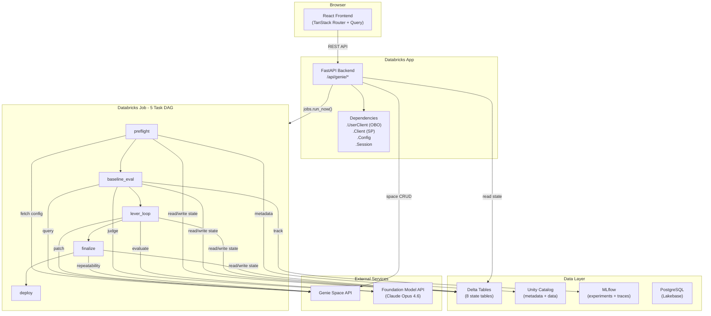
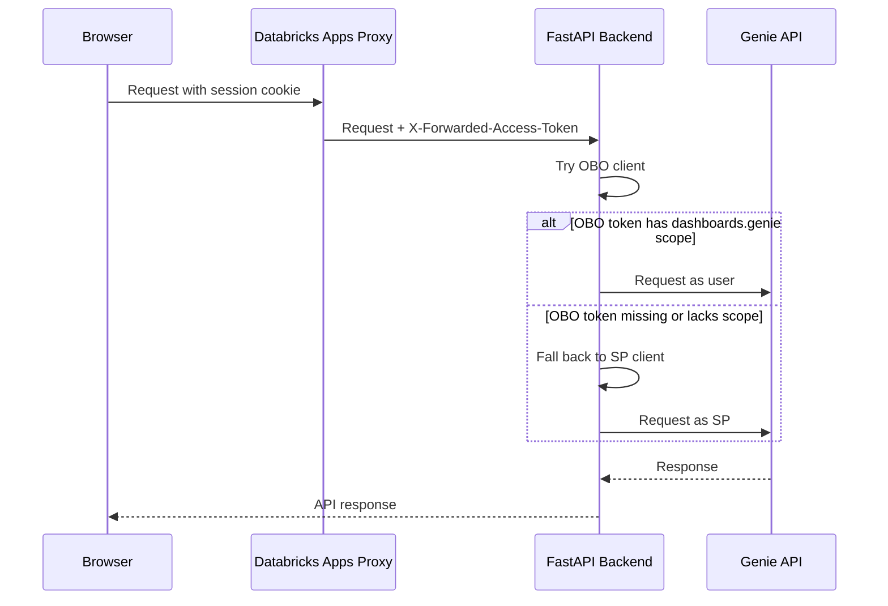
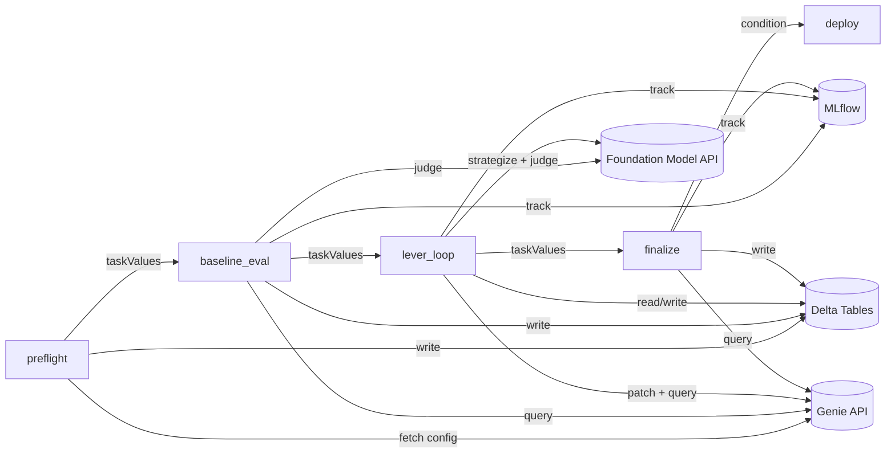

# 02 -- Architecture Overview

[Back to Index](00-index.md) | Previous: [01 Introduction](01-introduction.md) | Next: [03 Optimization Pipeline](03-optimization-pipeline.md)

---

## System Architecture

The Genie Space Optimizer is a three-tier application: a React frontend, a FastAPI backend, and a Databricks Jobs-based optimization engine. The backend acts as the control plane -- serving the UI, managing state, and orchestrating optimization jobs. The optimization engine runs as a multi-task Databricks Job, reading and writing state through Delta tables.



---

## Component Inventory

### Backend (`src/genie_space_optimizer/backend/`)

| Component | File | Purpose |
|-----------|------|---------|
| App factory | `app.py` | Registers routes, serves frontend, configures lifespan |
| Response models | `models.py` | Pydantic models for all API responses |
| System routes | `router.py` | `/version`, `/current-user` |
| Job launcher | `job_launcher.py` | Builds wheel, uploads artifacts, creates/updates persistent job, submits runs |
| Spark factory | `_spark.py` | Serverless Spark session with auto-recreate on credential errors |
| Dependencies | `core/dependencies.py` | Typed FastAPI DI: `Client`, `UserClient`, `Config`, `Session` |
| Config | `core/_config.py` | `AppConfig` loaded from environment variables |
| SQL execution | `core/sql.py` | SQL Warehouse statement execution wrapper |
| Lakebase | `core/lakebase.py` | PostgreSQL/SQLModel setup |

### Routes (`src/genie_space_optimizer/backend/routes/`)

| Route file | Endpoints | Purpose |
|------------|-----------|---------|
| `spaces.py` | `GET /spaces`, `GET /spaces/{id}`, `POST /spaces/{id}/optimize` | Space listing, detail, UI-triggered optimization |
| `runs.py` | `GET /runs/{id}`, `/comparison`, `/apply`, `/discard`, `/iterations`, `/asi`, `/provenance`, `/iteration-detail` | Run monitoring, results, actions, transparency |
| `activity.py` | `GET /activity` | Permission-filtered recent runs |
| `settings.py` | `GET /settings/permissions` | Advisor-only permission dashboard |
| `trigger.py` | `POST /trigger`, `GET /trigger/status/{id}` | Programmatic (headless) API |

### Common Utilities (`src/genie_space_optimizer/common/`)

| Module | Purpose |
|--------|---------|
| `config.py` | All constants: thresholds, rate limits, iteration params, LLM config, prompts |
| `genie_client.py` | Genie Space API wrapper: list, fetch, patch, query, result DFs, permissions |
| `genie_schema.py` | Config schema validation (lenient/strict), instruction slot budget (100 max) |
| `uc_metadata.py` | Unity Catalog introspection: REST API with Spark SQL fallback for columns, tags, routines, FKs |
| `delta_helpers.py` | Delta table read/write operations |

### Optimization Engine (`src/genie_space_optimizer/optimization/`)

| Module | Purpose |
|--------|---------|
| `harness.py` | Full pipeline orchestration: preflight through deploy |
| `optimizer.py` | Adaptive strategist, failure clustering, proposal generation |
| `evaluation.py` | Benchmark generation, temporal date resolution, 9-judge scoring, MLflow tracking |
| `applier.py` | Patch application (30+ patch types) and rollback |
| `preflight.py` | Pre-flight validation, UC metadata collection, benchmark loading |
| `state.py` | Delta-backed state machine (8 tables + provenance) |
| `labeling.py` | MLflow labeling sessions for human review |
| `repeatability.py` | Repeatability testing and variance classification |
| `report.py` | Markdown report generation |
| `models.py` | MLflow LoggedModel snapshots and metric linking |
| `benchmarks.py` | Benchmark question definitions |
| `scorers/` | 9 quality scorers (+ 1 repeatability scorer) |

### Scorers (`src/genie_space_optimizer/optimization/scorers/`)

| Scorer | Type | What It Evaluates |
|--------|------|-------------------|
| `syntax_validity` | Deterministic | SQL parses correctly (Spark EXPLAIN) |
| `schema_accuracy` | Deterministic | Correct tables, columns, and joins referenced |
| `logical_accuracy` | LLM judge | Correct aggregations, filters, GROUP BY, ORDER BY |
| `semantic_equivalence` | LLM judge | Same business metric as expected answer |
| `completeness` | LLM judge | All requested dimensions/measures included |
| `response_quality` | LLM judge | Natural language analysis accuracy |
| `result_correctness` | Deterministic | Correct final result values |
| `asset_routing` | Deterministic | Correct asset type (table, metric view, TVF) selected |
| `arbiter` | LLM judge | Tiebreaker when result correctness disagrees |

### Frontend (`src/genie_space_optimizer/ui/`)

| Component | Purpose |
|-----------|---------|
| `routes/index.tsx` | Dashboard: space grid, activity feed, stats |
| `routes/spaces/$spaceId.tsx` | Space detail, optimization trigger |
| `routes/runs/$runId.tsx` | Run monitoring with pipeline steps, lever status, charts |
| `routes/runs/$runId/comparison.tsx` | Side-by-side config diff with apply/discard |
| `routes/settings.tsx` | Advisor-only permissions dashboard |
| `components/IterationChart.tsx` | Score progression across iterations |
| `components/AsiResultsPanel.tsx` | ASI failure analysis breakdown |
| `components/ProvenancePanel.tsx` | Judge-to-patch provenance viewer |
| `lib/api.ts` | Auto-generated OpenAPI client |
| `lib/transparency-api.ts` | Transparency API hooks |

### Job Entry Points (`src/genie_space_optimizer/jobs/`)

| Script | DAG Task | Purpose |
|--------|----------|---------|
| `run_preflight.py` | `preflight` | Config analysis and metadata collection |
| `run_baseline.py` | `baseline_eval` | Baseline evaluation and benchmark scoring |
| `run_lever_loop.py` | `lever_loop` | Iterative optimization with 5 levers |
| `run_finalize.py` | `finalize` | Repeatability tests and final report |
| `run_deploy.py` | `deploy` | Deploy to version control (conditional) |
| `run_optimization.py` | -- | Single-entry-point runner (alternative to DAG) |
| `run_evaluation_only.py` | -- | Standalone evaluation |

---

## Authentication Flow

The app uses two Databricks clients:

1. **Service Principal (SP)** -- `Dependencies.Client` -- always available, used for job submission, Delta state access, and as a fallback for Genie API calls
2. **OBO User Client** -- `Dependencies.UserClient` -- uses the `X-Forwarded-Access-Token` header injected by the Databricks Apps runtime, scoped to the logged-in user's permissions

When the OBO token is missing or lacks a required scope (e.g., `dashboards.genie`), the backend falls back to the SP client transparently. The `_genie_client()` function tests the OBO token first, catches `PermissionDenied`, and returns the SP client.



See [08 -- Permissions and Security](08-permissions-and-security.md) for the complete permissions model.

---

## Data Flow

### Optimization Trigger

1. User clicks **Optimize** in the React frontend (or calls `POST /trigger`)
2. Backend validates permissions, creates a `QUEUED` run in Delta, snapshots the current Genie Space config
3. Backend builds the project wheel, uploads artifacts, and calls `jobs.run_now()` on the persistent job
4. Backend updates the run to `IN_PROGRESS` with the `job_run_id`
5. Frontend polls `GET /runs/{id}` every 5 seconds for status updates

### Pipeline Execution

The Databricks Job runs 5 sequential tasks, each reading/writing Delta state:



### Inter-Task Communication

Tasks pass data forward using `dbutils.jobs.taskValues`:

| From | To | Data Passed |
|------|----|-------------|
| preflight | baseline_eval | Benchmark count, experiment name, UC metadata summary |
| baseline_eval | lever_loop | Baseline scores, thresholds_met flag, evaluation MLflow run IDs |
| lever_loop | finalize | Best iteration, accepted levers, total patches |
| finalize | deploy | Deploy readiness flag |

### State Persistence

All durable state is stored in 8 Delta tables partitioned by `run_id`. See [06 -- State Management](06-state-management.md) for the complete schema.

---

## Project Structure

```
Genie_Space_Optimizer/
+-- pyproject.toml                    # Python project config and apx metadata
+-- databricks.yml                    # Databricks Asset Bundle definition
+-- Makefile                          # Deployment helpers
+-- app.yml                           # Databricks App entry point (uvicorn)
+-- resources/
|   +-- grant_app_uc_permissions.py   # UC grant script for app SP
+-- docs/
|   +-- genie-space-optimizer-design/ # This documentation set
+-- src/genie_space_optimizer/
    +-- backend/                      # FastAPI backend
    |   +-- routes/                   # API route handlers
    |   +-- core/                     # DI, config, factories
    +-- ui/                           # React + Vite frontend
    |   +-- routes/                   # File-based TanStack Router pages
    |   +-- components/               # React components
    |   +-- lib/                      # API client, hooks
    +-- common/                       # Shared utilities
    +-- optimization/                 # Core optimization engine
    |   +-- scorers/                  # 9 quality scorers
    +-- jobs/                         # Databricks Job entry points
```

---

## Databricks Resources Provisioned

The `databricks.yml` bundle provisions:

| Resource | Description |
|----------|-------------|
| **Databricks App** | Serves the full-stack web application with OBO authentication |
| **PostgreSQL Database** | Lakebase instance (CU_1 capacity) |
| **SQL Warehouse** | For statement execution and UC metadata queries |
| **Optimization Job** | Persistent job `genie-space-optimizer-runner` triggered on-demand |

---

Next: [03 -- Optimization Pipeline](03-optimization-pipeline.md)
