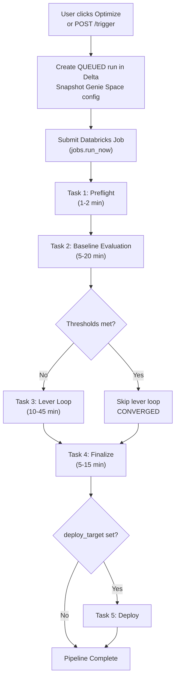
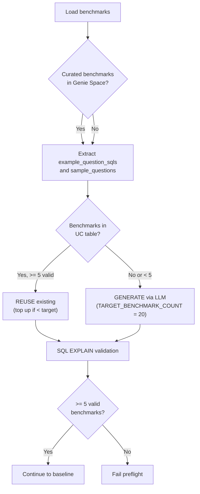
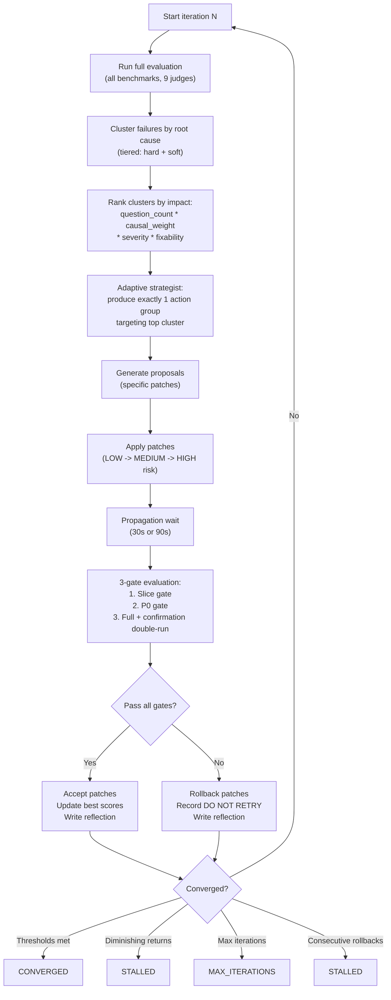

# 03 -- Optimization Pipeline (End-to-End Deep Dive)

[Back to Index](00-index.md) | Previous: [02 Architecture](02-architecture-overview.md) | Next: [04 Evaluation and Scoring](04-evaluation-and-scoring.md)

---

This is the most detailed document in the set. It walks through every stage of the optimization pipeline, from the moment a user clicks "Optimize" to the final repeatability report.

## Pipeline Overview

The optimizer runs as a 5-task Databricks Job DAG. Each task is a notebook that reads parameters from the prior task via `dbutils.jobs.taskValues` and persists state to Delta tables.



**Typical total duration: 20-60 minutes** depending on space complexity, number of tables, and benchmark count.

---

## Step 1: Preflight (Task 1)

**Duration:** 1-2 minutes | **Entry point:** `jobs/run_preflight.py` -> `preflight.run_preflight()`

The preflight stage validates that the optimizer has everything it needs before committing to a full evaluation run.

### 1.1 Fetch Genie Space Configuration

The optimizer retrieves the full Genie Space configuration via the Genie API:

```
GET /api/2.0/genie/spaces/{space_id}?include_serialized_space=true
```

This returns the serialized space config including tables, metric views, functions, instructions, join specifications, sample questions, and column configurations. The config is stored as a snapshot in the `genie_opt_runs` Delta table so the original can be restored on rollback.

### 1.2 Validate Configuration Schema

The config is validated using `genie_schema.validate_serialized_space()` in **lenient mode** (strict mode is used post-optimization). Validation checks:

- Required fields present (title, data_sources)
- Table identifiers are fully qualified (catalog.schema.table)
- Instruction slot budget does not exceed the 100-slot Genie API limit (each example SQL = 1 slot, each SQL function = 1, each text instruction = 1)
- No duplicate IDs

### 1.3 Collect Unity Catalog Metadata

UC metadata is needed by the LLM for benchmark generation and by the optimization levers for targeted patches. The optimizer tries three sources in priority order:

1. **Prefetched data** -- metadata collected during the optimization trigger (via OBO SQL from the backend)
2. **REST API** -- `WorkspaceClient` calls: `w.tables.get()` for columns, `w.functions.list()` for routines, `w.entity_tag_assignments.list()` for tags
3. **Spark SQL fallback** -- queries against `system.information_schema` if REST fails

Metadata collected:

| Data | Source | Purpose |
|------|--------|---------|
| Column names, types, descriptions | REST `tables.get()` or `information_schema.columns` | Benchmark SQL generation, description enrichment |
| Table tags | REST or `information_schema.table_tags` | Context for LLM judges |
| Routines (functions) | REST `functions.list()` or `information_schema.routines` | TVF optimization |
| Foreign keys | REST `table_constraints` or `information_schema.table_constraints` | Join discovery |
| Table descriptions | REST `tables.get()` or `information_schema.tables` | Description enrichment |

### 1.4 Validate Access

Two access checks run during preflight:

- **Core access** (`_validate_core_access`): Uses REST `w.tables.get()` to confirm the SP can read table metadata for at least one table in the space. This is faster and more reliable than querying `information_schema`.
- **Write access** (`_validate_write_access`): Only when `apply_mode` is `both` or `uc_artifact`. Checks that the SP has `MODIFY` privilege on the target schemas. Fails fast with a clear error if missing.

### 1.5 Load or Generate Benchmarks

The optimizer needs benchmark questions to evaluate the Genie Space. The strategy depends on what exists:



LLM-generated benchmarks use the `BENCHMARK_GENERATION_PROMPT` with full UC metadata context. Generated benchmarks cover 7 categories: aggregation, ranking, time-series, comparison, detail, list, and threshold. Invalid benchmarks (those that fail `SQL EXPLAIN`) are dropped. A coverage gap fill pass generates additional questions for uncovered tables and asset types.

### 1.6 Create MLflow Experiment

An MLflow experiment is created (or reused) at:

```
/Shared/genie-space-optimizer/{space_id}/{domain}
```

Judge prompts are registered as experiment-level tags for reproducibility. A `LoggedModel` version 0 is created to represent the baseline configuration.

### 1.7 Ingest Human Feedback

If a prior optimization run created a labeling session, preflight checks for human corrections:

- Loads assessments from the MLflow labeling session
- Extracts corrected benchmark SQL (if humans provided better expected SQL)
- These corrections are applied to the benchmark dataset before baseline evaluation

### 1.8 Stage Records

Preflight writes `PREFLIGHT_STARTED` and `PREFLIGHT_COMPLETE` (or `PREFLIGHT_FAILED`) stages to the `genie_opt_stages` Delta table with timing and summary information.

---

## Step 2: Baseline Evaluation (Task 2)

**Duration:** 5-20 minutes | **Entry point:** `jobs/run_baseline.py` -> `evaluation.run_baseline_evaluation()`

The baseline evaluation establishes the "before" score by running all benchmark questions through Genie and scoring the responses.

### 2.1 Temporal Date Resolution

Before evaluation, the optimizer scans benchmark questions for relative time references and rewrites the ground-truth SQL to match the current date:

| Pattern | Example | Rewritten To |
|---------|---------|-------------|
| "this year" / "YTD" | `WHERE date >= '2025-01-01'` | `WHERE date >= '2026-01-01'` |
| "this month" | `WHERE month = '2025-01'` | `WHERE month = '2026-03'` |
| "this quarter" | `WHERE quarter = 'Q1 2025'` | `WHERE quarter = 'Q1 2026'` |
| "last quarter" | Previous quarter dates | Updated to current minus 1 quarter |
| "last N months/days" | Rolling window | Updated to current date minus N |
| "last year" | Previous year dates | Updated to current minus 1 year |

Explicit years (e.g., "for 2024") are intentionally **not** rewritten. A `temporal_note` is attached to evaluation traces so LLM judges know dates were auto-adjusted.

### 2.2 Run Benchmarks Through Genie

Each benchmark question is sent to the Genie API:

1. `start_conversation()` -- creates a conversation with the question
2. Poll until status is `COMPLETED` or `FAILED` (exponential backoff: 3s initial, 10s max, 120s timeout)
3. On HTTP 429 (rate limit): exponential backoff with `GENIE_RATE_LIMIT_RETRIES` (3) retries, starting at `GENIE_RATE_LIMIT_BASE_DELAY` (30s)
4. Fetch the generated SQL and result DataFrame

A `RATE_LIMIT_SECONDS` (12s) delay is enforced between consecutive Genie API calls.

### 2.3 Score with 9 LLM Judges

Each Genie response is evaluated by 9 judges. See [04 -- Evaluation and Scoring](04-evaluation-and-scoring.md) for the full judge framework. In summary:

| Judge | Type | What It Checks |
|-------|------|----------------|
| Syntax Validity | Deterministic | SQL parses (Spark EXPLAIN) |
| Schema Accuracy | Deterministic | Tables and columns exist |
| Logical Accuracy | LLM | Correct filters, aggregations, GROUP BY |
| Semantic Equivalence | LLM | Same business metric as expected |
| Completeness | LLM | All requested dimensions included |
| Response Quality | LLM | NL analysis accuracy |
| Result Correctness | Deterministic | Matching result values |
| Asset Routing | Deterministic | Correct asset type selected |
| Arbiter | LLM | Tiebreaker for conflicting verdicts |

All judges except `syntax_validity` and `asset_routing` return structured JSON with `failure_type`, `blame_set`, `counterfactual_fix`, `wrong_clause`, and `rationale`. These flow directly into ASI metadata and provenance.

### 2.4 Arbiter Verdicts

The arbiter judge runs when result correctness reports a mismatch. It produces one of four verdicts:

| Verdict | Meaning | Impact |
|---------|---------|--------|
| `genie_correct` | Genie's answer is correct; the benchmark expected SQL is wrong | Benchmark auto-correction candidate |
| `ground_truth_correct` | The expected SQL is correct; Genie's answer is wrong | Hard failure for optimization |
| `both_correct` | Both answers are valid (different but equivalent approaches) | Excluded from failure clusters |
| `neither_correct` | Both are wrong | GT repair candidate; eventually quarantined |

### 2.5 Record Baseline Scores

Baseline scores are written to `genie_opt_iterations` as iteration 0. If all quality thresholds are already met, the lever loop is skipped entirely and the run converges with `baseline_meets_thresholds`.

### 2.6 Create Labeling Session

An MLflow labeling session is created for the baseline evaluation traces. Failed trace IDs are prioritized. The session URL is persisted to `genie_opt_runs.labeling_session_url` and surfaced in the run detail UI as a "Human Review" link.

### 2.7 MLflow Tracking

All evaluation traces are tagged with:

- `genie.optimization_run_id` -- links trace to the optimization run
- `genie.iteration` -- iteration number (0 for baseline)
- `genie.eval_scope` -- evaluation scope (`full`, `slice`, `p0`)
- `genie.lever` -- lever number (null for baseline)

Expected SQL is logged as `Expectation` assessments on traces. ASI feedback is logged as `asi_{judge}` entries.

---

## Step 3: Preparatory Stages (Start of Task 3)

Before the adaptive lever loop begins, four preparatory stages run in sequence. These are deterministic, low-risk improvements that don't require LLM-driven strategy.

### Stage 2.5: Prompt Matching Auto-Config

**What it does:** Applies two Genie Space features that improve query accuracy without changing any descriptions or instructions:

1. **Format Assistance** (`enable_format_assistance`): Turns on `get_example_values` for all visible columns. This tells Genie the exact value formats to expect (e.g., "YYYY-MM-DD" for dates, specific enum values for categoricals).

2. **Entity Matching** (`enable_value_dictionary`): Builds value dictionaries for prioritized STRING columns (up to a 120-column cap). This helps Genie resolve ambiguous user queries to exact column values (e.g., "NY" -> "New York").

**Propagation wait:** 90 seconds if entity matching changes were applied (value dictionaries take longer to index), 30 seconds otherwise.

**No LLM involved** -- this is a purely deterministic step.

### Stage 2.75: Description Enrichment and Example SQL Mining

**What it does:** Three sub-steps:

1. **Column description enrichment**: LLM generates structured descriptions for columns with insufficient descriptions (< 10 characters). Uses UC metadata (type, tags) as context.

2. **Table description enrichment**: LLM generates descriptions for tables with no description or insufficient descriptions (< 10 characters). Also generates space-level descriptions and sample questions for spaces that lack them.

3. **Example SQL mining**: Examines high-scoring baseline benchmarks (those that scored well across judges) and mines their SQL as proven example queries. Each mined SQL is validated with a 0-row check (EXPLAIN + LIMIT 0 execution) before being applied proactively via the Genie API as `example_question_sql` entries.

### Stage 2.85: Proactive Join Discovery

**What it does:** Parses `JOIN` clauses from successful baseline Genie queries, corroborates them with UC foreign key constraints, and codifies execution-proven joins as Genie Space join specifications.

The optimizer looks at:
- Baseline queries that scored well and contained JOIN clauses
- UC foreign key metadata for corroboration
- Existing join specifications in the Genie Space config (to avoid duplicates)

New join specs include left table, right table, join columns, and relationship type (e.g., many-to-one).

### Stage 2.95: Proactive Instruction Seeding

**What it does:** For spaces with no instructions or very short instructions (< 50 characters), seeds conservative routing instructions covering:

- Asset routing guidance (when to use tables vs. metric views vs. TVFs)
- Temporal conventions (date formats, fiscal year definitions)
- NULL handling rules
- Common join patterns discovered in Stage 2.85

This gives the Genie Space a baseline instruction set that the adaptive lever loop (specifically Lever 5) can then refine.

---

## Step 4: Adaptive Lever Loop (Core of Task 3)

**Duration:** 10-45 minutes | **Max iterations:** 3 (configurable via `MAX_ITERATIONS`)

This is the core optimization engine. Unlike a fixed-order lever sweep, the adaptive loop re-analyzes failures after each iteration and targets the highest-impact root cause.

### High-Level Iteration Cycle



### 4.1 Failure Clustering

After each evaluation, failures are clustered using a tiered approach:

**Hard failures** -- questions where the arbiter verdict is `ground_truth_correct` or `neither_correct`:
- These are genuine errors that need targeted fixes
- Clustered by `(failure_type, blame_set)` -- e.g., all questions failing because of `wrong_column` on `table_x.col_y` form one cluster

**Soft signals** -- questions where the arbiter verdict is `genie_correct` or `both_correct` but individual judges still reported failures:
- These are best-practice opportunities, not hard errors
- Clustered separately with `signal_type: soft`
- Passed to Levers 4 and 5 for instruction and join improvements

### 4.2 Cluster Ranking

Each cluster receives a priority score:

```
priority = question_count * causal_weight * severity * fixability
```

Where:
- `question_count` -- number of questions affected by this root cause
- `causal_weight` -- how directly the root cause explains the failure (1.0 = direct, 0.5 = indirect)
- `severity` -- how badly the failure impacts the overall score
- `fixability` -- how likely the available levers can fix it (1.0 = highly fixable, 0.3 = low confidence)

### 4.3 Adaptive Strategist

The adaptive strategist is an LLM call that receives:

1. **Ranked failure clusters** -- the top clusters with their priority scores
2. **Reflection buffer** -- a history of what was tried in prior iterations:
   - Which action groups were accepted or rolled back
   - Score deltas per judge
   - Which target objects were modified
   - **DO NOT RETRY list** -- specific (failure_type, blame_set, lever) tuples that were tried and failed
3. **Per-question failure persistence** -- questions classified as `INTERMITTENT`, `PERSISTENT`, or `ADDITIVE_LEVERS_EXHAUSTED` based on cross-iteration verdict history
4. **Available levers** -- what each lever can do

The strategist produces exactly **one action group** per iteration (not a batch of changes). This makes the cause-and-effect of each change measurable. The action group specifies:

- Which lever(s) to use
- Which specific objects to target (tables, columns, joins, instructions)
- What kind of change to make (add description, rewrite instruction, add join spec, etc.)

**Holistic fallback:** If the adaptive strategist returns zero action groups on iteration 1, the optimizer falls back to a holistic strategy that considers all failure patterns simultaneously.

### 4.4 Proposal Generation and Patch Application

The strategist's action group is converted into concrete proposals, then into patches:

1. **Proposals** -- high-level changes like "add description for column X" or "rewrite instructions to include join guidance"
2. **Patches** -- specific Genie API commands with `{action_type, target, command, rollback_command, risk_level}`

Patches are applied in risk order: **LOW -> MEDIUM -> HIGH**. High-risk patches (e.g., TVF removal) may be queued for human approval instead of applied automatically.

The patch system supports 30+ patch types. See [05 -- Optimization Levers](05-optimization-levers.md) for details.

### 4.5 Three-Gate Evaluation

After patches are applied and the propagation wait completes, the optimizer runs a three-gate quality check:

| Gate | Scope | What It Checks | Tolerance |
|------|-------|----------------|-----------|
| **Slice gate** | Only questions affected by the patch | Per-dimension accuracy didn't regress | `SLICE_GATE_TOLERANCE` (15%) |
| **P0 gate** | Priority-0 questions (highest impact) | Overall accuracy didn't drop | `REGRESSION_THRESHOLD` (5%) |
| **Full gate** | All benchmark questions | Overall accuracy across all judges | `REGRESSION_THRESHOLD` (5%), noise-floor adjusted |

The full gate uses a **confirmation double-run**: two independent evaluations are averaged to smooth Genie's non-deterministic SQL generation. This prevents accepting changes based on a lucky single evaluation or rolling back based on an unlucky one.

Score improvements below the **noise floor** (`MAX_NOISE_FLOOR` = 5.0 points) are treated as cosmetic and rejected, even if they technically pass the regression threshold.

### 4.6 Accept or Rollback

**Accept:** If all gates pass and the improvement exceeds the noise floor:
- Patches are kept in the Genie Space config
- Best scores are updated
- Instruction version snapshot is registered
- Reference SQLs are refreshed from accepted benchmarks
- A reflection entry is written recording what worked

**Rollback:** If any gate fails:
- All patches from this iteration are reverted using their rollback commands
- The (failure_type, blame_set, lever) tuple is added to the DO NOT RETRY list
- A reflection entry is written recording what failed and why

### 4.7 Convergence Criteria

The loop stops when any of these conditions is met:

| Condition | Result Status | `convergence_reason` |
|-----------|---------------|---------------------|
| All quality thresholds met | `CONVERGED` | `threshold_met` |
| Last `DIMINISHING_RETURNS_LOOKBACK` (2) accepted iterations each improved < `DIMINISHING_RETURNS_EPSILON` (2%) | `STALLED` | `no_further_improvement` |
| `MAX_ITERATIONS` (3) reached | `MAX_ITERATIONS` | `max_iterations` |
| `CONSECUTIVE_ROLLBACK_LIMIT` (2) consecutive rollbacks | `STALLED` | `no_further_improvement` |
| Baseline already met all thresholds | `CONVERGED` | `baseline_meets_thresholds` |

### 4.8 Escalation Mechanisms

For questions that resist automated fixes across multiple iterations:

**TVF removal** -- When a TVF is blamed in ASI provenance for `TVF_REMOVAL_BLAME_THRESHOLD` (2) consecutive iterations, the optimizer performs a TVF schema overlap analysis (checking if the TVF's output columns overlap with existing Genie assets) and generates a confidence tier:
- High confidence: TVF output is fully covered by other assets -> auto-remove
- Medium: partial overlap -> queue for human review
- Low: unique columns -> flag for review

**Ground-truth repair** -- After `NEITHER_CORRECT_REPAIR_THRESHOLD` (2) `neither_correct` verdicts, the optimizer attempts LLM-assisted ground-truth SQL correction, generating a new expected SQL using UC metadata and Genie's actual output as signals.

**Human review flagging** -- Questions that exhaust all automated approaches are written to `genie_opt_flagged_questions` and surfaced in the pending reviews panel of the UI.

**Quarantine** -- After `NEITHER_CORRECT_QUARANTINE_THRESHOLD` (3) consecutive `neither_correct` verdicts AND at least one failed GT repair, the question is excluded from the accuracy denominator to prevent it from blocking convergence.

---

## Step 5: Finalize (Task 4)

**Duration:** 5-15 minutes | **Entry point:** `jobs/run_finalize.py` -> `harness._run_finalize()`

### 5.1 Repeatability Testing

The optimizer runs exactly **2 repeatability evaluation passes** -- re-asking all benchmark questions to check SQL consistency:

1. Each benchmark is re-queried through Genie
2. The generated SQL is compared (MD5 hash) against the accepted iteration's SQL
3. Results are classified:
   - **IDENTICAL** -- same SQL every time (>= 90% match rate)
   - **SIGNIFICANT_VARIANCE** -- some variation (50-89%)
   - **CRITICAL_VARIANCE** -- highly inconsistent (< 50%)

The two passes are averaged for the final repeatability score.

### 5.2 Heartbeat and Timeout

The finalize task uses a heartbeat mechanism to prevent premature stale-run detection:

- **Heartbeat:** Emits `FINALIZE_HEARTBEAT` stage events every 30 seconds (configurable via `GENIE_SPACE_OPTIMIZER_FINALIZE_HEARTBEAT_SECONDS`)
- **Soft timeout:** 6600 seconds (configurable via `GENIE_SPACE_OPTIMIZER_FINALIZE_TIMEOUT_SECONDS`). If exceeded, raises `TimeoutError` and records `finalize_timeout` as the convergence reason.

### 5.3 Model Promotion

The best-performing model version (the iteration with the highest overall accuracy) is promoted in MLflow. This creates a traceable link between the optimization run and the configuration that produced the best results.

### 5.4 Report Generation

A Markdown report is generated containing:

- Executive summary (baseline vs. optimized scores, improvement percentage)
- Per-iteration score table
- Lever detail (accepted, rolled back, skipped, with reasons)
- Patch inventory (what was changed, patch types, risk levels)
- ASI summary (failure type distribution, blame distribution)
- Repeatability report
- MLflow experiment and run links

### 5.5 Labeling Session

A final MLflow labeling session is created for human review, populated with evaluation traces. Flagged trace IDs (from questions that failed or were escalated) are prioritized. The session URL is persisted for the run detail UI.

---

## Step 6: Deploy (Task 5, Optional)

The deploy task only runs if `deploy_target` is set (non-empty). It is controlled by a `deploy_check` condition task that evaluates `deploy_target != ""`.

Currently a placeholder for future Databricks Asset Bundle (DABs) integration -- the optimizer would commit the optimized configuration to version control.

When `deploy_target` is empty (the default), this task is skipped entirely.

---

## End-to-End Example

Here is a concrete walkthrough of what happens when optimizing a Genie Space with 5 tables and 15 columns:

1. **Trigger** (t=0s): User clicks "Optimize" on the Revenue & Property Intelligence space
2. **Preflight** (t=5s): Config fetched (5 tables, 2 joins, 10 instructions), UC metadata collected (15 columns, 3 tags, 1 routine), 20 benchmarks generated across 7 categories
3. **Baseline** (t=90s): 20 questions sent to Genie, each scored by 9 judges. Baseline: syntax 100%, schema 80%, logical 75%, semantic 70%, completeness 85%, result 65%, routing 90%. Overall: 78%
4. **Stage 2.5** (t=600s): Format assistance enabled on 15 columns, entity matching on 8 STRING columns. Wait 90s.
5. **Stage 2.75** (t=720s): 4 columns enriched with descriptions, 2 example SQLs mined from high-scoring benchmarks
6. **Stage 2.85** (t=780s): 1 join discovered from baseline queries, corroborated by FK constraint
7. **Stage 2.95** (t=810s): Instructions seeded (space had only 20 chars of instructions)
8. **Iteration 1** (t=840s): Full eval -> 82%. Cluster: 5 questions fail on `wrong_column` blaming `property_address`. Strategist: Lever 1, add column descriptions for `property_address` and aliases. Patches applied. 3-gate eval -> 87%. Accepted.
9. **Iteration 2** (t=1500s): Full eval -> 87%. Cluster: 3 questions fail on `missing_join_spec` blaming `revenue_summary`. Strategist: Lever 4, add join spec between `properties` and `revenue_summary`. Patches applied. 3-gate eval -> 91%. Accepted.
10. **Iteration 3** (t=2200s): Full eval -> 91%. Cluster: 2 questions fail on `asset_routing_error`. Strategist: Lever 5, rewrite instructions with routing guidance. Patches applied. 3-gate eval -> 94%. Accepted. All thresholds met -> CONVERGED.
11. **Finalize** (t=2800s): 2 repeatability passes -> 92% repeatability. Model promoted. Report generated. Labeling session created.
12. **Complete** (t=3200s): Total time ~53 minutes. User reviews comparison and clicks Apply.

---

## Timing Reference

| Stage | Typical Duration | Main Time Consumer |
|-------|------------------|--------------------|
| Preflight | 1-2 min | UC metadata collection, benchmark generation |
| Baseline eval | 5-20 min | 20 questions x Genie round-trip + 9 judges per question |
| Preparatory stages | 2-5 min | Entity matching propagation wait (90s) |
| Per adaptive iteration | 5-15 min | Full eval + 3-gate eval + propagation waits |
| Finalize | 5-15 min | 2 repeatability passes (40 Genie queries) |
| **Total** | **20-60 min** | Scales with benchmark count and iteration count |

---

Next: [04 -- Evaluation and Scoring](04-evaluation-and-scoring.md)
