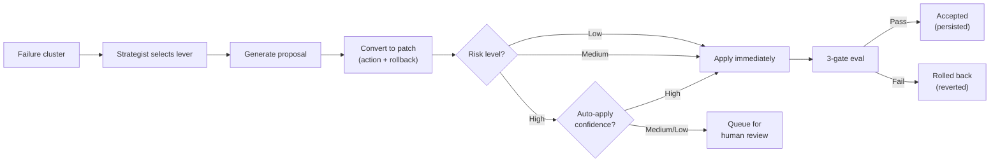

# 05 -- Optimization Levers

[Back to Index](00-index.md) | Previous: [04 Evaluation and Scoring](04-evaluation-and-scoring.md) | Next: [06 State Management](06-state-management.md)

---

## Overview

The optimizer uses 5 optimization levers, each targeting a different aspect of the Genie Space configuration. Before the lever loop begins, 4 preparatory stages run deterministic, low-risk improvements. The adaptive strategist (see [03 -- Pipeline](03-optimization-pipeline.md)) selects which lever to activate and what objects to target in each iteration.

---

## Preparatory Stages

These stages run once before the lever loop. They are not part of the adaptive iteration cycle.

### Stage 2.5: Prompt Matching Auto-Config

**Purpose:** Enable Genie's built-in prompt matching features on all eligible columns.

| Feature | Genie API Field | What It Does |
|---------|-----------------|--------------|
| Format Assistance | `enable_format_assistance` (formerly `get_example_values`) | Shows Genie the exact value formats for each column (date patterns, enum values, number formats) |
| Entity Matching | `enable_value_dictionary` (formerly `build_value_dictionary`) | Builds a value dictionary for STRING columns so Genie can resolve fuzzy matches ("NY" -> "New York") |

**Scope:**
- Format assistance: all visible columns
- Entity matching: prioritized STRING columns, up to a 120-column cap (`MAX_VALUE_DICTIONARY_COLUMNS`)

**Config migration:** The optimizer handles the v1 -> v2 API field name migration (`get_example_values` -> `enable_format_assistance`, `build_value_dictionary` -> `enable_value_dictionary`) automatically via `_migrate_column_configs_v1_to_v2()`.

**Propagation wait:** 90 seconds if entity matching was enabled (value dictionaries require indexing time), 30 seconds otherwise.

### Stage 2.75: Description Enrichment and Example SQL Mining

**Purpose:** Fill in missing or inadequate descriptions and seed proven example queries.

**Column enrichment:**
- Targets columns with descriptions shorter than 10 characters
- LLM generates structured descriptions using UC metadata (column type, tags, table context)
- Descriptions follow a consistent format: what the column represents, valid values, business meaning

**Table enrichment:**
- Targets tables with no description or descriptions shorter than 10 characters
- LLM generates table-level descriptions explaining the table's business purpose, key columns, and relationships
- Also generates space-level descriptions and sample questions for spaces that lack them

**Example SQL mining:**
- Examines baseline benchmarks that scored well across all judges
- Extracts their SQL as proven example queries
- Each mined SQL is validated with a 0-row check (`EXPLAIN` + `LIMIT 0` execution)
- Valid SQLs are applied to the Genie Space config as `example_question_sql` entries via the Genie API

### Stage 2.85: Proactive Join Discovery

**Purpose:** Detect implicit joins from successful queries and codify them as explicit Genie Space join specifications.

**Process:**
1. Parse `JOIN` clauses from baseline Genie queries that scored well
2. Corroborate with UC foreign key constraints (higher confidence if FK exists)
3. Check for duplicates against existing join specs in the Genie Space config
4. Create new join specifications with left table, right table, join columns, and relationship type

**Lever 4 always re-runs this discovery** even during the adaptive loop, ensuring new joins found from later evaluations are captured.

### Stage 2.95: Proactive Instruction Seeding

**Purpose:** Provide a baseline instruction set for spaces with minimal or no instructions.

**Trigger:** Space instructions are shorter than 50 characters.

**Generated instructions cover:**
- Asset routing guidance (when to prefer metric views vs. tables vs. TVFs)
- Temporal conventions (date column formats, fiscal year definitions if detected)
- NULL handling rules (how to interpret NULLs in key columns)
- Common join patterns discovered in Stage 2.85

This gives the adaptive lever loop's Lever 5 a foundation to refine rather than starting from scratch.

---

## The 5 Optimization Levers

### Lever 1: Tables and Columns

**What it optimizes:** Table and column metadata in the Genie Space configuration.

| Patch Type | What It Does | Risk Level |
|------------|-------------|------------|
| `add_description` | Add table description | Low |
| `update_description` | Update existing table description | Low |
| `add_column_description` | Add column description | Low |
| `update_column_description` | Update existing column description | Low |
| `hide_column` | Hide irrelevant column from Genie | Medium |
| `unhide_column` | Make hidden column visible | Low |
| `rename_column_alias` | Add or change column alias | Low |
| `enable_format_assistance` | Turn on format assistance for a column | Low |
| `enable_value_dictionary` | Turn on entity matching for a column | Medium |

**When the strategist chooses Lever 1:**
- Failure clusters contain `wrong_column`, `wrong_table`, or `missing_column` failure types
- Blame set points to specific tables or columns
- Column descriptions are missing or misleading

**UC artifact support:** When `apply_mode` includes `uc_artifact`, column and table description changes are also written to Unity Catalog as `ALTER TABLE ... ALTER COLUMN ... COMMENT` and `COMMENT ON TABLE` statements during the Apply phase.

### Lever 2: Metric Views

**What it optimizes:** Metric view definitions and their column configurations.

| Patch Type | What It Does | Risk Level |
|------------|-------------|------------|
| `add_mv_measure` | Add a MEASURE() column to a metric view | Medium |
| `update_mv_measure` | Update metric view measure definition | Medium |
| `add_mv_dimension` | Add a dimension column to a metric view | Low |
| `update_mv_yaml` | Update metric view YAML definition | Medium |

**When the strategist chooses Lever 2:**
- Failure clusters contain `wrong_aggregation`, `missing_measure`, or `metric_view_error` failure types
- Questions expecting MEASURE() syntax get different SQL from Genie
- Metric view definitions are incomplete or have wrong column mappings

### Lever 3: Table-Valued Functions (TVFs)

**What it optimizes:** TVF parameters, SQL bodies, and function signatures.

| Patch Type | What It Does | Risk Level |
|------------|-------------|------------|
| `add_tvf_parameter` | Add a parameter to a TVF | Medium |
| `update_tvf_sql` | Update the TVF's SQL body | High |
| `remove_tvf` | Remove a TVF from the Genie Space | High |
| `add_tvf_description` | Add or update TVF description | Low |

**When the strategist chooses Lever 3:**
- Failure clusters contain `tvf_parameter_error`, `tvf_sql_error`, or `asset_routing_error` (routing to wrong asset)
- TVF schema overlap analysis shows the TVF's functionality is better served by other assets

**Escalation:** TVF removal is a high-risk operation. Before auto-removing:
- TVF must be blamed in ASI provenance for `TVF_REMOVAL_BLAME_THRESHOLD` (2) consecutive iterations
- Schema overlap analysis determines confidence tier (high/medium/low)
- Medium and low confidence removals are queued for human approval

### Lever 4: Join Specifications

**What it optimizes:** Table relationships, join columns, and cardinality in the Genie Space.

| Patch Type | What It Does | Risk Level |
|------------|-------------|------------|
| `add_join_spec` | Add a new join specification | Low |
| `update_join_spec` | Update existing join specification | Medium |
| `remove_join_spec` | Remove incorrect join specification | Medium |

**When the strategist chooses Lever 4:**
- Failure clusters contain `missing_join_spec`, `wrong_join`, or `cartesian_product` failure types
- Genie queries produce wrong results due to missing or incorrect joins

**Special behavior:** Lever 4 **always runs join discovery** (the same process as Stage 2.85) even without explicit join failure clusters. This captures joins that only became apparent from later evaluation queries.

### Lever 5: Genie Space Instructions

**What it optimizes:** The holistic instruction text that guides Genie's behavior.

| Patch Type | What It Does | Risk Level |
|------------|-------------|------------|
| `add_instruction` | Add a new text instruction | Low |
| `update_instruction` | Update existing instruction | Medium |
| `remove_instruction` | Remove an instruction | Medium |
| `rewrite_instruction` | Full instruction rewrite | High |

**When the strategist chooses Lever 5:**
- Failure clusters contain `asset_routing_error`, `disambiguation_error`, or broad instruction-related issues
- Multiple failure types suggest the instructions need a holistic rewrite rather than targeted patches

**Holistic rewrite:** Lever 5 uses a specialized `LEVER_5_HOLISTIC_PROMPT` that considers:
- The space's purpose and data domain
- All benchmark evaluation learnings (both hard failures and soft signals)
- Prior lever tweaks (what was already changed by Levers 1-4)
- Both hard failure clusters and soft signal clusters
- Instruction guidance from the lever directives

The rewrite produces a `rewrite_instruction` patch that replaces the full instruction body. This is the highest-risk operation but often the most impactful when individual fixes aren't sufficient.

---

## Instruction Slot Budget

The Genie API enforces a **100-slot instruction budget**. Each slot consumes capacity:

| Item | Slots |
|------|-------|
| Each `example_question_sql` | 1 |
| Each `sql_function` | 1 |
| Each text instruction | 1 |
| Table/MV descriptions | 1 each |

The optimizer enforces this budget:
1. **Pre-apply:** Proposals are capped at remaining budget
2. **Post-apply:** Trim excess if over budget
3. **Strict validation:** `genie_schema.count_instruction_slots()` validates after every patch

---

## Patch Lifecycle

Each patch record in Delta includes:
- `patch_type`, `target_object`, `old_value`, `new_value`
- `risk_level` (low, medium, high)
- `lever` (which lever generated it)
- `rolled_back` (boolean)
- `rollback_reason` (if rolled back)
- Provenance chain linking back to the judge verdict and failure cluster

---

## Failure Type to Lever Mapping

The strategist uses this mapping to determine which lever can fix a given failure type:

| Failure Type | Primary Lever | Secondary Lever |
|-------------|---------------|-----------------|
| `wrong_column` | 1 (Tables/Columns) | -- |
| `wrong_table` | 1 (Tables/Columns) | 5 (Instructions) |
| `missing_column` | 1 (Tables/Columns) | -- |
| `wrong_aggregation` | 2 (Metric Views) | 3 (TVFs) |
| `missing_measure` | 2 (Metric Views) | -- |
| `metric_view_error` | 2 (Metric Views) | -- |
| `tvf_parameter_error` | 3 (TVFs) | -- |
| `tvf_sql_error` | 3 (TVFs) | -- |
| `missing_join_spec` | 4 (Joins) | 5 (Instructions) |
| `wrong_join` | 4 (Joins) | -- |
| `cartesian_product` | 4 (Joins) | -- |
| `asset_routing_error` | 5 (Instructions) | 1 (Tables/Columns) |
| `disambiguation_error` | 5 (Instructions) | -- |
| `temporal_error` | 5 (Instructions) | -- |

---

Next: [06 -- State Management](06-state-management.md)
