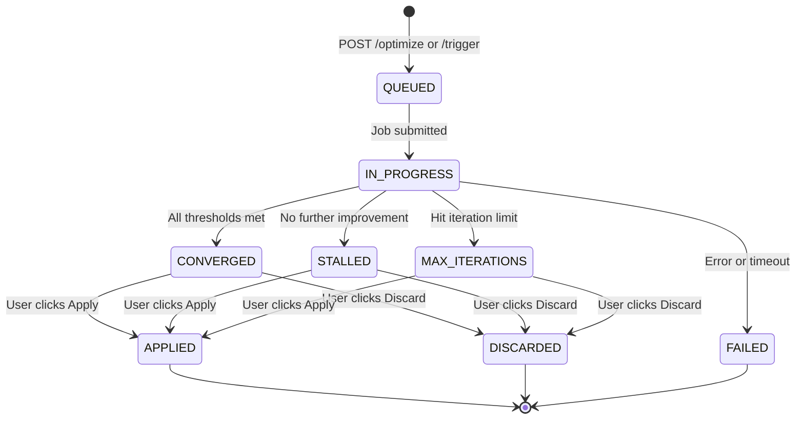

# 06 -- State Management

[Back to Index](00-index.md) | Previous: [05 Optimization Levers](05-optimization-levers.md) | Next: [07 API Reference](07-api-reference.md)

---

## Overview

The optimizer maintains all state in Delta tables, providing ACID transactions, time travel, and schema evolution. State is partitioned by `run_id` (or `space_id` where appropriate), enabling concurrent runs on different spaces without conflict.

---

## Delta Tables

All tables are created in `{catalog}.{schema}` (configured via `GENIE_SPACE_OPTIMIZER_CATALOG` and `GENIE_SPACE_OPTIMIZER_SCHEMA` environment variables). Tables are created automatically on first use via `ensure_optimization_tables()`.

### 1. `genie_opt_runs`

One row per optimization run. The primary state record.

| Column | Type | Description |
|--------|------|-------------|
| `run_id` | STRING | Primary key (UUID) |
| `space_id` | STRING | Genie Space ID |
| `status` | STRING | Current run status |
| `triggered_by` | STRING | User email or "system" |
| `apply_mode` | STRING | `genie_config`, `uc_artifact`, or `both` |
| `config_snapshot` | STRING | JSON snapshot of original Genie Space config |
| `best_accuracy` | DOUBLE | Best overall accuracy achieved |
| `best_repeatability` | DOUBLE | Best repeatability score |
| `best_iteration` | INT | Iteration that achieved best accuracy |
| `baseline_accuracy` | DOUBLE | Baseline evaluation score |
| `optimized_accuracy` | DOUBLE | Final optimized score |
| `convergence_reason` | STRING | Why the run stopped |
| `experiment_name` | STRING | MLflow experiment path |
| `job_run_id` | STRING | Databricks job run ID |
| `labeling_session_url` | STRING | MLflow labeling session URL |
| `created_at` | TIMESTAMP | Run creation time |
| `updated_at` | TIMESTAMP | Last update time |

### 2. `genie_opt_stages`

Per-stage timeline tracking. Each major step writes start/complete/error records.

| Column | Type | Description |
|--------|------|-------------|
| `run_id` | STRING | Foreign key to runs |
| `stage` | STRING | Stage name (e.g., `PREFLIGHT_STARTED`, `LEVER_1_EVAL_DONE`) |
| `status` | STRING | `started`, `completed`, `failed` |
| `detail_json` | STRING | JSON with stage-specific details |
| `error_message` | STRING | Error text if failed |
| `duration_seconds` | DOUBLE | Stage duration |
| `started_at` | TIMESTAMP | Stage start time |

### 3. `genie_opt_iterations`

Per-evaluation scores across all quality dimensions.

| Column | Type | Description |
|--------|------|-------------|
| `run_id` | STRING | Foreign key to runs |
| `iteration` | INT | Iteration number (0 = baseline) |
| `lever` | INT | Lever number (null for baseline) |
| `eval_scope` | STRING | `full`, `slice`, `p0`, `held_out` |
| `overall_accuracy` | DOUBLE | Mean of all dimension scores |
| `total_questions` | INT | Number of questions evaluated |
| `correct_count` | INT | Number of passing questions |
| `thresholds_met` | BOOLEAN | Whether all thresholds met |
| `scores_json` | STRING | JSON with per-dimension scores |
| `mlflow_run_id` | STRING | MLflow evaluation run ID |
| `reflection_json` | STRING | JSON with reflection entry for this iteration |
| `created_at` | TIMESTAMP | Evaluation timestamp |

### 4. `genie_opt_patches`

Individual patch records with full before/after values.

| Column | Type | Description |
|--------|------|-------------|
| `run_id` | STRING | Foreign key to runs |
| `patch_id` | STRING | Unique patch identifier |
| `iteration` | INT | Iteration that generated this patch |
| `lever` | INT | Which lever generated it |
| `patch_type` | STRING | e.g., `add_column_description`, `rewrite_instruction` |
| `target_object` | STRING | What was changed (table.column, instruction ID, etc.) |
| `old_value` | STRING | Previous value |
| `new_value` | STRING | New value |
| `risk_level` | STRING | `low`, `medium`, `high` |
| `rolled_back` | BOOLEAN | Whether the patch was reverted |
| `rollback_reason` | STRING | Why it was rolled back |
| `patch_index` | INT | Order within the iteration |
| `scope` | STRING | `genie_config`, `uc_artifact`, or `both` |
| `created_at` | TIMESTAMP | Patch timestamp |

### 5. `genie_eval_asi_results`

ASI (Automated Structured Investigation) failure assessments from judges.

| Column | Type | Description |
|--------|------|-------------|
| `run_id` | STRING | Foreign key to runs |
| `iteration` | INT | Iteration number |
| `question_id` | STRING | Benchmark question ID |
| `judge` | STRING | Judge name |
| `value` | STRING | Judge verdict (`pass`, `fail`, score) |
| `failure_type` | STRING | e.g., `wrong_column`, `missing_join_spec` |
| `severity` | STRING | `critical`, `major`, `minor` |
| `confidence` | DOUBLE | Judge confidence (0-1) |
| `blame_set` | STRING | JSON array of blamed objects |
| `counterfactual_fix` | STRING | Suggested fix |
| `wrong_clause` | STRING | Specific SQL clause that was wrong |
| `arbiter_verdict` | STRING | Arbiter verdict if applicable |
| `mlflow_run_id` | STRING | MLflow run ID for trace linking |
| `created_at` | TIMESTAMP | Assessment timestamp |

### 6. `genie_opt_provenance`

End-to-end provenance linking every patch back to the judge verdicts that motivated it.

| Column | Type | Description |
|--------|------|-------------|
| `run_id` | STRING | Foreign key to runs |
| `iteration` | INT | Iteration number |
| `lever` | INT | Lever number |
| `question_id` | STRING | Question that triggered the investigation |
| `judge` | STRING | Judge that found the failure |
| `judge_verdict` | STRING | What the judge reported |
| `resolved_root_cause` | STRING | Root cause after clustering |
| `signal_type` | STRING | `hard` or `soft` |
| `cluster_id` | STRING | Failure cluster identifier |
| `proposal_id` | STRING | Generated proposal identifier |
| `patch_type` | STRING | Resulting patch type |
| `gate_type` | STRING | Which gate evaluated it |
| `gate_result` | STRING | `pass` or `fail` |
| `resolution_method` | STRING | How the root cause was addressed |
| `blame_set` | STRING | JSON array of blamed objects |
| `counterfactual_fix` | STRING | Suggested fix |
| `created_at` | TIMESTAMP | Record timestamp |

### 7. `genie_opt_queued_patches`

High-risk patches pending human approval.

| Column | Type | Description |
|--------|------|-------------|
| `run_id` | STRING | Foreign key to runs |
| `space_id` | STRING | Genie Space ID |
| `patch_type` | STRING | e.g., `remove_tvf` |
| `target_object` | STRING | What would be changed |
| `confidence_tier` | STRING | `high`, `medium`, `low` |
| `coverage_analysis` | STRING | JSON with overlap analysis |
| `status` | STRING | `pending`, `approved`, `rejected` |
| `created_at` | TIMESTAMP | Queue timestamp |

### 8. `genie_opt_flagged_questions`

Questions flagged for human review after exhausting automated approaches.

| Column | Type | Description |
|--------|------|-------------|
| `run_id` | STRING | Foreign key to runs |
| `space_id` | STRING | Genie Space ID |
| `question_id` | STRING | Benchmark question ID |
| `question_text` | STRING | The question |
| `reason` | STRING | Why it was flagged |
| `status` | STRING | `pending`, `reviewed`, `resolved` |
| `created_at` | TIMESTAMP | Flag timestamp |

---

## Run Lifecycle



### Status Definitions

| Status | Meaning |
|--------|---------|
| `QUEUED` | Run created, job not yet submitted |
| `IN_PROGRESS` | Job running, pipeline executing |
| `CONVERGED` | All quality thresholds met |
| `STALLED` | Optimization attempted but couldn't improve further |
| `MAX_ITERATIONS` | Hit the iteration limit without meeting all thresholds |
| `FAILED` | Error during execution |
| `APPLIED` | User confirmed the optimized configuration |
| `DISCARDED` | User rolled back to the original configuration |

---

## Provenance Chain

The provenance system creates a traceable path from every patch back to the judge verdicts that motivated it:

```
Judge verdict (ASI) --> Failure cluster --> Strategy action group --> Proposal --> Patch --> Gate result
```

This is queryable via the `genie_opt_provenance` table and visualized in the UI's Provenance Panel.

---

## Data Access

### Reading State

The backend reads state via `state.load_run()`, `state.load_stages()`, `state.load_iterations()`, `state.load_patches()`. These use `delta_helpers.read_table()` which handles:
- Schema change errors (`SCHEMA_CHANGE_SINCE_ANALYSIS`) with automatic `REFRESH TABLE` retry
- NaN/Inf scrubbing via `_scrub_nan()`
- Partition pruning on `run_id`

### Writing State

State writes use `state.create_run()`, `state.update_run_status()`, `state.write_stage()`, `state.write_iteration()`, `state.write_patch()`. These append to Delta tables with automatic schema evolution.

---

Next: [07 -- API Reference](07-api-reference.md)
