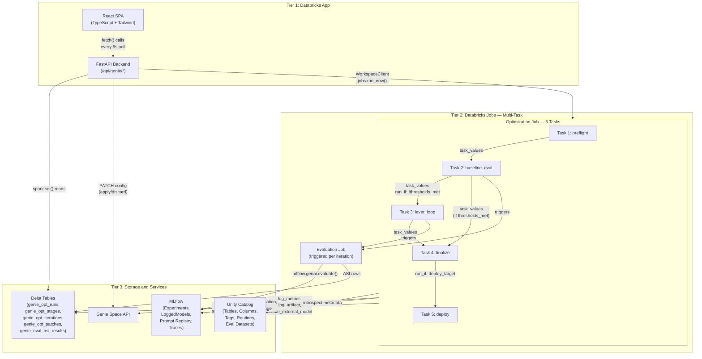
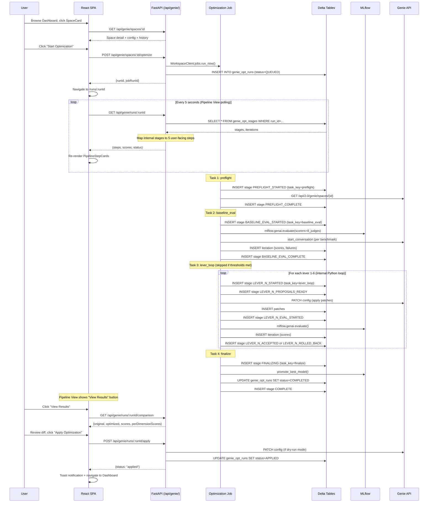
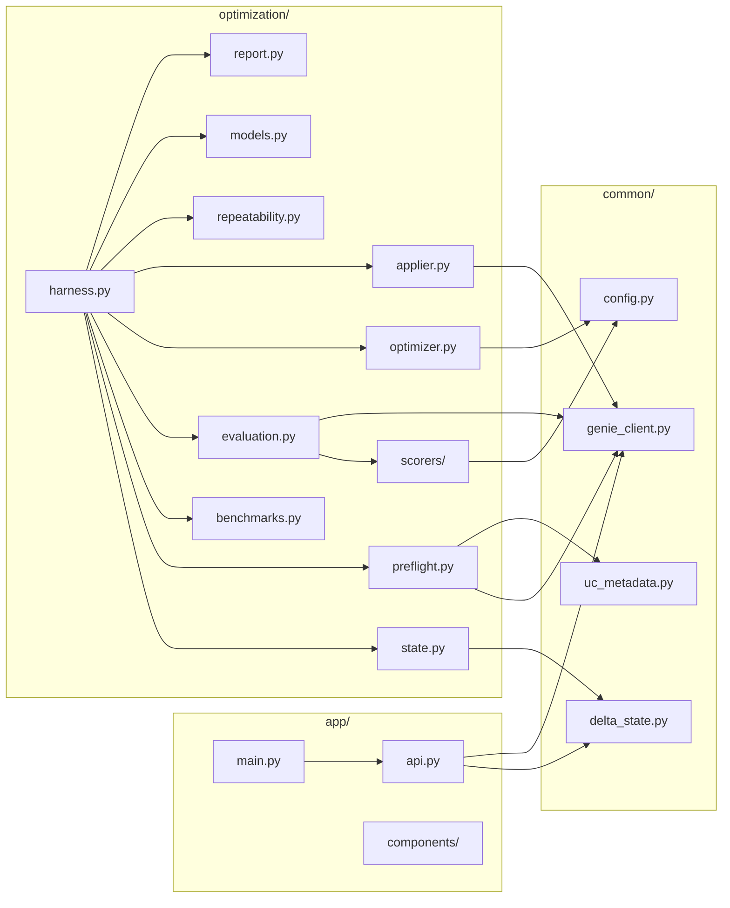

# Genie Space Optimizer App — Architecture Overview

## 1. Design Philosophy

The Genie Space Optimizer is a **Databricks App** that exposes a deterministic, repeatable optimization harness as a service. Users log in, select a Genie Space, and click "Optimize." The system runs a multi-stage pipeline (benchmark, evaluate, optimize, apply, re-evaluate) with full transparency — every stage transition, every score, every patch is visible in real time.

Key principles:

- **Orchestration-by-code, not orchestration-by-agent.** The optimization pipeline is a pure Python function with fixed stage ordering, fixed judges, fixed thresholds, and fixed convergence criteria. No LLM decides what to do next.
- **Stateless UI, durable compute.** The React SPA is a read-only dashboard backed by a FastAPI API. The optimization runs as a Databricks Job on its own cluster. If the app restarts, nothing is lost.
- **Apply/Discard control.** Users review a side-by-side diff of original vs. optimized configurations and explicitly choose to apply or discard. The system never auto-applies changes without user consent.
- **Delta as the single source of truth.** All state is in Delta tables — queryable by SQL, visible to the UI, auditable by governance tools.
- **Same function, same inputs, same behavior.** The harness is a library callable from a job, a notebook, or a test. No skill files, no agent routing.

---

## 2. Three-Tier Architecture



### Tier 1 — Databricks App (React SPA + FastAPI)

| Component | Responsibility |
|-----------|---------------|
| **React SPA** | 4 screens: Dashboard (space grid + activity), Space Detail (config + start optimization), Pipeline View (live step progress), Comparison View (side-by-side diff + apply/discard) |
| **FastAPI backend** | REST endpoints under `/api/genie/` for space listing, job submission, run status, comparison data, apply/discard actions |

The frontend is built with React 18, TypeScript, Vite, and Tailwind CSS. It communicates exclusively with the FastAPI backend via REST. The app runs as a Databricks App container with SSO authentication. The app process never runs optimization logic — it only reads Delta, submits/cancels jobs, and applies/discards configurations.

### Tier 2 — Databricks Jobs (Multi-Task Optimization)

The optimization runs as a **single Databricks Job with 5 tasks** connected by `depends_on` and `run_if`:

| Task | Notebook | Responsibility | Depends On |
|------|----------|---------------|------------|
| **preflight** | `run_preflight.py` | Fetch config, UC metadata, generate/load benchmarks, create MLflow experiment, snapshot model | — |
| **baseline_eval** | `run_baseline.py` | Run full 8-judge evaluation, check if thresholds already met | preflight |
| **lever_loop** | `run_lever_loop.py` | Iterate levers 1-6 with convergence checking (internal Python loop) | baseline_eval (`run_if`: thresholds NOT met) |
| **finalize** | `run_finalize.py` | Repeatability test, promote best model, generate report | lever_loop OR baseline_eval |
| **deploy** | `run_deploy.py` | Deploy via DABs, held-out evaluation | finalize (`run_if`: deploy_target set) |

**Evaluation Job** runs `mlflow.genai.evaluate()` with the 8-judge suite. Triggered by baseline_eval and lever_loop tasks via `WorkspaceClient.jobs.submit_run()`.

**Why multi-task?**
- **Workflows UI** shows exactly which stage is running (task 2/5), with per-task duration
- **Per-task retry** — if lever_loop crashes, only lever_loop retries (not preflight again)
- **`run_if` conditions** — skip lever_loop if baseline already passes, skip deploy if no target
- **`dbutils.jobs.taskValues`** — clean parameter hand-off between stages
- **Per-task timeout** — preflight gets 600s, lever_loop gets 5400s

**Inter-task data flow:**

| Mechanism | What It Carries | Direction |
|-----------|----------------|-----------|
| `dbutils.jobs.taskValues` | run_id, model_id, experiment_name, scores, thresholds_met | Task → next task |
| Delta tables | Stage transitions, iteration scores, patches, ASI | Task → Delta → UI / resume |
| MLflow | Eval run IDs, model versions, traces | Task → MLflow → report |

### Tier 3 — Storage and Services

| Component | Responsibility |
|-----------|---------------|
| **Delta tables** | Optimization run state, stage transitions, iteration scores, patches, ASI results |
| **MLflow** | Experiment tracking, LoggedModels (config versioning), Prompt Registry, evaluation traces |
| **Unity Catalog** | Table/column/tag/routine metadata for introspection; evaluation datasets; trace storage |
| **Genie Space API** | Query execution (`start_conversation`/`get_message`), config reads (`GET /spaces/{id}`) |

---

## 3. Data Flow



---

## 4. Technology Choices

| Decision | Choice | Rationale |
|----------|--------|-----------|
| Frontend | React 18 + TypeScript + Vite + Tailwind CSS | Modern SPA with type safety, fast builds, responsive design, Databricks-branded UI |
| API layer | FastAPI | REST endpoints under `/api/genie/`, async support, Pydantic response models, serves React static build |
| State store | Delta tables | ACID guarantees, multi-reader, SQL-queryable, time travel for audit, partitioned by `run_id` |
| Compute | Databricks Jobs (multi-task) | 5-task DAG with per-task retry/timeout, Workflows UI shows stage progress, `dbutils.jobs.taskValues` for inter-task data |
| Evaluation | MLflow GenAI | `mlflow.genai.evaluate()` with custom `@scorer` judges, Prompt Registry, LoggedModels, trace storage |
| Config versioning | MLflow LoggedModels | Snapshot Genie config + UC metadata per iteration, promote/rollback by model ID |
| Metadata store | Unity Catalog | Table/column/tag introspection, evaluation dataset storage, trace location |

**Why not run optimization inside the app process?**
- Optimization can take 30-60 minutes (25 benchmarks x 12s rate limit x 5 iterations = ~25 min minimum).
- The app container has limited compute and memory.
- If the app restarts (deploy, crash, scaling), the optimization would be lost.
- Jobs provide compute isolation, auto-scaling, and audit trails.

**Why Delta instead of JSON file?**
- `optimization-progress.json` is a single-writer file with no query capability.
- Delta supports concurrent reads from the UI while the job writes.
- Delta gives SQL access for ad-hoc debugging (`SELECT * FROM genie_opt_stages WHERE run_id = '...'`).
- Delta time travel enables audit and rollback.

---

## 5. Project Structure

```
src/wanderbricks_semantic/
├── app/                                  # Databricks App (Tier 1)
│   ├── frontend/                         # React SPA
│   │   ├── src/
│   │   │   ├── App.tsx                   # Root component with React Router
│   │   │   ├── main.tsx                  # Vite entry point
│   │   │   ├── pages/
│   │   │   │   ├── Dashboard.tsx         # Screen 1: space grid + activity
│   │   │   │   ├── SpaceDetail.tsx       # Screen 2: config + start optimization
│   │   │   │   ├── PipelineView.tsx      # Screen 3: live pipeline progress
│   │   │   │   └── ComparisonView.tsx    # Screen 4: diff + apply/discard
│   │   │   ├── components/              # Reusable components (SpaceCard, SearchBar, etc.)
│   │   │   ├── api/client.ts            # Typed fetch wrappers for /api/genie/*
│   │   │   └── types/index.ts           # TypeScript interfaces
│   │   ├── vite.config.ts
│   │   ├── tailwind.config.js
│   │   └── package.json
│   ├── backend/                          # FastAPI backend
│   │   ├── main.py                       # FastAPI app + static file serving
│   │   ├── routes/                       # Route modules (spaces, runs, activity)
│   │   ├── services/                     # Business logic (genie, optimization, comparison)
│   │   └── models.py                     # Pydantic response models
│   └── app.yaml                          # Databricks App manifest
│
├── optimization/                         # Optimization Harness (Tier 2)
│   ├── __init__.py
│   ├── harness.py                        # Stage functions + convenience optimize_genie_space()
│   ├── state.py                          # Delta state machine (read/write stages)
│   ├── preflight.py                      # Stage 1: config + UC metadata validation
│   ├── benchmarks.py                     # Benchmark generation, validation, MLflow sync
│   ├── evaluation.py                     # Evaluation orchestration (job-mode + inline)
│   ├── scorers/                          # 8 judge implementations
│   │   ├── __init__.py                   # all_scorers list
│   │   ├── syntax_validity.py
│   │   ├── schema_accuracy.py
│   │   ├── logical_accuracy.py
│   │   ├── semantic_equivalence.py
│   │   ├── completeness.py
│   │   ├── asset_routing.py
│   │   ├── result_correctness.py
│   │   └── arbiter.py
│   ├── optimizer.py                      # Failure clustering + proposal generation
│   ├── applier.py                        # Patch DSL rendering + apply + rollback
│   ├── repeatability.py                  # Cross-iteration + Cell 9c repeatability
│   ├── models.py                         # LoggedModel lifecycle
│   └── report.py                         # Optimization report generation
│
├── common/                               # Shared utilities
│   ├── __init__.py
│   ├── genie_client.py                   # Genie API wrapper (query, config fetch)
│   ├── uc_metadata.py                    # UC introspection (columns, tags, routines)
│   ├── delta_state.py                    # Generic Delta read/write helpers
│   └── config.py                         # Thresholds, constants, feature flags
│
├── jobs/                                 # Job task notebooks (one per task)
│   ├── run_preflight.py                  # Task 1: config + metadata + benchmarks
│   ├── run_baseline.py                   # Task 2: baseline evaluation
│   ├── run_lever_loop.py                 # Task 3: lever iteration loop
│   ├── run_finalize.py                   # Task 4: report + model promotion
│   ├── run_deploy.py                     # Task 5: DABs deploy + held-out eval
│   └── run_evaluation_only.py            # Standalone eval job entry point
│
├── run_genie_evaluation.py               # (existing) evaluation notebook
├── deploy_genie_spaces.py                # (existing) deployment script
├── create_tvfs.py                        # (existing) TVF creation
├── create_metric_views.py                # (existing) metric view creation
├── golden-queries.yaml                   # (deprecated — benchmarks now in MLflow eval datasets)
├── validate_genie_spaces_notebook.py     # (existing) validation notebook
└── validate_genie_benchmark_sql.py       # (existing) validation logic
```

### Package Boundaries



**Dependency rule:** `app/` depends on `common/` only (reads Delta, calls Genie API for space listing). It never imports `optimization/`. The `optimization/` package depends on `common/`. The `common/` package has no internal dependencies.

---

## 6. Resilience Model — Multi-Task + Delta State Machine

Resilience comes from two complementary layers: **Databricks Jobs DAG** for coarse-grained stage orchestration, and **Delta state machine** for fine-grained tracking within the lever loop.

### 6a. Jobs DAG — Coarse Orchestration

The 5-task DAG handles stage sequencing, conditional execution, and per-task retry:

- If `preflight` fails → `baseline_eval` never runs (dependency not met)
- If `baseline_eval` meets all thresholds → `lever_loop` is skipped (`run_if` condition)
- If `lever_loop` crashes → Databricks retries only that task (`max_retries: 1`), not the whole job
- Each task has its own timeout (preflight: 600s, lever_loop: 5400s, etc.)

### 6b. Delta State Machine — Fine-Grained Tracking

Within each task (especially `lever_loop`), every stage transition is written to `genie_opt_stages`:

- The lever loop writes `LEVER_1_STARTED`, `LEVER_1_PROPOSALS_READY`, `LEVER_1_ACCEPTED`, etc.
- If `lever_loop` crashes mid-lever and retries, it reads Delta to find the last completed lever and resumes
- The React app polls Delta via the API every 5 seconds to show lever-level progress
- Multiple concurrent runs are isolated by `run_id` partitioning

### 6c. Task Values — Inter-Task Data Flow

Each task sets output values via `dbutils.jobs.taskValues.set()` and downstream tasks read them via `dbutils.jobs.taskValues.get()`:

```python
# In preflight task:
dbutils.jobs.taskValues.set(key="model_id", value=model_id)
dbutils.jobs.taskValues.set(key="experiment_name", value=exp_name)

# In baseline_eval task:
model_id = dbutils.jobs.taskValues.get(taskKey="preflight", key="model_id")
```

### 6d. Safe Stage Wrapper

```python
def _safe_stage(run_id, stage_name, fn, *args):
    write_stage(run_id, stage_name, "STARTED")
    try:
        result = fn(*args)
        write_stage(run_id, stage_name, "COMPLETE", detail=result)
        return result
    except Exception as e:
        write_stage(run_id, stage_name, "FAILED", detail={"error": str(e)})
        raise
```

Every stage (within every task) is wrapped in `_safe_stage()` — so the UI always knows where a failure occurred.

---

## 7. Authentication and Security

| Concern | Mechanism |
|---------|-----------|
| User authentication | Databricks App SSO — automatic, no custom auth code needed |
| API authorization | App service principal inherits user permissions; users only see spaces they have access to |
| Job execution | Job runs as the app service principal (or configured user); has access to UC catalog/schema |
| Secret management | Databricks secrets for LLM endpoint config; no secrets in code |
| Data access | UC permissions enforce table/schema access; Delta tables in the optimization schema |

---

## 8. Scalability Considerations

| Dimension | Approach |
|-----------|----------|
| Multiple concurrent optimizations | Each run gets a unique `run_id`; Delta tables partitioned by `run_id`; multiple jobs can run in parallel |
| Multiple users watching same run | All users poll the same Delta tables; no session affinity needed |
| Large benchmark sets | Evaluation job scales to cluster size; benchmarks processed sequentially (Genie rate limit is the bottleneck, not compute) |
| History growth | Delta tables use `OPTIMIZE` and `VACUUM`; old runs archived after configurable retention |
