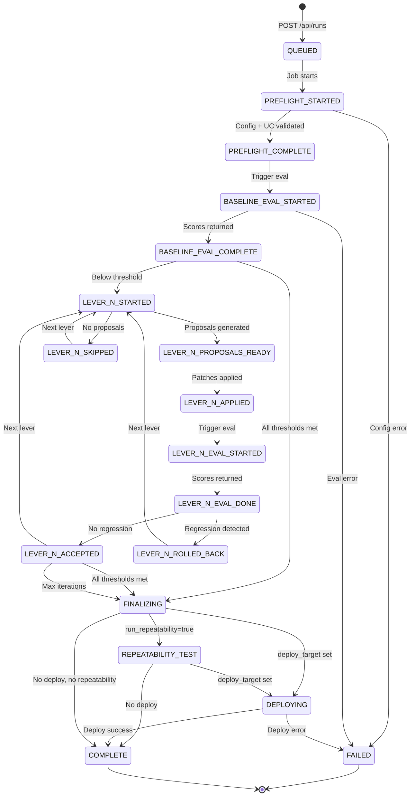

# Delta State Schema

All optimization state is stored in Delta tables within the Unity Catalog schema configured for the app (e.g., `{catalog}.{schema}`). This replaces the file-based `optimization-progress.json` used by the agent skill orchestrator.

---

## 1. State Machine



**Stage naming for levers:** Replace `N` with the lever number (1-6). For example: `LEVER_1_STARTED`, `LEVER_4_ROLLED_BACK`, `LEVER_6_EVAL_DONE`.

---

## 2. Table Definitions

### 2.1 `genie_opt_runs`

One row per optimization run. Created when the user clicks "Optimize" and updated as the run progresses.

```sql
CREATE TABLE IF NOT EXISTS {catalog}.{schema}.genie_opt_runs (
    run_id              STRING        NOT NULL COMMENT 'UUID for this optimization run',
    space_id            STRING        NOT NULL COMMENT 'Genie Space ID being optimized',
    domain              STRING        NOT NULL COMMENT 'Domain name (e.g. revenue_property)',
    catalog             STRING        NOT NULL COMMENT 'Unity Catalog name',
    uc_schema           STRING        NOT NULL COMMENT 'UC schema (catalog.schema format)',
    status              STRING        NOT NULL COMMENT 'QUEUED|IN_PROGRESS|CONVERGED|STALLED|MAX_ITERATIONS|FAILED|CANCELLED',
    started_at          TIMESTAMP     NOT NULL COMMENT 'When the run was created',
    completed_at        TIMESTAMP              COMMENT 'When the run reached a terminal state',
    job_run_id          STRING                 COMMENT 'Databricks Job run ID',
    max_iterations      INT           NOT NULL COMMENT 'Maximum lever iterations allowed',
    levers              STRING        NOT NULL COMMENT 'JSON array of lever numbers to try, e.g. [1,2,3,4,5,6]',
    apply_mode          STRING        NOT NULL DEFAULT 'genie_config' COMMENT 'Where patches are applied: genie_config|uc_artifact|both',
    deploy_target       STRING                 COMMENT 'DABs target for post-optimization deploy (null = no deploy)',
    benchmarks_generated BOOLEAN      DEFAULT false COMMENT 'True if benchmarks were auto-generated by LLM during this run',
    best_iteration      INT           DEFAULT 0 COMMENT 'Iteration number with highest accuracy',
    best_accuracy       DOUBLE        DEFAULT 0.0 COMMENT 'Best overall accuracy achieved (0-100)',
    best_repeatability  DOUBLE        DEFAULT 0.0 COMMENT 'Best repeatability percentage (0-100)',
    best_model_id       STRING                 COMMENT 'MLflow LoggedModel ID for the best iteration',
    convergence_reason  STRING                 COMMENT 'Why the run stopped (threshold_met|plateau|max_iterations|error)',
    experiment_name     STRING                 COMMENT 'MLflow experiment path',
    experiment_id       STRING                 COMMENT 'MLflow experiment ID',
    config_snapshot     STRING                 COMMENT 'JSON: Genie Space config at run start',
    triggered_by        STRING                 COMMENT 'User email who initiated the run',
    updated_at          TIMESTAMP     NOT NULL COMMENT 'Last update timestamp'
)
USING DELTA
PARTITIONED BY (space_id)
COMMENT 'Genie Space optimization runs — one row per optimization attempt'
TBLPROPERTIES (
    'delta.autoOptimize.optimizeWrite' = 'true',
    'delta.autoOptimize.autoCompact' = 'true'
);
```

### 2.2 `genie_opt_stages`

One row per stage transition. The harness writes a row every time it enters or exits a stage. This is the primary table the UI polls to render the progress stepper.

```sql
CREATE TABLE IF NOT EXISTS {catalog}.{schema}.genie_opt_stages (
    run_id              STRING        NOT NULL COMMENT 'FK to genie_opt_runs.run_id',
    task_key            STRING                 COMMENT 'Databricks Job task key (preflight, baseline_eval, lever_loop, finalize, deploy)',
    stage               STRING        NOT NULL COMMENT 'Stage name (PREFLIGHT_STARTED, LEVER_2_EVAL_DONE, etc.)',
    status              STRING        NOT NULL COMMENT 'STARTED|COMPLETE|FAILED|SKIPPED|ROLLED_BACK',
    started_at          TIMESTAMP     NOT NULL COMMENT 'When this stage began',
    completed_at        TIMESTAMP              COMMENT 'When this stage ended (null if in progress)',
    duration_seconds    DOUBLE                 COMMENT 'Wall-clock duration of this stage',
    lever               INT                    COMMENT 'Lever number (1-6) if this is a lever stage, null otherwise',
    iteration           INT                    COMMENT 'Evaluation iteration number if applicable',
    detail_json         STRING                 COMMENT 'JSON: stage-specific detail (see Section 3)',
    error_message       STRING                 COMMENT 'Error message if status=FAILED'
)
USING DELTA
PARTITIONED BY (run_id)
COMMENT 'Optimization stage transitions — ordered timeline of what happened'
TBLPROPERTIES (
    'delta.autoOptimize.optimizeWrite' = 'true',
    'delta.autoOptimize.autoCompact' = 'true'
);
```

### 2.3 `genie_opt_iterations`

One row per evaluation iteration. Contains the full score breakdown and failure list for each evaluation pass.

```sql
CREATE TABLE IF NOT EXISTS {catalog}.{schema}.genie_opt_iterations (
    run_id              STRING        NOT NULL COMMENT 'FK to genie_opt_runs.run_id',
    iteration           INT           NOT NULL COMMENT 'Evaluation iteration number (0 = baseline)',
    lever               INT                    COMMENT 'Which lever was applied before this eval (null for baseline)',
    eval_scope          STRING        NOT NULL COMMENT 'full|slice|p0|held_out',
    timestamp           TIMESTAMP     NOT NULL COMMENT 'When this evaluation completed',
    mlflow_run_id       STRING                 COMMENT 'MLflow run ID for this evaluation',
    model_id            STRING                 COMMENT 'LoggedModel ID used for this evaluation',
    overall_accuracy    DOUBLE        NOT NULL COMMENT 'Overall accuracy percentage (0-100)',
    total_questions     INT           NOT NULL COMMENT 'Number of benchmark questions evaluated',
    correct_count       INT           NOT NULL COMMENT 'Number of questions that passed all judges',
    scores_json         STRING        NOT NULL COMMENT 'JSON: per-judge scores {judge_name: score_0_to_100}',
    failures_json       STRING                 COMMENT 'JSON: array of failed question IDs',
    remaining_failures  STRING                 COMMENT 'JSON: array of question IDs still failing',
    arbiter_actions_json STRING                COMMENT 'JSON: array of arbiter verdicts',
    repeatability_pct   DOUBLE                 COMMENT 'Repeatability percentage (0-100) if measured',
    repeatability_json  STRING                 COMMENT 'JSON: per-question repeatability details',
    thresholds_met      BOOLEAN       NOT NULL COMMENT 'True if all quality thresholds passed',
    rows_json           STRING                 COMMENT 'JSON: per-question evaluation detail rows'
)
USING DELTA
PARTITIONED BY (run_id)
COMMENT 'Evaluation iteration results — scores and failures per eval pass'
TBLPROPERTIES (
    'delta.autoOptimize.optimizeWrite' = 'true',
    'delta.autoOptimize.autoCompact' = 'true'
);
```

### 2.4 `genie_opt_patches`

One row per patch applied (or rolled back). Provides a full audit trail of every metadata change made to the Genie Space.

```sql
CREATE TABLE IF NOT EXISTS {catalog}.{schema}.genie_opt_patches (
    run_id              STRING        NOT NULL COMMENT 'FK to genie_opt_runs.run_id',
    iteration           INT           NOT NULL COMMENT 'Iteration when this patch was applied',
    lever               INT           NOT NULL COMMENT 'Lever number (1-6)',
    patch_index         INT           NOT NULL COMMENT 'Index within the patch set',
    patch_type          STRING        NOT NULL COMMENT 'Patch type from PATCH_TYPES (e.g. add_instruction, update_mv_measure)',
    scope               STRING        NOT NULL COMMENT 'genie_config or uc_artifact or both',
    risk_level          STRING        NOT NULL COMMENT 'low|medium|high',
    target_object       STRING                 COMMENT 'Object being modified (table name, column name, etc.)',
    patch_json          STRING        NOT NULL COMMENT 'JSON: full patch definition',
    command_json        STRING                 COMMENT 'JSON: rendered action command',
    rollback_json       STRING                 COMMENT 'JSON: rollback command',
    applied_at          TIMESTAMP     NOT NULL COMMENT 'When the patch was applied',
    rolled_back         BOOLEAN       DEFAULT false COMMENT 'True if this patch was subsequently rolled back',
    rolled_back_at      TIMESTAMP              COMMENT 'When the rollback occurred',
    rollback_reason     STRING                 COMMENT 'Why the patch was rolled back (regression, p0_failure, etc.)',
    proposal_id         STRING                 COMMENT 'FK to the proposal that generated this patch',
    cluster_id          STRING                 COMMENT 'Failure cluster that motivated this patch'
)
USING DELTA
PARTITIONED BY (run_id)
COMMENT 'Patch audit trail — every metadata change applied to Genie Space'
TBLPROPERTIES (
    'delta.autoOptimize.optimizeWrite' = 'true',
    'delta.autoOptimize.autoCompact' = 'true'
);
```

### 2.5 `genie_eval_asi_results` (existing)

Already exists in the current codebase. One row per judge per question per evaluation. Contains Actionable Side Information (ASI) used by the optimizer to cluster failures and generate proposals.

```sql
CREATE TABLE IF NOT EXISTS {catalog}.{schema}.genie_eval_asi_results (
    run_id              STRING        NOT NULL COMMENT 'MLflow run ID',
    iteration           INT           NOT NULL COMMENT 'Evaluation iteration number',
    question_id         STRING        NOT NULL COMMENT 'Benchmark question ID',
    judge               STRING        NOT NULL COMMENT 'Judge name (syntax_validity, schema_accuracy, etc.)',
    value               STRING        NOT NULL COMMENT 'Judge verdict (yes|no|skipped|genie_correct|...)',
    failure_type        STRING                 COMMENT 'From FAILURE_TAXONOMY (wrong_table, wrong_column, etc.)',
    severity            STRING                 COMMENT 'critical|major|minor|info',
    confidence          DOUBLE                 COMMENT 'Judge confidence (0.0-1.0)',
    blame_set           STRING                 COMMENT 'JSON: array of metadata fields blamed',
    counterfactual_fix  STRING                 COMMENT 'Suggested metadata change to fix the issue',
    wrong_clause        STRING                 COMMENT 'SQL clause that is wrong (SELECT, FROM, WHERE, etc.)',
    expected_value      STRING                 COMMENT 'What the correct value should be',
    actual_value        STRING                 COMMENT 'What Genie actually produced',
    missing_metadata    STRING                 COMMENT 'What metadata should exist but does not',
    ambiguity_detected  BOOLEAN                COMMENT 'True if the question is ambiguous',
    logged_at           TIMESTAMP     NOT NULL COMMENT 'When this ASI row was written'
)
USING DELTA
COMMENT 'Actionable Side Information from evaluation judges'
TBLPROPERTIES (
    'delta.autoOptimize.optimizeWrite' = 'true',
    'delta.autoOptimize.autoCompact' = 'true'
);
```

---

## 3. `detail_json` Schemas by Stage Type

The `genie_opt_stages.detail_json` column holds stage-specific context. Its schema depends on the stage name.

### PREFLIGHT_COMPLETE

```json
{
    "space_title": "Revenue & Property Intelligence",
    "space_tables_count": 5,
    "space_tvfs_count": 4,
    "space_mvs_count": 2,
    "uc_columns_count": 87,
    "uc_tags_count": 12,
    "uc_routines_count": 15,
    "benchmarks_count": 25,
    "benchmarks_valid": 24,
    "benchmarks_invalid": 1,
    "experiment_name": "/Users/user@example.com/genie-optimization/revenue_property",
    "experiment_id": "12345",
    "config_hash": "a1b2c3d4"
}
```

### BASELINE_EVAL_COMPLETE

```json
{
    "mlflow_run_id": "abc123",
    "model_id": "lm-xyz",
    "overall_accuracy": 72.0,
    "thresholds_met": false,
    "scores": {
        "syntax_validity": 100.0,
        "schema_accuracy": 88.0,
        "logical_accuracy": 76.0,
        "semantic_equivalence": 80.0,
        "completeness": 72.0,
        "result_correctness": 68.0,
        "asset_routing": 92.0
    },
    "failure_count": 7,
    "failures": ["rev_003", "rev_007", "rev_012", "rev_015", "rev_018", "rev_021", "rev_023"]
}
```

### LEVER_N_PROPOSALS_READY

```json
{
    "lever": 1,
    "lever_name": "Tables & Columns",
    "clusters_found": 3,
    "proposals_generated": 2,
    "proposals": [
        {
            "proposal_id": "P001",
            "cluster_id": "C001",
            "change_description": "Add column description for booking_date",
            "confidence": 0.85,
            "questions_fixed": 3,
            "net_impact": 2.55
        }
    ]
}
```

### LEVER_N_ACCEPTED / LEVER_N_ROLLED_BACK

```json
{
    "lever": 1,
    "before_scores": {"syntax_validity": 100.0, "schema_accuracy": 88.0},
    "after_scores": {"syntax_validity": 100.0, "schema_accuracy": 92.0},
    "delta": {"schema_accuracy": 4.0},
    "patches_applied": 2,
    "regression_detected": false,
    "rollback_reason": null
}
```

### REPEATABILITY_TEST

```json
{
    "mean_repeatability": 92.0,
    "identical_count": 20,
    "minor_variance_count": 3,
    "significant_variance_count": 2,
    "critical_variance_count": 0,
    "target": 90.0,
    "passed": true
}
```

---

## 4. Query Patterns for the UI

### Progress stepper (ordered stage timeline)

```sql
SELECT stage, status, started_at, completed_at, duration_seconds,
       lever, iteration, detail_json, error_message
FROM {catalog}.{schema}.genie_opt_stages
WHERE run_id = :run_id
ORDER BY started_at ASC
```

### Current run status

```sql
SELECT run_id, space_id, domain, status, started_at, completed_at,
       best_iteration, best_accuracy, best_repeatability, convergence_reason,
       experiment_name, job_run_id
FROM {catalog}.{schema}.genie_opt_runs
WHERE run_id = :run_id
```

### Score chart (accuracy across iterations)

```sql
SELECT iteration, lever, overall_accuracy, scores_json, thresholds_met
FROM {catalog}.{schema}.genie_opt_iterations
WHERE run_id = :run_id AND eval_scope = 'full'
ORDER BY iteration ASC
```

### Failure table with ASI detail

```sql
SELECT a.question_id, a.judge, a.value, a.failure_type, a.severity,
       a.blame_set, a.counterfactual_fix, a.wrong_clause
FROM {catalog}.{schema}.genie_eval_asi_results a
INNER JOIN (
    SELECT MAX(iteration) AS max_iter
    FROM {catalog}.{schema}.genie_opt_iterations
    WHERE run_id = :run_id AND eval_scope = 'full'
) latest
WHERE a.run_id = (
    SELECT mlflow_run_id FROM {catalog}.{schema}.genie_opt_iterations
    WHERE run_id = :run_id AND eval_scope = 'full'
    ORDER BY iteration DESC LIMIT 1
)
AND a.value NOT IN ('yes', 'skipped')
ORDER BY a.severity DESC, a.question_id
```

### Patch audit trail

```sql
SELECT iteration, lever, patch_type, scope, risk_level,
       target_object, applied_at, rolled_back, rollback_reason
FROM {catalog}.{schema}.genie_opt_patches
WHERE run_id = :run_id
ORDER BY applied_at ASC
```

### Space selector (with last optimization metadata)

```sql
SELECT r.space_id, r.domain, r.status, r.best_accuracy, r.best_repeatability,
       r.completed_at AS last_optimized, r.convergence_reason
FROM {catalog}.{schema}.genie_opt_runs r
INNER JOIN (
    SELECT space_id, MAX(started_at) AS latest
    FROM {catalog}.{schema}.genie_opt_runs
    GROUP BY space_id
) latest ON r.space_id = latest.space_id AND r.started_at = latest.latest
ORDER BY r.completed_at DESC
```

### Optimization history for a space

```sql
SELECT run_id, status, started_at, completed_at,
       best_accuracy, best_repeatability, best_iteration, convergence_reason
FROM {catalog}.{schema}.genie_opt_runs
WHERE space_id = :space_id
ORDER BY started_at DESC
```

---

## 5. Helper Functions

### `write_stage()`

```python
def write_stage(
    spark,
    run_id: str,
    stage: str,
    status: str,
    *,
    catalog: str,
    schema: str,
    task_key: str | None = None,
    lever: int | None = None,
    iteration: int | None = None,
    detail: dict | None = None,
    error_message: str | None = None,
) -> None:
    """Write a stage transition row to genie_opt_stages.

    Called by each task notebook at every stage boundary. task_key identifies
    which Databricks Job task wrote this row (preflight, baseline_eval,
    lever_loop, finalize, deploy). Computes duration by looking up the
    previous stage's started_at for this run_id.
    """
    from datetime import datetime, timezone
    import json

    now = datetime.now(timezone.utc)
    table = f"{catalog}.{schema}.genie_opt_stages"

    spark.sql(f"""
        INSERT INTO {table}
        VALUES (
            '{run_id}',
            '{stage}',
            '{status}',
            TIMESTAMP '{now.isoformat()}',
            {"TIMESTAMP '" + now.isoformat() + "'" if status in ('COMPLETE', 'FAILED', 'SKIPPED', 'ROLLED_BACK') else 'NULL'},
            NULL,
            {lever if lever is not None else 'NULL'},
            {iteration if iteration is not None else 'NULL'},
            {("'" + json.dumps(detail).replace("'", "''") + "'") if detail else 'NULL'},
            {("'" + error_message.replace("'", "''") + "'") if error_message else 'NULL'}
        )
    """)
```

### `read_latest_stage()`

```python
def read_latest_stage(
    spark,
    run_id: str,
    catalog: str,
    schema: str,
) -> dict | None:
    """Read the most recent stage for a run. Used by the UI for current status."""
    table = f"{catalog}.{schema}.genie_opt_stages"
    rows = spark.sql(f"""
        SELECT stage, status, started_at, completed_at, lever, iteration,
               detail_json, error_message
        FROM {table}
        WHERE run_id = '{run_id}'
        ORDER BY started_at DESC
        LIMIT 1
    """).collect()

    if not rows:
        return None
    row = rows[0].asDict()
    if row.get("detail_json"):
        import json
        row["detail"] = json.loads(row["detail_json"])
    return row
```

### `write_iteration()`

```python
def write_iteration(
    spark,
    run_id: str,
    iteration: int,
    eval_result: dict,
    *,
    catalog: str,
    schema: str,
    lever: int | None = None,
    eval_scope: str = "full",
    model_id: str | None = None,
) -> None:
    """Write an evaluation iteration result to genie_opt_iterations."""
    import json
    from datetime import datetime, timezone

    table = f"{catalog}.{schema}.genie_opt_iterations"
    now = datetime.now(timezone.utc)

    scores = eval_result.get("scores", {})
    failures = eval_result.get("failures", [])
    remaining = eval_result.get("remaining_failures", failures)
    arbiter_actions = eval_result.get("arbiter_actions", [])

    thresholds_met = eval_result.get("thresholds_met", False)
    if isinstance(thresholds_met, (int, float)):
        thresholds_met = thresholds_met == 1.0

    spark.sql(f"""
        INSERT INTO {table}
        VALUES (
            '{run_id}', {iteration}, {lever if lever is not None else 'NULL'},
            '{eval_scope}',
            TIMESTAMP '{now.isoformat()}',
            {("'" + eval_result.get('mlflow_run_id', '') + "'") if eval_result.get('mlflow_run_id') else 'NULL'},
            {("'" + model_id + "'") if model_id else 'NULL'},
            {eval_result.get('overall_accuracy', 0.0)},
            {eval_result.get('total_questions', 0)},
            {eval_result.get('correct_count', 0)},
            '{json.dumps(scores).replace("'", "''")}',
            '{json.dumps(failures).replace("'", "''")}',
            '{json.dumps(remaining).replace("'", "''")}',
            '{json.dumps(arbiter_actions).replace("'", "''")}',
            {eval_result.get('repeatability_pct', 'NULL')},
            {("'" + json.dumps(eval_result.get('repeatability_details', [])).replace("'", "''") + "'") if eval_result.get('repeatability_details') else 'NULL'},
            {str(thresholds_met).lower()},
            NULL
        )
    """)
```

### `update_run_status()`

```python
def update_run_status(
    spark,
    run_id: str,
    *,
    catalog: str,
    schema: str,
    status: str | None = None,
    best_iteration: int | None = None,
    best_accuracy: float | None = None,
    best_repeatability: float | None = None,
    best_model_id: str | None = None,
    convergence_reason: str | None = None,
) -> None:
    """Update fields on a run row. Only non-None fields are updated."""
    from datetime import datetime, timezone

    table = f"{catalog}.{schema}.genie_opt_runs"
    now = datetime.now(timezone.utc)

    sets = [f"updated_at = TIMESTAMP '{now.isoformat()}'"]
    if status:
        sets.append(f"status = '{status}'")
        if status in ("CONVERGED", "STALLED", "MAX_ITERATIONS", "FAILED", "CANCELLED"):
            sets.append(f"completed_at = TIMESTAMP '{now.isoformat()}'")
    if best_iteration is not None:
        sets.append(f"best_iteration = {best_iteration}")
    if best_accuracy is not None:
        sets.append(f"best_accuracy = {best_accuracy}")
    if best_repeatability is not None:
        sets.append(f"best_repeatability = {best_repeatability}")
    if best_model_id is not None:
        sets.append(f"best_model_id = '{best_model_id}'")
    if convergence_reason is not None:
        sets.append(f"convergence_reason = '{convergence_reason}'")

    spark.sql(f"""
        UPDATE {table}
        SET {', '.join(sets)}
        WHERE run_id = '{run_id}'
    """)
```

---

## 6. Migration from `optimization-progress.json`

| JSON field | Delta table | Column(s) |
|------------|-------------|-----------|
| `space_id` | `genie_opt_runs` | `space_id` |
| `domain` | `genie_opt_runs` | `domain` |
| `started_at` | `genie_opt_runs` | `started_at` |
| `current_iteration` | Derived: `MAX(iteration) FROM genie_opt_iterations` | — |
| `max_iterations` | `genie_opt_runs` | `max_iterations` |
| `status` | `genie_opt_runs` | `status` |
| `iterations[]` | `genie_opt_iterations` | One row per iteration |
| `iterations[].scores` | `genie_opt_iterations` | `scores_json` |
| `iterations[].failures` | `genie_opt_iterations` | `failures_json` |
| `iterations[].model_id` | `genie_opt_iterations` | `model_id` |
| `iterations[].mlflow_run_id` | `genie_opt_iterations` | `mlflow_run_id` |
| `best_iteration` | `genie_opt_runs` | `best_iteration` |
| `best_overall_accuracy` | `genie_opt_runs` | `best_accuracy` |
| `remaining_failures` | `genie_opt_iterations` (latest) | `remaining_failures` |
| `convergence_reason` | `genie_opt_runs` | `convergence_reason` |
| `promoted_model_id` | `genie_opt_runs` | `best_model_id` |
| `score_history[]` | `genie_opt_iterations` (all full-scope rows) | `scores_json`, `overall_accuracy` |
| `patch_history[]` | `genie_opt_patches` | One row per patch |
| `pareto_frontier[]` | Derived: query `genie_opt_iterations` + `genie_opt_patches` | — |
| `current_patch_set` | `genie_opt_patches` (latest iteration, `rolled_back=false`) | — |
| `patched_objects` | `genie_opt_patches` (distinct `target_object`) | — |
| `lever_impacts` | `genie_opt_stages` (LEVER_N_ACCEPTED/ROLLED_BACK) | `detail_json` |
| `lever_audit` | `genie_opt_stages` (all LEVER_N_* rows) | Derived from stage history |
| `benchmark_corrections[]` | `genie_eval_asi_results` (arbiter, value=genie_correct) | — |
| `repeatability_pct` | `genie_opt_iterations` (latest with repeatability) | `repeatability_pct` |
| `eval_dataset_name` | `genie_opt_runs` | `experiment_name` (dataset derived from domain) |

---

## 7. Table Creation Script

```python
def ensure_optimization_tables(spark, catalog: str, schema: str) -> None:
    """Create all optimization Delta tables if they don't exist.

    Called once during app startup or job initialization.
    Idempotent — safe to call multiple times.
    """
    tables = {
        "genie_opt_runs": GENIE_OPT_RUNS_DDL,
        "genie_opt_stages": GENIE_OPT_STAGES_DDL,
        "genie_opt_iterations": GENIE_OPT_ITERATIONS_DDL,
        "genie_opt_patches": GENIE_OPT_PATCHES_DDL,
        "genie_eval_asi_results": GENIE_EVAL_ASI_RESULTS_DDL,
    }
    for name, ddl in tables.items():
        resolved = ddl.replace("{catalog}", catalog).replace("{schema}", schema)
        spark.sql(resolved)
        print(f"  [OK] {catalog}.{schema}.{name}")
```

Each `*_DDL` constant contains the corresponding `CREATE TABLE IF NOT EXISTS` statement from Section 2.
