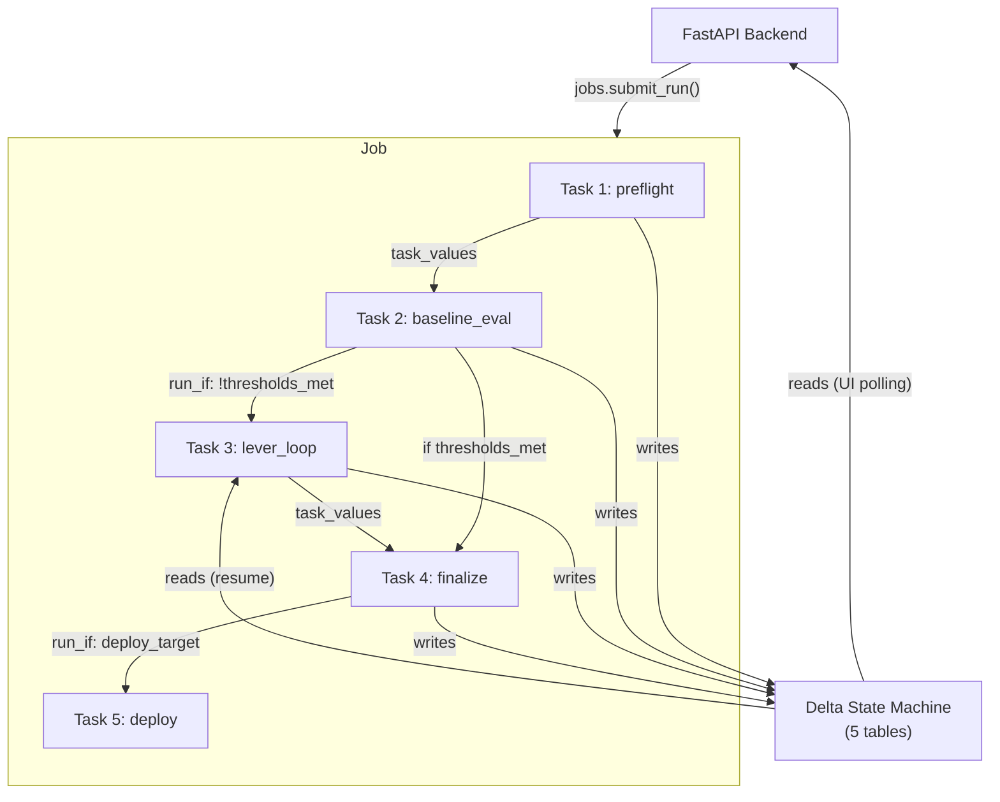
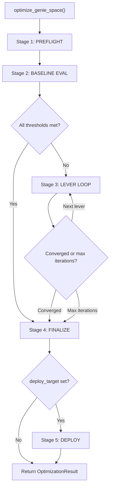

# Optimization Harness

The optimization harness is a library of stage functions executed as a **multi-task Databricks Job**. Each stage runs as a separate task in one job, connected by `depends_on` and `run_if` conditions, with `dbutils.jobs.taskValues` for inter-task parameter passing.

---

## 0. Architecture: Multi-Task Job + Delta State Machine



**Multi-task execution.** Each stage runs as a separate Databricks Job task on Serverless compute. The hand-off between stages uses `dbutils.jobs.taskValues` for parameters (run_id, model_id, scores) and Delta for detailed state.

**Two layers of resilience:**

1. **Jobs DAG (coarse):** If `preflight` fails, `baseline_eval` never runs. If baseline meets thresholds, `lever_loop` is skipped via `run_if`. Each task has its own timeout and `max_retries: 1`.
2. **Delta state machine (fine):** Within the `lever_loop` task, every lever transition is written to Delta. If the task crashes mid-lever and retries, `_resume_lever_loop()` reads the last completed lever from Delta and continues.

**Inter-task data flow via task values:**

| Task | Sets | Reads From |
|------|------|------------|
| preflight | `run_id`, `model_id`, `experiment_name`, `benchmarks_count`, `config_hash` | job parameters |
| baseline_eval | `baseline_scores` (JSON), `thresholds_met`, `baseline_accuracy`, `mlflow_run_id` | preflight task values |
| lever_loop | `final_scores` (JSON), `best_iteration`, `best_model_id`, `levers_accepted` (JSON), `levers_rolled_back` (JSON), `iteration_count` | baseline_eval task values |
| finalize | `final_status`, `report_path`, `convergence_reason` | lever_loop OR baseline_eval task values |
| deploy | `held_out_accuracy` | finalize task values |

**Resilience guarantees:**
- `_safe_stage()` wrapper catches all exceptions, writes `FAILED` to Delta, then re-raises
- Delta writes are atomic — partial stage data cannot corrupt the state machine
- Multiple concurrent optimization runs are isolated by `run_id` partitioning
- The lever loop reads Delta on entry to determine resume point if retried

---

## 1. Entry Points

### Primary: Multi-Task Job (5 notebooks)

In production, the optimization pipeline runs as a single Databricks Job with 5 tasks. Each task is a separate notebook that calls one stage function from the harness library:

| Notebook | Calls | Task Values In | Task Values Out |
|----------|-------|---------------|-----------------|
| `jobs/run_preflight.py` | `_run_preflight()` | job params | run_id, model_id, experiment_name |
| `jobs/run_baseline.py` | `_run_baseline()` | preflight values | baseline_scores, thresholds_met |
| `jobs/run_lever_loop.py` | `_run_lever_loop()` | baseline_eval values | final_scores, best_iteration, best_model_id |
| `jobs/run_finalize.py` | `_run_finalize()` | lever_loop OR baseline_eval values | final_status, report_path |
| `jobs/run_deploy.py` | `_run_deploy()` | finalize values | held_out_accuracy |

### Convenience: Single-Function (for notebooks/tests)

For ad-hoc use and testing, `optimize_genie_space()` orchestrates all 5 stages in-process:

```python
def optimize_genie_space(
    space_id: str,
    catalog: str,
    schema: str,
    domain: str,
    *,
    max_iterations: int = 5,
    deploy_target: str | None = None,
    levers: list[int] | None = None,
    apply_mode: str = "genie_config",
    thresholds: dict[str, float] | None = None,
    run_id: str | None = None,
    experiment_name: str | None = None,
    run_repeatability: bool = True,
    triggered_by: str | None = None,
) -> OptimizationResult:
    """Run the full pipeline in a single process (for notebooks and tests).

    Args:
        apply_mode: Where patches are applied. One of:
            - "genie_config" (DEFAULT): Write to Genie Space config overlays.
            - "uc_artifact": Write to UC via ALTER TABLE / MV YAML / TVF SQL.
            - "both": Write to both targets.
            Levers 4-6 are always Genie config native regardless.

    In production, use the multi-task job instead — it provides per-task
    retry, conditional execution, and Workflows UI visibility.

    This function calls the same stage functions that the job notebooks call.
    """
```

### `OptimizationResult`

```python
from dataclasses import dataclass, field

@dataclass
class OptimizationResult:
    run_id: str
    space_id: str
    domain: str
    status: str                          # CONVERGED | STALLED | MAX_ITERATIONS | FAILED
    best_iteration: int
    best_accuracy: float                 # 0-100
    best_repeatability: float            # 0-100
    best_model_id: str | None
    convergence_reason: str | None
    total_iterations: int
    levers_attempted: list[int]
    levers_accepted: list[int]
    levers_rolled_back: list[int]
    final_scores: dict[str, float]       # per-judge scores (0-100)
    experiment_name: str
    experiment_id: str
    report_path: str | None              # path to generated report
    error: str | None                    # error message if FAILED
```

---

## 2. Pipeline Stages



### Stage 1: PREFLIGHT

**Purpose:** Validate everything needed before evaluation begins, including generating benchmark questions if none exist.

```python
# Pseudocode
def _run_preflight(run_id, space_id, catalog, schema, domain, experiment_name):
    write_stage(run_id, "PREFLIGHT_STARTED", "STARTED")

    # 1. Fetch Genie Space config
    config = genie_client.fetch_space_config(space_id)
    #    GET /api/2.0/genie/spaces/{space_id}?include_serialized_space=true

    # 2. Fetch UC metadata
    uc_columns = uc_metadata.get_columns(catalog, schema)
    #    SELECT * FROM {catalog}.information_schema.columns WHERE table_schema = '{schema}'
    uc_tags = uc_metadata.get_tags(catalog, schema)
    #    SELECT * FROM {catalog}.information_schema.table_tags WHERE schema_name = '{schema}'
    uc_routines = uc_metadata.get_routines(catalog, schema)
    #    SELECT * FROM {catalog}.information_schema.routines WHERE routine_schema = '{schema}'

    # 3. Create MLflow experiment
    uc_schema = f"{catalog}.{schema}"
    exp_name = experiment_name or f"/Users/{user_email}/genie-optimization/{domain}"
    mlflow.set_experiment(exp_name)
    set_experiment_trace_location(uc_schema)

    # 4. Load or generate benchmarks
    eval_dataset_name = f"{uc_schema}.genie_benchmarks_{domain}"
    benchmarks_generated = False

    try:
        dataset = mlflow.genai.datasets.get_dataset(uc_table_name=eval_dataset_name)
        benchmarks = load_benchmarks_from_dataset(dataset)
        if len(benchmarks) < 5:
            raise ValueError("Insufficient benchmarks — regenerating")
    except Exception:
        # No existing dataset or too few benchmarks — generate via LLM
        write_stage(run_id, "BENCHMARK_GENERATION", "STARTED", detail={
            "reason": "no_existing_dataset",
            "target_count": TARGET_BENCHMARK_COUNT,
        })

        benchmarks = generate_benchmarks(
            config=config,
            uc_columns=uc_columns,
            uc_tags=uc_tags,
            uc_routines=uc_routines,
            domain=domain,
            catalog=catalog,
            schema=schema,
            spark=spark,
            target_count=TARGET_BENCHMARK_COUNT,
        )
        benchmarks_generated = True

        write_stage(run_id, "BENCHMARK_GENERATION", "COMPLETE", detail={
            "generated_count": len(benchmarks),
            "categories": list(set(b["category"] for b in benchmarks)),
        })

    # 5. Validate benchmark SQL
    validation = validate_benchmarks(benchmarks, spark)
    #    For each benchmark: spark.sql(f"EXPLAIN {resolve_sql(expected_sql)}") to verify

    # 6. Register / sync benchmarks to MLflow evaluation dataset
    dataset = mlflow.genai.datasets.create_dataset(uc_table_name=eval_dataset_name)
    dataset.merge_records(build_eval_records(benchmarks))

    # 7. Register judge prompts (first run only)
    register_judge_prompts(uc_schema, domain, exp_name)

    # 8. Create LoggedModel for iteration 0 (config snapshot)
    model_id = create_genie_model_version(
        space_id, config, iteration=0, domain=domain,
        uc_schema=uc_schema,
        uc_columns=uc_columns, uc_tags=uc_tags, uc_routines=uc_routines
    )

    write_stage(run_id, "PREFLIGHT_COMPLETE", "COMPLETE", detail={
        "space_title": config.get("title", ""),
        "uc_columns_count": len(uc_columns),
        "uc_tags_count": len(uc_tags),
        "uc_routines_count": len(uc_routines),
        "benchmarks_count": len(benchmarks),
        "benchmarks_generated": benchmarks_generated,
        "benchmarks_valid": validation["valid"],
        "benchmarks_invalid": validation["invalid"],
        "experiment_name": exp_name,
        "config_hash": compute_config_hash(config, uc_columns, uc_tags, uc_routines),
    })

    return config, benchmarks, model_id, exp_name
```

#### Benchmark Generation (Sub-Stage)

When no MLflow evaluation dataset exists for this domain (first optimization of a space), the harness auto-generates ~20 benchmark questions by calling **Databricks Claude Opus 4.6**:

```python
def generate_benchmarks(config, uc_columns, uc_tags, uc_routines,
                        domain, catalog, schema, spark,
                        target_count=20) -> list[dict]:
    """Generate benchmark questions + expected SQL from Genie Space metadata.

    1. Build context from: Genie Space tables/instructions/sample_questions,
       UC columns with descriptions, metric views, TVFs with signatures
    2. Call LLM (databricks-claude-opus-4-6) with BENCHMARK_GENERATION_PROMPT
    3. Parse JSON response into list of benchmark dicts
    4. Validate each expected_sql via spark.sql(f"EXPLAIN {resolve_sql(sql)}")
    5. Discard questions that fail validation
    6. Assign splits (80% train, 20% held_out) and priorities (top 3 = P0)

    Returns list of benchmark dicts, each containing:
        question, expected_sql, expected_asset, category, priority,
        split, required_tables, required_columns, question_id
    """
```

The generated benchmarks become the source of truth via the MLflow evaluation dataset — no YAML file needed. On subsequent runs for the same space, the existing dataset is loaded directly.

### Stage 2: BASELINE EVAL

**Purpose:** Establish baseline scores before any optimization.

```python
def _run_baseline(run_id, space_id, benchmarks, exp_name, model_id, catalog, schema):
    write_stage(run_id, "BASELINE_EVAL_STARTED", "STARTED", iteration=0)

    # Run full 8-judge evaluation via job
    baseline_result = run_evaluation_via_job(
        space_id=space_id,
        experiment_name=exp_name,
        iteration=0,
        domain=domain,
        model_id=model_id,
        eval_scope="full",
    )

    # Normalize scores from 0-1 to 0-100 if needed
    scores = normalize_scores(baseline_result["scores"])
    baseline_result["scores"] = scores

    # Write iteration to Delta
    write_iteration(spark, run_id, iteration=0, eval_result=baseline_result,
                    catalog=catalog, schema=schema, eval_scope="full", model_id=model_id)

    # Check convergence
    thresholds_met = all_thresholds_met(scores)

    write_stage(run_id, "BASELINE_EVAL_COMPLETE", "COMPLETE", iteration=0, detail={
        "mlflow_run_id": baseline_result.get("mlflow_run_id"),
        "model_id": model_id,
        "overall_accuracy": baseline_result["overall_accuracy"],
        "thresholds_met": thresholds_met,
        "scores": scores,
        "failure_count": len(baseline_result.get("failures", [])),
        "failures": baseline_result.get("failures", []),
    })

    # Update run-level best
    update_run_status(spark, run_id, catalog=catalog, schema=schema,
                      best_iteration=0,
                      best_accuracy=baseline_result["overall_accuracy"],
                      best_model_id=model_id)

    return baseline_result, scores, thresholds_met
```

### Stage 3: LEVER LOOP

**Purpose:** Iteratively improve the Genie Space by applying targeted metadata changes.

```python
def _run_lever_loop(run_id, space_id, domain, benchmarks, exp_name,
                    prev_scores, prev_accuracy, prev_model_id,
                    config, catalog, schema, levers, max_iterations, thresholds,
                    apply_mode="genie_config"):

    iteration_counter = 1  # baseline was iteration 0
    metadata_snapshot = config

    for lever in levers:  # default: [1, 2, 3, 4, 5, 6]

        # Early exit: all thresholds met
        if all_thresholds_met(prev_scores, thresholds):
            update_run_status(spark, run_id, catalog=catalog, schema=schema,
                              status="CONVERGED",
                              convergence_reason="All thresholds met")
            break

        # Early exit: max iterations
        if iteration_counter >= max_iterations:
            update_run_status(spark, run_id, catalog=catalog, schema=schema,
                              status="MAX_ITERATIONS",
                              convergence_reason=f"Reached {max_iterations} iterations")
            break

        write_stage(run_id, f"LEVER_{lever}_STARTED", "STARTED", lever=lever)

        # 3a. Analyze failures and generate proposals
        eval_results_for_optimizer = build_optimizer_input(prev_scores, latest_iteration)
        clusters = cluster_failures(eval_results_for_optimizer, metadata_snapshot)
        proposals = generate_metadata_proposals(clusters, metadata_snapshot,
                                               target_lever=lever, apply_mode=apply_mode)

        if not proposals:
            write_stage(run_id, f"LEVER_{lever}_SKIPPED", "SKIPPED", lever=lever,
                        detail={"reason": "no_proposals_generated"})
            continue

        write_stage(run_id, f"LEVER_{lever}_PROPOSALS_READY", "COMPLETE", lever=lever,
                    detail={
                        "lever": lever,
                        "clusters_found": len(clusters),
                        "proposals_generated": len(proposals),
                        "proposals": [summarize_proposal(p) for p in proposals],
                    })

        # 3b. Apply patches
        patches = proposals_to_patches(proposals)
        apply_log = apply_patch_set(space_id, patches, metadata_snapshot,
                                   apply_mode=apply_mode, deploy_target=None)

        # Verify dual persistence
        failed_repos = verify_dual_persistence(apply_log.get("applied", []))
        if failed_repos:
            rollback(apply_log, space_id, metadata_snapshot)
            write_stage(run_id, f"LEVER_{lever}_ROLLED_BACK", "ROLLED_BACK", lever=lever,
                        detail={"reason": "dual_persistence_failure", "failed_repos": failed_repos})
            continue

        write_stage(run_id, f"LEVER_{lever}_APPLIED", "COMPLETE", lever=lever)

        # Write patches to Delta
        for i, patch in enumerate(apply_log.get("applied", [])):
            write_patch(spark, run_id, iteration_counter, lever, i, patch, catalog, schema)

        # Propagation wait
        time.sleep(30)

        # 3c. Create LoggedModel for this iteration
        model_id = create_genie_model_version(
            space_id, metadata_snapshot, iteration_counter, domain,
            patch_set=patches, parent_model_id=prev_model_id)

        # 3d. Slice gate (evaluate only patched objects)
        write_stage(run_id, f"LEVER_{lever}_EVAL_STARTED", "STARTED",
                    lever=lever, iteration=iteration_counter)

        slice_result = run_evaluation_via_job(
            space_id, exp_name, iteration_counter, domain,
            model_id=model_id, eval_scope="slice",
            patched_objects=apply_log.get("patched_objects", []))

        if slice_result["overall_accuracy"] < prev_accuracy - 5:
            rollback(apply_log, space_id, metadata_snapshot)
            write_stage(run_id, f"LEVER_{lever}_ROLLED_BACK", "ROLLED_BACK", lever=lever,
                        detail={"reason": "slice_gate_failed",
                                "slice_accuracy": slice_result["overall_accuracy"],
                                "threshold": prev_accuracy - 5})
            mark_patches_rolled_back(spark, run_id, iteration_counter, "slice_gate_failed", catalog, schema)
            continue

        # 3e. P0 gate (evaluate P0 questions only)
        p0_result = run_evaluation_via_job(
            space_id, exp_name, iteration_counter, domain,
            model_id=model_id, eval_scope="p0")

        p0_failures = [f for f in p0_result.get("failures", []) if f]
        if p0_failures:
            rollback(apply_log, space_id, metadata_snapshot)
            write_stage(run_id, f"LEVER_{lever}_ROLLED_BACK", "ROLLED_BACK", lever=lever,
                        detail={"reason": "p0_gate_failed", "p0_failures": p0_failures})
            mark_patches_rolled_back(spark, run_id, iteration_counter, "p0_gate_failed", catalog, schema)
            continue

        # 3f. Full evaluation
        lever_result = run_evaluation_via_job(
            space_id, exp_name, iteration_counter, domain,
            model_id=model_id, eval_scope="full")

        lever_scores = normalize_scores(lever_result["scores"])
        lever_result["scores"] = lever_scores
        lever_accuracy = lever_result["overall_accuracy"]

        write_iteration(spark, run_id, iteration_counter, lever_result,
                        catalog=catalog, schema=schema, lever=lever,
                        eval_scope="full", model_id=model_id)

        # 3g. Regression check
        regressions = detect_regressions(lever_scores, prev_scores)
        if regressions:
            rollback(apply_log, space_id, metadata_snapshot)
            write_stage(run_id, f"LEVER_{lever}_ROLLED_BACK", "ROLLED_BACK", lever=lever,
                        detail={
                            "reason": "regression_detected",
                            "regressions": regressions,
                            "before_scores": prev_scores,
                            "after_scores": lever_scores,
                        })
            mark_patches_rolled_back(spark, run_id, iteration_counter, "regression", catalog, schema)
            continue

        # 3h. Accept: update tracking state
        write_stage(run_id, f"LEVER_{lever}_ACCEPTED", "COMPLETE", lever=lever,
                    detail={
                        "before_scores": prev_scores,
                        "after_scores": lever_scores,
                        "delta": {k: lever_scores.get(k, 0) - prev_scores.get(k, 0) for k in lever_scores},
                        "patches_applied": len(apply_log.get("applied", [])),
                    })

        write_stage(run_id, f"LEVER_{lever}_EVAL_DONE", "COMPLETE",
                    lever=lever, iteration=iteration_counter)

        # 3i. Handle arbiter corrections
        genie_corrections = [a for a in lever_result.get("arbiter_actions", [])
                             if a.get("verdict") == "genie_correct"]
        if len(genie_corrections) >= ARBITER_CORRECTION_TRIGGER:
            apply_benchmark_corrections(genie_corrections, spark, uc_schema, domain)

        # Update best
        if lever_accuracy > prev_accuracy:
            update_run_status(spark, run_id, catalog=catalog, schema=schema,
                              best_iteration=iteration_counter,
                              best_accuracy=lever_accuracy,
                              best_model_id=model_id)

        prev_scores = lever_scores
        prev_accuracy = lever_accuracy
        prev_model_id = model_id
        metadata_snapshot = genie_client.fetch_space_config(space_id)
        iteration_counter += 1

    return prev_scores, prev_accuracy, prev_model_id, iteration_counter
```

### Stage 4: FINALIZE

**Purpose:** Run final repeatability test, promote the best model, generate report.

```python
def _run_finalize(run_id, space_id, domain, exp_name, prev_scores, prev_model_id,
                  iteration_counter, catalog, schema, run_repeatability):

    write_stage(run_id, "FINALIZING", "STARTED")

    # 4a. Repeatability test (if enabled)
    if run_repeatability and iteration_counter > 1:
        write_stage(run_id, "REPEATABILITY_TEST", "STARTED")

        rep_result = run_evaluation_via_job(
            space_id, exp_name, iteration_counter, domain,
            model_id=prev_model_id, eval_scope="full", run_repeatability=True)

        rep_pct = rep_result.get("repeatability_pct", 0.0)
        rep_details = rep_result.get("repeatability_details", [])

        identical = sum(1 for d in rep_details if d.get("classification") == "IDENTICAL")
        minor = sum(1 for d in rep_details if d.get("classification") == "MINOR_VARIANCE")
        significant = sum(1 for d in rep_details if d.get("classification") == "SIGNIFICANT_VARIANCE")
        critical = sum(1 for d in rep_details if d.get("classification") == "CRITICAL_VARIANCE")

        write_stage(run_id, "REPEATABILITY_TEST", "COMPLETE", detail={
            "mean_repeatability": rep_pct,
            "identical_count": identical,
            "minor_variance_count": minor,
            "significant_variance_count": significant,
            "critical_variance_count": critical,
            "target": 90.0,
            "passed": rep_pct >= 90.0,
        })

        update_run_status(spark, run_id, catalog=catalog, schema=schema,
                          best_repeatability=rep_pct)

    # 4b. Promote best model
    promote_best_model(run_id, catalog, schema)

    # 4c. Generate comprehensive report
    report_path = generate_report(run_id, domain, catalog, schema,
                                  output_dir="docs/genie_space_optimizer")
    # Report includes:
    #   - Header: run_id, space name, domain, triggered_by, timestamps, final status
    #   - Executive Summary: baseline → final score, improvement %, levers accepted/rolled back
    #   - Per-Iteration Detail Table: iteration, lever, MLflow eval run ID, model ID,
    #     per-judge scores (all 8) with delta from previous, correct/total, verdict + reason
    #   - Per-Lever Detail: failure clusters, proposals, patches (type/target/risk),
    #     score before/after/delta per judge, rollback reason if applicable
    #   - Patch Inventory: every patch (including rolled-back), with iteration, lever,
    #     patch_type, target_object, risk_level, status, rollback_reason
    #   - ASI Summary: top failure types by frequency, most-blamed objects,
    #     counterfactual fixes acted on vs ignored
    #   - Repeatability Report: per-question classification (IDENTICAL/MINOR/SIGNIFICANT/CRITICAL)
    #   - MLflow Links: experiment URL, all eval run IDs, model version links

    # 4d. Determine final status
    if all_thresholds_met(prev_scores):
        final_status = "CONVERGED"
        reason = "All thresholds met"
    else:
        final_status = "MAX_ITERATIONS"
        reason = f"Completed {iteration_counter} iterations"

    update_run_status(spark, run_id, catalog=catalog, schema=schema,
                      status=final_status, convergence_reason=reason)

    write_stage(run_id, "FINALIZING", "COMPLETE")
    return final_status, reason, report_path
```

### Stage 5: DEPLOY (optional)

**Purpose:** Deploy the optimized Genie Space via Databricks Asset Bundles.

```python
def _run_deploy(run_id, deploy_target, space_id, exp_name, domain,
                prev_model_id, iteration_counter, catalog, schema):

    if not deploy_target:
        return

    write_stage(run_id, "DEPLOYING", "STARTED")

    # 5a. Bundle deploy
    deploy_result = deploy_bundle_and_run_genie_job(target=deploy_target)

    if deploy_result.get("status") != "SUCCESS":
        write_stage(run_id, "DEPLOYING", "FAILED",
                    error_message=deploy_result.get("error", "Deploy failed"))
        return

    # 5b. Held-out evaluation (validate on unseen questions)
    held_out_result = run_evaluation_via_job(
        space_id, exp_name, iteration_counter + 1, domain,
        model_id=prev_model_id, eval_scope="held_out")

    write_stage(run_id, "DEPLOYING", "COMPLETE", detail={
        "deploy_target": deploy_target,
        "held_out_accuracy": held_out_result.get("overall_accuracy", 0.0),
        "held_out_thresholds_met": held_out_result.get("thresholds_met", False),
    })
```

---

## 3. Convergence Logic

The harness stops the lever loop when any of these conditions is met:

| Condition | Status | Convergence Reason |
|-----------|--------|--------------------|
| All 8 judge thresholds met | `CONVERGED` | `"All thresholds met"` |
| No improvement for 2 consecutive iterations | `STALLED` | `"No improvement for 2 consecutive iterations"` |
| `iteration_counter >= max_iterations` | `MAX_ITERATIONS` | `"Reached {max_iterations} iterations"` |
| Unrecoverable error | `FAILED` | Error message |
| User cancellation | `CANCELLED` | `"Cancelled by user"` |

### Threshold checking

```python
DEFAULT_THRESHOLDS = {
    "syntax_validity": 98.0,
    "schema_accuracy": 95.0,
    "logical_accuracy": 90.0,
    "semantic_equivalence": 90.0,
    "completeness": 90.0,
    "result_correctness": 85.0,
    "asset_routing": 95.0,
}

def all_thresholds_met(scores: dict, targets: dict | None = None) -> bool:
    """Check if all judge scores meet their thresholds.

    Scores are in 0-100 scale. Missing scores are treated as not met.
    """
    targets = targets or DEFAULT_THRESHOLDS
    for judge, threshold in targets.items():
        score = scores.get(judge, scores.get(f"{judge}/mean"))
        if score is None or score < threshold:
            return False
    return True
```

### Score normalization

MLflow GenAI returns scores in 0-1 range (proportion of "yes" verdicts). The harness normalizes to 0-100 for display and threshold checking.

```python
def normalize_scores(scores: dict) -> dict:
    """Convert 0-1 scores to 0-100 scale."""
    normalized = {}
    for judge, score in scores.items():
        if isinstance(score, (int, float)) and 0 <= score <= 1.0:
            normalized[judge] = score * 100
        else:
            normalized[judge] = score
    return normalized
```

### Regression detection

```python
def detect_regressions(current: dict, previous: dict, threshold: float = 2.0) -> list:
    """Detect if any metric dropped more than threshold percentage points."""
    regressions = []
    for key in previous:
        prev_val = previous.get(key, 0)
        curr_val = current.get(key, 0)
        if curr_val < prev_val - threshold:
            regressions.append({
                "judge": key,
                "previous": prev_val,
                "current": curr_val,
                "drop": prev_val - curr_val,
            })
    return regressions
```

---

## 4. Resume Logic

Resume works at two levels: **Jobs DAG** handles coarse resume (if lever_loop task fails, only lever_loop retries), and **Delta** handles fine-grained resume within the lever_loop task.

### Per-task resume (handled by Jobs DAG)

Databricks Jobs retry individual tasks. If `lever_loop` crashes, Databricks retries just that task. The task reads its inputs from the previous task's task values (which persist across retries) and from Delta.

### Lever loop internal resume (handled by Delta)

When the `lever_loop` task starts (or restarts after a crash), it reads Delta to determine where to continue:

```python
def _resume_lever_loop(spark, run_id: str, catalog: str, schema: str) -> dict:
    """Load lever loop state from Delta for resume.

    Returns context dict with: last completed lever, iteration counter,
    latest scores, latest model_id.
    """
    # 1. Find all LEVER_* stages for this run
    lever_stages = spark.sql(f"""
        SELECT * FROM {catalog}.{schema}.genie_opt_stages
        WHERE run_id = '{run_id}' AND stage LIKE 'LEVER_%'
        ORDER BY started_at DESC
    """).toPandas()

    # 2. Find last completed lever
    completed_levers = lever_stages[
        lever_stages["stage"].str.endswith("_ACCEPTED") |
        lever_stages["stage"].str.endswith("_ROLLED_BACK") |
        lever_stages["stage"].str.endswith("_SKIPPED")
    ]

    if completed_levers.empty:
        return {"resume_from_lever": None, "iteration_counter": 1}

    last_lever_stage = completed_levers.iloc[0]["stage"]
    last_lever_num = int(last_lever_stage.split("_")[1])

    # 3. Load latest iteration scores
    latest_iter = load_latest_full_iteration(spark, run_id, catalog, schema)

    return {
        "resume_from_lever": last_lever_num,
        "iteration_counter": (latest_iter["iteration"] + 1) if latest_iter else 1,
        "prev_scores": json.loads(latest_iter["scores_json"]) if latest_iter else {},
        "prev_accuracy": latest_iter.get("overall_accuracy", 0.0) if latest_iter else 0.0,
        "prev_model_id": latest_iter.get("model_id") if latest_iter else None,
    }
```

### Convenience function resume (for `optimize_genie_space()`)

```python
def _resume_run(spark, run_id: str, catalog: str, schema: str) -> dict:
    """Load state from Delta for resuming a run via the convenience function.
    Determines which stage to start from based on last completed stage.
    """
    last_stage = read_latest_stage(spark, run_id, catalog, schema)
    stage_name = last_stage["stage"]

    if stage_name == "PREFLIGHT_COMPLETE":
        resume_from = "BASELINE"
    elif stage_name == "BASELINE_EVAL_COMPLETE":
        resume_from = "LEVER_LOOP"
    elif "LEVER_" in stage_name:
        resume_from = "LEVER_LOOP"  # lever_loop handles internal resume
    elif stage_name == "FINALIZING":
        resume_from = "FINALIZE"
    else:
        resume_from = "PREFLIGHT"

    return {"resume_from": resume_from, "last_stage": last_stage}
```

---

## 5. Error Handling

Every stage is wrapped in a try/except that writes the failure to Delta before re-raising.

```python
def _safe_stage(run_id, stage_name, fn, *args, **kwargs):
    """Execute a stage function with error handling and Delta logging."""
    try:
        return fn(*args, **kwargs)
    except Exception as e:
        error_msg = f"{type(e).__name__}: {str(e)[:500]}"
        write_stage(run_id, stage_name, "FAILED", error_message=error_msg)
        update_run_status(spark, run_id, catalog=catalog, schema=schema,
                          status="FAILED", convergence_reason=error_msg)
        raise
```

Common failure modes:

| Failure | Stage | Recovery |
|---------|-------|----------|
| Genie Space not found | PREFLIGHT | Fail run, user re-checks space ID |
| Benchmark SQL invalid | PREFLIGHT | Discard invalid benchmarks; regenerate if too few remain |
| Genie API timeout | BASELINE/LEVER | Retry via job retry policy |
| Evaluation job failed | BASELINE/LEVER | Fail stage, log job error, user retries |
| Patch apply failed | LEVER | Rollback patches, skip lever, continue |
| Regression detected | LEVER | Auto-rollback, skip lever, continue |
| MLflow tracking error | Any | Fail run, user checks experiment permissions |
| Deploy failed | DEPLOY | Fail deploy stage, run still CONVERGED/MAX_ITERATIONS |

---

## 6. Timing Constants

| Constant | Value | Purpose |
|----------|-------|---------|
| `RATE_LIMIT_SECONDS` | 12 | Delay between Genie API calls (rate limit compliance) |
| `PROPAGATION_WAIT` | 30 | Seconds to wait after applying patches before evaluation |
| `GENIE_POLL_INITIAL` | 3 | Initial poll interval for Genie query completion (seconds) |
| `GENIE_POLL_MAX` | 10 | Maximum poll interval for Genie query (adaptive backoff) |
| `GENIE_MAX_WAIT` | 120 | Maximum wait for a single Genie query (seconds) |
| `JOB_POLL_INTERVAL` | 30 | Seconds between job completion polls |
| `JOB_MAX_WAIT` | 3600 | Maximum wait for an evaluation job (seconds) |
| `UI_POLL_INTERVAL` | 5 | Seconds between UI status polls |

---

## 7. Lever Ordering and Descriptions

| Lever | Name | Target | Scope | Examples |
|-------|------|--------|-------|----------|
| 1 | Tables & Columns | Column descriptions, visibility | `apply_mode` governed | `update_column_description`, `hide_column`, `add_column_description` |
| 2 | Metric Views | MV measures, dimensions, YAML | `apply_mode` governed | `update_mv_measure`, `add_mv_dimension`, `update_mv_yaml` |
| 3 | Table-Valued Functions | TVF SQL, parameters, comments | `apply_mode` governed | `update_tvf_sql`, `add_tvf_parameter`, `add_tvf` |
| 4 | Join Specifications | `join_specs` in Genie config | Always `genie_config` | `add_join_spec`, `update_join_spec`, `remove_join_spec` |
| 5 | Column Discovery Settings | `get_example_values`, `build_value_dictionary`, synonyms | Always `genie_config` | `enable_example_values`, `enable_value_dictionary`, `add_column_synonym` |
| 6 | Genie Space Instructions | Instructions, routing rules, filters | Always `genie_config` | `add_instruction`, `update_instruction` via LLM proposal generation |

Levers are always attempted in order (1 through 6, instructions last). A lever is skipped if `generate_metadata_proposals()` returns no proposals for it. The user can override the lever list via the `levers` parameter. Default: `[1, 2, 3, 4, 5, 6]`.
