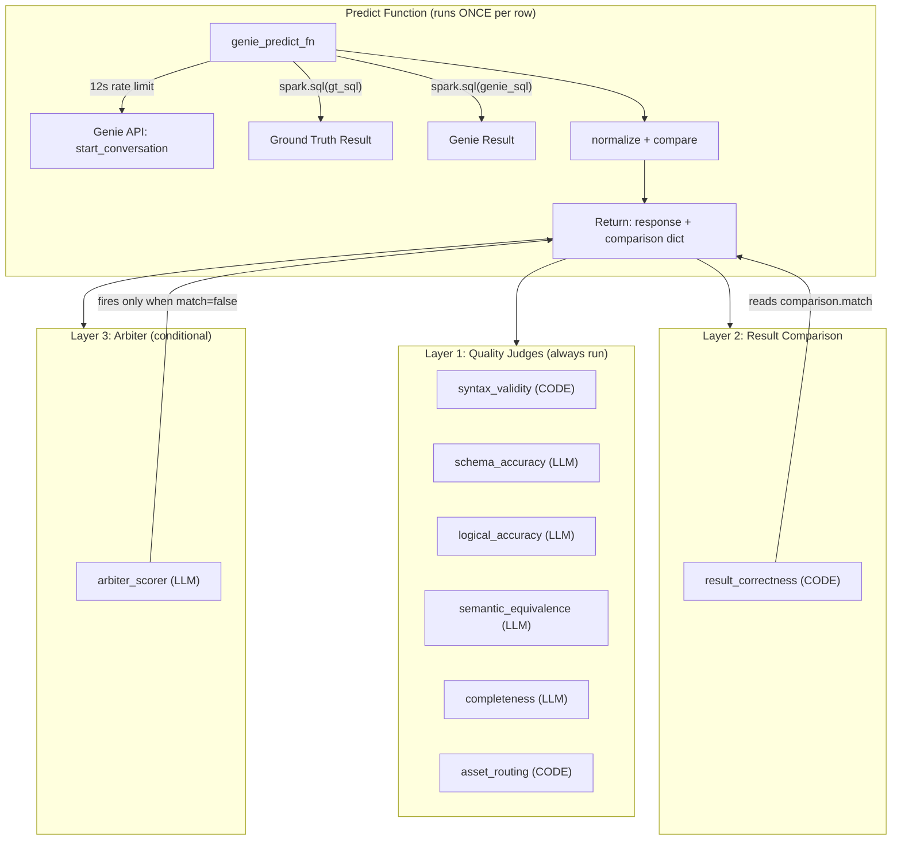

# Evaluation Engine

The evaluation engine runs 8 judges against a benchmark set using `mlflow.genai.evaluate()`. It is the core quality measurement system. Every optimization iteration runs the engine and uses its scores and ASI (Actionable Side Information) to decide what to do next.

---

## 1. Three-Layer Judge Architecture



All 8 scorers are passed to `mlflow.genai.evaluate(scorers=all_scorers)` as a flat list. The predict function runs once per benchmark question, and all scorers read its output. No scorer calls `spark.sql()`.

---

## 2. Predict Function

### `genie_predict_fn`

```python
@mlflow.trace
def genie_predict_fn(question: str, expected_sql: str = "", **kwargs) -> dict:
    """Query Genie, execute both SQLs, return response + comparison.

    mlflow.genai.evaluate() unpacks inputs dict as keyword arguments.
    Additional keys (question_id, space_id, catalog, gold_schema) are captured via **kwargs;
    space_id/catalog/gold_schema are available from outer scope.

    SQL execution is lifted here so every scorer reads pre-computed results.
    Neither result_correctness nor arbiter_scorer calls spark.sql().
    """
```

**Implementation steps:**

1. **Rate limit:** `time.sleep(RATE_LIMIT_SECONDS)` (12 seconds) before each Genie call.
2. **Genie call:** `run_genie_query(space_id, question)` returns `{status, sql, conversation_id, message_id}`.
3. **SQL sanitization:** `sanitize_sql(genie_sql)` extracts first statement, strips comments and trailing semicolons.
4. **GT SQL resolution:** `resolve_sql(expected_sql)` substitutes `${catalog}` and `${gold_schema}`.
5. **Dual execution:** `spark.sql(gt_sql).toPandas()` and `spark.sql(genie_sql).toPandas()`.
6. **Normalization:** `normalize_result_df(df)` on both DataFrames.
7. **Comparison:** Build comparison dict using hash, exact, and signature matching.

### `run_genie_query`

```python
def run_genie_query(space_id: str, question: str, max_wait: int = 120) -> dict:
    """Execute a query against Genie and return SQL + status."""
    w = WorkspaceClient()
    resp = w.genie.start_conversation(space_id=space_id, content=question)
    conversation_id = resp.conversation_id
    message_id = resp.message_id

    poll_interval = 3
    while time.time() - start < max_wait:
        time.sleep(poll_interval)
        msg = w.genie.get_message(space_id, conversation_id, message_id)
        status = str(msg.status)
        if any(s in status for s in ["COMPLETED", "FAILED", "CANCELLED"]):
            break
        poll_interval = min(poll_interval + 1, 10)  # adaptive backoff

    sql = None
    if msg and hasattr(msg, "attachments") and msg.attachments:
        for att in msg.attachments:
            if hasattr(att, "query") and att.query:
                sql = att.query.query if hasattr(att.query, "query") else str(att.query)

    return {"status": status, "sql": sql, "conversation_id": conversation_id, "message_id": message_id}
```

### SQL Helpers (MANDATORY)

```python
def resolve_sql(sql: str, cat: str = None, schema: str = None) -> str:
    """Substitute ${catalog} and ${gold_schema} template variables.
    Ground truth SQL in benchmarks uses these variables."""
    if not sql:
        return sql
    cat = cat or catalog
    schema = schema or gold_schema
    return sql.replace("${catalog}", cat).replace("${gold_schema}", schema)

def sanitize_sql(sql: str) -> str:
    """Extract first SQL statement, strip comments and trailing semicolons.
    Genie may return multi-statement SQL for compound questions."""
    if not sql:
        return sql
    sql = sql.strip().rstrip(";").strip()
    statements = [s.strip() for s in sql.split(";") if s.strip()]
    if not statements:
        return sql
    first = statements[0]
    lines = [l for l in first.split("\n") if not l.strip().startswith("--")]
    return "\n".join(lines).strip()
```

### Result Comparison

```python
def normalize_result_df(df):
    """Deterministic normalization of a result DataFrame."""
    if df is None or df.empty:
        return df
    df = df.copy()
    df.columns = [c.strip().lower() for c in df.columns]
    df = df[sorted(df.columns)]
    for col in df.select_dtypes(include=["float64", "float32"]).columns:
        df[col] = df[col].round(6)
    for col in df.select_dtypes(include=["object"]).columns:
        df[col] = df[col].apply(lambda x: x.strip() if isinstance(x, str) else x)
    for col in df.select_dtypes(include=["datetime64", "datetimetz"]).columns:
        df[col] = pd.to_datetime(df[col], utc=True)
    df = df.sort_values(by=list(df.columns)).reset_index(drop=True)
    return df

def result_signature(df):
    """Quick schema hash + rowcount + numeric sums for loose comparison."""
    if df is None or df.empty:
        return {"schema_hash": "", "row_count": 0, "numeric_sums": {}}
    schema_str = ",".join(f"{c}:{df[c].dtype}" for c in sorted(df.columns))
    schema_hash = hashlib.md5(schema_str.encode()).hexdigest()[:8]
    numeric_sums = {}
    for col in df.select_dtypes(include=["number"]).columns:
        numeric_sums[col] = round(float(df[col].sum()), 6)
    return {"schema_hash": schema_hash, "row_count": len(df), "numeric_sums": numeric_sums}
```

### Comparison Dict Schema

```python
comparison = {
    "match": bool,           # True if exact or hash match
    "match_type": str,       # "exact" | "hash" | "signature" | "mismatch"
    "gt_rows": int,          # Row count of ground truth result
    "genie_rows": int,       # Row count of Genie result
    "gt_hash": str,          # MD5 of GT CSV (first 8 hex chars)
    "genie_hash": str,       # MD5 of Genie CSV (first 8 hex chars)
    "gt_signature": dict,    # {schema_hash, row_count, numeric_sums}
    "genie_signature": dict, # {schema_hash, row_count, numeric_sums}
    "error": str | None,     # Error message if SQL execution failed
}
```

**Match cascade:**
1. **exact** — `gt_df.shape == genie_df.shape and gt_df.equals(genie_df)` (after normalization)
2. **hash** — `gt_hash == genie_hash` (MD5 of CSV)
3. **signature** — `gt_sig["schema_hash"] == genie_sig["schema_hash"] and gt_sig["row_count"] == genie_sig["row_count"]`
4. **mismatch** — none of the above

---

## 3. Response Extraction Helper

`mlflow.genai.evaluate()` serializes predict function responses to dicts before passing to scorers. Without this helper, scorers receive raw dicts and silently return wrong values.

```python
def _extract_response_text(outputs: Union[dict, Any]) -> str:
    """Extract response text from mlflow.genai.evaluate() serialized format."""
    if isinstance(outputs, str):
        return outputs
    if isinstance(outputs, dict):
        if "response" in outputs:
            return outputs["response"]
        if "output" in outputs:
            output_list = outputs["output"]
            if output_list and len(output_list) > 0:
                item = output_list[0]
                if "content" in item and item["content"]:
                    return item["content"][0].get("text", "")
    return ""
```

---

## 4. LLM Call Helper

All LLM judges use `_call_llm_for_scoring()` with the Databricks SDK. `make_judge()` is NOT used.

```python
from databricks.sdk import WorkspaceClient
from databricks.sdk.service.serving import ChatMessage, ChatMessageRole

def _call_llm_for_scoring(prompt: str, max_retries: int = 3) -> dict:
    """Call LLM using Databricks SDK with retry + backoff.
    Returns parsed JSON. Uses temperature=0 for deterministic judge consistency."""
    w = WorkspaceClient()
    last_err = None
    for attempt in range(max_retries):
        try:
            response = w.serving_endpoints.query(
                name=LLM_ENDPOINT,  # "databricks-claude-opus-4-6"
                messages=[ChatMessage(role=ChatMessageRole.USER, content=prompt)],
                temperature=0,
            )
            content = response.choices[0].message.content
            if not content or not content.strip():
                raise ValueError(f"Empty LLM response on attempt {attempt + 1}")
            content = content.strip()
            if content.startswith("```"):
                content = content.split("\n", 1)[1] if "\n" in content else content[3:]
                content = content.rsplit("```", 1)[0]
            return json.loads(content)
        except Exception as e:
            last_err = e
            if attempt < max_retries - 1:
                time.sleep(2 ** attempt)
    raise last_err
```

---

## 5. Scorer Specifications

### Common Types

```python
from mlflow.genai.scorers import scorer
from mlflow.entities import Feedback, AssessmentSource

CODE_SOURCE = AssessmentSource(source_type="CODE", source_id="genie-optimizer-v2")
LLM_SOURCE = AssessmentSource(source_type="LLM_JUDGE", source_id=f"databricks:/{LLM_ENDPOINT}")
```

### 5.1 `syntax_validity_scorer` (CODE, Layer 1)

| Property | Value |
|----------|-------|
| **Signature** | `syntax_validity_scorer(inputs: dict, outputs: dict) -> Feedback` |
| **Mechanism** | Runs `EXPLAIN {sql}` via Spark |
| **Values** | `"yes"` (EXPLAIN succeeds) or `"no"` (EXPLAIN fails or no SQL) |
| **Source** | `CODE_SOURCE` |
| **Threshold** | 98% |

```python
@scorer
def syntax_validity_scorer(inputs: dict, outputs: dict) -> Feedback:
    sql = sanitize_sql(_extract_response_text(outputs))
    if not sql or not sql.strip():
        return Feedback(name="syntax_validity", value="no",
                        rationale="No SQL generated.", source=CODE_SOURCE,
                        metadata=build_asi_metadata(failure_type="other", severity="critical",
                                                    missing_metadata="Genie returned no SQL"))
    try:
        spark.sql(f"EXPLAIN {sql}")
        return Feedback(name="syntax_validity", value="yes",
                        rationale="SQL parses successfully via EXPLAIN.", source=CODE_SOURCE)
    except Exception as e:
        return Feedback(name="syntax_validity", value="no",
                        rationale=f"EXPLAIN failed: {str(e)[:200]}", source=CODE_SOURCE,
                        metadata=build_asi_metadata(failure_type="other", severity="critical",
                                                    actual_value=sql[:100]))
```

### 5.2 `asset_routing_scorer` (CODE, Layer 1)

| Property | Value |
|----------|-------|
| **Signature** | `asset_routing_scorer(inputs: dict, outputs: dict, expectations: dict) -> Feedback` |
| **Mechanism** | Prefix matching: `mv_` or `measure(` = MV, `get_` = TVF, else TABLE |
| **Values** | `"yes"` (correct asset) or `"no"` (wrong asset) |
| **Source** | `CODE_SOURCE` |
| **Threshold** | 95% |

```python
@scorer
def asset_routing_scorer(inputs: dict, outputs: dict, expectations: dict) -> Feedback:
    sql = sanitize_sql(_extract_response_text(outputs) or "").lower()
    expected_asset = expectations.get("expected_asset", "").upper()
    uses_mv = "mv_" in sql or "measure(" in sql
    uses_tvf = "get_" in sql
    actual_asset = "MV" if uses_mv else ("TVF" if uses_tvf else "TABLE")
    correct = actual_asset == expected_asset
    return Feedback(
        name="asset_routing", value="yes" if correct else "no",
        rationale=f"Expected {expected_asset}, got {actual_asset}. SQL: {sql[:100]}",
        source=CODE_SOURCE,
        metadata=None if correct else build_asi_metadata(
            failure_type="asset_routing_error",
            severity="major", confidence=0.95,
            expected_value=expected_asset, actual_value=actual_asset,
            blame_set=[f"{expected_asset.lower()}_routing"]))
```

### 5.3 `schema_accuracy_judge` (LLM, Layer 1)

| Property | Value |
|----------|-------|
| **Signature** | `schema_accuracy_judge(inputs: dict, outputs: dict, expectations: dict) -> Feedback` |
| **Mechanism** | LLM via `_call_llm_for_scoring()` |
| **Expected JSON** | `{correct, failure_type, wrong_clause, blame_set, rationale}` |
| **Failure types** | `wrong_table`, `wrong_column`, `wrong_join`, `missing_column`, `missing_join_spec`, `wrong_join_spec` |
| **Values** | `"yes"`, `"no"`, `"unknown"` |
| **Source** | `LLM_SOURCE` |
| **Threshold** | 95% |

### 5.4 `logical_accuracy_judge` (LLM, Layer 1)

| Property | Value |
|----------|-------|
| **Signature** | `logical_accuracy_judge(inputs: dict, outputs: dict, expectations: dict) -> Feedback` |
| **Mechanism** | LLM via `_call_llm_for_scoring()` |
| **Expected JSON** | `{correct, failure_type, wrong_clause, blame_set, rationale}` |
| **Failure types** | `wrong_aggregation`, `wrong_filter`, `wrong_groupby`, `wrong_orderby` |
| **Values** | `"yes"`, `"no"`, `"unknown"` |
| **Source** | `LLM_SOURCE` |
| **Threshold** | 90% |

### 5.5 `semantic_equivalence_judge` (LLM, Layer 1)

| Property | Value |
|----------|-------|
| **Signature** | `semantic_equivalence_judge(inputs: dict, outputs: dict, expectations: dict) -> Feedback` |
| **Mechanism** | LLM via `_call_llm_for_scoring()` |
| **Expected JSON** | `{equivalent, failure_type, blame_set, rationale}` |
| **Failure types** | `different_metric`, `different_grain`, `different_scope` |
| **Values** | `"yes"`, `"no"`, `"unknown"` |
| **Source** | `LLM_SOURCE` |
| **Threshold** | 90% |

### 5.6 `completeness_judge` (LLM, Layer 1)

| Property | Value |
|----------|-------|
| **Signature** | `completeness_judge(inputs: dict, outputs: dict, expectations: dict) -> Feedback` |
| **Mechanism** | LLM via `_call_llm_for_scoring()` |
| **Expected JSON** | `{complete, failure_type, blame_set, rationale}` |
| **Failure types** | `missing_column`, `missing_filter`, `missing_temporal_filter`, `missing_aggregation`, `partial_answer`, `missing_format_assistance`, `missing_entity_matching`, `missing_synonym` |
| **Values** | `"yes"`, `"no"`, `"unknown"` |
| **Source** | `LLM_SOURCE` |
| **Threshold** | 90% |

### 5.7 `result_correctness` (CODE, Layer 2)

| Property | Value |
|----------|-------|
| **Signature** | `result_correctness(inputs: dict, outputs: dict, expectations: dict) -> Feedback` |
| **Mechanism** | Reads `outputs["comparison"]["match"]` — does NOT call spark.sql() |
| **Values** | `"yes"` (match) or `"no"` (mismatch or error) |
| **Source** | `CODE_SOURCE` |
| **Threshold** | 85% |

```python
@scorer
def result_correctness(inputs: dict, outputs: dict, expectations: dict) -> Feedback:
    cmp = outputs.get("comparison", {}) if isinstance(outputs, dict) else {}
    if cmp.get("error"):
        return Feedback(name="result_correctness", value="no",
                        rationale=f"Comparison error: {cmp['error']}", source=CODE_SOURCE)
    if cmp.get("match"):
        match_type = cmp.get("match_type", "unknown")
        return Feedback(name="result_correctness", value="yes",
                        rationale=f"Match type: {match_type}. Rows: {cmp.get('gt_rows', '?')}.",
                        source=CODE_SOURCE)
    return Feedback(name="result_correctness", value="no",
                    rationale=f"Mismatch. GT rows={cmp.get('gt_rows')} vs Genie rows={cmp.get('genie_rows')}.",
                    source=CODE_SOURCE,
                    metadata=build_asi_metadata(
                        failure_type="wrong_aggregation", severity="major", confidence=0.9,
                        expected_value=f"hash={cmp.get('gt_hash')}",
                        actual_value=f"hash={cmp.get('genie_hash')}",
                        counterfactual_fix="Review aggregation logic"))
```

### 5.8 `arbiter_scorer` (LLM, Layer 3 — Conditional)

| Property | Value |
|----------|-------|
| **Signature** | `arbiter_scorer(inputs: dict, outputs: dict, expectations: dict) -> Feedback` |
| **Trigger** | Only when `comparison.match == False` and `comparison.error` is falsy |
| **Values** | `"skipped"`, `"genie_correct"`, `"ground_truth_correct"`, `"both_correct"`, `"neither_correct"` |
| **Source** | `LLM_SOURCE` (when invoked), `CODE_SOURCE` (when skipped) |
| **Cost** | Zero LLM calls for passing rows |

**Verdict actions:**
- `genie_correct` — Auto-update `expected_sql` in MLflow eval dataset (benchmark correction)
- `ground_truth_correct` — Feed to optimizer as failure (optimize metadata)
- `both_correct` — Add disambiguation instruction
- `neither_correct` — Flag for human review

```python
@scorer
def arbiter_scorer(inputs: dict, outputs: dict, expectations: dict) -> Feedback:
    cmp = outputs.get("comparison", {}) if isinstance(outputs, dict) else {}

    if cmp.get("match"):
        return Feedback(name="arbiter", value="skipped",
                        rationale="Results match — arbiter not invoked.", source=CODE_SOURCE)
    if cmp.get("error"):
        return Feedback(name="arbiter", value="skipped",
                        rationale=f"SQL execution error — cannot arbitrate: {cmp['error']}",
                        source=CODE_SOURCE)

    genie_sql = sanitize_sql(_extract_response_text(outputs))
    gt_sql = resolve_sql(expectations.get("expected_response", ""))
    question = inputs.get("question", "")

    prompt = (
        f"{loaded_prompts.get('arbiter', JUDGE_PROMPTS['arbiter'])}\n\n"
        f"Question: {question}\n"
        f"Ground Truth SQL: {gt_sql}\n"
        f"Genie SQL: {genie_sql}\n"
        f"Result comparison: {json.dumps(cmp)}\n\n"
        '{"verdict": "<genie_correct|ground_truth_correct|both_correct|neither_correct>", '
        '"failure_type": "<wrong_aggregation|wrong_filter|wrong_table|other>", '
        '"blame_set": ["<blamed_object>"], '
        '"rationale": "<brief explanation>"}'
    )
    try:
        result = _call_llm_for_scoring(prompt)
        verdict = result.get("verdict", "ground_truth_correct")
        meta = None
        if verdict in ("ground_truth_correct", "neither_correct"):
            meta = build_asi_metadata(
                failure_type=result.get("failure_type", "other"),
                severity="major", confidence=0.85,
                blame_set=result.get("blame_set", []),
                counterfactual_fix=result.get("rationale", ""))
        return Feedback(name="arbiter", value=verdict,
                        rationale=result.get("rationale", verdict),
                        source=LLM_SOURCE, metadata=meta)
    except Exception as e:
        return Feedback(name="arbiter", value="ground_truth_correct",
                        rationale=f"Arbiter LLM call failed: {e}", source=LLM_SOURCE)
```

---

## 6. ASI Schema (Actionable Side Information)

ASI is structured metadata attached to each scorer `Feedback` via the `metadata` dict. It tells the optimizer exactly what went wrong and what to fix.

### Schema

```python
ASI_SCHEMA = {
    "failure_type": "str",            # from FAILURE_TAXONOMY (see 04-patch-dsl doc)
    "severity": "str",                # critical | major | minor | info
    "confidence": "float",            # 0.0-1.0
    "wrong_clause": "str | None",     # SELECT, FROM, WHERE, JOIN, GROUP BY, ORDER BY, MEASURE
    "blame_set": "list[str]",         # metadata fields blamed (table names, column names, instructions)
    "quoted_metadata_text": "str | None",   # exact text from Genie config that caused the issue
    "missing_metadata": "str | None",       # what should exist but doesn't
    "ambiguity_detected": "bool",
    "expected_value": "str | None",
    "actual_value": "str | None",
    "counterfactual_fix": "str | None",     # suggested metadata change
    "affected_question_pattern": "str | None",  # regex or description
}
```

### Builder

```python
def build_asi_metadata(
    failure_type="other", severity="minor", confidence=0.5,
    wrong_clause=None, blame_set=None, quoted_metadata_text=None,
    missing_metadata=None, ambiguity_detected=False,
    expected_value=None, actual_value=None,
    counterfactual_fix=None, affected_question_pattern=None,
) -> dict:
    return {
        "failure_type": failure_type,
        "severity": severity,
        "confidence": confidence,
        "wrong_clause": wrong_clause,
        "blame_set": blame_set or [],
        "quoted_metadata_text": quoted_metadata_text,
        "missing_metadata": missing_metadata,
        "ambiguity_detected": ambiguity_detected,
        "expected_value": expected_value,
        "actual_value": actual_value,
        "counterfactual_fix": counterfactual_fix,
        "affected_question_pattern": affected_question_pattern,
    }
```

### UC Table

ASI is persisted to `genie_eval_asi_results` (see `01-delta-state-schema.md`) after each evaluation. One row per judge per question. The optimizer reads this table via `read_asi_from_uc()` to cluster failures and generate proposals.

---

## 7. Judge Prompt Templates

These are the default prompts stored in `JUDGE_PROMPTS` and registered to the MLflow Prompt Registry on the first iteration.

```python
JUDGE_PROMPTS = {
    "schema_accuracy": (
        "You are a SQL schema expert evaluating SQL for a Databricks Genie Space.\n"
        "Determine if the GENERATED SQL references the correct tables, columns, and joins.\n\n"
        "User question: {{ inputs }}\n"
        "Generated SQL: {{ outputs }}\n"
        "Expected SQL: {{ expectations }}\n\n"
        "Respond with yes if the generated SQL references the correct tables, columns, "
        "and joins for the question, or no if it does not."
    ),
    "logical_accuracy": (
        "You are a SQL logic expert evaluating SQL for a Databricks Genie Space.\n"
        "Determine if the GENERATED SQL applies correct aggregations, filters, GROUP BY, "
        "ORDER BY, and WHERE clauses for the business question.\n\n"
        "User question: {{ inputs }}\n"
        "Generated SQL: {{ outputs }}\n"
        "Expected SQL: {{ expectations }}\n\n"
        "Respond with yes if the generated SQL applies the correct logic "
        "for the question, or no if it does not."
    ),
    "semantic_equivalence": (
        "You are a SQL semantics expert evaluating SQL for a Databricks Genie Space.\n"
        "Determine if the two SQL queries measure the SAME business metric and would "
        "answer the same question, even if written differently.\n\n"
        "User question: {{ inputs }}\n"
        "Generated SQL: {{ outputs }}\n"
        "Expected SQL: {{ expectations }}\n\n"
        "Respond with yes if the two queries are semantically equivalent "
        "for the question, or no if they are not."
    ),
    "completeness": (
        "You are a SQL completeness expert evaluating SQL for a Databricks Genie Space.\n"
        "Determine if the GENERATED SQL fully answers the user's question without "
        "missing dimensions, measures, or filters.\n\n"
        "User question: {{ inputs }}\n"
        "Generated SQL: {{ outputs }}\n"
        "Expected SQL: {{ expectations }}\n\n"
        "Respond with yes if the generated SQL fully answers the question, "
        "or no if it is missing dimensions, measures, or filters."
    ),
    "arbiter": (
        "You are a senior SQL arbiter for a Databricks Genie Space evaluation.\n"
        "Two SQL queries attempted to answer the same business question but produced different results.\n"
        "Analyze both queries and determine which is correct.\n\n"
        "User question and expected SQL: {{ inputs }}\n"
        "Genie response and comparison: {{ outputs }}\n"
        "Expected result: {{ expectations }}\n\n"
        "Return one of: genie_correct, ground_truth_correct, both_correct, neither_correct\n"
        'Respond with JSON: {"verdict": "...", "rationale": "explanation"}'
    ),
}
```

### Prompt Registration Lifecycle

**Iteration 1 — Registration:**

```python
def register_judge_prompts(uc_schema, domain, experiment_name):
    """Register all judge prompts to MLflow Prompt Registry + experiment artifacts."""
    for name, template in JUDGE_PROMPTS.items():
        prompt_name = f"{uc_schema}.genie_opt_{name}"
        version = mlflow.genai.register_prompt(
            name=prompt_name, template=template,
            commit_message=f"Genie eval judge: {name} (domain: {domain})",
            tags={"domain": domain, "type": "judge"})
        mlflow.genai.set_prompt_alias(name=prompt_name, alias="production", version=version.version)
```

**Every iteration — Loading:**

```python
def load_judge_prompts(uc_schema: str, alias: str = "production") -> dict:
    """Load all judge prompts from Prompt Registry by alias.
    Falls back to inline JUDGE_PROMPTS if unavailable."""
    prompts = {}
    for name in JUDGE_PROMPTS:
        if uc_schema:
            prompt_name = f"{uc_schema}.genie_opt_{name}"
            try:
                prompt = mlflow.genai.load_prompt(f"prompts:/{prompt_name}@{alias}")
                prompts[name] = prompt.template
                continue
            except Exception:
                pass
        prompts[name] = JUDGE_PROMPTS[name]
    return prompts
```

---

## 8. Scorer Registration Lifecycle

After defining scorers with `@scorer`, call `.register(name=...)` to make them visible in the MLflow Judges tab.

```python
all_scorers = [
    syntax_validity_scorer,
    schema_accuracy_judge,
    logical_accuracy_judge,
    semantic_equivalence_judge,
    completeness_judge,
    asset_routing_scorer,
    result_correctness,
    arbiter_scorer,
]

registered_judges = {}
for s in all_scorers:
    name = getattr(s, "name", getattr(s, "__name__", str(s)))
    try:
        reg = s.register(name=name)
        registered_judges[name] = reg
    except Exception as e:
        print(f"  [FAILED to register] {name}: {type(e).__name__}: {e}")
```

**Do NOT stack `@mlflow.trace` on `@scorer`.** This wraps the scorer in a generic wrapper that strips `.register()`, leaving the Judges tab empty.

---

## 9. MLflow Integration

### Evaluation Call

```python
evaluate_kwargs = {
    "predict_fn": genie_predict_fn,
    "data": eval_data,       # pd.DataFrame with inputs + expectations columns
    "scorers": all_scorers,
}
if model_id:
    evaluate_kwargs["model_id"] = model_id

eval_result = mlflow.genai.evaluate(**evaluate_kwargs)
```

### Evaluation Dataset (UC-backed)

```python
eval_dataset = mlflow.genai.datasets.create_dataset(
    uc_table_name=f"{uc_schema}.genie_benchmarks_{domain}")
eval_dataset.merge_records(records)
```

Each record:
```python
{
    "inputs": {
        "question": str,
        "expected_sql": str,
        "space_id": str,
        "question_id": str,
        "category": str,
    },
    "expectations": {
        "expected_response": str,    # same as expected_sql
        "expected_asset": str,       # MV | TVF | TABLE
        "expected_facts": list,
        "guidelines": str,
    },
}
```

### LoggedModel Auto-Creation

When `model_id` is empty, the evaluation notebook auto-creates a LoggedModel:

1. Fetch Genie config via `GET /api/2.0/genie/spaces/{space_id}?include_serialized_space=true`
2. Fetch UC snapshots: `information_schema.columns`, `information_schema.table_tags`, `information_schema.routines`
3. Compute `config_hash = MD5(json.dumps({config, uc_columns, uc_tags, uc_routines}, sort_keys=True))`
4. Create model: `mlflow.create_external_model(name=f"genie-space-{space_id}", ...)`
5. Log artifacts: `genie_config.json`, `uc_columns.json`, `uc_tags.json`, `uc_routines.json`

### Trace Storage

```python
mlflow.set_experiment_trace_location(uc_schema)
```

All `@mlflow.trace`-decorated functions (including `genie_predict_fn`) write traces to the UC schema.

---

## 10. Repeatability Testing

### Cross-Iteration Repeatability (free, iteration 2+)

Compares per-question SQL hashes between current and previous iteration:

```python
def _compute_cross_iteration_repeatability(current_rows, previous_rows) -> dict:
    """Compare SQL hashes between iterations. Free — no extra Genie queries."""
    current_map = {extract_question_id(r): md5(extract_sql(r).lower()) for r in current_rows}
    previous_map = {extract_question_id(r): md5(extract_sql(r).lower()) for r in previous_rows}

    common = set(current_map) & set(previous_map)
    stable = sum(1 for q in common if current_map[q] == previous_map[q])
    return {
        "repeatability_pct": (stable / len(common) * 100) if common else 100.0,
        "total": len(common),
        "stable": stable,
        "unstable": [q for q in common if current_map[q] != previous_map[q]],
    }
```

### Cell 9c Re-Query Test (dedicated, final only)

Runs during Stage 4 FINALIZE when `run_repeatability=True`:

1. For each benchmark, take the original SQL from predict output
2. Re-query Genie 2 more times (with 12s rate limit between calls)
3. MD5-hash all 3 SQL variants (lowercased)
4. Compute `repeatability_pct = most_common_hash_count / total_hashes * 100`

**Classification:**

| Repeatability % | Classification | Severity |
|----------------|----------------|----------|
| 100% | IDENTICAL | None |
| 70-99% | MINOR_VARIANCE | minor |
| 50-69% | SIGNIFICANT_VARIANCE | major |
| 0-49% | CRITICAL_VARIANCE | critical |

**Outputs:**
- MLflow metric: `repeatability/mean` (0-1 scale)
- MLflow artifact: `evaluation/repeatability.json`
- ASI rows: failures written to `genie_eval_asi_results` with `failure_type="repeatability_issue"`

---

## 11. Benchmark Schema

Each benchmark question (whether loaded from an existing eval dataset or generated by LLM) has this structure:

```python
{
    "question_id": "rev_001",                      # unique ID (auto-generated if LLM-created)
    "question": "What was total revenue last quarter?",
    "expected_sql": "SELECT MEASURE(total_revenue) ... FROM ${catalog}.${gold_schema}.booking_analytics_metrics ...",
    "expected_asset": "MV",                        # MV | TVF | TABLE
    "category": "aggregation",                     # aggregation | ranking | time-series | comparison | detail | list | threshold
    "source": "generated",                         # generated | arbiter_corrected
    "priority": "P0",                              # P0 = must-pass gate, else normal
    "split": "train",                              # train | held_out (assigned by assign_splits)
    "required_tables": ["booking_analytics_metrics"],
    "required_columns": ["total_revenue", "check_in_date", "booking_status"],
    "expected_facts": ["Returns total revenue for the previous quarter"],
    "guidelines": "Should use MEASURE() syntax for metric views",
}
```

**Template variables:** `${catalog}` and `${gold_schema}` in `expected_sql` are resolved at runtime by `resolve_sql()`.

**Primary storage:** MLflow evaluation dataset in UC (`{uc_schema}.genie_benchmarks_{domain}`). No YAML file.

---

## 12. Benchmark Generation

When no evaluation dataset exists for a domain (first optimization), benchmarks are auto-generated via LLM.

### `generate_benchmarks()`

```python
def generate_benchmarks(
    config: dict,
    uc_columns: pd.DataFrame,
    uc_tags: pd.DataFrame,
    uc_routines: pd.DataFrame,
    domain: str,
    catalog: str,
    schema: str,
    spark,
    target_count: int = 20,
) -> list[dict]:
    """Generate benchmark questions with expected SQL from Genie Space metadata.

    Steps:
    1. Build context string from:
       - Genie Space tables (names, column lists)
       - Genie Space instructions and sample questions
       - UC column descriptions and tags
       - Metric view definitions (YAML/measures/dimensions)
       - TVF signatures and comments
    2. Call Databricks Claude Opus 4.6 with BENCHMARK_GENERATION_PROMPT:
       - Asks for {target_count} diverse questions across 7 categories
       - Each question must include expected_sql using ${catalog}.${gold_schema} variables
       - Each question must specify expected_asset (MV for metric views, TVF for functions, TABLE otherwise)
       - Returns JSON array
    3. Parse LLM JSON response
    4. Validate each expected_sql:
       - resolve_sql() to substitute template variables
       - spark.sql(f"EXPLAIN {resolved_sql}") to verify parseability
       - Discard questions that fail EXPLAIN
    5. Assign question_ids: {domain_prefix}_{sequential_number}
    6. Assign priorities: top 3 highest-confidence questions → P0, rest → normal
    7. Assign splits: 80% train, 20% held_out via assign_splits()

    Returns list of benchmark dicts.
    """
```

### LLM Prompt Structure

The `BENCHMARK_GENERATION_PROMPT` (defined in `config.py`) instructs the LLM to:

1. **Analyze** the schema context (tables, columns, descriptions, metric views, TVFs)
2. **Generate** questions that a business user would realistically ask
3. **Write SQL** using the correct asset type: `MEASURE()` for metric views, function calls for TVFs, standard SQL for tables
4. **Diversify** across 7 categories: aggregation, ranking, time-series, comparison, detail, list, threshold
5. **Use template variables** `${catalog}` and `${gold_schema}` in all SQL
6. **Return** a JSON array of question objects

### `load_benchmarks_from_dataset()`

```python
def load_benchmarks_from_dataset(dataset_or_spark, uc_schema: str, domain: str) -> list[dict]:
    """Load benchmarks from an existing MLflow evaluation dataset.
    Reads from the UC table {uc_schema}.genie_benchmarks_{domain}.
    Returns list of benchmark dicts.
    """
```

Replaces the old `load_benchmarks(path, domain)` which read from YAML.

### Evaluation Scopes

| Scope | Filter | Used For |
|-------|--------|----------|
| `full` | All benchmarks | Baseline and full lever evaluation |
| `slice` | Benchmarks whose `required_tables` overlap with `patched_objects` | Quick gate after applying patches |
| `p0` | Benchmarks with `priority == "P0"` | Must-pass gate |
| `held_out` | Benchmarks with `split == "held_out"` | Post-deploy validation |
