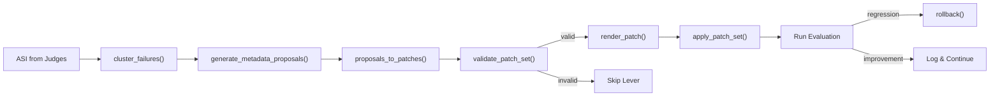

# Patch DSL & Metadata Optimizer

The optimizer analyzes evaluation failures (via ASI) and generates targeted metadata change proposals. The applier renders those proposals into a Patch DSL, applies them to the Genie Space config (or UC objects depending on `apply_mode`), and supports rollback if regressions are detected.

**`apply_mode` governs where changes are written:**

| `apply_mode` | Levers 1-3 | Levers 4-6 |
|--------------|-----------|-----------|
| `"genie_config"` (DEFAULT) | Write to Genie Space config overlays (`column_configs`, `data_sources`) | Always Genie config native |
| `"uc_artifact"` | Write to UC via ALTER TABLE, MV YAML, TVF SQL | Always Genie config native |
| `"both"` | Write to both Genie config and UC | Always Genie config native |

Users who lack UC write access use the default `"genie_config"` mode.

---

## 1. Failure Taxonomy

22 failure types that judges can report via ASI. Each maps to one or more control levers.

```python
FAILURE_TAXONOMY = {
    "wrong_table",              # Genie used the wrong table
    "wrong_column",             # Genie used the wrong column
    "wrong_join",               # Genie used the wrong join condition
    "missing_join_spec",        # No join_spec defined for table pair (Lever 4)
    "wrong_join_spec",          # Incorrect join condition or relationship type (Lever 4)
    "missing_filter",           # Missing WHERE clause
    "missing_temporal_filter",  # Missing date/time filter
    "wrong_aggregation",        # Wrong SUM/AVG/COUNT/etc.
    "wrong_measure",            # Wrong MEASURE() expression
    "missing_instruction",      # Genie Space needs a routing instruction
    "ambiguous_question",       # Question is ambiguous, needs disambiguation
    "asset_routing_error",      # Wrong asset type (MV vs TVF vs TABLE)
    "tvf_parameter_error",      # Wrong TVF parameter usage
    "performance_issue",        # Query performance problem
    "repeatability_issue",      # Non-deterministic SQL generation
    "missing_synonym",          # Column/table synonym needed (Lever 5)
    "description_mismatch",     # Description doesn't match usage
    "missing_format_assistance",# Column should have get_example_values: true (Lever 5)
    "missing_entity_matching",  # Column should have build_value_dictionary: true (Lever 5)
    "stale_data",               # Data freshness issue
    "data_freshness",           # Same as stale_data (alias)
    "other",                    # Uncategorized
}
```

---

## 2. Six Control Levers

Each lever targets a specific category of metadata changes. Levers are attempted in order (1 through 6). Instructions (Lever 6) is always last.

| Lever | Name | Target Objects | Scope | Typical Patches |
|-------|------|---------------|-------|-----------------|
| 1 | Tables & Columns | Column descriptions, visibility | `genie_config` or `uc_artifact` (per `apply_mode`) | `update_column_description`, `hide_column`, `add_column_description` |
| 2 | Metric Views | MV measures, dimensions, YAML | `genie_config` or `uc_artifact` (per `apply_mode`) | `update_mv_measure`, `add_mv_measure`, `add_mv_dimension`, `update_mv_yaml` |
| 3 | Table-Valued Functions | TVF SQL, parameters, docs | `genie_config` or `uc_artifact` (per `apply_mode`) | `update_tvf_sql`, `add_tvf_parameter`, `add_tvf` |
| 4 | Join Specifications | `join_specs` in Genie config | Always `genie_config` | `add_join_spec`, `update_join_spec`, `remove_join_spec` |
| 5 | Column Discovery Settings | `get_example_values`, `build_value_dictionary`, column synonyms | Always `genie_config` | `enable_example_values`, `enable_value_dictionary`, `add_column_synonym` |
| 6 | Genie Space Instructions | Instructions, routing rules, default filters | Always `genie_config` | `add_instruction`, `update_instruction`, `remove_instruction` |

### `apply_mode` Effect on Scope

```python
def _resolve_scope(lever: int, apply_mode: str) -> str:
    """Determine where a patch is applied based on lever and apply_mode.

    Levers 4-6: Always genie_config (these are Genie Space native structures).
    Levers 1-3: Governed by apply_mode parameter.
    """
    if lever in (4, 5, 6):
        return "genie_config"
    return apply_mode  # "genie_config" | "uc_artifact" | "both"
```

### Failure-to-Lever Mapping

```python
def _map_to_lever(root_cause: str, asi_failure_type: str, blame_set: list) -> int:
    """Map a failure root cause to its primary control lever."""
    mapping = {
        "wrong_column": 1,
        "wrong_table": 1,
        "missing_column": 1,
        "description_mismatch": 1,
        "wrong_aggregation": 2,
        "wrong_measure": 2,
        "missing_filter": 2,        # can also be 3 or 6 depending on context
        "missing_temporal_filter": 2,
        "tvf_parameter_error": 3,
        "wrong_filter": 3,
        "wrong_join": 4,             # join issues -> Lever 4 (Join Specs)
        "missing_join_spec": 4,      # missing join spec -> Lever 4
        "wrong_join_spec": 4,        # incorrect join spec -> Lever 4
        "missing_synonym": 5,        # synonyms -> Lever 5 (Column Discovery)
        "missing_format_assistance": 5,  # get_example_values -> Lever 5
        "missing_entity_matching": 5,    # build_value_dictionary -> Lever 5
        "asset_routing_error": 6,    # routing -> Lever 6 (Instructions)
        "missing_instruction": 6,
        "ambiguous_question": 6,
        "repeatability_issue": 1,    # structured metadata first
    }
    return mapping.get(asi_failure_type, mapping.get(root_cause, 6))
```

### `_LEVER_TO_PATCH_TYPE` (Applier mapping)

```python
_LEVER_TO_PATCH_TYPE = {
    # Lever 1: Tables & Columns
    ("wrong_column", 1): "update_column_description",
    ("wrong_table", 1): "update_table_comment",
    ("missing_column", 1): "update_column_description",
    ("description_mismatch", 1): "update_column_description",
    ("repeatability_issue", 1): "update_column_description",

    # Lever 2: Metric Views
    ("wrong_aggregation", 2): "update_mv_measure",
    ("wrong_measure", 2): "update_mv_measure",
    ("missing_filter", 2): "update_mv_yaml",
    ("missing_temporal_filter", 2): "update_mv_yaml",

    # Lever 3: TVFs
    ("wrong_filter", 3): "update_tvf_comment",
    ("tvf_parameter_error", 3): "update_tvf_comment",
    ("missing_filter", 3): "update_tvf_comment",

    # Lever 4: Join Specifications
    ("wrong_join", 4): "update_join_spec",
    ("missing_join_spec", 4): "add_join_spec",
    ("wrong_join_spec", 4): "update_join_spec",

    # Lever 5: Column Discovery Settings
    ("missing_synonym", 5): "add_column_synonym",
    ("missing_format_assistance", 5): "enable_example_values",
    ("missing_entity_matching", 5): "enable_value_dictionary",

    # Lever 6: Instructions
    ("asset_routing_error", 6): "add_instruction",
    ("missing_instruction", 6): "add_instruction",
    ("missing_filter", 6): "add_instruction",
    ("ambiguous_question", 6): "add_instruction",
}
```

---

## 3. Patch Types (35 total)

The `scope` field indicates the **native** target. The `apply_mode` parameter determines the actual target at runtime (see Section 2). Levers 4-6 are always `genie_config` regardless of `apply_mode`.

```python
PATCH_TYPES = [
    # --- Lever 1: Descriptions & visibility (apply_mode governed) ---
    {"type": "update_description",      "scope": "apply_mode",   "risk_level": "low",    "affects": ["descriptions", "column_metadata"]},
    {"type": "add_description",         "scope": "apply_mode",   "risk_level": "low",    "affects": ["descriptions", "column_metadata"]},
    {"type": "add_column_description",  "scope": "apply_mode",   "risk_level": "low",    "affects": ["column_metadata", "descriptions"]},
    {"type": "update_column_description","scope":"apply_mode",   "risk_level": "low",    "affects": ["column_metadata", "descriptions"]},
    {"type": "hide_column",            "scope": "genie_config",  "risk_level": "low",    "affects": ["column_visibility", "column_metadata"]},
    {"type": "unhide_column",          "scope": "genie_config",  "risk_level": "low",    "affects": ["column_visibility", "column_metadata"]},
    {"type": "rename_column_alias",    "scope": "genie_config",  "risk_level": "medium", "affects": ["column_metadata", "aliases"]},
    {"type": "add_table",              "scope": "uc_artifact",   "risk_level": "high",   "affects": ["tables", "schema"]},
    {"type": "remove_table",           "scope": "uc_artifact",   "risk_level": "high",   "affects": ["tables", "schema"]},

    # --- Lever 2: Metric Views (apply_mode governed) ---
    {"type": "add_mv_measure",         "scope": "apply_mode",   "risk_level": "medium", "affects": ["metric_view", "measures"]},
    {"type": "update_mv_measure",      "scope": "apply_mode",   "risk_level": "medium", "affects": ["metric_view", "measures"]},
    {"type": "remove_mv_measure",      "scope": "apply_mode",   "risk_level": "medium", "affects": ["metric_view", "measures"]},
    {"type": "add_mv_dimension",       "scope": "apply_mode",   "risk_level": "medium", "affects": ["metric_view", "dimensions"]},
    {"type": "remove_mv_dimension",    "scope": "apply_mode",   "risk_level": "medium", "affects": ["metric_view", "dimensions"]},
    {"type": "update_mv_yaml",         "scope": "apply_mode",   "risk_level": "high",   "affects": ["metric_view", "mv_yaml"]},

    # --- Lever 3: TVFs (apply_mode governed) ---
    {"type": "add_tvf_parameter",      "scope": "apply_mode",   "risk_level": "medium", "affects": ["tvf_parameters", "tvf_definition"]},
    {"type": "remove_tvf_parameter",   "scope": "apply_mode",   "risk_level": "medium", "affects": ["tvf_parameters", "tvf_definition"]},
    {"type": "update_tvf_sql",         "scope": "apply_mode",   "risk_level": "high",   "affects": ["tvf_definition", "tvf_sql"]},
    {"type": "add_tvf",               "scope": "apply_mode",   "risk_level": "high",   "affects": ["tvfs", "tvf_definition"]},
    {"type": "remove_tvf",            "scope": "apply_mode",   "risk_level": "high",   "affects": ["tvfs", "tvf_definition"]},

    # --- Lever 4: Join Specifications (always genie_config) ---
    {"type": "add_join_spec",          "scope": "genie_config",  "risk_level": "medium", "affects": ["join_specs", "relationships"]},
    {"type": "remove_join_spec",       "scope": "genie_config",  "risk_level": "medium", "affects": ["join_specs", "relationships"]},
    {"type": "update_join_spec",       "scope": "genie_config",  "risk_level": "medium", "affects": ["join_specs", "relationships"]},

    # --- Lever 5: Column Discovery Settings (always genie_config) ---
    {"type": "enable_example_values",  "scope": "genie_config",  "risk_level": "low",    "affects": ["column_configs", "format_assistance"]},
    {"type": "disable_example_values", "scope": "genie_config",  "risk_level": "low",    "affects": ["column_configs", "format_assistance"]},
    {"type": "enable_value_dictionary","scope": "genie_config",  "risk_level": "low",    "affects": ["column_configs", "entity_matching"]},
    {"type": "disable_value_dictionary","scope":"genie_config",  "risk_level": "low",    "affects": ["column_configs", "entity_matching"]},
    {"type": "add_column_synonym",     "scope": "genie_config",  "risk_level": "low",    "affects": ["column_configs", "synonyms"]},
    {"type": "remove_column_synonym",  "scope": "genie_config",  "risk_level": "low",    "affects": ["column_configs", "synonyms"]},

    # --- Lever 6: Instructions & Filters (always genie_config) ---
    {"type": "add_instruction",         "scope": "genie_config", "risk_level": "low",    "affects": ["instructions"]},
    {"type": "update_instruction",      "scope": "genie_config", "risk_level": "medium", "affects": ["instructions"]},
    {"type": "remove_instruction",      "scope": "genie_config", "risk_level": "medium", "affects": ["instructions"]},
    {"type": "add_default_filter",     "scope": "genie_config",  "risk_level": "medium", "affects": ["filters", "default_filters"]},
    {"type": "remove_default_filter",  "scope": "genie_config",  "risk_level": "medium", "affects": ["filters", "default_filters"]},
    {"type": "update_filter_condition","scope": "genie_config",  "risk_level": "medium", "affects": ["filters", "default_filters"]},
]
```

**Note:** The old `add_join`, `remove_join`, `update_join_condition` (scope `uc_universal`) and `add_synonym`, `remove_synonym` patch types are replaced by the new Lever 4 and Lever 5 types above.

---

## 4. Conflict Rules (18 pairs)

Mutually exclusive patch types that cannot coexist in the same patch set:

```python
CONFLICT_RULES = [
    ("add_table", "remove_table"),
    ("add_instruction", "remove_instruction"),
    ("add_instruction", "update_instruction"),
    ("update_instruction", "remove_instruction"),
    ("add_default_filter", "remove_default_filter"),
    ("add_tvf_parameter", "remove_tvf_parameter"),
    ("add_tvf", "remove_tvf"),
    ("add_mv_measure", "remove_mv_measure"),
    ("add_mv_dimension", "remove_mv_dimension"),
    ("hide_column", "unhide_column"),
    ("add_column_description", "update_column_description"),
    ("add_description", "update_description"),
    ("update_mv_measure", "remove_mv_measure"),
    # Lever 4: Join Specifications
    ("add_join_spec", "remove_join_spec"),
    ("update_join_spec", "remove_join_spec"),
    # Lever 5: Column Discovery Settings
    ("enable_example_values", "disable_example_values"),
    ("enable_value_dictionary", "disable_value_dictionary"),
    ("add_column_synonym", "remove_column_synonym"),
    # Cross-lever: description add/update
    ("add_description", "add_column_description"),
]
```

---

## 5. Failure Clustering

`cluster_failures()` groups evaluation failures into actionable clusters.

```python
def cluster_failures(eval_results: dict, metadata_snapshot: dict) -> list:
    """Group failures by (judge, failure_type, blame_set) for batch proposals.

    Algorithm:
    1. Extract ASI from eval results (UC table or metadata columns)
    2. For each failure row, create a group key: (judge, asi_failure_type, blame_set_str)
       - If no ASI, fall back to: (judge, _extract_pattern(rationale), "")
    3. Group failures by key
    4. Keep clusters with >= 2 questions (others go to long tail)
    5. Sort by cluster size descending

    Returns list of cluster dicts.
    """
```

### Cluster Dict Schema

```python
{
    "cluster_id": "C001",                # auto-assigned sequential ID
    "root_cause": str,                   # primary failure description
    "question_ids": ["rev_003", "rev_007"],  # affected benchmark questions
    "affected_judge": "schema_accuracy", # which judge flagged this
    "confidence": 0.85,                  # average ASI confidence
    "asi_failure_type": "wrong_column",  # from FAILURE_TAXONOMY
    "asi_blame_set": "booking_date",     # blamed metadata field(s)
    "asi_counterfactual_fixes": [        # suggested fixes from judges
        "Add column description for booking_date clarifying it represents check-in date"
    ],
}
```

---

## 6. Proposal Generation (LLM-Powered)

`generate_metadata_proposals()` is the key intelligence step — it converts failure clusters into actionable proposals using **Databricks Claude Opus 4.6** for text generation.

```python
def generate_metadata_proposals(
    clusters: list,
    metadata_snapshot: dict,
    target_lever: int | None = None,
    apply_mode: str = "genie_config",
    w: WorkspaceClient = None,
) -> list:
    """Generate metadata change proposals from failure clusters.

    For each cluster:
    1. Map root_cause to lever via _map_to_lever()
    2. If target_lever is set, skip clusters for other levers
    3. Look up the current value of blamed metadata fields in metadata_snapshot
    4. Call LLM to generate proposed_value:
       - For levers 1-3: use PROPOSAL_GENERATION_PROMPT with failure context + current metadata
       - For lever 4: use LEVER_4_JOIN_SPEC_PROMPT with join context + current join_specs
       - For lever 5: use LEVER_5_DISCOVERY_PROMPT with column context + current column_configs
       - For lever 6: use LEVER_6_INSTRUCTION_PROMPT with routing failures + current instructions
       - LLM returns {proposed_value, rationale}
    5. Build proposal with concrete proposed_value from LLM
    6. Resolve scope via _resolve_scope(lever, apply_mode)
    7. Add dual_persistence paths from _dual_persist_paths()
    8. Score proposal: net_impact = questions_fixed * confidence - 0.1 * blast_radius

    Sort by net_impact descending. Return top proposals.
    """
```

### LLM Call for Proposal Text

The optimizer calls `_call_llm_for_proposal()` for each cluster that needs a concrete metadata change:

```python
def _call_llm_for_proposal(cluster: dict, metadata_snapshot: dict,
                            patch_type: str, lever: int) -> dict:
    """Call Databricks Claude Opus 4.6 to generate proposal text.

    Prompt selection by lever:
      - Levers 1-3: PROPOSAL_GENERATION_PROMPT (UC metadata context)
      - Lever 4:    LEVER_4_JOIN_SPEC_PROMPT (join context + current join_specs)
      - Lever 5:    LEVER_5_DISCOVERY_PROMPT (column discovery context)
      - Lever 6:    LEVER_6_INSTRUCTION_PROMPT (routing failures + current instructions)

    Passes: failure_type, blame_set, affected_questions, counterfactual_fixes,
            current metadata for blamed objects, target patch_type.

    Returns: {"proposed_value": str, "rationale": str}
    """
    from common.config import (
        LLM_ENDPOINT,
        PROPOSAL_GENERATION_PROMPT,
        LEVER_4_JOIN_SPEC_PROMPT,
        LEVER_5_DISCOVERY_PROMPT,
        LEVER_6_INSTRUCTION_PROMPT,
    )

    prompt_map = {
        4: LEVER_4_JOIN_SPEC_PROMPT,
        5: LEVER_5_DISCOVERY_PROMPT,
        6: LEVER_6_INSTRUCTION_PROMPT,
    }
    prompt_template = prompt_map.get(lever, PROPOSAL_GENERATION_PROMPT)

    prompt = prompt_template.format(
        failure_type=cluster["asi_failure_type"],
        blame_set=cluster["asi_blame_set"],
        affected_questions=cluster["question_ids"],
        counterfactual_fixes=cluster["asi_counterfactual_fixes"],
        current_metadata=_extract_metadata_for_blame(metadata_snapshot, cluster["asi_blame_set"]),
        patch_type_description=_describe_patch_type(patch_type),
        # lever 4: join spec context
        current_join_specs=metadata_snapshot.get("join_specs", []),
        table_relationships=[t.get("relationships", []) for t in metadata_snapshot.get("tables", [])],
        # lever 5: column discovery context
        current_column_configs=metadata_snapshot.get("column_configs", {}),
        string_column_count=metadata_snapshot.get("string_column_count", 0),
        max_value_dictionary_cols=120,
        # lever 6: instruction context
        failures_context=json.dumps(cluster, default=str),
        current_instructions=metadata_snapshot.get("general_instructions", ""),
        table_names=[t["name"] for t in metadata_snapshot.get("tables", [])],
        mv_names=[...], tvf_names=[...],
    )

    result = _call_llm_for_scoring(prompt)
    return result
```

**Where LLM calls occur in the optimizer (summary):**

| Function | LLM? | Purpose |
|----------|-------|---------|
| `cluster_failures()` | No | Group ASI rows by (failure_type, blame_set) |
| `_map_to_lever()` | No | Static lookup table |
| `generate_metadata_proposals()` | **Yes** | Generate proposed_value text for patches |
| `_call_llm_for_proposal()` | **Yes** | The actual LLM call (Claude Opus 4.6) |
| `_resolve_scope()` | No | Determine target (genie_config / uc_artifact / both) |
| `score_patch_set()` | No | Algorithmic scoring |
| `detect_conflicts_and_batch()` | No | CONFLICT_RULES check |
| `render_patch()` | No | Convert to action dict |
| `apply_patch_set()` | No | API calls to Genie or UC |

### Proposal Dict Schema

```python
{
    "proposal_id": "P001",
    "cluster_id": "C001",
    "lever": 1,
    "change_description": "Add column description for booking_date: 'Check-in date for the booking'",
    "dual_persistence": {
        "api": "PATCH /api/2.0/genie/spaces/{space_id}",
        "repo": "gold_layer_design/yaml/booking/fact_booking.yaml",
    },
    "confidence": 0.85,
    "questions_fixed": 3,
    "questions_at_risk": 1,
    "net_impact": 2.55,                  # questions_fixed * confidence - 0.1 * (blast / total)
    "asi": {
        "failure_type": "wrong_column",
        "blame_set": ["booking_date"],
        "severity": "major",
        "counterfactual_fixes": ["Add description clarifying check-in date"],
        "ambiguity_detected": False,
    },
}
```

### Dual Persistence Paths

```python
DUAL_PERSIST_PATHS = {
    1: {"api": "PATCH /api/2.0/genie/spaces/{space_id}", "repo": "gold_layer_design/yaml/{domain}/*.yaml"},
    2: {"api": "PATCH /api/2.0/genie/spaces/{space_id}", "repo": "src/semantic/metric_views/*.yaml"},
    3: {"api": "PATCH /api/2.0/genie/spaces/{space_id}", "repo": "src/semantic/tvfs/*.sql"},
    4: {"api": "PATCH /api/2.0/genie/spaces/{space_id}", "repo": "src/genie/{domain}_genie_export.json"},
    5: {"api": "PATCH /api/2.0/genie/spaces/{space_id}", "repo": "src/genie/{domain}_genie_export.json"},
    6: {"api": "PATCH /api/2.0/genie/spaces/{space_id}", "repo": "src/genie/{domain}_genie_export.json"},
}
```

### Scoring

```python
def score_patch_set(patch_set: list, metadata_snapshot: dict) -> float:
    """Score a patch set by estimated impact.
    questions_blamed * avg_confidence - 0.1 * (blast_objects / total_objects)"""
    total_questions = sum(p.get("questions_fixed", 0) for p in patch_set)
    avg_confidence = sum(p.get("confidence", 0.5) for p in patch_set) / max(len(patch_set), 1)
    blast = len(set(p.get("target_object", "") for p in patch_set))
    total_objects = len(metadata_snapshot.get("tables", []))
    return total_questions * avg_confidence - 0.1 * (blast / max(total_objects, 1))
```

---

## 7. Patch Validation

```python
def validate_patch_set(patches: list) -> tuple[bool, list[str]]:
    """Validate a patch set before application.

    Rules:
    1. Max 5 distinct target objects per patch set
    2. No conflicting patch types (from CONFLICT_RULES)
    3. All patch types must be in PATCH_TYPES
    4. Each patch must have required fields: type, target (or object_id)

    Returns (valid: bool, errors: list[str]).
    """
    errors = []
    targets = set(p.get("target_object") or p.get("object_id", "") for p in patches)
    if len(targets) > 5:
        errors.append(f"Too many target objects: {len(targets)} (max 5)")

    types_in_set = set(p["type"] for p in patches)
    for a, b in CONFLICT_RULES:
        if a in types_in_set and b in types_in_set:
            errors.append(f"Conflicting patch types: {a} and {b}")

    valid_types = {pt["type"] for pt in PATCH_TYPES}
    for p in patches:
        if p["type"] not in valid_types:
            errors.append(f"Unknown patch type: {p['type']}")

    return (len(errors) == 0, errors)
```

---

## 8. Patch Rendering

`render_patch()` converts a proposal-level patch into an actionable command with rollback.

```python
def render_patch(patch: dict, space_id: str, space_config: dict) -> dict:
    """Render a patch into an action dict with command and rollback command.

    Returns:
        {
            "action_type": str,
            "target": str,
            "command": str,           # JSON: {"op": "add|update|remove", ...details}
            "rollback_command": str,   # JSON: reverse operation
            "risk_level": str,
        }
    """
```

**Command JSON format by operation:**

| Op | Fields |
|----|--------|
| `add_instruction` | `{"op": "add", "section": "instructions", "new_text": "..."}` |
| `update_instruction` | `{"op": "update", "section": "instructions", "old_text": "...", "new_text": "..."}` |
| `remove_instruction` | `{"op": "remove", "section": "instructions", "old_text": "..."}` |
| `hide_column` | `{"op": "update", "section": "column_configs", "table": "...", "column": "...", "visible": false}` |
| `update_column_description` | `{"op": "update", "section": "column_configs", "table": "...", "column": "...", "new_text": "...", "old_text": "..."}` |
| `add_default_filter` | `{"op": "add", "section": "default_filters", "filter": {...}}` |
| `add_join_spec` | `{"op": "add", "section": "join_specs", "join_spec": {"left_table": "...", "right_table": "...", "join_columns": [{"left": "...", "right": "..."}], "relationship_type": "--rt=FROM_RELATIONSHIP_TYPE_MANY_TO_ONE--"}}` |
| `update_join_spec` | `{"op": "update", "section": "join_specs", "left_table": "...", "right_table": "...", "join_spec": {...}}` |
| `remove_join_spec` | `{"op": "remove", "section": "join_specs", "left_table": "...", "right_table": "..."}` |
| `enable_example_values` | `{"op": "update", "section": "column_configs", "table": "...", "column": "...", "get_example_values": true}` |
| `disable_example_values` | `{"op": "update", "section": "column_configs", "table": "...", "column": "...", "get_example_values": false}` |
| `enable_value_dictionary` | `{"op": "update", "section": "column_configs", "table": "...", "column": "...", "build_value_dictionary": true}` |
| `disable_value_dictionary` | `{"op": "update", "section": "column_configs", "table": "...", "column": "...", "build_value_dictionary": false}` |
| `add_column_synonym` | `{"op": "add", "section": "column_configs", "table": "...", "column": "...", "synonyms": ["..."]}` |
| `remove_column_synonym` | `{"op": "remove", "section": "column_configs", "table": "...", "column": "...", "synonyms": ["..."]}` |

---

## 9. Patch Application

```python
def apply_patch_set(
    space_id: str,
    patches: list,
    space_config: dict,
    apply_mode: str = "genie_config",
    deploy_target: str | None = None,
    use_patch_dsl: bool = True,
    w: WorkspaceClient = None,
) -> dict:
    """Apply a patch set to a Genie Space (and optionally UC artifacts).

    1. Render all patches into actions
    2. Resolve scope per action via _resolve_scope(lever, apply_mode)
    3. Classify risk: low/medium = apply in-place, high = queue
    4. For genie_config scope: _apply_action_to_config(space_config, action)
    5. For uc_artifact scope: _apply_action_to_uc(w, action)
    6. For "both": apply to both targets
    7. PATCH the Genie Space config via API (if any genie_config actions)
    8. Collect rollback commands

    Returns apply_log dict.
    """
```

### Apply Log Schema

```python
{
    "space_id": str,
    "pre_snapshot": dict,         # full config before changes
    "post_snapshot": dict,        # full config after changes
    "applied": [                  # low/medium risk patches that were applied
        {"index": int, "patch": dict, "action": dict},
    ],
    "queued_high": [              # high risk patches deferred for human review
        {"index": int, "patch": dict, "action": dict},
    ],
    "rollback_commands": list[str],  # reverse commands for all applied patches
    "deploy_target": str | None,
    "patched_objects": list[str], # distinct target objects modified
}
```

### `_apply_action_to_config()` (Genie Space config)

Dispatches by `op` and `section` to mutate the Genie Space config dict in-place:

- **instructions** — append/replace/remove text in `general_instructions`
- **column_configs** — update `data_sources.tables[].column_configs[]` visibility, description, aliases, `get_example_values`, `build_value_dictionary`, `synonyms`
- **join_specs** — add/remove/update `data_sources[].join_specs[]` (includes `relationship_type` annotations)
- **default_filters** — add/remove/update `default_filters[]`
- **sql_functions** — add/remove `sql_functions[]`
- **tags** — add/remove `tags[]`

Uses `old_text` guard for idempotency — only applies if the existing value matches.

### `_apply_action_to_uc()` (UC artifacts, used when `apply_mode` is `uc_artifact` or `both`)

Dispatches by patch type to execute DDL/DML against UC:

- **update_column_description** → `ALTER TABLE ... ALTER COLUMN ... COMMENT '...'`
- **update_mv_yaml** → overwrite metric view YAML in UC volume
- **update_tvf_sql** → `CREATE OR REPLACE FUNCTION ...`

Only used for Levers 1-3 when `apply_mode` includes `uc_artifact`. Levers 4-6 always use `_apply_action_to_config()`.

### Risk Classification

```python
LOW_RISK = {"add_description", "add_column_description",
            "update_column_description", "update_description",
            "update_table_comment", "update_tvf_comment", "add_instruction",
            "enable_example_values", "disable_example_values",
            "enable_value_dictionary", "disable_value_dictionary",
            "add_column_synonym", "remove_column_synonym"}

MEDIUM_RISK = {"add_table", "hide_column", "add_default_filter",
               "add_tvf_parameter", "update_instruction", "update_mv_measure",
               "add_mv_measure", "add_mv_dimension", "rename_column_alias",
               "add_join_spec", "update_join_spec", "remove_join_spec",
               "update_filter_condition", "remove_default_filter"}

HIGH_RISK = {"remove_table", "remove_instruction", "remove_tvf",
             "remove_mv_measure", "update_mv_yaml",
             "update_tvf_sql", "add_tvf", "remove_tvf_parameter"}
```

---

## 10. Rollback

```python
def rollback(apply_log: dict, space_id: str, space_config: dict | None = None) -> dict:
    """Restore the Genie Space config to its pre-patch state.

    Primary mechanism: replace current config with apply_log["pre_snapshot"].
    Fallback: execute rollback_commands in reverse order.

    Returns:
        {"status": "SUCCESS" | "error", "executed_count": int, "errors": list[str],
         "restored_config": dict}
    """
```

If `pre_snapshot` is available (it always should be), the rollback replaces the entire config with the snapshot. Rollback commands are a fallback for partial recovery.

---

## 11. Conflict Detection and Batching

```python
def detect_conflicts_and_batch(proposals: list) -> list:
    """Group proposals into conflict-free batches.

    1. Group by lever
    2. Within each lever, check CONFLICT_RULES
    3. Start new batch when a conflict is found

    Returns list of batches, each containing non-conflicting proposals.
    """
```

---

## 12. Regression Detection

```python
def detect_regressions(current_metrics: dict, previous_metrics: dict, threshold: float = 2.0) -> list:
    """Detect if any metric dropped more than threshold percentage points.

    Returns list of regression dicts:
    [{"judge": str, "previous": float, "current": float, "drop": float}]
    """
    regressions = []
    for key in previous_metrics:
        prev_val = previous_metrics.get(key, 0)
        curr_val = current_metrics.get(key, 0)
        if curr_val < prev_val - threshold:
            regressions.append({
                "judge": key, "previous": prev_val,
                "current": curr_val, "drop": prev_val - curr_val})
    return regressions
```

---

## 13. Genie Config Helpers

### Strip Non-Exportable Fields

```python
NON_EXPORTABLE_FIELDS = {
    "id", "title", "description", "creator", "creator_id",
    "updated_by", "updated_at", "created_at", "warehouse_id",
    "execute_as_user_id", "space_status",
}

def strip_non_exportable_fields(config: dict) -> dict:
    """Remove fields that should not be included in PATCH requests."""
    return {k: v for k, v in config.items() if k not in NON_EXPORTABLE_FIELDS}
```

### Sort Genie Config

```python
def sort_genie_config(config: dict) -> dict:
    """Sort arrays in a Genie config for deterministic comparison.
    Sorts: tables by name, columns by name, join_specs, default_filters, etc."""
```

---

## 14. Lever 4 — Join Specification Optimization

Lever 4 optimizes the `join_specs` array in the Genie Space config. Join specs guide Genie on how to join tables for questions that cannot be answered by a single metric view or TVF.

Lever 4 has two pathways:

**Reactive (failure-driven):**
1. `cluster_failures()` identifies join-related failures (`failure_type` in: `wrong_join`, `missing_join_spec`, `wrong_join_spec`)
2. `generate_metadata_proposals(target_lever=4)` calls Claude Opus 4.6 with `LEVER_4_JOIN_SPEC_PROMPT` providing SQL diffs, current join_specs, and table relationships
3. `apply_patch_set()` applies `add_join_spec` / `update_join_spec` / `remove_join_spec` patches

**Proactive (discovery-driven):**
1. `discover_join_candidates()` scans table column_configs for matching key columns (`_key`, `_id`, `_code`, `_fk` suffixes) across table pairs that lack a join spec
2. Candidates are converted directly to `add_join_spec` proposals (no LLM call needed — the heuristic provides the join column and relationship type)
3. Fact→dim directionality is inferred from table name prefixes (`fact_*` / `dim_*`), with `MANY_TO_ONE` as the default relationship type
4. Proposals flow through the normal `apply_patch_set()` → 3-gate evaluation → accept/rollback pipeline

Note: Genie Space automatically inherits declared foreign keys from Unity Catalog, so FK-based discovery is not needed. The column-name heuristic catches undeclared relationships that follow naming conventions.

Join spec structure in the Genie Space API (used in `data_sources.join_specs`):

```python
{
    "id": "01f0ad0d633619c7b3f7c7fbc9ac975e",
    "left": {
        "identifier": "catalog.schema.fact_booking",
        "alias": "fact_booking"
    },
    "right": {
        "identifier": "catalog.schema.dim_hotel",
        "alias": "dim_hotel"
    },
    "sql": [
        "`fact_booking`.`hotel_id` = `dim_hotel`.`hotel_id`",
        "--rt=FROM_RELATIONSHIP_TYPE_MANY_TO_ONE--"
    ]
}
```

The `sql` array contains the join condition (using backtick-quoted aliases) followed by a relationship type annotation. The `id` is server-generated.

Helper functions `_join_spec_left_id()` / `_join_spec_right_id()` in `applier.py` extract identifiers from either the API format (nested `left`/`right` objects) or legacy format (flat `left_table_name`/`right_table_name`).

Always `genie_config` scope — `apply_mode` does not affect this lever.

---

## 15. Lever 5 — Column Discovery Settings

Lever 5 optimizes per-column discovery flags and synonyms in the Genie Space `column_configs`. Three sub-types:

- **`get_example_values: true`** — enables format assistance so Genie can show users example column values
- **`build_value_dictionary: true`** — enables entity matching so Genie can map user terms to column values (limit: **120 string columns** per space)
- **`synonyms: [...]`** — alternative names for columns to improve natural language matching

1. `cluster_failures()` identifies discovery-related failures (`failure_type` in: `missing_format_assistance`, `missing_entity_matching`, `missing_synonym`)
2. `generate_metadata_proposals(target_lever=5)` calls Claude Opus 4.6 with `LEVER_5_DISCOVERY_PROMPT` providing column configs and string column count
3. `apply_patch_set()` applies `enable_example_values` / `enable_value_dictionary` / `add_column_synonym` patches

The optimizer respects the 120-column limit for `build_value_dictionary` by counting existing enabled columns before proposing new ones.

Always `genie_config` scope — `apply_mode` does not affect this lever.

---

## 16. Lever 6 — Instruction Optimization

Lever 6 uses the same cluster → propose → apply pattern as Levers 1-3, with an instruction-specific LLM prompt (`LEVER_6_INSTRUCTION_PROMPT`):

1. `cluster_failures()` identifies instruction-related failures (`failure_type` in: `asset_routing_error`, `missing_instruction`, `ambiguous_question`)
2. `generate_metadata_proposals(target_lever=6)` calls Claude Opus 4.6 with `LEVER_6_INSTRUCTION_PROMPT` to generate instruction text
3. `apply_patch_set()` applies `add_instruction` / `update_instruction` patches

No special adapter or external package required — Lever 6 is unified with the standard optimization pipeline.

---

## 17. ASI-to-Patch Pipeline Summary


