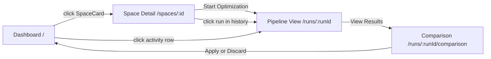

# Databricks App Frontend

The frontend is a React single-page application (SPA) with a FastAPI backend, deployed as a Databricks App. The SPA communicates exclusively with the FastAPI backend via REST APIs under the `/api/genie/` prefix. The backend reads Delta tables for state and interacts with Databricks services (Jobs API, Genie API, Unity Catalog) on behalf of the user.

---

## 1. Tech Stack

| Layer | Technology |
|-------|-----------|
| Framework | React 18 + TypeScript |
| Build Tool | Vite 6 |
| Styling | Tailwind CSS 3 |
| Routing | React Router v6 |
| Icons | Lucide React |
| API Client | Fetch API (native) |
| Backend | FastAPI (Python) |
| State Store | Delta tables in Unity Catalog |

---

## 2. Application Structure

```
app/
├── frontend/                         # React SPA
│   ├── src/
│   │   ├── App.tsx                   # Root component with React Router
│   │   ├── main.tsx                  # Vite entry point
│   │   ├── pages/
│   │   │   ├── Dashboard.tsx         # Screen 1: space grid + activity
│   │   │   ├── SpaceDetail.tsx       # Screen 2: config view + start optimization
│   │   │   ├── PipelineView.tsx      # Screen 3: live pipeline progress
│   │   │   └── ComparisonView.tsx    # Screen 4: side-by-side diff + apply/discard
│   │   ├── components/
│   │   │   ├── Layout.tsx            # App shell: header, nav, footer
│   │   │   ├── SpaceCard.tsx         # Grid card for a Genie Space
│   │   │   ├── SearchBar.tsx         # Debounced search input
│   │   │   ├── PipelineStepCard.tsx  # Expandable step card with status/timing
│   │   │   ├── ScoreCard.tsx         # Score display with breakdown bars
│   │   │   ├── ConfigDiff.tsx        # Side-by-side config comparison
│   │   │   └── Notification.tsx      # Toast notification (success/error/info)
│   │   ├── api/
│   │   │   └── client.ts            # Typed fetch wrappers for /api/genie/*
│   │   └── types/
│   │       └── index.ts             # TypeScript interfaces for API responses
│   ├── index.html
│   ├── vite.config.ts
│   ├── tailwind.config.js
│   ├── tsconfig.json
│   └── package.json
│
├── backend/                          # FastAPI backend
│   ├── main.py                       # FastAPI app + static file serving
│   ├── routes/
│   │   ├── spaces.py                 # /api/genie/spaces endpoints
│   │   ├── runs.py                   # /api/genie/runs endpoints
│   │   └── activity.py              # /api/genie/activity endpoint
│   ├── services/
│   │   ├── genie_service.py          # Genie API interactions
│   │   ├── optimization_service.py   # Job submission + Delta reads
│   │   └── comparison_service.py     # Config diff + apply/discard logic
│   └── models.py                     # Pydantic response models
│
└── app.yaml                          # Databricks App manifest
```

---

## 3. Navigation Flow



---

## 4. Screen 1: Dashboard (`/`)

The landing page and primary entry point for all personas.

### Layout

```
┌──────────────────────────────────────────────────────────────┐
│  [Header: Genie Space Optimizer — Databricks branding]        │
├──────────────────────────────────────────────────────────────┤
│  Stats Bar                                                    │
│  ┌──────────────┐  ┌──────────────┐  ┌──────────────┐       │
│  │ Total Spaces  │  │ Recent Runs  │  │ Avg Quality  │       │
│  │     12        │  │      5       │  │    87%       │       │
│  └──────────────┘  └──────────────┘  └──────────────┘       │
├──────────────────────────────────────────────────────────────┤
│  [SearchBar: Filter Genie Spaces by name...]                  │
├──────────────────────────────────────────────────────────────┤
│  Space Grid (3 columns, responsive)                           │
│  ┌───────────────┐ ┌───────────────┐ ┌───────────────┐      │
│  │ SpaceCard     │ │ SpaceCard     │ │ SpaceCard     │      │
│  │ Name          │ │ Name          │ │ Name          │      │
│  │ Description   │ │ Description   │ │ Description   │      │
│  │ 5 tables      │ │ 3 tables      │ │ 8 tables      │      │
│  │ Modified: 2d  │ │ Modified: 1w  │ │ Modified: 3h  │      │
│  │ Score: 87%    │ │ Score: —      │ │ Score: 92%    │      │
│  └───────────────┘ └───────────────┘ └───────────────┘      │
├──────────────────────────────────────────────────────────────┤
│  Recent Activity                                              │
│  ┌────────────────────────────────────────────────────────┐  │
│  │ Space          │ Status    │ User    │ Score │ Date    │  │
│  │ Revenue & Prop │ COMPLETED │ user@db │ 92%   │ 2h ago  │  │
│  │ Customer Eng   │ RUNNING   │ user@db │ —     │ 15m ago │  │
│  └────────────────────────────────────────────────────────┘  │
└──────────────────────────────────────────────────────────────┘
```

### Data Sources

- **Stats Bar:** Aggregated from `GET /api/genie/spaces` (total count) and `GET /api/genie/activity` (run count, avg score)
- **Space Grid:** `GET /api/genie/spaces` returns spaces enriched with last optimization metadata from Delta
- **Search:** Client-side filtering of the spaces array by name/description
- **Activity Table:** `GET /api/genie/activity` returns recent optimization runs across the workspace

### Component: `SpaceCard`

```typescript
interface SpaceCardProps {
  id: string;
  name: string;
  description: string;
  tableCount: number;
  lastModified: string;
  qualityScore: number | null;    // null = never optimized
}
```

Clicking a SpaceCard navigates to `/spaces/:id`.

---

## 5. Screen 2: Space Detail (`/spaces/:spaceId`)

Detailed view of a single Genie Space's current configuration with the "Start Optimization" button.

### Layout

```
┌──────────────────────────────────────────────────────────────┐
│  ← Back to Dashboard                                          │
├──────────────────────────────────────────────────────────────┤
│  Header                                                       │
│  Space Name: Revenue & Property Intelligence                  │
│  Description: ...                                             │
│  Tables: 5 │ Last Modified: Feb 23 │ Quality: 87%            │
│                                                               │
│  Apply Mode:  (●) Genie Space Config Only                     │
│               ( ) UC Artifacts                                │
│               ( ) Both                                        │
│                                         [Start Optimization]  │
├──────────────────────────────────────────────────────────────┤
│  Configuration Panels (two columns)                           │
│  ┌────────────────────────┐  ┌────────────────────────────┐  │
│  │ General Instructions   │  │ Sample Questions            │  │
│  │ (full text)            │  │ 1. What was total revenue?  │  │
│  │                        │  │ 2. Show top 10 properties   │  │
│  │                        │  │ 3. Revenue by property type │  │
│  └────────────────────────┘  └────────────────────────────┘  │
├──────────────────────────────────────────────────────────────┤
│  Referenced Tables                                            │
│  ┌────────────────────────────────────────────────────────┐  │
│  │ Table Name       │ Catalog  │ Schema   │ Columns │ Desc│  │
│  │ fact_booking     │ catalog  │ gold     │ 12      │ ... │  │
│  │ fact_payment     │ catalog  │ gold     │ 8       │ ... │  │
│  └────────────────────────────────────────────────────────┘  │
├──────────────────────────────────────────────────────────────┤
│  Optimization History                                         │
│  ┌────────────────────────────────────────────────────────┐  │
│  │ Run ID   │ Status    │ Baseline │ Optimized │ Date     │  │
│  │ abc123   │ COMPLETED │ 72%      │ 92%       │ Feb 23   │  │
│  │ def456   │ COMPLETED │ 68%      │ 85%       │ Feb 22   │  │
│  └────────────────────────────────────────────────────────┘  │
└──────────────────────────────────────────────────────────────┘
```

### Data Sources

- **Header + Config:** `GET /api/genie/spaces/:id` returns full space config (instructions, sample questions, table refs)
- **Tables:** Included in the space detail response, enriched with UC metadata (column count, descriptions)
- **History:** Included in the space detail response or fetched from `GET /api/genie/activity?space_id=:id`

### "Start Optimization" Action

Calls `POST /api/genie/spaces/:id/optimize?apply_mode=<selected>`. The frontend sends the user's `apply_mode` selection (default: `"genie_config"`). The backend:
1. Creates a row in `genie_opt_runs` with status `QUEUED` and the selected `apply_mode`
2. Submits a Databricks Job via `WorkspaceClient().jobs.run_now()` with `apply_mode` in notebook_params
3. Returns `{ runId, jobRunId }` to the frontend
4. Frontend navigates to `/runs/:runId`

### Apply Mode Radio Group

| Option | Value | Description |
|--------|-------|-------------|
| **Genie Space Config Only** (default) | `genie_config` | All changes are written to the Genie Space config overlays. Users do not need UC write access. |
| **UC Artifacts** | `uc_artifact` | Changes to levers 1-3 go directly to UC via ALTER TABLE, MV YAML updates, etc. Requires UC write permissions. |
| **Both** | `both` | Apply to both Genie config and UC artifacts for maximum coverage. |

Levers 4-6 (Join Specifications, Column Discovery Settings, Genie Space Instructions) always write to the Genie Space config regardless of this setting.

---

## 6. Screen 3: Pipeline View (`/runs/:runId`)

Real-time visualization of the optimization pipeline. Polls `GET /api/genie/runs/:runId` every 5 seconds until the run reaches a terminal state.

### Layout

```
┌──────────────────────────────────────────────────────────────┐
│  ← Back to Space Detail                                       │
├──────────────────────────────────────────────────────────────┤
│  Header                                                       │
│  Optimization Pipeline — Revenue & Property Intelligence      │
│  Run: abc123 │ Started: Feb 23, 2:15 PM │ By: user@db        │
├──────────────────────────────────────────────────────────────┤
│  Progress Bar                                                 │
│  ████████████████░░░░░░░░░░░░░  3/5 steps complete           │
│  (gradient: red → yellow → green)                             │
├──────────────────────────────────────────────────────────────┤
│  Score Summary (shown when pipeline completes)                │
│  ┌──────────────┐  ┌──────────────┐  ┌──────────────┐       │
│  │ Baseline     │  │ Optimized    │  │ Improvement  │       │
│  │   72%        │  │   92%        │  │   +20 pts    │       │
│  └──────────────┘  └──────────────┘  └──────────────┘       │
├──────────────────────────────────────────────────────────────┤
│  Pipeline Steps (vertically stacked, expandable)              │
│                                                               │
│  [1] Configuration Analysis         ✓ completed    12s        │
│      ▼ (expand)                                               │
│      Summary: Analyzed 5 tables, 3 instructions...            │
│      Inputs: { ... }                                          │
│      Outputs: { ... }                                         │
│                                                               │
│  [2] Metadata Collection            ✓ completed    8s         │
│                                                               │
│  [3] Baseline Evaluation            ◷ running...   45s        │
│      (spinning animation)                                     │
│                                                               │
│  [4] Configuration Generation       ○ pending                 │
│                                                               │
│  [5] Optimized Evaluation           ○ pending                 │
│                                                               │
├──────────────────────────────────────────────────────────────┤
│  [View Results →]  (shown when pipeline completes)            │
└──────────────────────────────────────────────────────────────┘
```

### Pipeline Steps

The backend maps internal harness stages to 5 user-facing pipeline steps:

| Step # | Name | Maps to Internal Stages | Description |
|--------|------|------------------------|-------------|
| 1 | Configuration Analysis | `PREFLIGHT_STARTED` → `PREFLIGHT_COMPLETE` | Analyzes current Genie Space config, identifies improvement areas |
| 2 | Metadata Collection | Part of `PREFLIGHT` (UC metadata fetch) | Collects column descriptions, tags, and sample values from Unity Catalog |
| 3 | Baseline Evaluation | `BASELINE_EVAL_STARTED` → `BASELINE_EVAL_COMPLETE` | Evaluates current config using 8-judge suite, produces baseline score |
| 4 | Configuration Generation | `LEVER_*` stages (all lever iterations) | Generates optimized instructions, descriptions, and sample questions |
| 5 | Optimized Evaluation | `FINALIZING` → `COMPLETE` | Evaluates the optimized config and compares against baseline |

The API response for `GET /api/genie/runs/:runId` includes a `steps` array with this user-facing mapping already applied, so the frontend doesn't need to understand internal stage names.

### Polling

```typescript
const POLL_INTERVAL = 5000; // 5 seconds

function usePipelinePolling(runId: string) {
  const [run, setRun] = useState<PipelineRun | null>(null);

  useEffect(() => {
    let active = true;

    async function poll() {
      while (active) {
        const data = await fetch(`/api/genie/runs/${runId}`).then(r => r.json());
        setRun(data);

        if (['COMPLETED', 'FAILED', 'CANCELLED'].includes(data.status)) {
          break;
        }
        await new Promise(r => setTimeout(r, POLL_INTERVAL));
      }
    }

    poll();
    return () => { active = false; };
  }, [runId]);

  return run;
}
```

### Component: `PipelineStepCard`

```typescript
interface PipelineStep {
  stepNumber: number;
  name: string;
  status: 'pending' | 'running' | 'completed' | 'failed';
  durationSeconds: number | null;
  summary: string | null;
  inputs: Record<string, any> | null;
  outputs: Record<string, any> | null;
}

interface PipelineStepCardProps {
  step: PipelineStep;
  isExpanded: boolean;
  onToggle: () => void;
}
```

- **pending:** Gray circle icon, grayed-out text
- **running:** Spinning animation, blue text, elapsed timer
- **completed:** Green check icon, duration shown
- **failed:** Red X icon, error message in expandable detail

---

## 7. Screen 4: Comparison View (`/runs/:runId/comparison`)

Side-by-side review of original vs. optimized configurations with evaluation scores. This is the decision point where the user applies or discards the optimization.

### Layout

```
┌──────────────────────────────────────────────────────────────┐
│  ← Back to Pipeline View                                      │
├──────────────────────────────────────────────────────────────┤
│  Header                                                       │
│  Optimization Results — Revenue & Property Intelligence       │
│  Review changes and choose to apply or discard                │
│                        [Apply Optimization]  [Discard]        │
├──────────────────────────────────────────────────────────────┤
│  Score Card                                                   │
│  ┌──────────────┐  ┌──────────────┐  ┌──────────────┐       │
│  │ Baseline     │  │ Optimized    │  │ Improvement  │       │
│  │   72%        │  │   92%        │  │   +27.8%     │       │
│  └──────────────┘  └──────────────┘  └──────────────┘       │
│                                                               │
│  Per-Dimension Score Breakdown                                │
│  syntax_validity     ████████████████████ 100% → 100%        │
│  schema_accuracy     ████████████████░░░░  88% → 96%  (+8)   │
│  logical_accuracy    █████████████░░░░░░░  76% → 92%  (+16)  │
│  semantic_equiv      ██████████████░░░░░░  80% → 90%  (+10)  │
│  completeness        ████████████░░░░░░░░  72% → 88%  (+16)  │
│  result_correct      ███████████░░░░░░░░░  68% → 85%  (+17)  │
│  asset_routing       ████████████████████  92% → 96%  (+4)   │
├──────────────────────────────────────────────────────────────┤
│  Configuration Diff                                           │
│                                                               │
│  Instructions                                                 │
│  ┌────────────────────────┐  ┌────────────────────────────┐  │
│  │ ORIGINAL               │  │ OPTIMIZED                  │  │
│  │ You are a revenue      │  │ You are a revenue          │  │
│  │ analyst assistant.     │  │ analyst assistant.          │  │
│  │                        │  │ + When asked about revenue  │  │
│  │                        │  │   trends, use the           │  │
│  │                        │  │   booking_analytics_metrics  │  │
│  │                        │  │   metric view with          │  │
│  │                        │  │   MEASURE() syntax.         │  │
│  └────────────────────────┘  └────────────────────────────┘  │
│                                                               │
│  Sample Questions                                             │
│  ┌────────────────────────┐  ┌────────────────────────────┐  │
│  │ ORIGINAL               │  │ OPTIMIZED                  │  │
│  │ 1. Total revenue?      │  │ 1. Total revenue?          │  │
│  │ 2. Top properties      │  │ 2. Top properties          │  │
│  │                        │  │ 3. Revenue by type  [NEW]  │  │
│  │                        │  │ 4. Booking trends   [NEW]  │  │
│  └────────────────────────┘  └────────────────────────────┘  │
│                                                               │
│  Table Descriptions                                           │
│  ┌────────────────────────┐  ┌────────────────────────────┐  │
│  │ fact_booking:           │  │ fact_booking:              │  │
│  │ "Booking transactions" │  │ "Booking transactions      │  │
│  │                        │  │  including check-in date,   │  │
│  │                        │  │  revenue, and guest info"   │  │
│  └────────────────────────┘  └────────────────────────────┘  │
├──────────────────────────────────────────────────────────────┤
│                        [Apply Optimization]  [Discard]        │
└──────────────────────────────────────────────────────────────┘
```

### Data Source

`GET /api/genie/runs/:runId/comparison` returns:

```typescript
interface ComparisonData {
  runId: string;
  spaceId: string;
  spaceName: string;
  baselineScore: number;
  optimizedScore: number;
  improvementPct: number;
  perDimensionScores: {
    dimension: string;
    baseline: number;
    optimized: number;
    delta: number;
  }[];
  original: SpaceConfiguration;
  optimized: SpaceConfiguration;
}

interface SpaceConfiguration {
  instructions: string;
  sampleQuestions: string[];
  tableDescriptions: { tableName: string; description: string }[];
}
```

### Apply / Discard Actions

| Action | API Call | Backend Behavior |
|--------|---------|-----------------|
| Apply Optimization | `POST /api/genie/runs/:runId/apply` | PATCH Genie Space config via API, update `genie_opt_runs.status` to `APPLIED`, log action to Delta |
| Discard | `POST /api/genie/runs/:runId/discard` | Update `genie_opt_runs.status` to `DISCARDED`, log decision to Delta, leave Genie Space unchanged |

Both actions show a toast notification on success and offer a "Return to Dashboard" link.

### Component: `ConfigDiff`

```typescript
interface ConfigDiffProps {
  original: SpaceConfiguration;
  optimized: SpaceConfiguration;
}
```

Renders three side-by-side sections:
- **Instructions:** Full text comparison, added lines highlighted in green
- **Sample Questions:** Numbered list with `[NEW]` badges on added questions
- **Table Descriptions:** Table-by-table, changed text highlighted

### Component: `ScoreCard`

```typescript
interface ScoreCardProps {
  baselineScore: number;
  optimizedScore: number;
  improvementPct: number;
  perDimensionScores: {
    dimension: string;
    baseline: number;
    optimized: number;
    delta: number;
  }[];
}
```

Renders three stat cards (Baseline, Optimized, Improvement) plus a per-dimension breakdown with dual-bar visualization.

---

## 8. Core Components

| Component | Purpose |
|-----------|---------|
| `Layout` | App shell with dark header (#1B3139), Databricks branding, red accent (#FF3621), and footer |
| `SpaceCard` | Card in grid showing space name, description, table count, last modified, quality score badge |
| `SearchBar` | Input with search icon, clear button, debounced filtering (300ms) |
| `PipelineStepCard` | Expandable card for a pipeline step with status icon, timing, summary, JSON inputs/outputs |
| `ScoreCard` | Evaluation score display with baseline vs optimized comparison and per-dimension bars |
| `ConfigDiff` | Side-by-side comparison of two `SpaceConfiguration` objects with change highlighting |
| `Notification` | Toast notification with auto-dismiss (5s), supports success/error/info variants |

---

## 9. FastAPI Backend Endpoints

All endpoints are under the `/api/genie/` prefix.

### Spaces

```python
from fastapi import FastAPI, HTTPException
from pydantic import BaseModel

app = FastAPI()

@app.get("/api/genie/spaces")
def list_spaces() -> list[SpaceSummary]:
    """List all Genie Spaces accessible to the user, enriched with optimization metadata.

    Returns space name, description, table count, last modified, and quality score
    (from the most recent optimization run in Delta, if any).

    Used by: Dashboard grid.
    """

@app.get("/api/genie/spaces/{space_id}")
def get_space_detail(space_id: str) -> SpaceDetail:
    """Get full configuration of a Genie Space.

    Returns instructions, sample questions, referenced tables with UC metadata
    (column names, descriptions, tags), and optimization run history.

    Used by: Space Detail page.
    """

@app.post("/api/genie/spaces/{space_id}/optimize")
def start_optimization(space_id: str) -> OptimizeResponse:
    """Initiate an optimization pipeline for a Genie Space.

    1. Creates a QUEUED row in genie_opt_runs
    2. Submits a Databricks Job via WorkspaceClient().jobs.submit_run()
    3. Returns { runId, jobRunId }

    Used by: "Start Optimization" button.
    """
```

### Runs

```python
@app.get("/api/genie/runs/{run_id}")
def get_run(run_id: str) -> PipelineRun:
    """Get current status of an optimization run with user-facing pipeline steps.

    Maps internal harness stages to 5 user-facing steps:
      PREFLIGHT     -> Step 1 (Configuration Analysis) + Step 2 (Metadata Collection)
      BASELINE_EVAL -> Step 3 (Baseline Evaluation)
      LEVER_*       -> Step 4 (Configuration Generation)
      FINALIZING    -> Step 5 (Optimized Evaluation)

    Returns run metadata, step statuses, and score summary (when complete).

    Used by: Pipeline View (polled every 5s).
    """

@app.get("/api/genie/runs/{run_id}/comparison")
def get_comparison(run_id: str) -> ComparisonData:
    """Get side-by-side comparison of original vs optimized configurations.

    Returns:
    - Baseline and optimized scores with per-dimension breakdown
    - Original SpaceConfiguration (instructions, sample questions, table descriptions)
    - Optimized SpaceConfiguration (after lever loop applied patches)
    - Diff highlights

    Built from: genie_opt_runs.config_snapshot (original),
    current Genie Space config via API (optimized), and
    genie_opt_iterations scores.

    Used by: Comparison View.
    """

@app.post("/api/genie/runs/{run_id}/apply")
def apply_optimization(run_id: str) -> ActionResponse:
    """Apply the optimized configuration to the Genie Space.

    The optimization harness has already applied patches during the lever loop,
    so this endpoint:
    1. Verifies the run completed successfully
    2. Updates genie_opt_runs.status to APPLIED
    3. Logs the apply action with user identity and timestamp
    4. Returns confirmation

    If the harness ran in dry-run mode, this endpoint would PATCH the Genie Space
    config via the API using the optimized configuration snapshot.

    Used by: "Apply Optimization" button.
    """

@app.post("/api/genie/runs/{run_id}/discard")
def discard_optimization(run_id: str) -> ActionResponse:
    """Discard the optimization results without changing the Genie Space.

    1. Rolls back any patches applied during the lever loop (via rollback())
    2. Updates genie_opt_runs.status to DISCARDED
    3. Logs the discard action with user identity and timestamp

    Used by: "Discard" button.
    """
```

### Activity

```python
@app.get("/api/genie/activity")
def get_activity(space_id: str | None = None, limit: int = 20) -> list[ActivityItem]:
    """Get recent optimization activity across the workspace.

    Optionally filtered by space_id. Returns run ID, space name, status,
    initiating user, baseline/optimized scores, and timestamp.

    Used by: Dashboard activity table, Space Detail history.
    """
```

### Response Models

```python
class SpaceSummary(BaseModel):
    id: str
    name: str
    description: str
    tableCount: int
    lastModified: str
    qualityScore: float | None

class SpaceDetail(BaseModel):
    id: str
    name: str
    description: str
    instructions: str
    sampleQuestions: list[str]
    tables: list[TableInfo]
    optimizationHistory: list[RunSummary]

class TableInfo(BaseModel):
    name: str
    catalog: str
    schema_name: str  # "schema" is reserved in Pydantic
    description: str
    columnCount: int
    rowCount: int | None

class OptimizeResponse(BaseModel):
    runId: str
    jobRunId: str

class PipelineRun(BaseModel):
    runId: str
    spaceId: str
    spaceName: str
    status: str                        # QUEUED | RUNNING | COMPLETED | FAILED | CANCELLED
    startedAt: str
    completedAt: str | None
    initiatedBy: str
    baselineScore: float | None
    optimizedScore: float | None
    steps: list[PipelineStep]

class PipelineStep(BaseModel):
    stepNumber: int
    name: str
    status: str                        # pending | running | completed | failed
    durationSeconds: float | None
    summary: str | None
    inputs: dict | None
    outputs: dict | None

class ComparisonData(BaseModel):
    runId: str
    spaceId: str
    spaceName: str
    baselineScore: float
    optimizedScore: float
    improvementPct: float
    perDimensionScores: list[DimensionScore]
    original: SpaceConfiguration
    optimized: SpaceConfiguration

class DimensionScore(BaseModel):
    dimension: str
    baseline: float
    optimized: float
    delta: float

class SpaceConfiguration(BaseModel):
    instructions: str
    sampleQuestions: list[str]
    tableDescriptions: list[TableDescription]

class TableDescription(BaseModel):
    tableName: str
    description: str

class ActionResponse(BaseModel):
    status: str                        # applied | discarded
    runId: str
    message: str

class ActivityItem(BaseModel):
    runId: str
    spaceId: str
    spaceName: str
    status: str
    initiatedBy: str
    baselineScore: float | None
    optimizedScore: float | None
    timestamp: str

class RunSummary(BaseModel):
    runId: str
    status: str
    baselineScore: float | None
    optimizedScore: float | None
    timestamp: str
```

---

## 10. Internal Stage-to-Step Mapping (Backend)

The backend translates internal harness stages into 5 user-facing pipeline steps. This mapping lives in the `GET /api/genie/runs/:runId` route handler.

```python
def map_stages_to_steps(stages: list[dict], iterations: list[dict]) -> list[dict]:
    """Map internal harness stages to 5 user-facing pipeline steps.

    Internal stages are fine-grained (PREFLIGHT_STARTED, LEVER_2_EVAL_DONE, etc.).
    Users see 5 coarse steps with clear names and progressive disclosure.
    """
    STEP_DEFINITIONS = [
        {
            "stepNumber": 1,
            "name": "Configuration Analysis",
            "stage_prefixes": ["PREFLIGHT"],
            "summary_template": "Analyzed {tables} tables, {instructions} instructions, {questions} sample questions",
        },
        {
            "stepNumber": 2,
            "name": "Metadata Collection",
            "stage_prefixes": ["PREFLIGHT"],
            "summary_template": "Collected metadata for {columns} columns, {tags} tags, {routines} routines from Unity Catalog",
        },
        {
            "stepNumber": 3,
            "name": "Baseline Evaluation",
            "stage_prefixes": ["BASELINE_EVAL"],
            "summary_template": "Evaluated {questions} benchmark questions with 8 judges. Baseline score: {score}%",
        },
        {
            "stepNumber": 4,
            "name": "Configuration Generation",
            "stage_prefixes": ["LEVER_"],
            "summary_template": "Applied {patches} optimizations across {levers} categories. Score improved from {before}% to {after}%",
        },
        {
            "stepNumber": 5,
            "name": "Optimized Evaluation",
            "stage_prefixes": ["FINALIZING", "REPEATABILITY", "DEPLOYING", "COMPLETE"],
            "summary_template": "Final evaluation complete. Optimized score: {score}%. Repeatability: {repeatability}%",
        },
    ]

    steps = []
    for defn in STEP_DEFINITIONS:
        matching = [s for s in stages if any(s["stage"].startswith(p) for p in defn["stage_prefixes"])]
        status = _derive_step_status(matching)
        duration = _compute_step_duration(matching)
        summary = _build_step_summary(defn, matching, iterations)
        inputs_outputs = _extract_step_io(matching)

        steps.append({
            "stepNumber": defn["stepNumber"],
            "name": defn["name"],
            "status": status,
            "durationSeconds": duration,
            "summary": summary,
            **inputs_outputs,
        })

    return steps


def _derive_step_status(matching_stages: list[dict]) -> str:
    """Derive user-facing status from internal stage statuses."""
    if not matching_stages:
        return "pending"
    statuses = {s["status"] for s in matching_stages}
    if "FAILED" in statuses:
        return "failed"
    if all(s in ("COMPLETE", "SKIPPED", "ROLLED_BACK") for s in statuses):
        return "completed"
    if "STARTED" in statuses:
        return "running"
    return "pending"
```

---

## 11. Design Principles

| Principle | Implementation |
|-----------|---------------|
| **Databricks-branded** | Dark header (#1B3139), red accent (#FF3621), clean gray body (#F5F5F5) |
| **Progressive disclosure** | Overview first (Dashboard grid), drill into detail (Space Detail), observe process (Pipeline), review results (Comparison) |
| **Responsive** | Tailwind CSS grid, 3-column on desktop, 2-column on tablet, 1-column on mobile. Min width: 768px |
| **Loading states** | Skeleton loaders for all async data fetches |
| **Error handling** | Inline error messages for API failures, toast notifications for user actions |
| **Keyboard accessible** | All interactive elements (cards, buttons, expandable sections) are focusable and operable via keyboard |
| **Screen reader** | Key elements (pipeline status, scores, diffs) have ARIA labels |

---

## 12. Authentication

| Concern | Mechanism |
|---------|-----------|
| User login | Databricks App SSO (automatic, no custom auth) |
| API auth | App service principal, requests forwarded with user identity |
| Space visibility | Genie API respects user's workspace permissions |
| Job submission | Service principal submits jobs; `triggered_by` field logs user email |
| Delta access | Service principal has read/write on the optimization schema |

---

## 13. Dependencies

### Frontend (`frontend/package.json`)

```json
{
  "dependencies": {
    "react": "^18.3.0",
    "react-dom": "^18.3.0",
    "react-router-dom": "^6.20.0",
    "lucide-react": "^0.300.0"
  },
  "devDependencies": {
    "typescript": "^5.4.0",
    "vite": "^6.0.0",
    "@vitejs/plugin-react": "^4.2.0",
    "tailwindcss": "^3.4.0",
    "autoprefixer": "^10.4.0",
    "postcss": "^8.4.0"
  }
}
```

### Backend (`requirements.txt`)

```
fastapi>=0.100.0
uvicorn>=0.20.0
databricks-sdk>=0.20.0
databricks-connect>=14.0.0
mlflow[databricks]>=3.4.0
pyyaml>=6.0
```

---

## 15. Optimization Process — Visual Walkthroughs

This section provides a step-by-step storyboard of the optimization pipeline as seen by the user. At each phase, it shows the internal harness stages being written to Delta, the corresponding API response shape, and the exact UI state the frontend should render. Use this as the definitive reference for building the Pipeline View status monitor.

---

### 15.1 Complete Optimization Timeline

The following diagram shows the full lifecycle of an optimization run from the user's perspective, with internal stages annotated on the right.

```
TIME    USER SEES (Pipeline View)                 INTERNAL HARNESS STAGES
─────   ──────────────────────────────────────    ─────────────────────────────────
0:00    ┌─────────────────────────────────┐
        │ [1] Config Analysis   ◷ running │       PREFLIGHT_STARTED
        │ [2] Metadata Collect. ○ pending │
        │ [3] Baseline Eval     ○ pending │
        │ [4] Config Generation ○ pending │
        │ [5] Optimized Eval    ○ pending │
        │                                 │
        │ Progress: ██░░░░░░░░░  1/5      │
        └─────────────────────────────────┘

0:08    ┌─────────────────────────────────┐       PREFLIGHT_COMPLETE
        │ [1] Config Analysis   ✓ 8s      │       (Genie config fetched,
        │ [2] Metadata Collect. ◷ running │        UC metadata collected,
        │ [3] Baseline Eval     ○ pending │        benchmarks validated,
        │ [4] Config Generation ○ pending │        MLflow experiment created,
        │ [5] Optimized Eval    ○ pending │        LoggedModel v0 created)
        │                                 │
        │ Progress: ████░░░░░░░  2/5      │
        └─────────────────────────────────┘

0:15    ┌─────────────────────────────────┐       BASELINE_EVAL_STARTED
        │ [1] Config Analysis   ✓ 8s      │
        │ [2] Metadata Collect. ✓ 7s      │
        │ [3] Baseline Eval     ◷ running │       (evaluation job submitted,
        │ [4] Config Generation ○ pending │        25 benchmarks × 12s rate limit
        │ [5] Optimized Eval    ○ pending │        ≈ 5 min for full eval)
        │                                 │
        │ Progress: ██████░░░░░  3/5      │
        └─────────────────────────────────┘

5:15    ┌─────────────────────────────────┐       BASELINE_EVAL_COMPLETE
        │ [1] Config Analysis   ✓ 8s      │       (iteration 0 scores written,
        │ [2] Metadata Collect. ✓ 7s      │        ASI results in Delta)
        │ [3] Baseline Eval     ✓ 5m 0s   │
        │     ▼ Baseline: 72%             │
        │ [4] Config Generation ◷ running │
        │ [5] Optimized Eval    ○ pending │
        │                                 │
        │ Progress: ████████░░░  4/5      │
        └─────────────────────────────────┘

5:15    ┌─────────────────────────────────┐       LEVER_1_STARTED
─       │                                 │       LEVER_1_PROPOSALS_READY
18:00   │ [4] Config Generation ◷ running │       LEVER_1_APPLIED
        │     Lever 1: Tables & Columns   │       LEVER_1_EVAL_STARTED
        │     3 patches applied           │       LEVER_1_EVAL_DONE (or ROLLED_BACK)
        │     Evaluating...               │       LEVER_1_ACCEPTED
        │                                 │       LEVER_2_STARTED
        │ (repeats for each lever 1-6)    │       ...
        │                                 │       LEVER_6_ACCEPTED (or earlier exit)
        └─────────────────────────────────┘

18:00   ┌─────────────────────────────────┐       FINALIZING (STARTED)
        │ [1] Config Analysis   ✓ 8s      │       REPEATABILITY_TEST (STARTED)
        │ [2] Metadata Collect. ✓ 7s      │       REPEATABILITY_TEST (COMPLETE)
        │ [3] Baseline Eval     ✓ 5m 0s   │       FINALIZING (COMPLETE)
        │ [4] Config Generation ✓ 12m 45s │       COMPLETE
        │ [5] Optimized Eval    ◷ running │
        │                                 │
        │ Progress: ██████████░  5/5      │
        └─────────────────────────────────┘

23:00   ┌─────────────────────────────────┐
        │ [1] Config Analysis   ✓ 8s      │
        │ [2] Metadata Collect. ✓ 7s      │
        │ [3] Baseline Eval     ✓ 5m 0s   │
        │ [4] Config Generation ✓ 12m 45s │
        │ [5] Optimized Eval    ✓ 5m 0s   │
        │                                 │
        │ ┌────────┐ ┌────────┐ ┌───────┐ │
        │ │Base: 72│ │Opt: 92 │ │+20 pts│ │
        │ └────────┘ └────────┘ └───────┘ │
        │                                 │
        │ Progress: ███████████  5/5  ✓   │
        │           [View Results →]      │
        └─────────────────────────────────┘
```

---

### 15.2 Walkthrough: Step 1 — Configuration Analysis

**When it starts:** Immediately after job begins executing.
**Internal stage:** `PREFLIGHT_STARTED` → `PREFLIGHT_COMPLETE`

```
┌─────────────────────────────────────────────────────────────────┐
│  [1] Configuration Analysis              ◷ running...    12s    │
│  ─────────────────────────────────────────────────────────────  │
│  ▼ Details                                                      │
│                                                                 │
│  What's happening:                                              │
│  ● Fetching Genie Space configuration via API                   │
│  ● Reading instructions, sample questions, and table references │
│  ● Identifying referenced Unity Catalog tables                  │
│  ● Validating benchmark questions against table schemas         │
│  ● Creating MLflow experiment for tracking                      │
│                                                                 │
│  (spinner animation next to current sub-task)                   │
└─────────────────────────────────────────────────────────────────┘
```

**When it completes:**

```
┌─────────────────────────────────────────────────────────────────┐
│  [1] Configuration Analysis              ✓ completed     8s     │
│  ─────────────────────────────────────────────────────────────  │
│  ▼ Details                                                      │
│                                                                 │
│  Summary: Analyzed 5 tables, 3 instructions, 8 sample questions │
│                                                                 │
│  Findings:                                                      │
│  ┌──────────────────────────────────────────────────────────┐  │
│  │ Item                │ Count │ Status                      │  │
│  │ Referenced tables   │ 5     │ All accessible              │  │
│  │ Instructions        │ 3     │ Analyzed                    │  │
│  │ Sample questions    │ 8     │ Analyzed                    │  │
│  │ Benchmark questions │ 25    │ 24 valid, 1 SQL error       │  │
│  │ MLflow experiment   │ —     │ Created                     │  │
│  └──────────────────────────────────────────────────────────┘  │
│                                                                 │
│  Config hash: a4f2b8...c1e9                                     │
└─────────────────────────────────────────────────────────────────┘
```

**API response shape** (relevant fields from `GET /api/genie/runs/:runId`):

```json
{
  "steps": [{
    "stepNumber": 1,
    "name": "Configuration Analysis",
    "status": "completed",
    "durationSeconds": 8.2,
    "summary": "Analyzed 5 tables, 3 instructions, 8 sample questions",
    "outputs": {
      "tables": 5,
      "instructions": 3,
      "sampleQuestions": 8,
      "benchmarksValid": 24,
      "benchmarksInvalid": 1,
      "configHash": "a4f2b8...c1e9"
    }
  }]
}
```

---

### 15.3 Walkthrough: Step 2 — Metadata Collection

**When it starts:** Immediately after Step 1 completes.
**Internal stage:** Also part of `PREFLIGHT` — the backend splits `PREFLIGHT_COMPLETE` into two user-facing steps based on the `detail_json` content.

```
┌─────────────────────────────────────────────────────────────────┐
│  [2] Metadata Collection                 ◷ running...    3s     │
│  ─────────────────────────────────────────────────────────────  │
│  ▼ Details                                                      │
│                                                                 │
│  What's happening:                                              │
│  ● Querying Unity Catalog information_schema for columns        │
│  ● Collecting table and column tags                             │
│  ● Discovering routines (Table-Valued Functions)                │
│  ● Reading column descriptions and sample values                │
│                                                                 │
│  Tables being scanned:                                          │
│  ┌────────────────────────────────────────────────────────┐    │
│  │ ✓ fact_booking          12 columns  │ tags: 3          │    │
│  │ ✓ fact_payment           8 columns  │ tags: 1          │    │
│  │ ◷ dim_property          15 columns  │ ...              │    │
│  │ ○ dim_guest              9 columns  │ ...              │    │
│  │ ○ fact_revenue_daily     6 columns  │ ...              │    │
│  └────────────────────────────────────────────────────────┘    │
└─────────────────────────────────────────────────────────────────┘
```

**When it completes:**

```
┌─────────────────────────────────────────────────────────────────┐
│  [2] Metadata Collection                 ✓ completed     7s     │
│  ─────────────────────────────────────────────────────────────  │
│  ▼ Details                                                      │
│                                                                 │
│  Summary: Collected metadata for 50 columns, 8 tags,            │
│           2 routines from Unity Catalog                         │
│                                                                 │
│  ┌──────────────────────────────────────────────────────────┐  │
│  │ Source              │ Count │ Detail                      │  │
│  │ Columns             │ 50    │ Across 5 tables             │  │
│  │ Column descriptions │ 38    │ 12 missing descriptions     │  │
│  │ Tags                │ 8     │ Compliance + semantic tags   │  │
│  │ Routines (TVFs)     │ 2     │ booking_analytics(),        │  │
│  │                     │       │ revenue_by_period()         │  │
│  │ Metric Views        │ 1     │ booking_analytics_metrics   │  │
│  └──────────────────────────────────────────────────────────┘  │
│                                                                 │
│  ⚠ 12 columns have no description — these are optimization     │
│    candidates for Lever 1 (Tables & Columns)                   │
└─────────────────────────────────────────────────────────────────┘
```

**API response shape:**

```json
{
  "steps": [{
    "stepNumber": 2,
    "name": "Metadata Collection",
    "status": "completed",
    "durationSeconds": 7.1,
    "summary": "Collected metadata for 50 columns, 8 tags, 2 routines from Unity Catalog",
    "outputs": {
      "columns": 50,
      "columnsWithDescriptions": 38,
      "columnsMissingDescriptions": 12,
      "tags": 8,
      "routines": 2,
      "metricViews": 1
    }
  }]
}
```

---

### 15.4 Walkthrough: Step 3 — Baseline Evaluation

**When it starts:** After metadata collection.
**Internal stages:** `BASELINE_EVAL_STARTED` → `BASELINE_EVAL_COMPLETE`
**Typical duration:** 3-8 minutes (25 benchmarks × 12s rate limit)

```
┌─────────────────────────────────────────────────────────────────┐
│  [3] Baseline Evaluation                 ◷ running...  2m 36s   │
│  ─────────────────────────────────────────────────────────────  │
│  ▼ Details                                                      │
│                                                                 │
│  What's happening:                                              │
│  ● Submitting evaluation job to Databricks Jobs                 │
│  ● Running 25 benchmark questions through Genie Space           │
│  ● Executing ground truth SQL for each question                 │
│  ● Scoring with 8 judges (syntax, schema, logic, semantic,      │
│    completeness, results, asset routing, arbiter)               │
│  ● Generating Actionable Side Information (ASI) for failures    │
│                                                                 │
│  Progress: 13/25 questions evaluated                            │
│  ████████████████████░░░░░░░░░░░░░░░░░░░  52%                  │
│                                                                 │
│  Estimated time remaining: ~2m 24s                              │
│  (12s per question × 12 remaining)                              │
└─────────────────────────────────────────────────────────────────┘
```

**Note on sub-progress:** The frontend can estimate progress within Step 3 by computing `elapsed / (benchmarkCount × 12)`. The exact question-level progress is not available from the API (the evaluation job runs internally), but the estimated completion % provides useful feedback.

**When it completes:**

```
┌─────────────────────────────────────────────────────────────────┐
│  [3] Baseline Evaluation                 ✓ completed   5m 0s    │
│  ─────────────────────────────────────────────────────────────  │
│  ▼ Details                                                      │
│                                                                 │
│  Summary: Evaluated 25 benchmark questions with 8 judges.       │
│           Baseline score: 72%                                   │
│                                                                 │
│  Per-Judge Scores:                                              │
│  ┌──────────────────────────────────────────────────────────┐  │
│  │ Judge               │ Score │ Target │ Status             │  │
│  │ syntax_validity     │ 100%  │  98%   │ ✓ Met              │  │
│  │ schema_accuracy     │  88%  │  95%   │ ✗ Below target     │  │
│  │ logical_accuracy    │  76%  │  90%   │ ✗ Below target     │  │
│  │ semantic_equivalence│  80%  │  90%   │ ✗ Below target     │  │
│  │ completeness        │  72%  │  90%   │ ✗ Below target     │  │
│  │ result_correctness  │  68%  │  85%   │ ✗ Below target     │  │
│  │ asset_routing       │  92%  │  95%   │ ✗ Below target     │  │
│  └──────────────────────────────────────────────────────────┘  │
│                                                                 │
│  Failures: 8 of 25 questions have at least one failing judge   │
│                                                                 │
│  Top Failure Types:                                             │
│  ┌──────────────────────────────────────────────────────────┐  │
│  │ Failure Type          │ Count │ Affected Questions       │  │
│  │ wrong_column          │ 3     │ Q5, Q12, Q18             │  │
│  │ missing_instruction   │ 2     │ Q7, Q22                  │  │
│  │ wrong_aggregation     │ 2     │ Q9, Q15                  │  │
│  │ asset_routing_error   │ 1     │ Q3                       │  │
│  └──────────────────────────────────────────────────────────┘  │
│                                                                 │
│  🔗 MLflow Run: experiment/run/abc123                           │
└─────────────────────────────────────────────────────────────────┘
```

**API response shape:**

```json
{
  "steps": [{
    "stepNumber": 3,
    "name": "Baseline Evaluation",
    "status": "completed",
    "durationSeconds": 300.4,
    "summary": "Evaluated 25 benchmark questions with 8 judges. Baseline score: 72%",
    "outputs": {
      "overallScore": 72.0,
      "benchmarkCount": 25,
      "failureCount": 8,
      "perJudgeScores": {
        "syntax_validity": 100.0,
        "schema_accuracy": 88.0,
        "logical_accuracy": 76.0,
        "semantic_equivalence": 80.0,
        "completeness": 72.0,
        "result_correctness": 68.0,
        "asset_routing": 92.0
      },
      "topFailureTypes": [
        {"type": "wrong_column", "count": 3},
        {"type": "missing_instruction", "count": 2},
        {"type": "wrong_aggregation", "count": 2},
        {"type": "asset_routing_error", "count": 1}
      ],
      "mlflowRunId": "abc123"
    }
  }]
}
```

---

### 15.5 Walkthrough: Step 4 — Configuration Generation (The Lever Loop)

This is the most complex step. Internally it runs through up to 6 control levers, each involving failure analysis, proposal generation, patch application, evaluation, and accept/rollback decisions. The user sees it as a single "Configuration Generation" step with a rich expandable detail area.

**Internal stage lifecycle per lever:**

```
LEVER_N_STARTED
  └─ cluster_failures() → LEVER_N_PROPOSALS_READY (or LEVER_N_SKIPPED)
      └─ apply_patch_set() → LEVER_N_APPLIED
          └─ propagation wait (30s)
              └─ slice evaluation → pass/fail
                  └─ P0 evaluation → pass/fail
                      └─ full evaluation → regression check
                          └─ LEVER_N_ACCEPTED  ─── or ─── LEVER_N_ROLLED_BACK
```

**While running — Lever sub-progress view:**

```
┌─────────────────────────────────────────────────────────────────┐
│  [4] Configuration Generation            ◷ running...  6m 22s   │
│  ─────────────────────────────────────────────────────────────  │
│  ▼ Details                                                      │
│                                                                 │
│  Optimization is iterating through 6 categories of changes.     │
│  Each category is evaluated and only kept if it improves scores.│
│                                                                 │
│  Lever Progress:                                                │
│  ┌──────────────────────────────────────────────────────────┐  │
│  │                                                          │  │
│  │  [L1] Tables & Columns                                   │  │
│  │       ✓ Accepted — 3 patches applied                     │  │
│  │       Score: 72% → 80% (+8)                              │  │
│  │       Patches:                                           │  │
│  │         • update_column_description: fact_booking.        │  │
│  │           check_in_date → "Guest arrival date..."        │  │
│  │         • add_synonym: dim_property.property_name →      │  │
│  │           "hotel name"                                   │  │
│  │         • hide_column: fact_booking.internal_audit_id    │  │
│  │                                                          │  │
│  │  [L2] Metric Views                                       │  │
│  │       ◷ Evaluating patches... (2 patches applied)        │  │
│  │       Patches:                                           │  │
│  │         • update_mv_measure: booking_analytics_metrics.  │  │
│  │           total_revenue → refined aggregation            │  │
│  │         • add_mv_dimension: booking_analytics_metrics.   │  │
│  │           property_type                                  │  │
│  │                                                          │  │
│  │  [L3] Table-Valued Functions      ○ Pending              │  │
│  │  [L4] Join Specifications         ○ Pending              │  │
│  │  [L5] Column Discovery            ○ Pending              │  │
│  │  [L6] Instructions                ○ Pending              │  │
│  │                                                          │  │
│  └──────────────────────────────────────────────────────────┘  │
│                                                                 │
│  Current score: 80% (started at 72%)                            │
└─────────────────────────────────────────────────────────────────┘
```

**Lever with rollback:**

```
│  │  [L3] Table-Valued Functions                                │
│  │       ✗ Rolled back — regression detected                   │
│  │       Attempted: 1 patch                                    │
│  │         • update_tvf_sql: booking_analytics() →             │
│  │           refined date range handling                       │
│  │       Reason: schema_accuracy dropped 88% → 82% (-6 pts)   │
│  │       (exceeds 2 pt regression threshold)                   │
```

**Lever skipped (no proposals):**

```
│  │  [L5] Column Discovery                                        │
│  │       ─ Skipped — no optimization opportunities found       │
```

**Early convergence (all thresholds met mid-loop):**

```
│  │  [L4] Join Specifications         ─ Skipped (converged)     │
│  │  [L5] Column Discovery            ─ Skipped (converged)     │
│  │  [L6] Instructions                ─ Skipped (converged)     │
│  │                                                             │
│  │  ✓ All quality thresholds met after Lever 3!                │
```

**When Step 4 completes:**

```
┌─────────────────────────────────────────────────────────────────┐
│  [4] Configuration Generation            ✓ completed  12m 45s   │
│  ─────────────────────────────────────────────────────────────  │
│  ▼ Details                                                      │
│                                                                 │
│  Summary: Applied 7 optimizations across 4 categories.          │
│           Score improved from 72% to 91%                        │
│                                                                 │
│  Lever Results:                                                 │
│  ┌──────────────────────────────────────────────────────────┐  │
│  │ Lever │ Category             │ Result    │ Patches │ Δ   │  │
│  │ 1     │ Tables & Columns     │ Accepted  │ 3       │ +8  │  │
│  │ 2     │ Metric Views         │ Accepted  │ 2       │ +5  │  │
│  │ 3     │ Table-Valued Func.   │ Rolled ←  │ 1       │ -6  │  │
│  │ 4     │ Join Specifications  │ Accepted  │ 2       │ +4  │  │
│  │ 5     │ Column Discovery     │ Accepted  │ 5       │ +3  │  │
│  │ 6     │ Instructions         │ Accepted  │ 2       │ +6  │  │
│  └──────────────────────────────────────────────────────────┘  │
│                                                                 │
│  Score progression: 72% → 80% → 85% → 85% → 91%               │
│  (Lever 3 rolled back, no change at that step)                 │
│                                                                 │
│  All applied patches (7 total):                                 │
│  ┌──────────────────────────────────────────────────────────┐  │
│  │ # │ Type                    │ Target            │ Risk   │  │
│  │ 1 │ update_column_desc      │ fact_booking.     │ Low    │  │
│  │   │                         │ check_in_date     │        │  │
│  │ 2 │ add_synonym             │ dim_property.     │ Low    │  │
│  │   │                         │ property_name     │        │  │
│  │ 3 │ hide_column             │ fact_booking.     │ Medium │  │
│  │   │                         │ internal_audit_id │        │  │
│  │ 4 │ update_mv_measure       │ booking_metrics.  │ Medium │  │
│  │   │                         │ total_revenue     │        │  │
│  │ 5 │ add_mv_dimension        │ booking_metrics.  │ Low    │  │
│  │   │                         │ property_type     │        │  │
│  │ 6 │ add_instruction         │ Genie Space       │ Low    │  │
│  │   │                         │ (routing rule)    │        │  │
│  │ 7 │ update_instruction      │ Genie Space       │ Medium │  │
│  │   │                         │ (MEASURE() guide) │        │  │
│  └──────────────────────────────────────────────────────────┘  │
└─────────────────────────────────────────────────────────────────┘
```

**API response shape for Step 4:**

```json
{
  "steps": [{
    "stepNumber": 4,
    "name": "Configuration Generation",
    "status": "completed",
    "durationSeconds": 765.0,
    "summary": "Applied 7 optimizations across 4 categories. Score improved from 72% to 91%",
    "outputs": {
      "scoreStart": 72.0,
      "scoreEnd": 91.0,
      "totalPatchesApplied": 7,
      "totalPatchesRolledBack": 1,
      "levers": [
        {
          "lever": 1,
          "name": "Tables & Columns",
          "result": "accepted",
          "patchCount": 3,
          "scoreDelta": 8.0,
          "patches": [
            {"type": "update_column_description", "target": "fact_booking.check_in_date", "risk": "low"},
            {"type": "add_column_synonym", "target": "dim_property.property_name", "risk": "low"},
            {"type": "hide_column", "target": "fact_booking.internal_audit_id", "risk": "medium"}
          ]
        },
        {
          "lever": 2,
          "name": "Metric Views",
          "result": "accepted",
          "patchCount": 2,
          "scoreDelta": 5.0,
          "patches": [
            {"type": "update_mv_measure", "target": "booking_analytics_metrics.total_revenue", "risk": "medium"},
            {"type": "add_mv_dimension", "target": "booking_analytics_metrics.property_type", "risk": "low"}
          ]
        },
        {
          "lever": 3,
          "name": "Table-Valued Functions",
          "result": "rolled_back",
          "patchCount": 1,
          "scoreDelta": -6.0,
          "rollbackReason": "regression_detected: schema_accuracy dropped 88% → 82%",
          "patches": []
        },
        {
          "lever": 4,
          "name": "Join Specifications",
          "result": "accepted",
          "patchCount": 2,
          "scoreDelta": 4.0,
          "patches": [
            {"type": "add_join_spec", "target": "fact_booking ↔ dim_hotel", "risk": "medium"},
            {"type": "update_join_spec", "target": "fact_payment ↔ dim_property", "risk": "medium"}
          ]
        },
        {
          "lever": 5,
          "name": "Column Discovery Settings",
          "result": "accepted",
          "patchCount": 5,
          "scoreDelta": 3.0,
          "patches": [
            {"type": "enable_example_values", "target": "fact_booking.booking_status", "risk": "low"},
            {"type": "enable_value_dictionary", "target": "dim_property.property_type", "risk": "low"},
            {"type": "add_column_synonym", "target": "dim_property.property_name → hotel name", "risk": "low"}
          ]
        },
        {
          "lever": 6,
          "name": "Genie Space Instructions",
          "result": "accepted",
          "patchCount": 2,
          "scoreDelta": 6.0,
          "patches": [
            {"type": "add_instruction", "target": "Genie Space (routing rule)", "risk": "low"},
            {"type": "update_instruction", "target": "Genie Space (MEASURE() guide)", "risk": "medium"}
          ]
        }
      ],
      "scoreProgression": [72.0, 80.0, 85.0, 85.0, 89.0, 92.0, 95.0]
    }
  }]
}
```

---

### 15.6 Walkthrough: Step 5 — Optimized Evaluation

**When it starts:** After the lever loop completes.
**Internal stages:** `FINALIZING` → `REPEATABILITY_TEST` → `COMPLETE`

```
┌─────────────────────────────────────────────────────────────────┐
│  [5] Optimized Evaluation                ◷ running...  2m 15s   │
│  ─────────────────────────────────────────────────────────────  │
│  ▼ Details                                                      │
│                                                                 │
│  What's happening:                                              │
│  ● Running final full evaluation with optimized configuration   │
│  ● Promoting best-performing model snapshot                     │
│  ● Testing repeatability (re-querying to check consistency)     │
│  ● Generating optimization report                               │
│                                                                 │
│  Sub-tasks:                                                     │
│  ┌──────────────────────────────────────────────────────────┐  │
│  │ ✓ Model promotion complete (best iteration: 4)           │  │
│  │ ◷ Repeatability test running... (13/25 questions)        │  │
│  │ ○ Report generation pending                              │  │
│  └──────────────────────────────────────────────────────────┘  │
└─────────────────────────────────────────────────────────────────┘
```

**When it completes:**

```
┌─────────────────────────────────────────────────────────────────┐
│  [5] Optimized Evaluation                ✓ completed   5m 0s    │
│  ─────────────────────────────────────────────────────────────  │
│  ▼ Details                                                      │
│                                                                 │
│  Summary: Final evaluation complete. Optimized score: 92%.      │
│           Repeatability: 92%                                    │
│                                                                 │
│  Final Per-Judge Scores (vs Baseline):                          │
│  ┌──────────────────────────────────────────────────────────┐  │
│  │ Judge               │ Before │ After  │ Target │ Status  │  │
│  │ syntax_validity     │ 100%   │ 100%   │  98%   │ ✓ Met   │  │
│  │ schema_accuracy     │  88%   │  96%   │  95%   │ ✓ Met   │  │
│  │ logical_accuracy    │  76%   │  92%   │  90%   │ ✓ Met   │  │
│  │ semantic_equivalence│  80%   │  92%   │  90%   │ ✓ Met   │  │
│  │ completeness        │  72%   │  88%   │  90%   │ ✗ Close │  │
│  │ result_correctness  │  68%   │  88%   │  85%   │ ✓ Met   │  │
│  │ asset_routing       │  92%   │  96%   │  95%   │ ✓ Met   │  │
│  └──────────────────────────────────────────────────────────┘  │
│                                                                 │
│  Repeatability Results:                                         │
│  ┌──────────────────────────────────────────────────────────┐  │
│  │ Classification      │ Count │ Pct                        │  │
│  │ IDENTICAL            │ 20    │ 80%                        │  │
│  │ MINOR_VARIANCE       │ 3     │ 12%                        │  │
│  │ SIGNIFICANT_VARIANCE │ 2     │  8%                        │  │
│  │ CRITICAL_VARIANCE    │ 0     │  0%                        │  │
│  │                      │       │                            │  │
│  │ Overall repeatability: 92% (target: 90%) ✓                │  │
│  └──────────────────────────────────────────────────────────┘  │
│                                                                 │
│  Convergence: 6 of 7 thresholds met                             │
│  🔗 MLflow Experiment  🔗 Best Model  🔗 Report                │
└─────────────────────────────────────────────────────────────────┘
```

---

### 15.7 Walkthrough: Completion → Comparison View Transition

When the pipeline reaches a terminal state (`COMPLETED`, `CONVERGED`, or `MAX_ITERATIONS`), the Pipeline View shows the score summary and a "View Results" button.

**Pipeline View — complete state:**

```
┌─────────────────────────────────────────────────────────────────┐
│  ← Back to Space Detail                                         │
│                                                                 │
│  Optimization Pipeline — Revenue & Property Intelligence        │
│  Run: abc123 │ Duration: 23m 0s │ Status: COMPLETED             │
│                                                                 │
│  ┌──────────────┐  ┌──────────────┐  ┌──────────────┐          │
│  │ Baseline     │  │ Optimized    │  │ Improvement  │          │
│  │    72%       │  │    92%       │  │ +20 points   │          │
│  └──────────────┘  └──────────────┘  └──────────────┘          │
│                                                                 │
│  Progress: ███████████████████████████████  5/5  ✓              │
│                                                                 │
│  [1] Configuration Analysis     ✓  8s                           │
│  [2] Metadata Collection        ✓  7s                           │
│  [3] Baseline Evaluation        ✓  5m 0s                        │
│  [4] Configuration Generation   ✓  12m 45s                      │
│  [5] Optimized Evaluation       ✓  5m 0s                        │
│                                                                 │
│  ┌───────────────────────────────────────────────────────┐      │
│  │              [  View Results →  ]                      │      │
│  │  Review the optimized configuration and choose         │      │
│  │  to apply or discard                                   │      │
│  └───────────────────────────────────────────────────────┘      │
└─────────────────────────────────────────────────────────────────┘
```

Clicking "View Results" navigates to `/runs/:runId/comparison` (the Comparison View documented in Section 7).

---

### 15.8 Walkthrough: Error States

**Step-level failure (e.g., evaluation job crash):**

```
┌─────────────────────────────────────────────────────────────────┐
│  [3] Baseline Evaluation                 ✗ failed      3m 22s   │
│  ─────────────────────────────────────────────────────────────  │
│  ▼ Error Details                                                │
│                                                                 │
│  The evaluation job failed with an error.                       │
│                                                                 │
│  Error: RuntimeError: Genie API returned 429 Too Many Requests  │
│         for question Q7. Exhausted 3 retries.                   │
│                                                                 │
│  Troubleshooting:                                               │
│  • Check that the Genie Space is accessible and healthy         │
│  • Verify rate limit settings (current: 12s between queries)    │
│  • View the Databricks Job run for full error logs              │
│                                                                 │
│  🔗 View Job Run                                                │
└─────────────────────────────────────────────────────────────────┘

┌─────────────────────────────────────────────────────────────────┐
│  [4] Configuration Generation            ○ pending (blocked)    │
│  [5] Optimized Evaluation                ○ pending (blocked)    │
└─────────────────────────────────────────────────────────────────┘

Pipeline Status: FAILED
Reason: RuntimeError: Genie API returned 429 Too Many Requests

[Return to Space Detail]
```

**Cancellation by user:**

```
┌─────────────────────────────────────────────────────────────────┐
│  Pipeline Status: CANCELLED                                     │
│  Cancelled by user@databricks.com at Feb 23, 2:32 PM           │
│                                                                 │
│  [1] Configuration Analysis     ✓  8s                           │
│  [2] Metadata Collection        ✓  7s                           │
│  [3] Baseline Evaluation        ✓  5m 0s                        │
│  [4] Configuration Generation   ✗  cancelled at 4m 12s          │
│      Lever 2 was in progress — all patches rolled back          │
│  [5] Optimized Evaluation       ○  not started                  │
│                                                                 │
│  Note: The Genie Space has been restored to its pre-            │
│  optimization state. No changes were applied.                   │
│                                                                 │
│  [Return to Space Detail]                                       │
└─────────────────────────────────────────────────────────────────┘
```

---

### 15.9 Extended API Response: `PipelineRun` with Lever Detail

To support the rich Step 4 visualization, the `PipelineRun` response should include an extended `levers` array alongside the 5 steps. This allows the frontend to render lever sub-progress independently.

```typescript
interface PipelineRun {
  runId: string;
  spaceId: string;
  spaceName: string;
  status: 'QUEUED' | 'RUNNING' | 'COMPLETED' | 'FAILED' | 'CANCELLED';
  startedAt: string;
  completedAt: string | null;
  initiatedBy: string;
  baselineScore: number | null;
  optimizedScore: number | null;
  steps: PipelineStep[];        // 5 user-facing steps
  levers: LeverStatus[];        // granular lever progress (for Step 4 detail)
  convergenceReason: string | null;
  mlflowExperimentUrl: string | null;
  jobRunUrl: string | null;
}

interface LeverStatus {
  lever: number;                // 1-6
  name: string;                 // "Tables & Columns", "Metric Views", ..., "Join Specifications", "Column Discovery Settings", "Genie Space Instructions"
  status: 'pending' | 'running' | 'evaluating' | 'accepted' | 'rolled_back' | 'skipped';
  patchCount: number;
  scoreBefore: number | null;   // score entering this lever
  scoreAfter: number | null;    // score after this lever (null if not yet evaluated)
  scoreDelta: number | null;
  rollbackReason: string | null;
  patches: PatchSummary[];
}

interface PatchSummary {
  type: string;                 // "update_column_description", "add_column_synonym", "add_join_spec", etc.
  target: string;               // "fact_booking.check_in_date"
  risk: 'low' | 'medium' | 'high';
  description: string;          // Human-readable one-liner
}
```

---

### 15.10 Rendering Decision Tree for the Frontend

The following decision tree tells the frontend exactly what to render based on the API response:

```
GET /api/genie/runs/:runId
  │
  ├─ status == "QUEUED"
  │    → Show all 5 steps as pending
  │    → Show "Waiting for job to start..." message
  │    → Continue polling
  │
  ├─ status == "RUNNING"
  │    │
  │    ├─ steps[0].status == "running"
  │    │    → Step 1 spinner, steps 2-5 pending
  │    │
  │    ├─ steps[1].status == "running"
  │    │    → Step 1 ✓, Step 2 spinner, steps 3-5 pending
  │    │
  │    ├─ steps[2].status == "running"
  │    │    → Steps 1-2 ✓, Step 3 spinner with estimated progress
  │    │    → Show: "Evaluating N benchmark questions..."
  │    │
  │    ├─ steps[3].status == "running"
  │    │    → Steps 1-3 ✓, Step 4 spinner
  │    │    → Render lever sub-progress from `levers` array
  │    │    → Show accepted/rolled_back/pending for each lever
  │    │    → Show current score vs baseline
  │    │
  │    └─ steps[4].status == "running"
  │         → Steps 1-4 ✓, Step 5 spinner
  │         → Show: "Running final evaluation and repeatability test..."
  │
  ├─ status == "COMPLETED"
  │    → All 5 steps ✓
  │    → Show score summary (baseline / optimized / delta)
  │    → Show [View Results →] button → navigates to /runs/:runId/comparison
  │    → Stop polling
  │
  ├─ status == "FAILED"
  │    → Show completed steps as ✓
  │    → Show failed step with ✗ and error message
  │    → Show remaining steps as "pending (blocked)"
  │    → Show convergenceReason as error banner
  │    → Show [Return to Space Detail] button
  │    → Stop polling
  │
  └─ status == "CANCELLED"
       → Show completed steps as ✓
       → Show in-progress step as "cancelled"
       → Show remaining steps as "not started"
       → Show cancellation banner with user and timestamp
       → Show [Return to Space Detail] button
       → Stop polling
```

---

### 15.11 Timing Reference for Progress Estimation

These typical timings help the frontend estimate progress and set user expectations:

| Phase | Typical Duration | Bottleneck | Variables |
|-------|-----------------|-----------|-----------|
| Step 1 (Config Analysis) | 5-15s | Genie API latency | Number of tables |
| Step 2 (Metadata Collection) | 5-15s | UC information_schema queries | Number of columns, tags |
| Step 3 (Baseline Evaluation) | 3-8 min | Rate limit (12s/query) | `benchmarkCount × 12s` |
| Step 4 (Config Generation) | 5-20 min | Lever count × eval per lever | Levers attempted, proposals per lever |
| Step 5 (Optimized Eval) | 3-8 min | Rate limit (12s/query) + repeatability | `benchmarkCount × 12s × 2` (if repeatability enabled) |
| **Total** | **12-50 min** | | Genie Space complexity |

The frontend can use `benchmarkCount` (from Step 1 output) and the 12s rate limit to show estimated time remaining during Steps 3 and 5:

```typescript
function estimateTimeRemaining(step: PipelineStep, benchmarkCount: number): string | null {
  if (step.status !== 'running') return null;

  const elapsed = step.durationSeconds ?? 0;
  const estimatedPerQuestion = 12; // seconds, rate limit

  if (step.stepNumber === 3 || step.stepNumber === 5) {
    const multiplier = step.stepNumber === 5 ? 2 : 1; // repeatability doubles queries
    const estimatedTotal = benchmarkCount * estimatedPerQuestion * multiplier;
    const remaining = Math.max(0, estimatedTotal - elapsed);
    return `~${Math.ceil(remaining / 60)}m ${Math.round(remaining % 60)}s remaining`;
  }

  return null;
}
```

---

## 14. Additional Delta Columns for Apply/Discard

The `genie_opt_runs` table needs two additional status values and an action log:

| Status Value | Meaning |
|-------------|---------|
| `APPLIED` | User reviewed and applied the optimized configuration |
| `DISCARDED` | User reviewed and chose not to apply |

These are terminal states that follow `COMPLETED`. The flow is:

```
COMPLETED → (user reviews Comparison View) → APPLIED or DISCARDED
```

The `genie_opt_stages` table records the apply/discard action:

```sql
INSERT INTO genie_opt_stages VALUES (
    :run_id, 'USER_DECISION', 'COMPLETE',
    CURRENT_TIMESTAMP(), CURRENT_TIMESTAMP(), 0,
    NULL, NULL,
    '{"action": "apply", "user": "user@example.com"}',
    NULL
)
```
