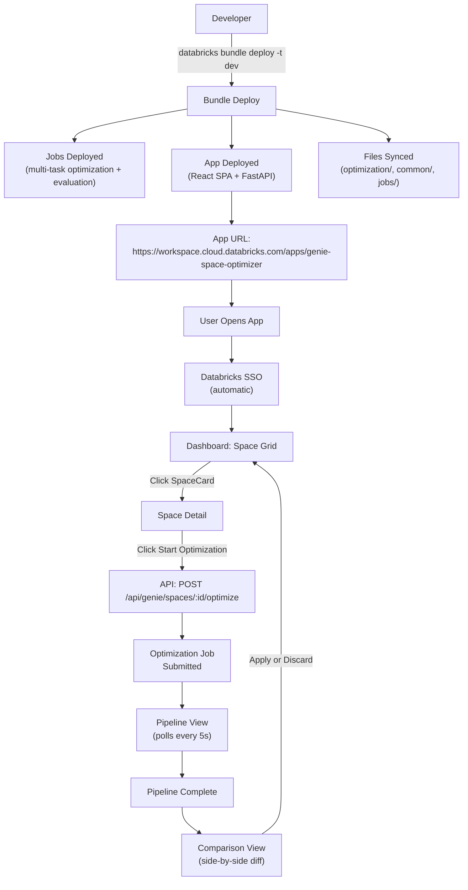

# Jobs & Deployment

This document covers the Databricks Asset Bundle job definitions, the Databricks App manifest, and the end-to-end deployment flow.

---

## 1. Optimization Job Template (Multi-Task)

The optimization runs as a **single Databricks Job with 5 tasks**. The app submits this job when a user clicks "Optimize." Each task is a separate notebook, connected by `depends_on` and `run_if`.

### `resources/semantic/genie_optimization_job.yml`

```yaml
resources:
  jobs:
    genie_optimization_job:
      name: "[${bundle.target}] Wanderbricks - Genie Space Optimization"
      description: >
        Multi-task Genie Space optimization pipeline:
        preflight → baseline_eval → lever_loop → finalize → deploy.
        Each stage is a separate task with its own retry and timeout.

      tags:
        team: data-engineering
        environment: ${bundle.target}
        project: wanderbricks
        layer: semantic
        job_type: genie_optimization

      tasks:
        - task_key: preflight
          notebook_task:
            notebook_path: ../../src/genie_space_optimizer/jobs/run_preflight.py
            base_parameters:
              run_id: ""
              space_id: ""
              catalog: ${var.catalog}
              schema: ${var.gold_schema}
              domain: ""
              triggered_by: ""
          environment_key: default
          timeout_seconds: 600
          max_retries: 1

        - task_key: baseline_eval
          depends_on:
            - task_key: preflight
          notebook_task:
            notebook_path: ../../src/genie_space_optimizer/jobs/run_baseline.py
            base_parameters:
              run_id: ""
              catalog: ${var.catalog}
              schema: ${var.gold_schema}
          environment_key: default
          timeout_seconds: 3600
          max_retries: 1

        - task_key: lever_loop
          depends_on:
            - task_key: baseline_eval
          condition_task:
            op: "NOT_EQUAL"
            left: "{{tasks.baseline_eval.values.thresholds_met}}"
            right: "true"
          notebook_task:
            notebook_path: ../../src/genie_space_optimizer/jobs/run_lever_loop.py
            base_parameters:
              run_id: ""
              catalog: ${var.catalog}
              schema: ${var.gold_schema}
              max_iterations: "5"
              levers: "1,2,3,4,5,6"
          environment_key: default
          timeout_seconds: 5400
          max_retries: 1

        - task_key: finalize
          depends_on:
            - task_key: lever_loop
              outcome: "succeeded_or_skipped"
          notebook_task:
            notebook_path: ../../src/genie_space_optimizer/jobs/run_finalize.py
            base_parameters:
              run_id: ""
              catalog: ${var.catalog}
              schema: ${var.gold_schema}
              run_repeatability: "true"
          environment_key: default
          timeout_seconds: 1800
          max_retries: 1

        - task_key: deploy
          depends_on:
            - task_key: finalize
          condition_task:
            op: "NOT_EQUAL"
            left: "{{tasks.finalize.values.deploy_target}}"
            right: ""
          notebook_task:
            notebook_path: ../../src/genie_space_optimizer/jobs/run_deploy.py
            base_parameters:
              run_id: ""
              catalog: ${var.catalog}
              schema: ${var.gold_schema}
          environment_key: default
          timeout_seconds: 1800
          max_retries: 1

      environments:
        - environment_key: default
          spec:
            client: "1"
            dependencies:
              - "mlflow[databricks]>=3.4.0"
              - "databricks-sdk>=0.40.0"
              - "databricks-connect>=15.4.0"

      max_concurrent_runs: 3

      email_notifications:
        on_failure:
          - ${var.user_email}
```

### Task Notebooks

Each task notebook follows the same pattern: read params, read upstream task values, call the stage function, write task values for downstream tasks.

#### Task 1: `jobs/run_preflight.py`

```python
# Databricks notebook source
import json
from genie_space_optimizer.optimization.preflight import run_preflight
from genie_space_optimizer.optimization.state import create_run

run_id = dbutils.widgets.get("run_id")
space_id = dbutils.widgets.get("space_id")
catalog = dbutils.widgets.get("catalog")
schema = dbutils.widgets.get("schema")
domain = dbutils.widgets.get("domain")
triggered_by = dbutils.widgets.get("triggered_by")

config, benchmarks, model_id, exp_name = run_preflight(
    w=WorkspaceClient(), spark=spark,
    run_id=run_id, space_id=space_id,
    catalog=catalog, schema=schema, domain=domain,
)

# Pass outputs to downstream tasks
dbutils.jobs.taskValues.set(key="run_id", value=run_id)
dbutils.jobs.taskValues.set(key="space_id", value=space_id)
dbutils.jobs.taskValues.set(key="domain", value=domain)
dbutils.jobs.taskValues.set(key="model_id", value=model_id)
dbutils.jobs.taskValues.set(key="experiment_name", value=exp_name)
dbutils.jobs.taskValues.set(key="benchmarks_count", value=len(benchmarks))
```

#### Task 2: `jobs/run_baseline.py`

```python
# Databricks notebook source
import json
from genie_space_optimizer.optimization.harness import _run_baseline

run_id = dbutils.jobs.taskValues.get(taskKey="preflight", key="run_id")
space_id = dbutils.jobs.taskValues.get(taskKey="preflight", key="space_id")
domain = dbutils.jobs.taskValues.get(taskKey="preflight", key="domain")
model_id = dbutils.jobs.taskValues.get(taskKey="preflight", key="model_id")
exp_name = dbutils.jobs.taskValues.get(taskKey="preflight", key="experiment_name")
catalog = dbutils.widgets.get("catalog")
schema = dbutils.widgets.get("schema")

baseline_result, scores, thresholds_met = _run_baseline(
    run_id=run_id, space_id=space_id, benchmarks=None,  # loaded from eval dataset
    exp_name=exp_name, model_id=model_id, catalog=catalog, schema=schema,
)

dbutils.jobs.taskValues.set(key="baseline_scores", value=json.dumps(scores))
dbutils.jobs.taskValues.set(key="thresholds_met", value=str(thresholds_met).lower())
dbutils.jobs.taskValues.set(key="baseline_accuracy", value=baseline_result["overall_accuracy"])
dbutils.jobs.taskValues.set(key="model_id", value=model_id)
```

#### Task 3: `jobs/run_lever_loop.py`

```python
# Databricks notebook source
import json
from genie_space_optimizer.optimization.harness import _run_lever_loop, _resume_lever_loop
from genie_space_optimizer.common.genie_client import fetch_space_config

run_id = dbutils.jobs.taskValues.get(taskKey="preflight", key="run_id")
space_id = dbutils.jobs.taskValues.get(taskKey="preflight", key="space_id")
domain = dbutils.jobs.taskValues.get(taskKey="preflight", key="domain")
exp_name = dbutils.jobs.taskValues.get(taskKey="preflight", key="experiment_name")
prev_scores = json.loads(dbutils.jobs.taskValues.get(taskKey="baseline_eval", key="baseline_scores"))
prev_accuracy = float(dbutils.jobs.taskValues.get(taskKey="baseline_eval", key="baseline_accuracy"))
prev_model_id = dbutils.jobs.taskValues.get(taskKey="baseline_eval", key="model_id")
catalog = dbutils.widgets.get("catalog")
schema = dbutils.widgets.get("schema")
max_iterations = int(dbutils.widgets.get("max_iterations"))
levers = [int(x) for x in dbutils.widgets.get("levers").split(",")]

# Check for resume (in case this task is being retried)
resume_state = _resume_lever_loop(spark, run_id, catalog, schema)
if resume_state["resume_from_lever"] is not None:
    levers = [l for l in levers if l > resume_state["resume_from_lever"]]
    prev_scores = resume_state.get("prev_scores", prev_scores)
    prev_accuracy = resume_state.get("prev_accuracy", prev_accuracy)
    prev_model_id = resume_state.get("prev_model_id", prev_model_id)

config = fetch_space_config(WorkspaceClient(), space_id)

final_scores, final_accuracy, best_model_id, iteration_count = _run_lever_loop(
    run_id=run_id, space_id=space_id, domain=domain, benchmarks=None,
    exp_name=exp_name, prev_scores=prev_scores, prev_accuracy=prev_accuracy,
    prev_model_id=prev_model_id, config=config,
    catalog=catalog, schema=schema, levers=levers, max_iterations=max_iterations,
)

dbutils.jobs.taskValues.set(key="final_scores", value=json.dumps(final_scores))
dbutils.jobs.taskValues.set(key="best_iteration", value=str(iteration_count - 1))
dbutils.jobs.taskValues.set(key="best_model_id", value=best_model_id or "")
dbutils.jobs.taskValues.set(key="iteration_count", value=str(iteration_count))
```

#### Task 4: `jobs/run_finalize.py`

```python
# Databricks notebook source
import json
from genie_space_optimizer.optimization.harness import _run_finalize

run_id = dbutils.jobs.taskValues.get(taskKey="preflight", key="run_id")
space_id = dbutils.jobs.taskValues.get(taskKey="preflight", key="space_id")
domain = dbutils.jobs.taskValues.get(taskKey="preflight", key="domain")
exp_name = dbutils.jobs.taskValues.get(taskKey="preflight", key="experiment_name")
catalog = dbutils.widgets.get("catalog")
schema = dbutils.widgets.get("schema")
run_repeatability = dbutils.widgets.get("run_repeatability").lower() == "true"
deploy_target = dbutils.widgets.get("deploy_target", "")

# Read from whichever upstream task ran last
try:
    prev_scores = json.loads(dbutils.jobs.taskValues.get(taskKey="lever_loop", key="final_scores"))
    prev_model_id = dbutils.jobs.taskValues.get(taskKey="lever_loop", key="best_model_id")
    iteration_count = int(dbutils.jobs.taskValues.get(taskKey="lever_loop", key="iteration_count"))
except Exception:
    prev_scores = json.loads(dbutils.jobs.taskValues.get(taskKey="baseline_eval", key="baseline_scores"))
    prev_model_id = dbutils.jobs.taskValues.get(taskKey="baseline_eval", key="model_id")
    iteration_count = 0

final_status, reason, report_path = _run_finalize(
    run_id=run_id, space_id=space_id, domain=domain, exp_name=exp_name,
    prev_scores=prev_scores, prev_model_id=prev_model_id,
    iteration_counter=iteration_count, catalog=catalog, schema=schema,
    run_repeatability=run_repeatability,
)

dbutils.jobs.taskValues.set(key="final_status", value=final_status)
dbutils.jobs.taskValues.set(key="report_path", value=report_path or "")
dbutils.jobs.taskValues.set(key="deploy_target", value=deploy_target)
```

#### Task 5: `jobs/run_deploy.py`

```python
# Databricks notebook source
from genie_space_optimizer.optimization.harness import _run_deploy

run_id = dbutils.jobs.taskValues.get(taskKey="preflight", key="run_id")
space_id = dbutils.jobs.taskValues.get(taskKey="preflight", key="space_id")
domain = dbutils.jobs.taskValues.get(taskKey="preflight", key="domain")
exp_name = dbutils.jobs.taskValues.get(taskKey="preflight", key="experiment_name")
deploy_target = dbutils.jobs.taskValues.get(taskKey="finalize", key="deploy_target")
prev_model_id = dbutils.jobs.taskValues.get(taskKey="finalize", key="best_model_id", default="")
catalog = dbutils.widgets.get("catalog")
schema = dbutils.widgets.get("schema")

_run_deploy(
    run_id=run_id, deploy_target=deploy_target, space_id=space_id,
    exp_name=exp_name, domain=domain, prev_model_id=prev_model_id,
    iteration_counter=0, catalog=catalog, schema=schema,
)
```

---

## 2. Evaluation Job Template (Existing)

The evaluation job already exists as a template. The optimization harness triggers it via the Databricks SDK.

### Reference: `genie-evaluation-job-template.yml`

Key parameters passed at runtime:

| Parameter | Source |
|-----------|--------|
| `space_id` | From optimization run |
| `experiment_name` | From optimization run |
| `iteration` | Current iteration number |
| `model_id` | Current LoggedModel ID |
| `eval_scope` | `full`, `slice`, `p0`, or `held_out` |
| `patched_objects_b64` | Base64-encoded JSON list of modified objects (for slice scope) |
| `run_repeatability` | `true` only during final repeatability test |
| `eval_dataset_name` | UC table name for the benchmark dataset |

### How the Harness Triggers Evaluation

The harness uses `WorkspaceClient().jobs.submit_run()` instead of `databricks bundle run` subprocess:

```python
def trigger_evaluation_job(
    w: WorkspaceClient,
    space_id: str,
    experiment_name: str,
    iteration: int,
    domain: str,
    model_id: str | None = None,
    eval_scope: str = "full",
    patched_objects: list | None = None,
    run_repeatability: bool = False,
    eval_dataset_name: str | None = None,
    catalog: str = "",
    schema: str = "",
) -> dict:
    """Trigger the evaluation job via Databricks SDK."""
    import base64, json

    patched_b64 = ""
    if patched_objects:
        patched_b64 = base64.b64encode(json.dumps(patched_objects).encode()).decode()

    run = w.jobs.submit_run(
        run_name=f"genie-eval-iter{iteration}-{space_id[:8]}",
        tasks=[{
            "task_key": "run_evaluation",
            "notebook_task": {
                "notebook_path": "src/wanderbricks_semantic/run_genie_evaluation",
                "base_parameters": {
                    "space_id": space_id,
                    "experiment_name": experiment_name,
                    "iteration": str(iteration),
                    "domain": domain,
                    "catalog": catalog,
                    "gold_schema": schema,
                    "model_id": model_id or "",
                    "eval_scope": eval_scope,
                    "patched_objects_b64": patched_b64,
                    "run_repeatability": str(run_repeatability).lower(),
                    "eval_dataset_name": eval_dataset_name or "",
                    "dataset_mode": "uc",
                    "uc_schema": f"{catalog}.{schema}",
                    "warehouse_id": "",
                    "min_benchmarks": "10",
                },
            },
            "environment_key": "default",
        }],
        environments=[{
            "environment_key": "default",
            "spec": {"dependencies": ["mlflow[databricks]>=3.4.0", "pyyaml>=6.0"]},
        }],
    )

    return {"status": "TRIGGERED", "run_id": str(run.run_id)}


def poll_job_completion(w: WorkspaceClient, run_id: int, poll_interval: int = 30, max_wait: int = 3600) -> dict:
    """Poll a job run until terminal state."""
    import time
    start = time.time()
    while time.time() - start < max_wait:
        run = w.jobs.get_run(run_id)
        state = run.state
        lifecycle = str(state.life_cycle_state) if state else "UNKNOWN"

        if lifecycle in ("TERMINATED", "INTERNAL_ERROR", "SKIPPED"):
            notebook_output = None
            if run.tasks:
                try:
                    task_output = w.jobs.get_run_output(run.tasks[0].run_id)
                    if task_output.notebook_output:
                        notebook_output = task_output.notebook_output.result
                except Exception:
                    pass
            return {
                "life_cycle_state": lifecycle,
                "result_state": str(state.result_state) if state.result_state else "",
                "notebook_output": notebook_output,
            }
        time.sleep(poll_interval)

    return {"life_cycle_state": "TIMEOUT", "result_state": "Exceeded max_wait", "notebook_output": None}
```

---

## 3. Databricks App Manifest

### `app/app.yaml`

```yaml
command:
  - "uvicorn"
  - "backend.main:app"
  - "--host=0.0.0.0"
  - "--port=8000"

env:
  - name: CATALOG
    value: "${var.catalog}"
  - name: SCHEMA
    value: "${var.gold_schema}"
  - name: WAREHOUSE_ID
    value: "${var.warehouse_id}"

resources:
  - name: genie-optimizer-sql-warehouse
    sql_warehouse:
      id: ${var.warehouse_id}
      permission: CAN_USE

permissions:
  - user_name: "users"
    level: "CAN_USE"
```

---

## 4. Bundle Configuration Additions

Add these entries to `databricks.yml`:

### New Job Resource Include

```yaml
include:
  - resources/*.yml
  - resources/gold/*.yml
  - resources/semantic/*.yml
  # Already included — semantic layer jobs are in resources/semantic/
```

### New Sync Paths

```yaml
sync:
  include:
    # Existing paths...
    - gold_layer_design/yaml/**/*.yaml
    - src/wanderbricks_semantic/metric_views/**/*.yaml
    - src/wanderbricks_semantic/genie_configs/**/*.json
    - src/wanderbricks_semantic/run_genie_evaluation.py
    - src/wanderbricks_semantic/table_valued_functions.sql
    - src/wanderbricks_semantic/validate_genie_spaces_notebook.py
    - src/wanderbricks_semantic/validate_genie_benchmark_sql.py
    # New paths for the optimizer app (multi-task job notebooks + library)
    - src/genie_space_optimizer/optimization/**/*.py
    - src/genie_space_optimizer/common/**/*.py
    - src/genie_space_optimizer/jobs/**/*.py
    - src/wanderbricks_semantic/app/backend/**/*.py
    - src/wanderbricks_semantic/app/frontend/dist/**/*
    - src/wanderbricks_semantic/app/app.yaml
```

### App Resource (if using Databricks Apps via DABs)

```yaml
resources:
  apps:
    genie_optimizer_app:
      name: "genie-space-optimizer"
      description: "Genie Space Optimizer — optimize Genie Spaces with a click"
      source_code_path: src/wanderbricks_semantic/app
      config:
        command:
          - "uvicorn"
          - "backend.main:app"
          - "--host=0.0.0.0"
          - "--port=8000"
        env:
          - name: CATALOG
            value: ${var.catalog}
          - name: SCHEMA
            value: ${var.gold_schema}
      permissions:
        - user_name: "users"
          level: "CAN_USE"
```

---

## 5. Deployment Flow



### Step-by-Step

1. **Deploy the bundle:**
   ```bash
   databricks bundle deploy -t dev
   ```
   This deploys the optimization job, evaluation job, React SPA + FastAPI app, and syncs all Python modules.

2. **User opens the app URL** (provided by Databricks Apps after deployment).

3. **SSO handles authentication** — no login page needed.

4. **User selects a Genie Space** and clicks "Optimize."

5. **The app submits the multi-task Databricks Job** via `WorkspaceClient().jobs.run_now()`, passing `run_id`, `space_id`, `catalog`, `schema`, and `domain` as notebook_params.

6. **The app creates a QUEUED row** in `genie_opt_runs` and starts polling Delta.

7. **The 6-task optimization job runs** on Serverless compute: preflight → baseline_eval → enrichment → lever_loop → finalize → deploy. Each task writes stage transitions to Delta.

8. **The app's dashboard auto-refreshes** every 5 seconds, reading Delta and rendering progress.

9. **When complete,** the dashboard shows final status, scores, and links to MLflow.

---

## 6. How the App Triggers Jobs

The app uses **`run_now`** on the pre-deployed multi-task job. The job is deployed via DABs and the app looks it up by name.

```python
from databricks.sdk import WorkspaceClient

w = WorkspaceClient()

# Look up the pre-deployed job by name
jobs = w.jobs.list(name=f"{bundle_target}-genie-optimization")
job_id = next(iter(jobs)).job_id

# Submit with run-specific parameters
run = w.jobs.run_now(
    job_id=job_id,
    notebook_params={
        "run_id": run_id,
        "space_id": space_id,
        "catalog": catalog,
        "schema": schema,
        "domain": domain,
        "triggered_by": user_email,
        "max_iterations": "5",
        "levers": "1,2,3,4,5,6",
        "run_repeatability": "true",
        "deploy_target": "",
    },
)
# Returns immediately with run.run_id
```

**Why `run_now`?** The multi-task job with 5 tasks, `depends_on`, `run_if`, and environment specs is defined in the YAML and deployed via DABs. Using `run_now` reuses the full DAG definition. The notebook params override `base_parameters` for each task.

---

## 7. Environment Variables

| Variable | Source | Used By |
|----------|--------|---------|
| `CATALOG` | `app.yaml` env or `databricks.yml` variable | App + Jobs |
| `SCHEMA` | `app.yaml` env or `databricks.yml` variable | App + Jobs |
| `WAREHOUSE_ID` | `app.yaml` env or `databricks.yml` variable | Genie API calls |
| `LLM_ENDPOINT` | Databricks secrets or env | LLM judge calls |
| `MLFLOW_TRACKING_URI` | Auto-set by Databricks | MLflow client |
