# Module Map & Refactoring Guide

This document maps every function and data structure from the current agent skill codebase to its new location in the app architecture. It also specifies what to reuse verbatim, what to refactor, and the test strategy.

---

## 1. Current-to-New Module Mapping

### From `orchestrator.py` (~2,557 lines)

| Current Function | New Module | Notes |
|-----------------|-----------|-------|
| `run_optimization_loop()` | `optimization/harness.py` | Refactor: replace JSON file I/O with Delta writes, remove CLI args |
| `_run_lever_aware_loop()` | `optimization/harness.py` | Core loop logic; refactor state writes to Delta |
| `init_progress()` | `optimization/state.py` | Replace: create Delta row in `genie_opt_runs` |
| `load_progress()` | `optimization/state.py` | Replace: read from `genie_opt_runs` + `genie_opt_stages` |
| `update_progress()` | `optimization/state.py` | Replace: `write_iteration()` + `update_run_status()` |
| `write_progress()` | `optimization/state.py` | Remove: no more JSON file writes |
| `_normalize_scores()` | `optimization/evaluation.py` | Reuse verbatim |
| `all_thresholds_met()` | `optimization/evaluation.py` | Reuse verbatim |
| `create_genie_model_version()` | `optimization/models.py` | Reuse with minor refactor (use SDK instead of subprocess for UC) |
| `promote_best_model()` | `optimization/models.py` | Reuse; read best from Delta instead of progress dict |
| `rollback_to_model()` | `optimization/models.py` | Reuse verbatim |
| `link_eval_scores_to_model()` | `optimization/models.py` | Reuse verbatim |
| `_compute_uc_metadata_diff()` | `optimization/models.py` | Reuse verbatim |
| `_build_patch_summary()` | `optimization/models.py` | Reuse verbatim |
| `discover_spaces()` | `common/genie_client.py` | Reuse; expose for app space selector |
| `_fetch_space_config()` | `common/genie_client.py` | Reuse verbatim |
| `run_genie_query()` | `common/genie_client.py` | Reuse verbatim |
| `detect_asset_type()` | `common/genie_client.py` | Reuse verbatim |
| `run_evaluation_iteration()` | `optimization/evaluation.py` | Reuse (inline eval path) |
| `trigger_evaluation_job()` | `optimization/evaluation.py` | Refactor: use SDK `jobs.submit_run()` instead of subprocess |
| `poll_job_completion()` | `optimization/evaluation.py` | Refactor: use SDK `jobs.get_run()` instead of subprocess |
| `run_evaluation_via_job()` | `optimization/evaluation.py` | Refactor: use SDK-based trigger/poll |
| `query_latest_evaluation()` | `optimization/evaluation.py` | Reuse verbatim |
| `generate_report()` | `optimization/report.py` | Refactor: read from Delta instead of progress dict |
| `deploy_bundle_and_run_genie_job()` | `optimization/harness.py` | Reuse; optionally refactor to SDK |
| `log_lever_impact()` | `optimization/state.py` | Replace: write to `genie_opt_stages` detail_json |
| `_update_pareto_frontier()` | `optimization/state.py` | Derive from Delta queries |
| `add_benchmark_correction()` | `optimization/benchmarks.py` | Reuse verbatim |
| `verify_dual_persistence()` | `optimization/applier.py` | Reuse verbatim |
| `_check_temporal_freshness()` | `optimization/benchmarks.py` | Reuse verbatim |
| `_synthesize_repeatability_failures()` | `optimization/repeatability.py` | Reuse verbatim |
| `_compute_cross_iteration_repeatability()` | `optimization/repeatability.py` | Reuse verbatim |
| `_synthesize_repeatability_failures_from_cross_iter()` | `optimization/repeatability.py` | Reuse verbatim |
| `_resolve_cli_profile()` | Remove | Not needed in app/job context |
| `_setup_worker_imports()` | Remove | Direct imports replace sys.path hacks |
| `_import_optimizer()` | Remove | Direct imports |
| `_import_applier()` | Remove | Direct imports |
| `main()` | Remove | Replaced by 5 task notebook entry points |

### From `run_genie_evaluation.py` (~1,400 lines)

| Current Function | New Module | Notes |
|-----------------|-----------|-------|
| `genie_predict_fn()` | `optimization/evaluation.py` | Reuse verbatim (core predict function) |
| `syntax_validity_scorer()` | `optimization/scorers/syntax_validity.py` | Reuse verbatim |
| `schema_accuracy_judge()` | `optimization/scorers/schema_accuracy.py` | Reuse verbatim |
| `logical_accuracy_judge()` | `optimization/scorers/logical_accuracy.py` | Reuse verbatim |
| `semantic_equivalence_judge()` | `optimization/scorers/semantic_equivalence.py` | Reuse verbatim |
| `completeness_judge()` | `optimization/scorers/completeness.py` | Reuse verbatim |
| `asset_routing_scorer()` | `optimization/scorers/asset_routing.py` | Reuse verbatim |
| `result_correctness()` | `optimization/scorers/result_correctness.py` | Reuse verbatim |
| `arbiter_scorer()` | `optimization/scorers/arbiter.py` | Reuse verbatim |
| `_extract_response_text()` | `optimization/evaluation.py` | Reuse verbatim |
| `_call_llm_for_scoring()` | `optimization/evaluation.py` | Reuse verbatim |
| `normalize_result_df()` | `optimization/evaluation.py` | Reuse verbatim |
| `result_signature()` | `optimization/evaluation.py` | Reuse verbatim |
| `build_asi_metadata()` | `optimization/evaluation.py` | Reuse verbatim |
| `resolve_sql()` | `common/genie_client.py` | Reuse verbatim |
| `sanitize_sql()` | `common/genie_client.py` | Reuse verbatim |
| `filter_benchmarks_by_scope()` | `optimization/benchmarks.py` | Reuse verbatim |
| `register_judge_prompts()` | `optimization/evaluation.py` | Reuse verbatim |
| `load_judge_prompts()` | `optimization/evaluation.py` | Reuse verbatim |
| `_prompts_already_registered()` | `optimization/evaluation.py` | Reuse verbatim |
| `_classify_repeatability()` | `optimization/repeatability.py` | Reuse verbatim |
| `_parse_arbiter_verdict()` | `optimization/scorers/arbiter.py` | Reuse verbatim |
| `detect_asset_type()` | `common/genie_client.py` | Reuse verbatim (shared) |
| `JUDGE_PROMPTS` | `common/config.py` | Move: constant dict |
| `ASI_SCHEMA` | `common/config.py` | Move: constant dict |
| `GENIE_THRESHOLDS` | `common/config.py` | Move: becomes `MLFLOW_THRESHOLDS` |
| `all_scorers` | `optimization/scorers/__init__.py` | Move: list assembly |

### From `benchmark_generator.py`

| Current Function | New Module | Notes |
|-----------------|-----------|-------|
| `assign_splits()` | `optimization/benchmarks.py` | Reuse verbatim |
| `parse_sql_dependencies()` | `optimization/benchmarks.py` | Reuse verbatim |
| `validate_ground_truth_sql()` | `optimization/benchmarks.py` | Reuse verbatim |
| `validate_with_retry()` | `optimization/benchmarks.py` | Reuse verbatim |
| `sync_yaml_to_mlflow_dataset()` | `optimization/benchmarks.py` | Reuse verbatim |
| `load_benchmarks()` | `optimization/benchmarks.py` | Reuse verbatim |
| `save_benchmarks()` | `optimization/benchmarks.py` | Reuse verbatim |
| `validate_benchmarks()` | `optimization/benchmarks.py` | Reuse verbatim |

### From `metadata_optimizer.py`

| Current Function | New Module | Notes |
|-----------------|-----------|-------|
| `cluster_failures()` | `optimization/optimizer.py` | Reuse verbatim |
| `generate_metadata_proposals()` | `optimization/optimizer.py` | Reuse verbatim |
| `propose_patch_set_from_asi()` | `optimization/optimizer.py` | Reuse verbatim |
| `_synthesize_patches_from_fixes()` | `optimization/optimizer.py` | Reuse verbatim |
| `score_patch_set()` | `optimization/optimizer.py` | Reuse verbatim |
| `read_asi_from_uc()` | `optimization/optimizer.py` | Refactor: use spark.sql instead of statement API |
| `_extract_asi_from_assessments()` | `optimization/optimizer.py` | Reuse verbatim |
| `_extract_judge_feedbacks_from_eval()` | `optimization/optimizer.py` | Reuse verbatim |
| `_infer_blame_from_rationale()` | `optimization/optimizer.py` | Reuse verbatim |
| `_convert_patch_set_to_proposals()` | `optimization/optimizer.py` | Reuse verbatim |
| `_call_llm_for_proposal()` | `optimization/optimizer.py` | New: LLM call for proposal text generation (Claude Opus 4.6) |
| `_resolve_scope()` | `optimization/optimizer.py` | New: determine target scope based on lever + apply_mode |
| `detect_conflicts_and_batch()` | `optimization/optimizer.py` | Reuse verbatim |
| `detect_regressions()` | `optimization/optimizer.py` | Reuse verbatim |
| `_map_to_lever()` | `optimization/optimizer.py` | Reuse verbatim |
| `_extract_pattern()` | `optimization/optimizer.py` | Reuse verbatim |
| `_is_generic_counterfactual()` | `optimization/optimizer.py` | Reuse verbatim |
| `_describe_fix()` | `optimization/optimizer.py` | Reuse verbatim |
| `_dual_persist_paths()` | `optimization/optimizer.py` | Reuse verbatim |
| `_patch_to_lever()` | `optimization/optimizer.py` | Reuse verbatim |
| `_collect_judge_quality_feedback()` | `optimization/optimizer.py` | Reuse verbatim |
| `PATCH_TYPES` | `common/config.py` | Move: constant list |
| `CONFLICT_RULES` | `common/config.py` | Move: constant list |
| `FAILURE_TAXONOMY` | `common/config.py` | Move: constant set |

### From `optimization_applier.py`

| Current Function | New Module | Notes |
|-----------------|-----------|-------|
| `render_patch()` | `optimization/applier.py` | Reuse verbatim |
| `apply_patch_set()` | `optimization/applier.py` | Reuse verbatim |
| `rollback()` | `optimization/applier.py` | Reuse verbatim |
| `proposals_to_patches()` | `optimization/applier.py` | Reuse verbatim |
| `_apply_action_to_config()` | `optimization/applier.py` | Reuse verbatim (extended for join_spec and column_config sections) |
| `_apply_action_to_uc()` | `optimization/applier.py` | New: apply patches to UC artifacts when apply_mode is uc_artifact or both |
| `classify_risk()` | `optimization/applier.py` | Reuse verbatim |
| `strip_non_exportable_fields()` | `optimization/applier.py` | Reuse verbatim |
| `sort_genie_config()` | `optimization/applier.py` | Reuse verbatim |
| `_get_general_instructions()` | `optimization/applier.py` | Reuse verbatim |
| `_set_general_instructions()` | `optimization/applier.py` | Reuse verbatim |
| `apply_proposal_batch()` | `optimization/applier.py` | Reuse (legacy path) |
| `verify_repo_update()` | `optimization/applier.py` | Reuse verbatim |
| `deploy_bundle_and_run_genie_job()` | `optimization/applier.py` | Reuse; consider SDK replacement |
| `validate_patch_set()` | `optimization/applier.py` | Reuse verbatim |
| `NON_EXPORTABLE_FIELDS` | `common/config.py` | Move: constant set |
| `_LEVER_TO_PATCH_TYPE` | `common/config.py` | Move: constant dict (updated for 6 levers) |
| `APPLY_MODE` | `common/config.py` | New: default "genie_config" |
| `MAX_VALUE_DICTIONARY_COLUMNS` | `common/config.py` | New: 120 |

### From `genie_evaluator.py`

| Current Function | New Module | Notes |
|-----------------|-----------|-------|
| `run_genie_query()` | `common/genie_client.py` | Merge with orchestrator version |
| `detect_asset_type()` | `common/genie_client.py` | Already mapped |
| `run_evaluation_iteration()` | `optimization/evaluation.py` | Merge with orchestrator version |
| `trigger_evaluation_job()` | `optimization/evaluation.py` | Refactor to SDK |
| `poll_job_completion()` | `optimization/evaluation.py` | Refactor to SDK |
| `run_evaluation_via_job()` | `optimization/evaluation.py` | Refactor to SDK |
| `query_latest_evaluation()` | `optimization/evaluation.py` | Reuse verbatim |

### New Modules (no current equivalent)

| New Module | Purpose |
|-----------|---------|
| `optimization/state.py` | Delta state machine: `write_stage()`, `read_latest_stage()`, `write_iteration()`, `update_run_status()`, `ensure_optimization_tables()` |
| `common/delta_state.py` | Generic Delta read/write helpers used by both `state.py` and the app |
| `common/uc_metadata.py` | UC introspection: `get_columns()`, `get_tags()`, `get_routines()` (extracted from orchestrator UC queries) |
| `app/backend/main.py` | FastAPI app entry point + static file serving for React SPA |
| `app/backend/routes/*.py` | FastAPI route modules (spaces, runs, activity) |
| `app/backend/services/*.py` | Backend services (genie, optimization, comparison) |
| `app/backend/models.py` | Pydantic response models |
| `app/frontend/` | React 18 + TypeScript + Vite + Tailwind CSS SPA (4 screens: Dashboard, SpaceDetail, PipelineView, ComparisonView) |
| `jobs/run_preflight.py` | Task 1 notebook: config + metadata + benchmarks |
| `jobs/run_baseline.py` | Task 2 notebook: baseline evaluation |
| `jobs/run_lever_loop.py` | Task 3 notebook: lever iteration loop |
| `jobs/run_finalize.py` | Task 4 notebook: report + model promotion |
| `jobs/run_deploy.py` | Task 5 notebook: DABs deploy + held-out eval |
| `jobs/run_evaluation_only.py` | Standalone evaluation job entry point |

---

## 2. Import Graph

```mermaid
graph TD
    subgraph app_layer [App Layer]
        react["app/frontend/ (React SPA)"]
        api_main["app/backend/main.py"]
        routes_spaces["app/backend/routes/spaces.py"]
        routes_runs["app/backend/routes/runs.py"]
        routes_activity["app/backend/routes/activity.py"]
        svc_genie["app/backend/services/genie_service.py"]
        svc_opt["app/backend/services/optimization_service.py"]
        svc_compare["app/backend/services/comparison_service.py"]
    end

    subgraph job_layer [Job Layer — 5 Task Notebooks]
        run_pre["jobs/run_preflight.py"]
        run_base["jobs/run_baseline.py"]
        run_lever["jobs/run_lever_loop.py"]
        run_final["jobs/run_finalize.py"]
        run_deploy["jobs/run_deploy.py"]
        run_eval["jobs/run_evaluation_only.py"]
    end

    subgraph harness_layer [Optimization Harness]
        harness["optimization/harness.py"]
        state["optimization/state.py"]
        preflight["optimization/preflight.py"]
        benchmarks["optimization/benchmarks.py"]
        evaluation["optimization/evaluation.py"]
        optimizer["optimization/optimizer.py"]
        applier["optimization/applier.py"]
        repeatability["optimization/repeatability.py"]
        models["optimization/models.py"]
        report["optimization/report.py"]
        scorers_init["optimization/scorers/__init__.py"]
    end

    subgraph scorer_layer [Scorers]
        sv["scorers/syntax_validity.py"]
        sa["scorers/schema_accuracy.py"]
        la["scorers/logical_accuracy.py"]
        se["scorers/semantic_equivalence.py"]
        co["scorers/completeness.py"]
        ar["scorers/asset_routing.py"]
        rc["scorers/result_correctness.py"]
        ab["scorers/arbiter.py"]
    end

    subgraph common_layer [Common]
        config["common/config.py"]
        genie["common/genie_client.py"]
        uc["common/uc_metadata.py"]
        delta["common/delta_state.py"]
    end

    react -->|"fetch /api/genie/*"| api_main
    api_main --> routes_spaces
    api_main --> routes_runs
    api_main --> routes_activity
    routes_spaces --> svc_genie
    routes_spaces --> delta
    routes_runs --> svc_opt
    routes_runs --> svc_compare
    routes_runs --> delta
    routes_activity --> delta
    svc_genie --> genie
    svc_opt --> delta
    svc_compare --> genie
    svc_compare --> delta

    run_opt --> harness
    run_eval --> evaluation

    harness --> state
    harness --> preflight
    harness --> benchmarks
    harness --> evaluation
    harness --> optimizer
    harness --> applier
    harness --> repeatability
    harness --> models
    harness --> report

    state --> delta
    state --> config
    preflight --> genie
    preflight --> uc
    preflight --> benchmarks
    benchmarks --> config
    evaluation --> scorers_init
    evaluation --> genie
    evaluation --> config
    optimizer --> config
    applier --> genie
    applier --> config
    repeatability --> genie
    repeatability --> config
    models --> config

    scorers_init --> sv
    scorers_init --> sa
    scorers_init --> la
    scorers_init --> se
    scorers_init --> co
    scorers_init --> ar
    scorers_init --> rc
    scorers_init --> ab

    sv --> evaluation
    sa --> evaluation
    la --> evaluation
    se --> evaluation
    co --> evaluation
    ar --> evaluation
    rc --> evaluation
    ab --> evaluation
```



**Dependency rules:**
- `app/` imports only from `common/` — never from `optimization/`
- `optimization/` imports from `common/` and from its own submodules
- `common/` has no internal dependencies (only external: `databricks-sdk`, `mlflow`, `pyyaml`)
- `scorers/*.py` import shared helpers from `optimization/evaluation.py` (`_extract_response_text`, `_call_llm_for_scoring`, `build_asi_metadata`, `resolve_sql`, `sanitize_sql`)

---

## 3. What to Reuse Verbatim

These functions and data structures are used exactly as-is. Copy them to their new modules with no logic changes.

### Functions

| Function | Reason |
|----------|--------|
| All 8 scorer implementations | Core judges — well-tested, correct |
| `normalize_result_df()` | Deterministic normalization — fragile to change |
| `result_signature()` | Hash-based comparison — must be consistent |
| `build_asi_metadata()` | ASI builder — simple dict construction |
| `_extract_response_text()` | MLflow deserialization — critical compatibility |
| `_call_llm_for_scoring()` | LLM call with retry — proven pattern |
| `resolve_sql()` + `sanitize_sql()` | SQL preprocessing — must be identical |
| `cluster_failures()` | Failure grouping algorithm |
| `generate_metadata_proposals()` | Proposal generation with scoring |
| `render_patch()` | Patch DSL rendering |
| `_apply_action_to_config()` | Config mutation logic |
| `validate_patch_set()` | Validation rules |
| `detect_regressions()` | Regression detection |
| `assign_splits()` | Benchmark splitting |
| `validate_ground_truth_sql()` | GT SQL validation |

### Data Structures

| Structure | Reason |
|-----------|--------|
| `PATCH_TYPES` (35 entries) | Complete patch type registry |
| `CONFLICT_RULES` (18 pairs) | Conflict detection rules |
| `FAILURE_TAXONOMY` (22 types) | Failure classification |
| `JUDGE_PROMPTS` (5 templates) | Judge prompt templates |
| `ASI_SCHEMA` (12 fields) | ASI metadata format |
| `NON_EXPORTABLE_FIELDS` | Config stripping |
| `_LEVER_TO_PATCH_TYPE` | Failure-to-patch mapping |
| `REPEATABILITY_CLASSIFICATIONS` | Repeatability buckets |

---

## 4. What to Refactor

### Replace JSON file I/O with Delta writes

| Current | New |
|---------|-----|
| `init_progress()` -> `optimization-progress.json` | `INSERT INTO genie_opt_runs` |
| `update_progress()` -> JSON merge | `write_iteration()` + `update_run_status()` |
| `write_progress()` -> file write | `write_stage()` |
| `load_progress()` -> file read | `SELECT FROM genie_opt_runs/stages/iterations` |

### Replace subprocess with Databricks SDK

| Current | New |
|---------|-----|
| `subprocess.run(["databricks", "bundle", "run", ...])` | `w.jobs.submit_run(...)` or `w.jobs.run_now(...)` |
| `subprocess.run(["databricks", "jobs", "get-run", ...])` | `w.jobs.get_run(run_id)` |
| `subprocess.run(["databricks", "jobs", "get-run-output", ...])` | `w.jobs.get_run_output(task_run_id)` |

### Replace SKILL.md routing with direct imports

| Current | New |
|---------|-----|
| `_setup_worker_imports(worker_dir)` + `sys.path.insert` | `from optimization.optimizer import cluster_failures, ...` |
| `_import_optimizer()` returns tuple of functions | Direct import at module level |
| `_import_applier()` returns tuple of functions | Direct import at module level |

### Replace CLI argument parsing with function parameters

| Current | New |
|---------|-----|
| `argparse` in `main()` | Parameters on `optimize_genie_space()` |
| `--space-id`, `--benchmarks`, `--domain` | Function args |
| `--job-mode`, `--lever-aware`, `--resume` | Feature flags in `config.py` |

---

## 5. Test Strategy

### Unit Tests (per module)

| Module | Test Focus | Mocking |
|--------|-----------|---------|
| `optimization/scorers/*.py` | Each scorer returns correct `Feedback` for known inputs | Mock `spark.sql()` for syntax_validity, mock `_call_llm_for_scoring()` for LLM judges |
| `optimization/optimizer.py` | `cluster_failures()` groups correctly, `generate_metadata_proposals()` respects lever filtering, `detect_regressions()` catches drops | None (pure functions on dicts) |
| `optimization/applier.py` | `render_patch()` produces valid commands, `_apply_action_to_config()` mutates correctly, `rollback()` restores snapshot | None (pure functions on dicts) |
| `optimization/benchmarks.py` | `assign_splits()` ratios, `validate_ground_truth_sql()` catches errors | Mock `spark.sql()` |
| `optimization/evaluation.py` | `normalize_scores()` 0-1 -> 0-100, `all_thresholds_met()` boundary cases | None (pure functions) |
| `optimization/state.py` | `write_stage()` produces correct SQL, `read_latest_stage()` returns expected row | Mock `spark.sql()` |
| `common/config.py` | Constants have expected values | None |

### Integration Tests (harness-level)

| Test | Scope | Mocking |
|------|-------|---------|
| Preflight stage | Config fetch + UC metadata + benchmark validation | Mock Genie API, mock UC tables |
| Baseline evaluation | Full predict + score pipeline | Mock Genie API (return known SQL), real spark for SQL execution |
| Lever loop (1 lever) | Cluster -> propose -> apply -> eval -> accept/rollback | Mock Genie API, mock LLM endpoint |
| Resume from stage | Load Delta state, continue from last stage | Pre-populated Delta tables |
| Rollback on regression | Detect regression, rollback patches, skip lever | Orchestrated failure scenario |

### E2E Tests (existing pattern)

The existing `test_optimization_e2e.py` tests can be adapted:

```python
# Existing tests that transfer directly:
- test_init_progress        -> test_create_run_row
- test_normalize_scores     -> test_normalize_scores (unchanged)
- test_update_progress      -> test_write_iteration
- test_all_thresholds_met   -> test_all_thresholds_met (unchanged)
- test_log_lever_impact     -> test_write_lever_stage
- test_pareto_frontier      -> test_derive_pareto_from_delta
- test_worker_imports       -> Remove (no more worker imports)
- test_cluster_failures     -> test_cluster_failures (unchanged)
- test_map_to_lever         -> test_map_to_lever (unchanged)
- test_repeatability        -> test_repeatability (unchanged)
- test_lever_aware_loop     -> test_lever_loop_integration
```

### App Tests

| Test | Method |
|------|--------|
| React SPA screens render | Vitest + React Testing Library or Playwright |
| Pipeline View polls and updates | Mock API responses with known data, verify component render |
| API endpoints | FastAPI TestClient with mocked spark |
| Job submission | Mock `WorkspaceClient().jobs.submit_run()` |
| Apply/Discard workflow | Mock comparison endpoint, verify correct POST on button click |

---

## 6. Migration Checklist

1. Create `common/` package with `config.py`, `genie_client.py`, `uc_metadata.py`, `delta_state.py`
2. Move constants (PATCH_TYPES, CONFLICT_RULES, FAILURE_TAXONOMY, JUDGE_PROMPTS, thresholds) to `config.py`
3. Extract Genie API functions to `genie_client.py`
4. Extract UC introspection queries to `uc_metadata.py`
5. Create `optimization/state.py` with Delta read/write helpers
6. Create `optimization/scorers/` package with one file per judge
7. Create `optimization/evaluation.py` with predict fn, MLflow integration, shared helpers
8. Move benchmark functions to `optimization/benchmarks.py`
9. Move optimizer functions to `optimization/optimizer.py`
10. Move applier functions to `optimization/applier.py`
11. Move repeatability functions to `optimization/repeatability.py`
12. Move LoggedModel functions to `optimization/models.py`
13. Create `optimization/harness.py` with `optimize_genie_space()` entry point
14. Create `optimization/report.py` with report generation
15. Create 5 task notebooks: `jobs/run_preflight.py`, `run_baseline.py`, `run_lever_loop.py`, `run_finalize.py`, `run_deploy.py`
16. Create `app/frontend/` React SPA (Dashboard, SpaceDetail, PipelineView, ComparisonView) and `app/backend/` FastAPI server
17. Create Delta table DDLs in `optimization/state.py`
18. Update `databricks.yml` with new sync paths and job resource
19. Write unit tests for scorers and pure functions
20. Write integration test for the harness with mocked Genie API
21. Run E2E test against a real Genie Space
